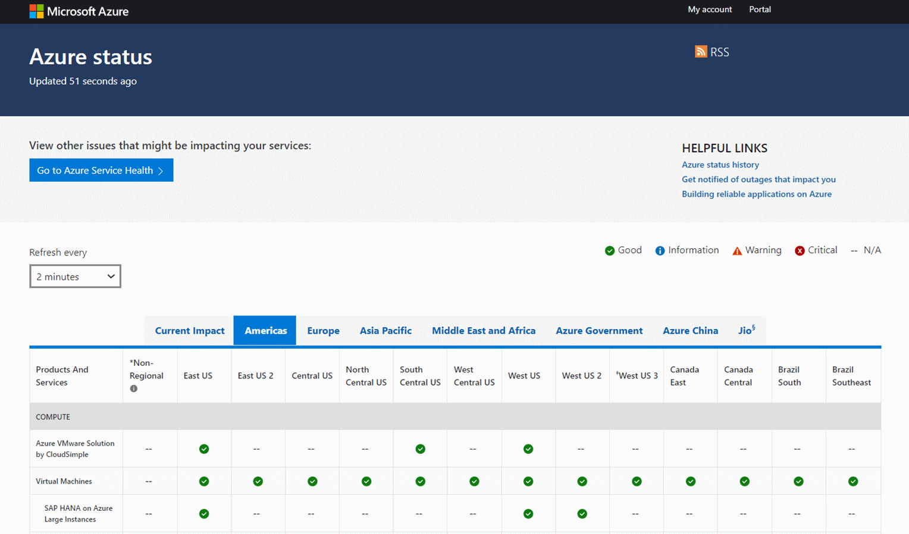
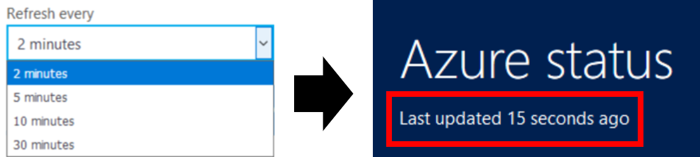

# Azure status overview

[Azure status](https://status.azure.com/status/) provides you with a global view of the health of Azure services and regions. With Azure status, you can get up-to-the-minute information on service availability. Azure status is available to everyone to view all services that report their service health, as well as incidents with wide-ranging impact. If you're a current Azure user, however, we strongly encourage you to use the personalized experience in [Azure Service Health](https://aka.ms/azureservicehealth). Azure Service Health includes all outages, upcoming planned maintenance activities, and service advisories.

## Azure status updates

The Azure status page gets updated in real time as the health of Azure services change. If you leave the Azure status page open, you can control the rate at which the page refreshes with new data. At the top, you can see the last time the page was updated.

## Azure status history

While the Azure status page always shows the latest health information, you can view older events using the [Azure status history page](https://status.azure.com/status/history/).

There you can see events up to 90 days in the past, including a preliminary root cause, mitigation, and next steps for Azure.

## RSS Feed

Azure status also provides [an RSS feed](https://status.azure.com/status/feed/) of changes to the health of Azure services that you can subscribe to.

## Next Steps

* Learn how you can get a more personalized view into Azure health with [Service Health](./service-health-overview.md).
* Learn how you can get a more granular view into the health of your specific Azure resources with [Resource Health](./resource-health-overview.md).
