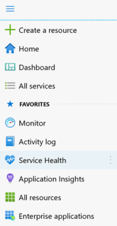

# Configure Resource Health alerts in the Azure portal

This article shows you how to set up activity log alerts for resource health notifications in the Azure portal.

Azure Resource Health keeps you informed about the current and historical health status of your Azure resources. Azure Resource Health alerts can notify you in near real-time when these resources have a change in their health status. Creating Resource Health alerts programmatically allow for users to create and customize alerts in bulk.

Resource health notifications are stored in the [Azure activity log](../azure-monitor/essentials/platform-logs-overview.md) Given the possibly large volume of information stored in the activity log, there is a separate user interface to make it easier to view and set up alerts on resource health notifications.
You can receive an alert when Azure resource sends resource health notifications to your Azure subscription. You can configure the alert based on:

* The subscription affected.
* The resource(s) type(s) affected.
* The resource group(s) affected.
* The resource(s) affected.
* The event status(s) of the resource(s) affected.
* The resource(s) affected statuses.
* The reason(s) type(s) of the resource(s) affected.

You also can configure who the alert should be sent to:

* Select an existing action group.
* Create a new action group (that can be used for future alerts).

To learn more about action groups, see [Create and manage action groups](../azure-monitor/alerts/action-groups.md).

For information on how to configure resource health notification alerts by using Azure Resource Manager templates, see [Resource Manager templates](./resource-health-alert-arm-template-guide.md).
Resource Health Alert using Azure portal

## Create a Resource Health alert rule in the Azure portal

1. In the Azure [portal](https://portal.azure.com/), select **Service Health**.

    
1. In the **Resource Health** section, select **Service Health**.
1. Select **Add resource health alert**.
1. The **Create an alert rule wizard** opens to the **Conditions** tab, with the **Scope** tab already populated. Follow the steps for Resource Health alerts, starting from the **Conditions** tab, in the [create a new alert rule wizard](../azure-monitor/alerts/alerts-create-new-alert-rule.md).

## Next steps

Learn more about Resource Health:

* [Azure Resource Health overview](Resource-health-overview.md)
* [Resource types and health checks available through Azure Resource Health](resource-health-checks-resource-types.md)

Create Service Health Alerts:

* [Configure Alerts for Service Health](./alerts-activity-log-service-notifications-portal.md) 
* [Azure Activity Log event schema](../azure-monitor/essentials/activity-log-schema.md)
* [Configure resource health alerts using Resource Manager templates](./resource-health-alert-arm-template-guide.md)
