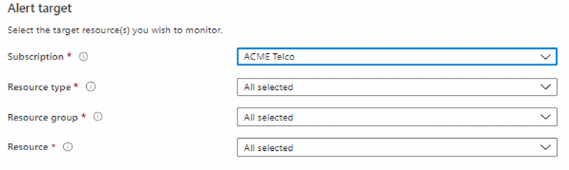
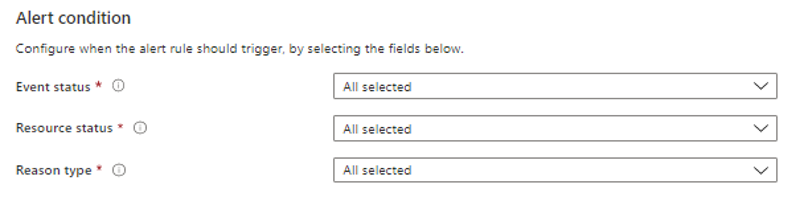

# Configure resource health alerts using Azure portal

This article shows you how to set up activity log alerts for resource health notifications by using the Azure portal.

Azure Resource Health keeps you informed about the current and historical health status of your Azure resources. Azure Resource Health alerts can notify you in near real-time when these resources have a change in their health status. Creating Resource Health alerts programmatically allow for users to create and customize alerts in bulk.

Resource health notifications are stored in the [Azure activity log](../azure-monitor/essentials/platform-logs-overview.md) Given the possibly large volume of information stored in the activity log, there is a separate user interface to make it easier to view and set up alerts on resource health notifications.
You can receive an alert when Azure resource sends resource health notifications to your Azure subscription. You can configure the alert based on:

* The subscription affected.
* The resource(s) type(s) affected.
* The resource group(s) affected.
* The resource(s) affected.
* The event status(s) of the resource(s) affected.
* The resource(s) affected statuses.
* The reason(s) type(s) of the resource(s) affected.

You also can configure who the alert should be sent to:

* Select an existing action group.
* Create a new action group (that can be used for future alerts).

To learn more about action groups, see [Create and manage action groups](../azure-monitor/alerts/action-groups.md).

For information on how to configure resource health notification alerts by using Azure Resource Manager templates, see [Resource Manager templates](./resource-health-alert-arm-template-guide.md).
Resource Health Alert using Azure portal

## Resource Health Alert Using Azure Portal

1. In the Azure [portal](https://portal.azure.com/), select **Service Health**.

    
2. In the **Resource Health** section, select **Service Health**.
3. Select **Add resource health alert** and fill in the fields.
4. Under Alert target, select the **Subscription**, **Resource Types**, **Resource Groups** and **Resource** you want to be alerted for.

    

5. Under alert condition select:
    1. The **Event Status** you want to be alerted for. The severity level of the event: Active, Resolved, In Progress, Updated
    2. The **Resource Status** you want to be alerted for. The resource status of the event: Available, Unavailable, Unknown, Degraded
    3. The **Reason Type** you want to be alerted for. The cause of the event: Platform Initiated, User Initiated
    
6. Under Define alert details, provide the following details:
    1. **Alert rule name**: The name for the new alert rule.
    2. **Description**: The description for the new alert rule.
    3. **Save alert to resource group**: Select the resource group where you want to save this new rule.
7. Under **Action group**, from the drop-down menu, specify the action group that you want to assign to this new alert rule. Or, [create a new action group](../azure-monitor/alerts/action-groups.md) and assign it to the new rule. To create a new group, select + **New group**.
8. To enable the rules after you create them, select **Yes** for the **Enable rule upon creation** option.
9. Select **Create alert rule**.

The new alert rule for the activity log is created, and a confirmation message appears in the upper-right corner of the window.
You can enable, disable, edit, or delete a rule. Learn more about [how to manage activity log rules](../azure-monitor/alerts/alerts-activity-log.md#view-and-manage-in-the-azure-portal).

## Next steps

Learn more about Resource Health:

* [Azure Resource Health overview](Resource-health-overview.md)
* [Resource types and health checks available through Azure Resource Health](resource-health-checks-resource-types.md)

Create Service Health Alerts:

* [Configure Alerts for Service Health](./alerts-activity-log-service-notifications-portal.md) 
* [Azure Activity Log event schema](../azure-monitor/essentials/activity-log-schema.md)
* [Configure resource health alerts using Resource Manager templates](./resource-health-alert-arm-template-guide.md)
