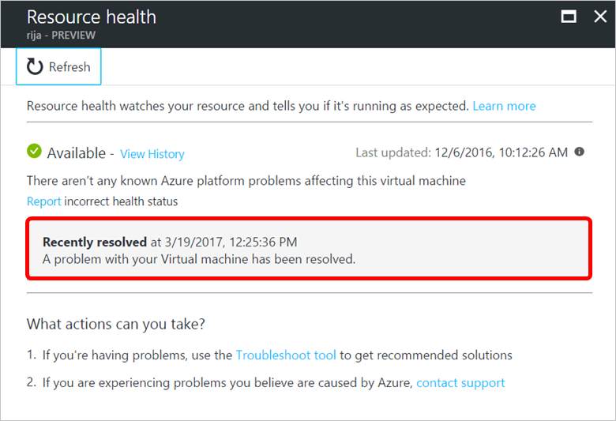
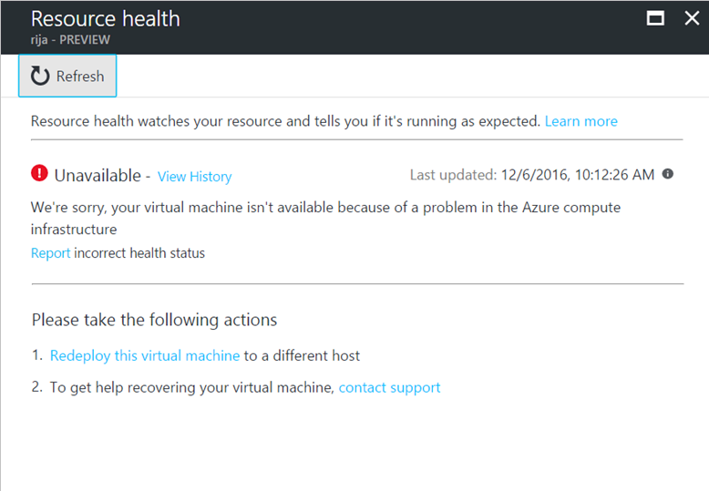
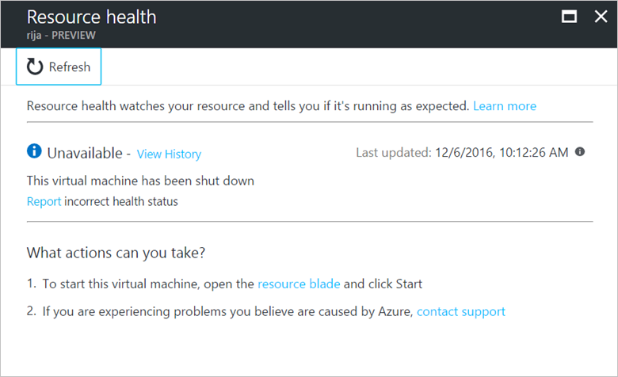
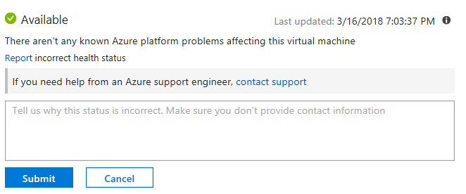
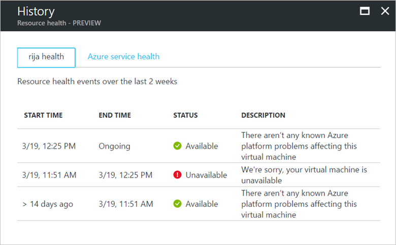
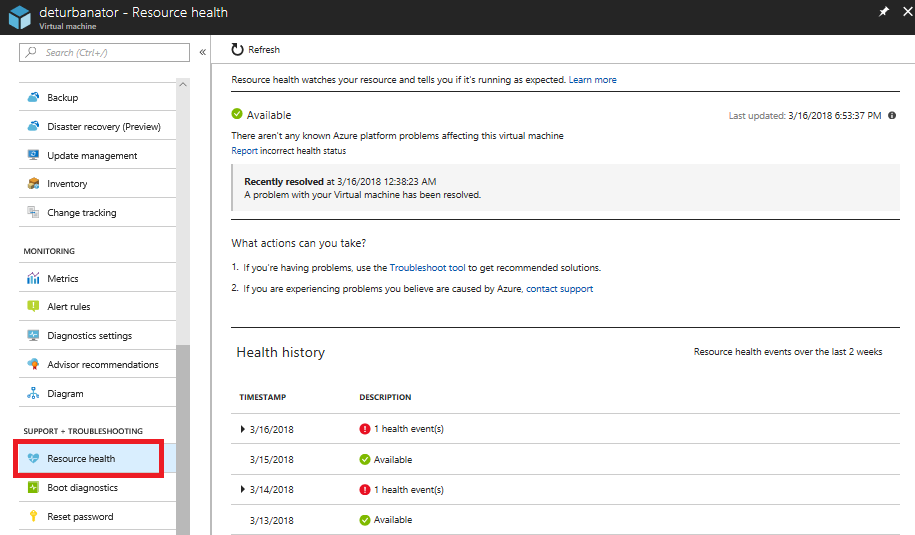
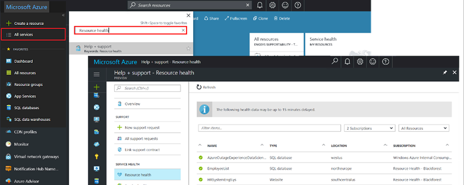

# Resource Health overview
 
Azure Resource Health helps you diagnose and get support for service problems that affect your Azure resources. It reports on the current and past health of your resources.

[Azure status](https://status.azure.com) reports on service problems that affect a broad set of Azure customers. Resource Health gives you a personalized dashboard of the health of your resources. Resource Health shows all the times that your resources have been unavailable because of Azure service problems. This data makes it easy for you to see if an SLA was violated.

## Resource definition and health assessment

A *resource* is a specific instance of an Azure service, such as a virtual machine, web app, or SQL database. Resource Health relies on signals from different Azure services to assess whether a resource is healthy. If a resource is unhealthy, Resource Health analyzes additional information to determine the source of the problem. It also reports on actions that Microsoft is taking to fix the problem and identifies things that you can do to address it.

For more information on how health is assessed, see the list of resource types and health checks at [Azure Resource Health](resource-health-checks-resource-types.md).

## Health status

The health of a resource is displayed as one of the following statuses.

### Available

*Available* means that there are no events detected that affect the health of the resource. In cases where the resource recovered from unplanned downtime during the last 24 hours, you'll see a "Recently resolved" notification.

### Unavailable

*Unavailable* means that the service detected an ongoing platform or non-platform event that affects the health of the resource.

#### Platform events

Platform events are triggered by multiple components of the Azure infrastructure. They include both scheduled actions (for example, planned maintenance) and unexpected incidents (for example, an unplanned host reboot or degraded host hardware that is predicted to fail after a specified time window).

Resource Health provides additional details about the event and the recovery process. It also enables you to contact Microsoft  Support even if you don't have an active support agreement.

#### Non-platform events

Non-platform events are triggered by user actions. Examples include stopping a virtual machine or reaching the maximum number of connections to Azure Cache for Redis.

### Unknown

*Unknown* means that Resource Health hasn't received information about the resource for more than 10 minutes. Although this status isn't a definitive indication of the state of the resource, it's an important data point for troubleshooting.

If the resource is running as expected, the status of the resource will change to *Available* after a few minutes.

If you experience problems with the resource, the *Unknown* health status might mean that an event in the platform is affecting the resource.

### Degraded

*Degraded* means that your resource detected a loss in performance, although it's still available for use.

Different resources have their own criteria for when they report that they are degraded.

## Reporting an incorrect status

If you think that the current health status is incorrect, you can tell us by selecting **Report incorrect health status**. In cases where an Azure problem is affecting you, we encourage you to contact Support from Resource Health.

## History information

You can access up to 30 days of history in the **Health history** section of Resource Health.

## Get started

To open Resource Health for one resource:

1. Sign in to the Azure portal.
2. Browse to your resource.
3. On the resource menu in the left pane, select **Resource health**.

You can also access Resource Health by selecting **All services** and typing **resource health** in the filter text box. In the **Help + support** pane, select [Resource health](https://ms.portal.azure.com/#blade/Microsoft_Azure_Monitoring/AzureMonitoringBrowseBlade/resourceHealth).

## Next steps

Check out these references to learn more about Resource Health:
-  [Resource types and health checks in Azure Resource Health](resource-health-checks-resource-types.md)
-  [Frequently asked questions about Azure Resource Health](resource-health-faq.md)
