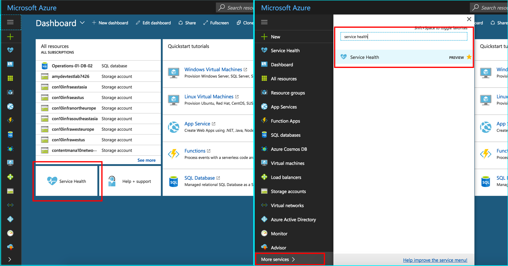
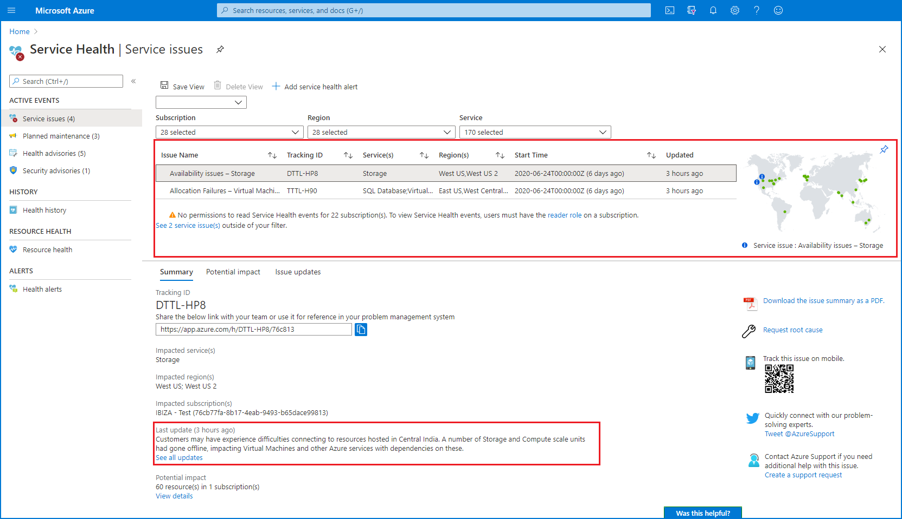
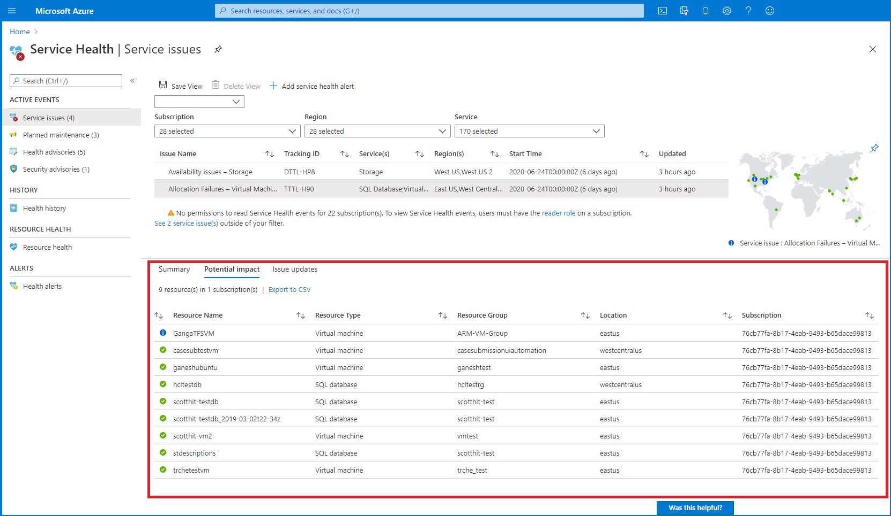
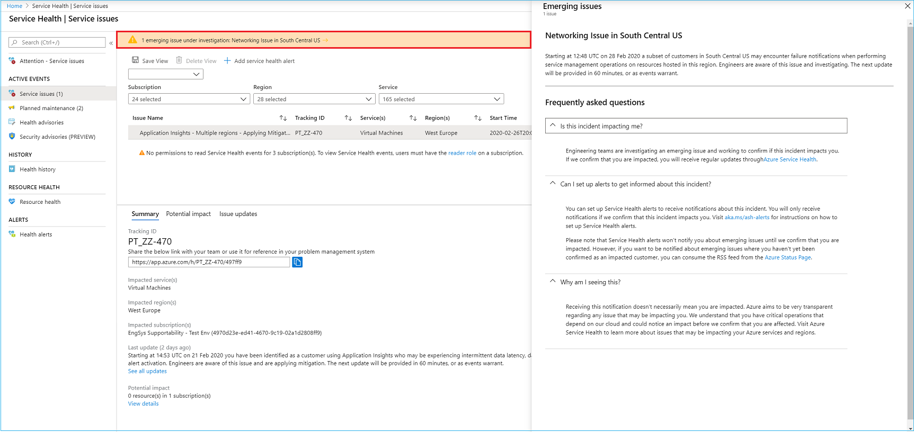
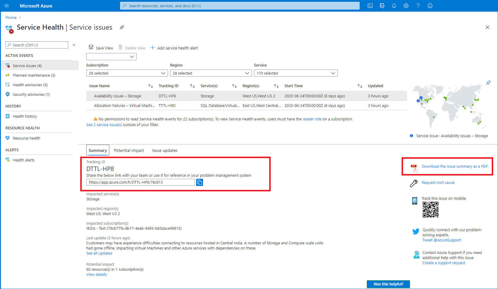
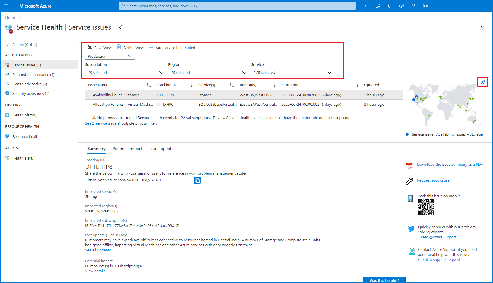
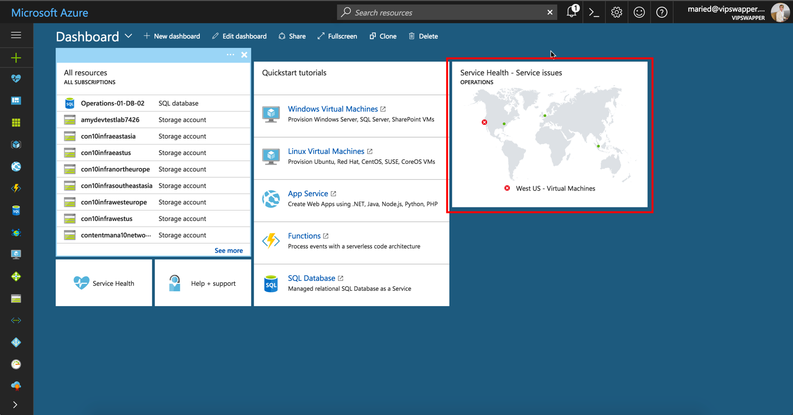

# Service Health overview

Service Health provides you with a customizable dashboard which tracks the health of your Azure services in the regions where you use them. In this dashboard, you can track active events like ongoing service issues, upcoming planned maintenance, or relevant health advisories. When events become inactive, they get placed in your health history for up to 90 days. Finally, you can use the Service Health dashboard to create and manage service health alerts which proactively notify you when service issues are affecting you.

## Service Health Events

Service Health tracks four types of health events that may impact your resources:

1. **Service issues** - Problems in the Azure services that affect you right now. 
2. **Planned maintenance** - Upcoming maintenance that can affect the availability of your services in the future.  
3. **Health advisories** - Changes in Azure services that require your attention. Examples include deprecation of Azure features or upgrade requirements (e.g upgrade to a supported PHP framework).
4. **Security advisories** - Security related notifications or violations that may affect the availability of your Azure services.

> [!NOTE]
> To view Service Health events, users must be [granted the Reader role](../role-based-access-control/role-assignments-portal.md) on a subscription.

## Get started with Service Health

To launch your Service Health dashboard, select the Service Health tile on your portal dashboard. If you have previously removed the tile or you're using custom dashboard, search for Service Health service in "More services" (bottom left on your dashboard).

## See current issues which impact your services

The **Service issues** view shows any ongoing problems in Azure services that are impacting your resources. You can understand when the issue began, and what services and regions are impacted. You can also read the most recent update to understand what Azure is doing to resolve the issue. 

Choose the **Potential impact** tab to see the specific list of resources you own that might be impacted by the issue. You can download a CSV list of these resources to share with your team.

## See emerging issues which may impact your services

There are situations when widespread service issues may be posted to the [Azure Status page](https://status.azure.com) before targeted communications can be sent to impacted customers. To ensure that Azure Service Health provides a comprehensive view of issues that may affect you, active Azure Status page issues are surfaced in Service Health as *emerging issues*. When an event is active on the Azure Status page, an emerging issues banner will be present in Service Health. Click the banner to see the full details of the issue.

## Get links and downloadable explanations 

You can get a link for the issue to use in your problem management system. You can download PDF and sometimes CSV files to share with people who don't have access to the Azure portal.   

## Get support from Microsoft

Contact support if your resource is left in a bad state even after the issue is resolved.  Use the support links on the right of the page.  

## Pin a personalized health map to your dashboard

Filter Service Health to show your business-critical subscriptions, regions, and resource types. Save the filter and pin a personalized health world map to your portal dashboard. 

## Configure service health alerts

Service Health integrates with Azure Monitor to alert you via emails, text messages, and webhook notifications when your business-critical resources are impacted. Set up an activity log alert for the appropriate service health event. Route that alert to the appropriate people in your organization using Action Groups. For more information, see [Configure Alerts for Service Health](../azure-monitor/platform/alerts-activity-log-service-notifications.md)

>[!VIDEO https://www.microsoft.com/en-us/videoplayer/embed/RE2OaXt]

## Next steps

Set up alerts so you are notified of health issues. For more information, see [Best practices for setting up Azure Service Health Alerts](https://www.youtube.com/watch?v=k5d5ca8K6tc&list=PLLasX02E8BPBBSqygdRvlTnHfp1POwE8K&index=6&t=0s). 
