<properties 
   pageTitle="Steps to failback from Azure to VMware" 
   description="This article describes how Azure Site Recovery and vContinuum tool can be used to failback a virtual machine back to VMware." 
   services="site-recovery" 
   documentationCenter="" 
   authors="ruturaj" 
   manager="mkjain" 
   editor=""/>

<tags
   ms.service="site-recovery"
   ms.devlang="powershell"
   ms.tgt_pltfrm="na"
   ms.topic="article"
   ms.workload="required" 
   ms.date="04/29/2015"
   ms.author="ruturajd@microsoft.com"/>

# Steps to failback from Azure to VMware

This document will walk you through the steps you need to failback from Azure back to your VMware site. You must have already followed the steps given in the tutorial for [VMware to Azure protection and recovery](site-recovery-vmware-to-azure.md).

After a successful failover to Azure, the virtual machines will be
available in the virtual machines tab. When you decide to failback –
below are the steps you need to follow.

Note that when you failback from Azure back to your VMware site, the recovery can only be to a virtual machine. Even if your initial source on VMware was a physical machine, failover to Azure followed by a failback to VMware will convert it into a virtual machine.

## Overview

1.  Install vContinuum server on-premises

    a.  Configure it to point to the CS

2.  Deploy a PS on Azure

3.  Install a MT on-premises

4.  Steps to protect the failed over VMs back to on-premises

    a.  Configuration considerations

5.  Monitoring protection of VMs back to on-premises

6.  Failover the VMs back to on-premises

Below is the setup overview that we will achieve with the below steps.
Part of the setup has already been completed during failover.

-   The blue lines are the connections used during failover.

-   The red lines are the connections used during failback.

-   The lines with arrows go over the internet.

## Install vContinuum on-premsies

The vContinuum setup will be at http://go.microsoft.com/fwlink/?linkid=526305

1.  Launch the setup to begin installation of vContinuum. After the
    welcome screen click next to begin specifying the settings

2.  Specify the CX server IP address and the CX server port. Ensure to
    select HTTPs in the checkbox.

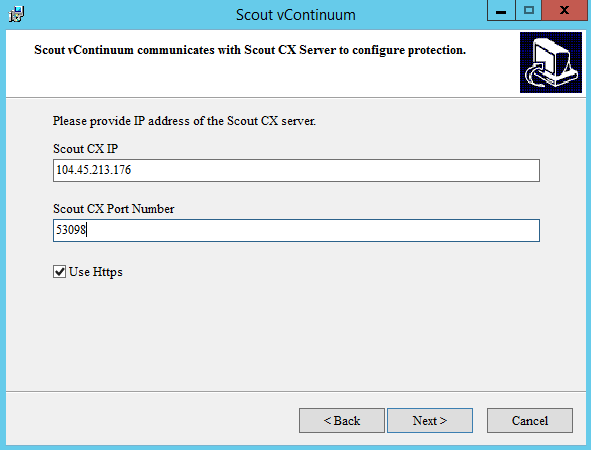

    a.  To discover the CX IP go to the CS deployment on Azure and view
        its dashboard. The public IP address will be displayed under
        Public Virtual IP address.

    b.  To discover the CX public port go to the endpoints tab in the VM
        page and identify the HTTPs endpoints public port

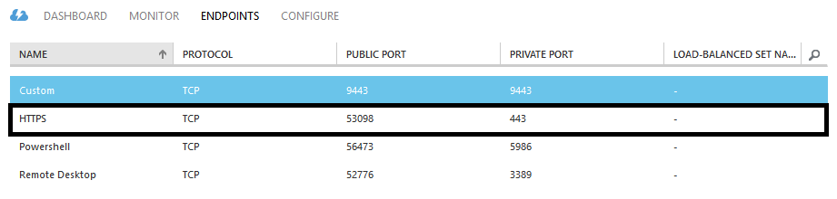

3.  Specify the CS Passphrase. You need to have noted down the
    passphrase during the CS registration. You would have used the
    passphrase during MT and PS deployments also. In case you do not
    remember the passphrase you can go in to the CS server on Azure and
    find the passphrase stored under C:\\Program Files (x86)\\InMage
    Systems\\private\\connection.passphrase

    

4.  Specify the location to install the vContinuum server and begin
    installation

    

5.  Once the installation completes, you can launch the vContinuum to
    see it working.

    

## Install PS server on Azure

A Process Server needs to be installed on Azure so that the VMs in Azure
can send the data back to on-premises MT. You need to deploy the PS on
Azure in the same network as the Configuration Server.

1.  On the Configuration Severs page in Azure, select to add a new
    Process Server 

2.  Configure the below settings on a Process Server to deploy a new
    server

    a.  Give the Process Server a name

    b.  Enter a username to connect to the virtual machine as admin

    c.  Enter the password to login with

    d.  Select the Configuration server to which the Process server
        needs to be registered to. Ensure that you select the correct
        Configuration server. This is the same server using which you
        protected and failed over your virtual machines.

    e.  Specify the Azure Network into which you need to deploy the
        Process Server. Ensure that you select the same network as your
        Configuration Server’s network.

    f.  Specify a unique IP address from the subnet selected.

    g.  Begin the deployment of the Process server.

1.  A job to deploy the Process server will be triggered

Once the Process server is deployed on Azure you can log into the server
using the credentials you specified. Use the same steps you used during
forward direction of protection to register the PS.

The Servers registered during failback will not be visible under VM
properties. They will be only visible under the Servers tab under the
Configuration server to which they have been registered.

It can take about 10-15 mins for the PS to be listed under the CS.

## Install an MT server on-premises

Depending on the source side virtual machines you need to install a
Linux or a Windows Master Target server on-premises.

### Deploy Windows MT

A windows MT is already bundled with vContinuum setup. When you install
the vContinuum, an MT is also deployed on the same machine and
registered to the Configuration server.

1.  To begin deployment, create an empty machine on-premises on the ESX
    host onto which you want to recover the VMs from Auzre.

2.  Ensure that there are at least two disks attached to the VM – one is
    used for the OS and the second one is used for Retention Drive.

3.  Install the operating system.

4.  Install the vContinuum on the server. This would also complete
    installation of the MT.

### Deploy Linux MT

1.  To begin deployment, create an empty machine on-premises on the ESX
    host onto which you want to recover the VMs from Auzre.

2.  Ensure that there are at least two disks attached to the VM – one is
    used for the OS and the second one is used for Retention Drive.

3.  Install the linux operating system.

    a.  NOTE: Linux Master Target (MT) system should not use LVM for
        root or retention storage spaces. Linux MT configured to avoid
        LVM partitions/disks discovery by default.

    b.  Partitions that you can create are
        

4.  Carry out the below post installation steps before beginning MT
    installation.

#### Post OS Installation Steps

To get SCSI ID’s for each of SCSI hard disk in a Linux virtual machine,
you should enable the parameter “disk.EnableUUID = TRUE”.

To enable this parameter, follow the steps as given below:

a. Shut down your virtual machine.

b. Right-click the VM’s entry in the left-hand panel and select **Edit
Settings.**

c. Click the **Options** tab.

d. Select the **Advanced\>General item** on the left and click the
**Configuration Parameters** that you see on the right.

“Configuration Parameters” option will be in de-active state when the
machine is running”. In order to make this tab active, shutdown machine.

e. See whether already a row with **disk.EnableUUID** exists?

If exists and if the value is set to False over write the value with
True (True and False values are case in-sensitive).

If exists and is set to true, click on cancel and test the SCSI
command inside guest operating system after it is boot-up.

f. If does not exist click **Add Row.**

Add disk.EnableUUID in the Name column.

Set its value as TRUE

NOTE: Do not add the above values along with double-quotes.

#### Download and Install the Additional Packages

NOTE: Make sure system has Internet connectivity before download and
installing additional packages.

\# yum install -y xfsprogs perl lsscsi rsync wget kexec-tools

Above command will download below mentioned 15 packages from CentOS 6.6
repository and install.

bc-1.06.95-1.el6.x86\_64.rpm

busybox-1.15.1-20.el6.x86\_64.rpm

elfutils-libs-0.158-3.2.el6.x86\_64.rpm

kexec-tools-2.0.0-280.el6.x86\_64.rpm

lsscsi-0.23-2.el6.x86\_64.rpm

lzo-2.03-3.1.el6\_5.1.x86\_64.rpm

perl-5.10.1-136.el6\_6.1.x86\_64.rpm

perl-Module-Pluggable-3.90-136.el6\_6.1.x86\_64.rpm

perl-Pod-Escapes-1.04-136.el6\_6.1.x86\_64.rpm

perl-Pod-Simple-3.13-136.el6\_6.1.x86\_64.rpm

perl-libs-5.10.1-136.el6\_6.1.x86\_64.rpm

perl-version-0.77-136.el6\_6.1.x86\_64.rpm

rsync-3.0.6-12.el6.x86\_64.rpm

snappy-1.1.0-1.el6.x86\_64.rpm

wget-1.12-5.el6\_6.1.x86\_64.rpm

NOTE: If source machine uses Reiser or XFS filesystem for root or boot
device, then following packages should be download and installed on
Linux Master Target prior to the protection.

\# cd /usr/local

\# wget
<http://elrepo.org/linux/elrepo/el6/x86_64/RPMS/kmod-reiserfs-0.0-1.el6.elrepo.x86_64.rpm>

\# wget
<http://elrepo.org/linux/elrepo/el6/x86_64/RPMS/reiserfs-utils-3.6.21-1.el6.elrepo.x86_64.rpm>

\# rpm -ivh kmod-reiserfs-0.0-1.el6.elrepo.x86\_64.rpm
reiserfs-utils-3.6.21-1.el6.elrepo.x86\_64.rpm

\# wget
<http://mirror.centos.org/centos/6.6/os/x86_64/Packages/xfsprogs-3.1.1-16.el6.x86_64.rpm>

\# rpm -ivh xfsprogs-3.1.1-16.el6.x86\_64.rpm

#### Apply Custom Configuration Changes

Before applying custom configuration changes make sure you have
completed Post Installation Steps

To apply custom configuration changes, follow the below mentioned steps:

1. Copy the RHEL 6-64 Unified Agent binary to the newly created OS.

2. Run the below command to untar the binary.

**tar -zxvf \<File name\>**

3. Execute below command to give permission.

\# **chmod 755 ./ApplyCustomChanges.sh**

4. Execute the below command to run the script.

**\# ./ApplyCustomChanges.sh**

NOTE: Execute the script only once on the server. **REBOOT** the server
after successful execution of the above script.

### Begin MT Installation

[Download](http://go.microsoft.com/fwlink/?LinkID=529757) the Linux
Master Target Server installation file.

Copy the downloaded Linux Master Target Server installer to the Linux
Master Target virtual machine using an sftp client utility of your
choice. Alternately you can log into the Linux Master Target virtual
machine and use wget to download the installation package from the
provided link.

Log in to the Linux Master Target server virtual machine using an ssh
client of your choice.

If you are connected to the Azure network on which you deployed your
Linux Master Target server through a VPN connection then use the
internal IP address for the Linux Master Target Server obtained from the
virtual machine dashboard and port 22 to connect to the Linux Master
Target Server using Secure Shell.

If you are connecting to the Linux Master Target Server over a public
internet connection use the Linux Master Target Server’s public virtual
IP address (from the virtual machines dashboard page) and the public
endpoint created for ssh to login to the Linux Master Target Server.

Extract the files from the gzipped Linux Master Target Server installer
tar archive by executing

*“tar –xvzf Microsoft-ASR\_UA\_8.2.0.0\_RHEL6-64\*”* from the directory
where you had copied the Linux Master Target Server installer to.

If you extracted the installer files to a different directory change
directory to the directory to which the contents of the tar archive were
extracted. From this directory path execute “sudo ./install.sh”

When prompted to make choice of Primary Role of this Agent select 2
(Master Target)

Leave the other interactive install options at their default values.

Wait for the rest of the installation to proceed and the Host Config
Interface to appear. The Host Configuration utility for the Linux Master
Target Server is a command line utility. Don’t resize your ssh client
utility window. Use the arrow keys to select the Global option and press
enter on your keyboard.

1.  Against the field IP enter the Internal IP address of the
    Configuration Server obtained from the virtual machines dashboard
    page and press enter.

2.  Against the field Port enter 22 and press enter.

3.  Leave Use https: as Yes. Press enter one more time.

4.  Enter the Passphrase that was generated on the Configuration Server.
    If you are using PuTTY client from a Windows machine to ssh to the
    Linux Master Target Server virtual machine you can use Shift+Insert
    to paste the contents of the clipboard. Copy the Passphrase to the
    local clipboard using Ctrl-C and use Shift+Insert to paste it. Press
    enter

5.  Use the right arrow key to navigate to quit and press enter.

Wait for the installation to complete

If for some reason you failed to register your Linux Master Target
Server to the Configuration Server you could do so again by running the
host configuration utility from /usr/local/ASR/Vx/bin/hostconfigcli (you
will first need to set access permissions to this directory by executing
chmod as a super user)

#### Validate Master Target Server registration to the Configuration Server.

You can validate that the Master Target Server registered successfully
with the Configuration Server by visiting the Server Details page under
the Configuration Server page on the Azure Site Recovery vault

## Begin protecting the virtual machines back to on-premises

Before failback of the VMs back to on-premises, first you need to
protect the virtual machines back to on-premises. Follow the below steps
to protect VMs of an application.

Note:
-----

When a VM is failed over to Azure, it adds an extra temp drive for page
file. This is an extra drive that is typically not required by your
failed over VM since it might already have a drive dedicated for the
page file.

Before you begin reverse protection of the virtual machines, you need to
ensure that the drive is taken offline so that it does not get
protected.

To do this,

1.  Open Computer Management (via control panel administrative tool, or
    by right click on This PC in the explorer window and selecting
    manage.)

2.  Select Storage Management so that it lists the disks online and
    attached to the machine.

3.  Select the temporary disk attached to the machine and choose to
    bring it offline.

4.  Once it has been successfully taken offline you can proceed with
    protecting the virtual machine in the reverse direction.

### Protection plan for VMs

On the Azure portal, look at the states of the virtual machine and
ensure that they are failed over.

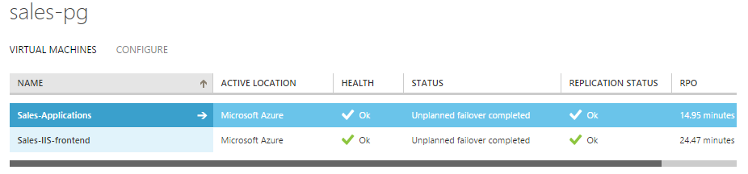

Note : during failover from Azure back to on-premises, the Azure VM is
considered similar to a Physical VM. The failover to on-premises is to a
virtual machine.

1.  Launch the vContinuum on your machine

1.  In the **Choose Application** setting, select **P2V**

2.  Click on the **New Protection** option to begin

3.  In the new window that opens you will begin protecting the virtual
    machines back to on-premises.

    a.  Select the **OS type** according to the VMs you want to failback
        and **Get Details**

    b.  In the **Primary server details**, you need to identify the
        virtual machines that you want to protect.

    c.  The virtual machines are listed by their Computer Hostnames and
        not as they are visible on vCenter or Azure

    d.  The virtual machines are listed under the vCenter Hostname that
        the virtual machines were on, before failover.

    e.  Once you have identified the VMs you want to protect, select
        them one by one.

4.  When you select a virtual machine to protect (and it has already
    failed over to Azure) you will get a popup window that gives two
    entries for the virtual machine. This is because the CS has detected
    two instances of the virtual machines registered to it. You need to
    remove the entry for the on-premises VM so that you can protect the
    correct VM. Note that you will see the entries by its computer
    hostname.

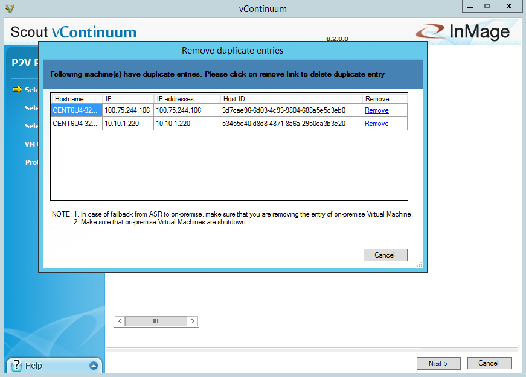

    a.  To select the correct VM – you can refer to its IP address. The
        IP address range on-premises will be the on-premises VM.

    b.  Click **Remove** to delete the entry

    c.  Go to the vCenter and stop the virtual machine on the vCenter

    d.  Next you can also delete the virtual machines on-premises

5.  Next you need to specify the on-premises MT server to which you want
    to protect the VMs.

    a.  Connect to the vCenter to which you want to failback to

a.  Select the MT server based on the host into which you want to
    recover the virtual machines

1.  Next provide the replication option for each of the virtual machines

a.  You need to select the recovery side **Datastore** – this is the
    datastore to which the VMs will be recovered to

The different options you need to provide per VM are

<table>
<tr><td>Option</td><td>Option recommended value</td></tr>
<tr><td>Process Server IP</td><td>Select the PS which you have deployed on Azure</td></tr>
<tr><td>Retention size in MB</td><td></td></tr>
<tr><td>Retention value</td><td>1</td></tr>
<tr><td>Days/Hours</td><td>Days</td></tr>
<tr><td>Consistency Interval</td><td>1</td></tr>
<tr><td>Select Target Datastore</td><td>The datastore available on the recovery side. This data store should have enough space and also be available to the ESX host on which you want to realise the virtual machine.</td></tr>
</table>

1.  Next you can configure the properties that the virtual machine will
    acquire after failover to on-premises site. The different properties
    you can configure are as below

  <table>
<tr><td>Property</td><td>How to configure</td></tr>
<tr><td>Network Configuration</td><td>For each NIC detected, configure the failback IP address for the virtual machine. Select the NIC and click **Change** to specify the IP address details.

</td></tr>
<tr><td>Hardware Configuration</td><td>You can specify the CPU and the Memory values for the VM. This setting can be applied to all the VMs you are trying to protect.

To identify the correct values for the CPU and Memory, you can refer to the IAAS VMs role size and see the number of cores and Memory assigned.
</td></tr>
<tr><td>Display Name</td><td>After failover back to on-premises, you can choose to rename the virtual machines as it will be seen in the inventory of vCenter. Note that the default value seen here is the virtual machine computer host name. To identify the VM name, you can refer to the VM list in the Protection group.</td></tr>
<tr><td>NAT Configuration</td><td>Discussed in detail below</td></tr>
</table>

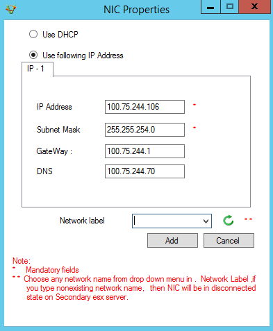

> **PS NAT settings choices**
>
> To enable protection of the virtual machines, two communication
> channels need to be established.
>
> The first channel is between the virtual machine and the Process
> Server. This channel collects the data from the VM and sends it to the
> PS. PS will then send this data to the Master Target. If the process
> server and the virtual machine to be protected are on the same Azure
> vNet, then you do not need to use the NAT settings. If the PS and the
> virtual machine to be protected is in two different vNet, then you
> need to specify the NAT settings for the PS and check the first
> option.
>
> 
>
> To identify the Process server Public IP, you can go to the PS
> deployment in Azure and see its Public IP address.
>
> The second channel is between the Process server and the Master
> target. The option to use NAT or not depends on whether you are using
> VPN based connection between MT and PS or protecting over the
> internet. If the PS communicates to the MT over a VPN, then you should
> not select this option. If the Master Target needs to communicate to
> the Process server over the internet, then specify the NAT settings
> for the PS.
>
> 
>
> To identify the Process server Public IP, you can go to the PS
> deployment in Azure and see its Public IP address.
>
> 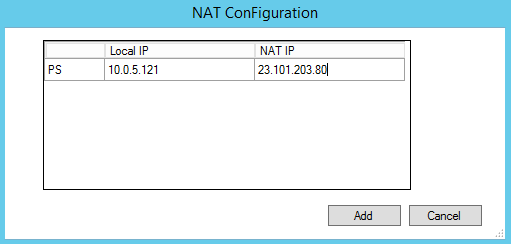

1.  If you have not deleted the on-premises virtual machines as specified
    in Step 5.d, and if the datastore you are failing back to, as
    selected in step 7.a still contains the old VMDK’s then you will
    also need to ensure that the failback VM gets created in a new
    place. For this you can select the Advanced settings and specify an
    alternate Folder to restore to in the **Folder Name Settings**
    section of the Advanced Settings.

The other options in the Advanced settings can be left as default.
Make sure you apply the folder name settings to all the servers.

1.  Next move to the final stage of the Protection. Here you need to run
    a Readiness Check to ensure that the virtual machines are ready to
    be protected back to on-premises.

	a.  Click on the readiness check and wait for it to complete.

	b.  The Readiness Report tab will give the information if all the
    virtual machines are ready.

	c.  If the Readiness Report is successful on all the virtual machines it
    will allow you to specify a name to the Protection plan

	d.  Give the plan a new Name and begin Protect by clicking the button
    below.

1.  The Protection will now begin.

    a.  You can see the progress of the protection on the vContinuum

	b.  Once the step **Activating Protection Plan** is completed, you can
    monitor the protection of the virtual machines via the ASR Portal.

	c.  You can also monitor the protection via Azure Site Recovery.

You can also see the exact status of the pairs by clicking into the
virtual machine and monitoring its progress under the volume replication
section.

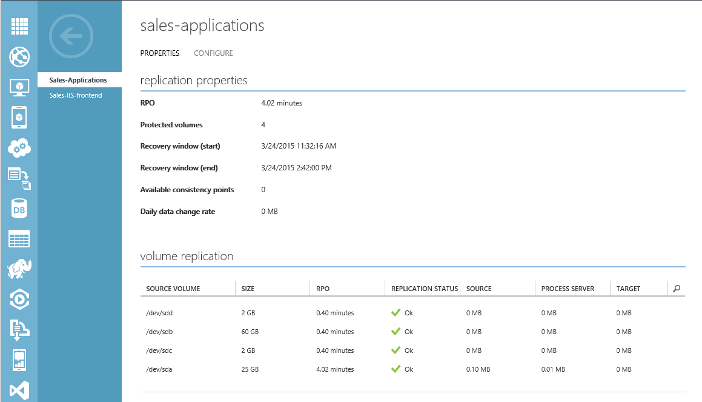

## Prepare the Failback plan

You can prepare a failback plan using vContinuum so that the application
can be failed over back to on-premises at any time. These recovery plans
are very similar to the ASR Recovery plans.

1.  Launch the vContinuum and select the option to **Manage plans**.

2.  User the sub-options select **Recover.**

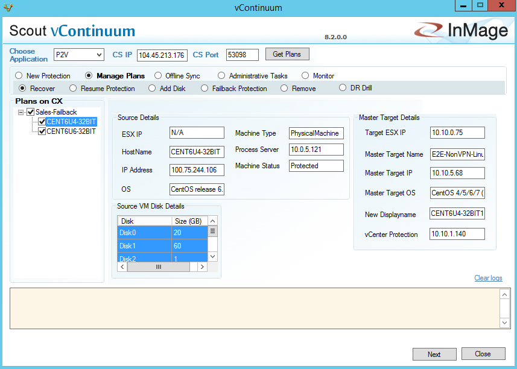

1.  You can see the list of all the Plans that have been used to protect the virtual machines. These are the same plans you can use to recover.

2.  Select the Protection Plan and select all the VMs you want to recover within it.

    a.  On selecting each VM you can see more details about the source
        VM, target ESX server where the VM will be recovered to and the
        source VM disk

3.  Click Next to begin the **Recover** Wizard

4.  Select the Virtual Machines you want to recover

    a.  See the list of all the virtual machines that you can recover

	b.  You can **recover based on** multiple options however we recommend
    the **Latest Tag.** This will ensure that the latest data from the
    virtual machine will be used.

	c.  Select **Apply for All VMs** to ensure that the latest tag will be
    chosen for all the virtual machines.

1.  Run the **Readiness Check.** This will inform if the right
    parameters are configured to enable the latest tag recovery of the
    virtual machine. Click Next if all the checks are successful else
    look at the log and resolve the errors.

2.  In the VM Configuration step of the wizard, ensure that the recovery
    settings are correctly set. In case the VM settings are different
    from the one you require, you can choose to change them. Since we
    have already completed this action during the protection, you may
    choose to ignore it this time.

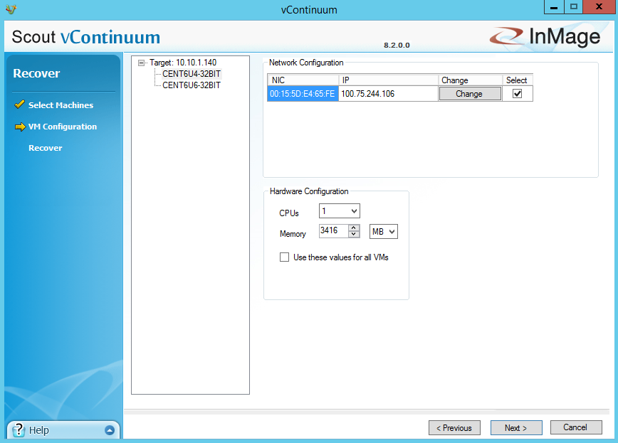

1.  Finally review the list of virtual machines that will be recovered.

    a.  Specify a recovery order to the virtual machines.

Note: The virtual machines are listed using the Computer Hostname. It
might be difficult to map the computer hostname to the virtual machine.
To map the names, you can go to the virtual machines dashboard in Azure
IAAS and look at the hostname of the virtual machine.

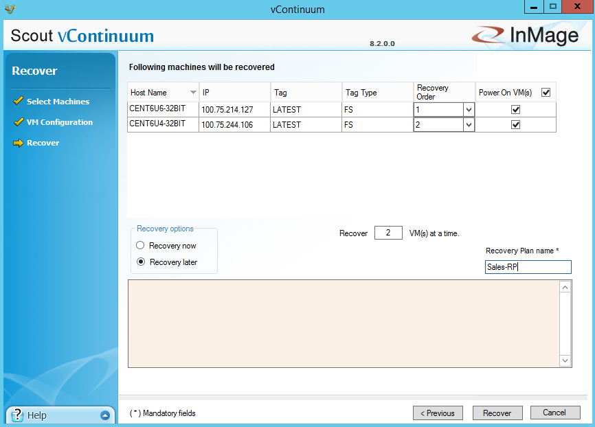

1.  Give the **recovery plan name** and select **Recover later** in
    **Recovery options.**

    a.  In case you want to recover right away you can choose to
        **Recover now** in the **Recovery options**.

    b.  It is recommended to Recover later since the protection initial
        replication may not have completed

    c.  Finally click on **Recover** button to either save the plan or
        to trigger the recovery based on your **Recovery options**.

2.  You can see the Recovery Status and see if it the plan is
    successfully saved.

1.  If you have chosen to recover later, you will be informed that the
    plan is created and you can recover later.

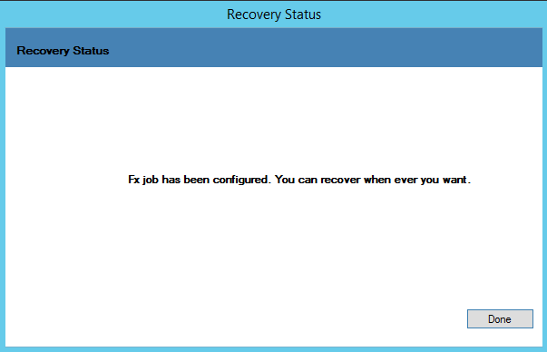

## Recover Virtual Machines

After the plan is created, you can choose to recover the virtual
machines. As a pre-requisite, you need to ensure that the virtual
machines have completed synchronization.

If Replication Status shows OK then the protection is completed and the
RPO threshold has been met. To confirm the replication pair’s health,
you can go to the virtual machine properties and see the health of the
replication.

**Turn off the Azure virtual machines before you initiate the recovery.
This will ensure that there is no split brain and your end customers
will be served by one copy of the application. Only when you have
successfully ensured that the Azure VMs are turned off continue to the
steps below.**

To begin recovering the virtual machines back to on-premise, you need to
start the plan that is saved.

1.  On the vContinuum select to **Monitor** the plans.

2.  The wizard will list the plans that have been executed till now.

1.  Select the **Recovery** node and select the plan that you want to
    recover.

    a.  It will inform you that the plan has not yet started.

2.  Click **Start** to begin the recovery.

3.  You can monitor the recovery of the virtual machines

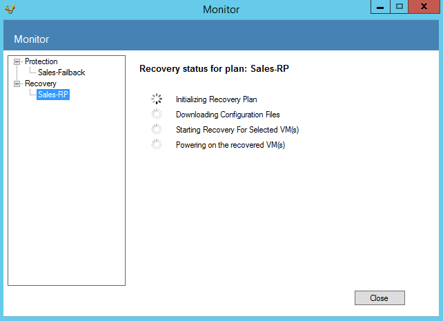

4. Once the VMs have been powered ON, you can connect to the virtual
    machines on your vCenter.

## Re-protect to Azure after failback

After failback has been completed you may want to protect the virtual
machines once again. The below steps will help you re-configure the
protection

1.  Check that the virtual machines on-premises are working and
    application is able to reach your end customers.

2.  On the Azure Site Recovery portal, select the virtual machines and
    delete them.

    a.  Select to disable the protection of the virtual machines. This
        will ensure that the VMs are no more protected.

3.  Go to the Azure IAAS virtual machines and delete the failed over
    VMs.

4.  Delete the old VMs on vSpehere – these are the VMs that you
    previously failed over to Azure.

5.  On the ASR portal select to protect the virtual machines recently
    failed over.

6.  Once the VMs are protected, you can add them to a recovery plan and
    be continuously protected.

