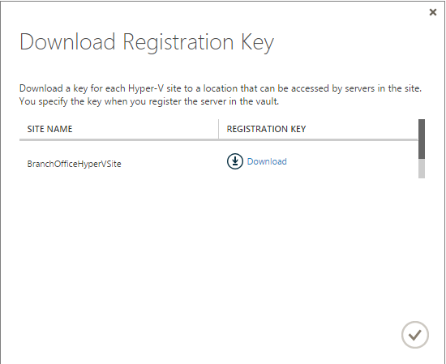
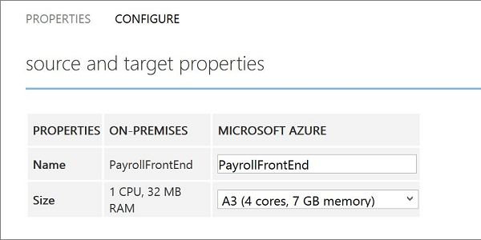

<properties
	pageTitle="Set up protection between an on-premises Hyper-V site and Azure" 
	description="Azure Site Recovery coordinates the replication, failover and recovery of virtual machines located on on-premises Hyper-V servers to Azure" 
	services="site-recovery" 
	documentationCenter="" 
	authors="rayne-wiselman" 
	manager="jwhit" 
	editor=""/>

<tags 
	ms.service="site-recovery" 
	ms.devlang="na"
	ms.topic="article"
	ms.tgt_pltfrm="na"
	ms.workload="storage-backup-recovery" 
	ms.date="05/07/2015" 
	ms.author="raynew"/>

# Set up protection between an on-premises Hyper-V site and Azure

## Overview

Azure Site Recovery contributes to your business continuity and disaster recovery (BCDR) strategy by orchestrating replication, failover and recovery of virtual machines and physical servers. Read about possible deployment scenarios in the [Site Recovery Overview](hyper-v-recovery-manager-overview/).

This article describes how to deploy Site Recovery to replicate virtual machines located on on-premises Hyper-V servers running Windows Server 2012 R2. Replication to Azure storage is orchestrated by Site Recovery. This deployment is particularly useful if you're running Hyper-V servers but System Center Virtual Machine Manager (VMM) isn't deployed.

## About this article

The article summarizes the deployment prerequisites, helps you to configure replication settings, and enable protection for virtual machines. It finishes up by testing failover to make sure everything's working as expected.

If you run into problems post your questions on the [Azure Recovery Services Forum](https://social.msdn.microsoft.com/forums/azure/home?forum=hypervrecovmgr).

## Before you start

Make sure you have everything in place before you begin.

### Azure prerequisites

- You'll need a [Microsoft Azure](http://azure.microsoft.com/) account. You can start with a [free trial](pricing/free-trial/).
- - You'll need an Azure storage account to store replicated data. The account needs geo-replication enabled. It should be in the same region as the Azure Site Recovery vault and be associated with the same subscription. To learn more read [Introduction to Microsoft Azure Storage](storage-introduction).
- - You'll need an Azure virtual network so that replicated virtual machines are connected to a network after failover.

## Hyper-V prerequisites

- In the source on-premises site you'll need at least one server running Windows Server 2012 R2 with the Hyper-V role.
- The Hyper-V server should contain one or more virtual machines.
- Hyper-V servers should be connected to the Internet, either directly or via a proxy.

### Virtual machine prerequisites

Virtual machines you want to protect should conform with [Azure prerequisites](https://msdn.microsoft.com/library/azure/dn469078.aspx#BKMK_E2A). 

### Provider and agent prerequisites

As part of Azure Site Recovery deployment you’ll install the Azure Site Recovery Provider and the Azure Recovery Services Agent on each Hyper-V server running virtual machines you want to protect. Note that:

- You should run the latest versions of the Provider and agent.
- All Hyper-V servers in a vault should have the same versions.
- The Provider will need to connect to Azure Site Recovery over the Internet. You can select to do this without a proxy, using proxy settings currently configured on the VMM server, or using custom proxy settings that you configure during Provider installation. To use an existing proxy server ensure that the URLs for connecting to Azure are allowed through the firewall:
	- hypervrecoverymanager.windowsazure.com
	- *.accesscontrol.windows.net
	- *.backup.windowsazure.com
- To use a custom proxy set up the proxy server before installing the Provider. During Provider setup you’ll need to specify the proxy server address and port, and credentials that can be used for access.

 
## Step 1: Create a vault

1. Sign in to the [Management Portal](https://portal.azure.com).

2. Expand **Data Services** > **Recovery Services** and click **Site Recovery Vault**.

3. Click **Create New** > **Quick Create**.

4. In **Name**, enter a friendly name to identify the vault.

5. In **Region**, select the geographic region for the vault. To check supported regions see Geographic Availability in [Azure Site Recovery Pricing Details](pricing/details/site-recovery/).

6. Click **Create vault**.

	

Check the status bar to confirm that the vault was successfully created. The vault will be listed as **Active** on the main Recovery Services page.

## Step 2: Create a Hyper-V site

1. In the Recovery Services page, click the vault to open the Quick Start page. Quick Start can also be opened at any time using the icon.

	

2. In the dropdown list, select **Between an on-premises Hyper-V site and Azure**.

	

3. In **Create a Hyper-V Site** click **Create Hyper-V site**. Specify a site name and save.

	

## Step 3: Install the Provider and agent
Install the Provider and agent. If you're installing on a Hyper-V cluster, performs steps 5-11 on each node in the failover cluster. After all nodes are registered and protection is enabled, virtual machines will be protected even if they migrate across nodes in the failover cluster.

1. In **Prepare Hyper-V servers**, click **Download a registration key** file.
2. On the **Download Registration Key** page, click **Download** next to the site. Download the key to a safe location that can be easily accessed by the Hyper-V server. The key is valid for 5 days after it's generated.

	

4. Click **Download the Provider** to obtain the latest version.
5. Run the file on each Hyper-V server you want to register in the vault. The file installs two components:
	- **Azure Site Recovery Provider**—Handles communication and orchestration between the Hyper-V server and the Azure Site Recovery portal. 
	- **Azure Recovery Services Agent**—Handles data transport between virtual machines running on the source Hyper-V server and Azure storage. 
6. In **Microsoft Update** you can opt in for updates. With this setting enabled, Provider and Agent updates will be installed according to your Microsoft Update policy.

	

7. In **Installation** specify where you want to install the Provider and Agent on the Hyper-V server.

	

8. After installation is complete continue setup to register the server in the vault.

	

9. On the **Internet Connection** page you specify how the Provider connects to Azure Site Recovery. Select **Use default system proxy settings** to use the default Internet connection settings configured on the server. If you don't specify a value the default settings will be used.

	

	Note that:

	- If the default proxy on the Hyper-V server requires authentication then you should select to use a custom proxy server. Type in the default proxy details and specify credentials.
	- If you want to use a custom proxy server set it up before you install the Provider.
	- Exempt the following addresses from routing through the proxy:
		- The URL for connecting to the Azure Site Recovery: *.hypervrecoverymanager.windowsazure.com
		- *.accesscontrol.windows.net
		- *.backup.windowsazure.com
		- *.blob.core.windows.net
		- *.store.core.windows.net 

	If you need to allow outbound connections to an Azure domain controller, allow the IP addresses described in Azure Datacenter IP Ranges, and allow the HTTP (80) and HTTPS (443) protocols. 

9. On the **Vault Settings** page, click **Browse** to select the key file. Specify the Azure Site Recovery subscription, the vault name, and the Hyper-V site to which the Hyper-V server belongs.

	

11. Registration starts to register the server in the vault.

	

11. After registration finishes metadata from the Hyper-V server is retrieved by Azure Site Recovery and the server is displayed on the **Hyper-V Sites** tab on the **Servers** page in the vault.

	

Note that if you want to install the Provider on Server Core for Windows Server 2012 R2 or standalone Hyper-V Server 2012 R2, do the following:

1. Download the Provider installation file and the registration key.
2. Extract the Provider installer by typing:

	`C:\Windows\System32> CD C:\ASR`
	`C:\ASR> AzureSiteRecoveryProvider.exe /x:. /q`
3. Install the Provider by typing:
	`C:\ASR> setupdr.exe /i`
4. Register the server by typing:
	`C:\ASR> DRConfigurator.exe /r /Credentials <Path to the registration key file> /FriendlyName <Name of the Hyper-V host>`

	- /Credentials: Mandatory parameter that specifies the location in which the registration key file is located.
	- /FriendlyName: Mandatory parameter for the name of the Hyper-V host server that appears in the Azure Site Recovery portal.
	- Optional proxy parameters:
		- /proxyAddress <address>: Address of proxy server
		- /proxyport <port>: Port of the proxy server
		- /proxyUsername <username>: Credentials if proxy requires authentication.
		- proxyPassword <password>

## Step 4: Create Azure resources

1. In **Prepare resources** select **Create Storage Account**  to create an Azure storage account if you don't have one. The account should have geo-replication enabled. It should be in the same region as the Azure Site Recovery vault, and be associated with the same subscription.

	

## Step 5: Create and configure protection groups

Protection groups are logical groupings of virtual machines that you want to protect using the same protection settings. You apply protection settings to a protection group, and those settings are applied to all virtual machines that you add to the group.
1. In **Create and configure protection groups** click **Create a protection group**. If any prerequisites aren't in place a message is issued and you can click **View details** for more information.

2. In the **Protection Groups** tab, add a protection group. Specify a name, the source Hyper-V site, the target **Azure**, your Azure Site Recovery subscription name, and the Azure storage account.

	

2. In **Replication settings** set the **Copy frequency** to specify how often the data delta should be synchronized between the source and target. You can set to 30 seconds, 5 minutes, or 15 minutes.
3. In **Retain recovery points** specify how many hours of recovery history should be stored.
4. In **Frequency of application-consistent snapshots** you can specify whether to take snapshots that use Volume Shadow Copy Service (VSS) to ensure that applications are in a consistent state when the snapshot is taken. By default these aren't taken. Make sure this value is set to less than the number of additional recovery points you configure. This is only supported if the virtual machine is running a Windows operating system.
5. In **Initial replication start time** specify when initial replication of virtual machines in the protection group should be sent to Azure.

	

## Step 6: Enable virtual machine protection

Add virtual machines to a protection group to enable protection for them. 

1. On the **Machines** tab for the protection group, click** Add virtual machines to protection groups to enable protection**.
2. On the **Enable Virtual Machine Protection** page select the virtual machines you want to protect. 

	

	The Enable Protection jobs begins. You can track progress on the **Jobs** tab. After the Finalize Protection job runs the virtual machine is ready for failover. 
3. After protection is set up you can:

	- View virtual machines in **Protected Items** > **Protection Groups** > *protectiongroup_name* > **Virtual Machines** You can drill down to machine details in the **Properties** tab..
	- Configure the failover properties for a virtual machines in **Protected Items** > **Protection Groups** > *protectiongroup_name* > **Virtual Machines** *virtual_machine_name* > **Configure**. You can configure:
		- **Name**: The name of the virtual machine in Azure.
		- **Size**: The target size of the virtual machine that fails over.

		
	- Configure additional virtual machine settings in *Protected Items** > **Protection Groups** > *protectiongroup_name* > **Virtual Machines** *virtual_machine_name* > **Configure**, including:

		- **Network adapters**: The number of network adapters is dictated by the size you specify for the target virtual machine. 
			- Large (A3) and A6: 2
			- ExtraLarge (A4) and A7:
			- A9: 2
			- D3: 2
			- D4: 4
			- D13: 4
			
			When you modify the size for a virtual machine and save the settings, the next time you open the **Configure** page the network adapters will be shown. The number of adapters for a virtual machine will be determined as follows:

			- If the number of network adapters on the source machine is less than or equal to the number of adapters allowed for the target machine size, then the target will have the same number of adapters as the source.
			- If the number of adapters for the source virtual machine exceeds the number allowed for the target size then the target size maximum will be used.
			- For example if a source machine has two network adapters and the target machine size supports four, the target machine will have two adapters. If the source machine has two adapters but the supported target size only supports one then the target machine will have only one adapter. 	
		- **Azure network**: Specify the network to which the virtual machine should fail over. If the virtual machine has multiple network adapters all adapters should connected to the same Azure network.
		- **Subnet** For each network adapter on the virtual machine, select the subnet in the Azure network to which the machine should connect after failover.
		- **Target IP address**: If the network adapter of source virtmachine is configured to use static a IP address then you can specify the IP address for the ttarget virtual machine to ensure that the machine has the same IP address after failover.  If you don't specify an IP address then any available address will be assigned at the time of failover. If you specify an address that's in use then failover wll fail.
		 
		
	

### Step 7: Test the deployment

There are two ways to run a test failover to Azure.

- Test failover without an Azure network—This type of test failover checks that the virtual machine comes up correctly in Azure. The virtual machine won’t be connected to any Azure network after failover.
- Test failover with an Azure network—This type of failover checks that the entire replication environment comes up as expected and that failed over the virtual machines will be connected to the specified target Azure network. For subnet handling, for test failover the subnet of the test virtual machine will be figured out based on the subnet of the replica virtual machine. This is different to regular replication when the subnet of a replica virtual machine is based on the subnet of the source virtual machine.

If you want to run a test failover for a virtual machine enabled for protection to Azure without specifying an Azure target network you don’t need to prepare anything. To run a test failover with a target Azure network you’ll need to create a new Azure network that’s isolated from your Azure production network (default behavior when you create a new network in Azure) and set up the infrastructure for the replicated virtual machine to work as expected. For example, a virtual machine with Domain Controller and DNS can be replicated to Azure using Azure Site Recovery and can be created in the test network using Test Failover. To run a test failover follow the steps below:

1. Do a test failover of the virtual machine with Domain Controller and DNS in the same network that you’ll be using for the actual test failover of the on-premises virtual machine.
2. Note down the IP addresses that were allocated to the failed over DNS virtual machine.
3. In the Azure virtual network that will be used for the failover, add the IP address as the address of the DNS server.
4. Run the test failover of the source on-premises virtual machines, specifying the Azure test network.
5. After validating that the test failure worked as expected, mark the test failover as complete for the recovery plan, and then mark the test failover as complete for the Domain Controller and DNS virtual machines.

To run the test failover do the following:

1. On the **Recovery Plans** tab, select the plan and click **Test Failover**.
2. On the **Confirm Test Failover** page select **None** or a specific Azure network.  Note that if you select **None** the test failover will check that the virtual machine replicated correctly to Azure but doesn't check your replication network configuration.

	

3. On the **Jobs** tab you can track failover progress. You should also be able to see the virtual machine test replica in the Azure portal. If you’re set up to access virtual machines from your on-premises network you can initiate a Remote Desktop connection to the virtual machine.
4. When the failover reaches the **Complete testing** phase , click **Complete Test** to finish up the test failover. You can drill down to the **Job** tab to track failover progress and status, and to perform any actions that are needed.
5. After  failover you'll be able to see the virtual machine test replica in the Azure portal. If you’re set up to access virtual machines from your on-premises network you can initiate a Remote Desktop connection to the virtual machine.

	1. Verify that the virtual machines start successfully.
    2. If you want to connect to the virtual machine in Azure using Remote Desktop after the failover, enable Remote Desktop Connection on the virtual machine before you run the test failover. You will also need to add an RDP endpoint on the virtual machine. You can leverage an [Azure Automation Runbooks](site-recovery-runbook-automation.md) to do that.
    3. After failover if you use a public IP address to connect to the virtual machine in Azure using Remote Desktop, ensure you don't have any domain policies that prevent you from connecting to a virtual machine using a public address.

6. After the testing is complete do the following:

	- Click **The test failover is complete**. Clean up the test environment to automatically power off and delete the test virtual machines.
	- Click **Notes** to record and save any observations associated with the test failover.
7. When the failover reaches the **Complete testing** phase finish the verification as follows:
	1. View the replica virtual machine in the Azure portal. Verify that the virtual machine starts successfully.
	2. If you’re set up to access virtual machines from your on-premises network you can initiate a Remote Desktop connection to the virtual machine.
	3. Click **Complete the test** to finish it.
	4. Click **Notes** to record and save any observations associated with the test failover.
	5.  Click **The test failover is complete**. Clean up the test environment to automatically power off and delete the test virtual machine.

