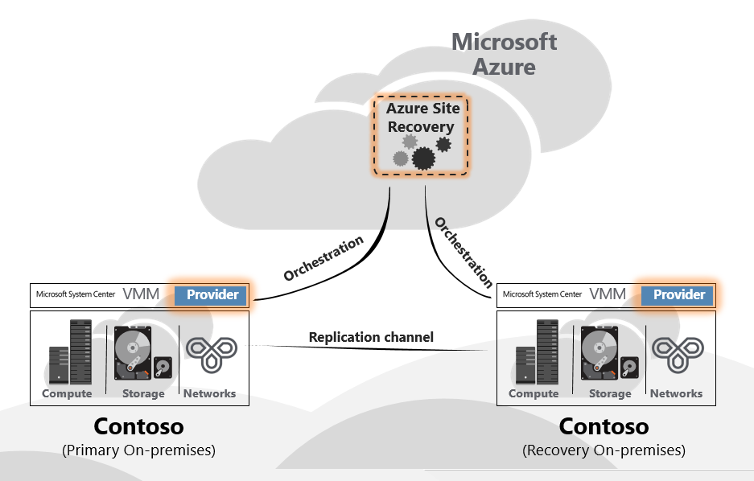
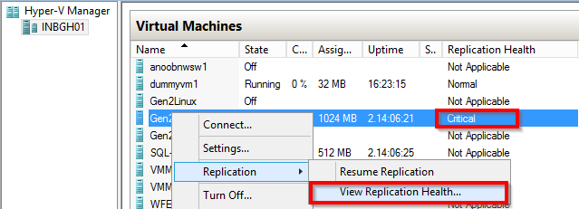

<properties
	pageTitle="Monitoring and Troubleshooting Guide for VMM and Hyper-V Site Protection" 
	description="Azure Site Recovery coordinates the replication, failover and recovery of virtual machines located on on-premises servers to Azure or a secondary datacenter. Use this article to monitor and troubleshoot  VMM or Hyper-V Site protection." 
	services="site-recovery" 
	documentationCenter="" 
	authors="anbacker" 
	manager="mkjain" 
	editor=""/>

<tags 
	ms.service="site-recovery" 
	ms.devlang="na"
	ms.topic="article"
	ms.tgt_pltfrm="na"
	ms.workload="storage-backup-recovery" 
	ms.date="06/16/2015" 
	ms.author="anbacker"/>
	
# Monitoring and Troubleshooting Guide for VMM and Hyper-V Site Protection

This Monitoring and Troubleshooting Guide enables you to learn tracking the replication health and troubleshooting techniques for Azure Site Recovery.

## Understanding the components

### VMM Site Deployment for replication between on-premises site.

As part of setting up DR between two on-premises location; Azure Site
Recovery Provider needs to be downloaded and installed on the VMM
server. Provider needs internet connectivity to ensure that all the
operations triggered from Azure Portal gets translated to on-premises
operations like enable protection, shutdown primary side virtual
machines as part of failovers etc.

### VMM Site Deployment for replication between on-premises & Azure.

As part of setting up DR between on-premises & Azure; Azure Site
Recovery Provider needs to be downloaded and installed on the VMM server
along with Azure Recovery Services Agent which needs to be installed on
each Hyper-V host.

### Hyper-V Site Deployment for replication between on-premises & Azure

This is same as that of VMM Deployment – only different being Provider &
Agent gets installed on the Hyper-V host itself.

## Monitor configuration, protection and recovery operations

Every operation in ASR gets audited and is tracked under the “JOBS” tab.
In case of any configuration, protection or recovery error navigate to
the JOBS tab and see if there are any failures.

Once you find failures under the JOBS view, select the JOB and click
ERROR DETAILS for that job.

The error details will help you identify possible cause and
recommendation for the issue.

In the above case there seems to be another operation which is in
progress because of which Protection configuration is failing. Ensure
that you resolve the issue as per the recommendation – there-after click
RESART to re-initiate the operation.

Option to RESTART is not available for all operations – for those which
doesn’t have the RESTART option navigate back to the object and redo the
operation once again. Every JOB can be cancelled at any point of time
while in-progress using the CANCEL button.

## Monitor replication health for virtual machine

ASR provider central & remote monitoring through the Azure Portal for
each of the protected entities. Navigate to the PROTECTED ITEMS
there-after select VMM CLOUDS or PROTECTION GROUPS. VMM CLOUDS tab is
only for VMM based deployments and all other scenarios have the
protected entities under PROTECTION GROUPS tab.

There-after select the protected entity under the respective cloud or
the protection group. Once you select the protected entity all allowed
operations are shown in the bottom pane.

As shown above in-case the virtual machine HEALTH is critical – you can
click the ERROR DETAILS button on the bottom to see the error. Based on
the “Possible causes” and “Recommendation” mentioned resolve the issue –
here in this case the virtual machine needs to be re-synchronized which
can be done from the portal itself by clicking the RESYNCHRONIZE button.

Note: If there are any active operations which are in-progress or failed
then navigate to the JOBS view as mentioned earlier to view the JOB
specific error.

## Troubleshoot on-premises issues

Connect to the on-premises Hyper-V manager console, select the virtual
machine and see the replication health.

In this case *Replication Health* is being indicated as Critical – *View
Replication Health* to see the details.

#### Event Viewer

| Scenarios               	| Event Sources                                                                                                                                                                                        	|
|-------------------------	|:------------------------------------------------------------------------------------------------------------------------------------------------------------------------------------------------------	|
| VMM Site Protection     	|  VMM Server <ul><li> **Applications and Service Logs/Microsoft/VirtualMachineManager/Server/Admin** </li></ul> Hyper-V Host <ul><li> **Applications and Service Logs/MicrosoftAzureRecoveryServices/Replication** (For Azure as Target)</li><li> **Applications and Service Logs/Microsoft/Windows/Hyper-V-VMMS/Admin** </li></ul> |
| Hyper-V Site Protection 	| <ul><li> **Applications and Service Logs/MicrosoftAzureRecoveryServices/Replication** </li><li> **Applications and Service Logs/Microsoft/Azure Site Recovery/Provider/Operational** </li><li>	**Applications and Service Logs/Microsoft/Windows/Hyper-V-VMMS/Admin** </li><ul>|

#### Hyper-V Replication Logging Options

All events pertaining to Hyper-V Replica are logged in the
Hyper-V-VMMS\\Admin log located under **Applications and Services
Logs\\Microsoft\\Windows**. In addition, an Analytic log can be enabled
for Hyper-V-VMMS. To enable this log, first make the Analytic and Debug
logs viewable in the Event Viewer. Open Event Viewer, then in the **View
menu**, click **Show Analytic and Debug logs**.

An Analytic log is visible under Hyper-V-VMMS

In the **Actions** pane, click on **Enable Log**. Once enabled, it
appears in **Performance Monitor** as an Event Trace Session located
under **Data Collector Sets.**

To view the information collected, first stop the tracing session by
disabling the log, and then save the log and re-open it in Event Viewer
or use other tools to convert it as desired.

## Understanding the virtual machine life cycle

## Reaching out for Microsoft Support

### Log collection

For VMM Site protection, refer [ASR Log Collection using Support
Diagnostics Platform (SDP)
Tool](http://social.technet.microsoft.com/wiki/contents/articles/28198.asr-data-collection-and-analysis-using-the-vmm-support-diagnostics-platform-sdp-tool.aspx)
to collect the required logs.

For Hyper-V Branch Office and SMB Site protection, download the
[tool](https://dcupload.microsoft.com/tools/win7files/DIAG_ASRHyperV_global.DiagCab)
& execute it on the Hyper-V host to collect the logs.

For VMware/Physical scenarios, refer [Azure Site Recovery Log Collection
for VMware and Physical site
protection](http://social.technet.microsoft.com/wiki/contents/articles/30677.azure-site-recovery-log-collection-for-vmware-and-physical-site-protection.aspx)
to collect the required logs.

SDP tool collects the log file locally which you can also locate under a randomly named subfolder under **%LocalAppData%\ElevatedDiagnostics**

### Opening a support ticket

To raise support ticket for ASR, reach out to Azure Support using the
URL at <http://aka.ms/getazuresupport>

## KB Articles

-   [How to preserve the drive letter for protected virtual machines
    > that are failed over or migrated to
    > Azure](http://support.microsoft.com/kb/3031135)

-   [How to troubleshoot Azure Recovery
    > Services](http://support.microsoft.com/kb/3005185)

-   [How to Enable Debug Logging for the Azure Site Recovery in Hyper-V
    > Site Protection](http://support.microsoft.com/kb/3033922)

-   [ASR: "The cluster resource could not be found" error when you try
    > to enable protection for a virtual
    > machine](http://support.microsoft.com/kb/3010979)
    
-   [Understand & Troubleshoot Hyper-V Replica
    > Guide](http://www.microsoft.com/en-in/download/details.aspx?id=29016)