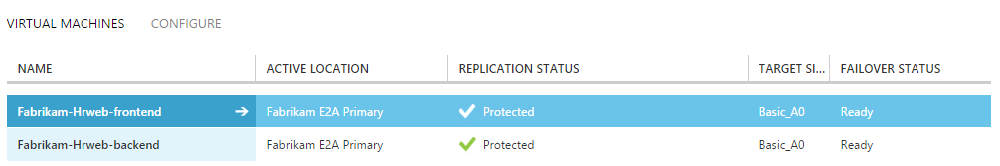
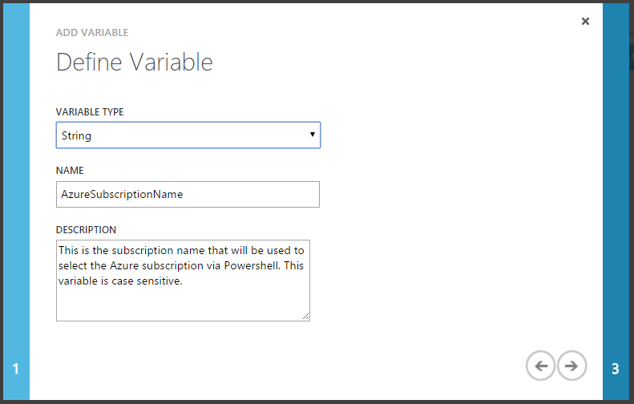
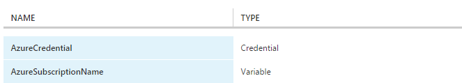
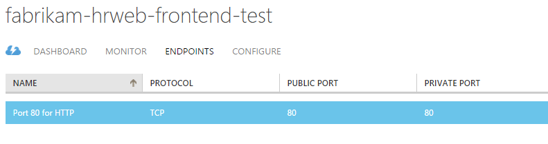

<properties 
   pageTitle="Add Azure automation runbooks to recovery plans" 
   description="This article describes how Azure Site Recovery now enables you to extend recovery plans using Azure Automation to complete complex tasks during recovery to Azure" 
   services="site-recovery" 
   documentationCenter="" 
   authors="ruturaj" 
   manager="mkjain" 
   editor=""/>

<tags
   ms.service="site-recovery"
   ms.devlang="powershell"
   ms.tgt_pltfrm="na"
   ms.topic="article"
   ms.workload="required" 
   ms.date="03/31/2015"
   ms.author="ruturajd@microsoft.com"/>

  
   

# Add Azure automation runbooks to recovery plans


This tutorial describes how Azure Site Recovery integrates with Azure
Automation to provide extensibility to recovery plans. Recovery plans
can orchestrate recovery of your virtual machines into Azure. They also
help in making the recovery **consistently accurate**, **repeatable**,
and **automated**. Integration with Azure Automation extends the
recovery plans with capability to execute runbooks.

If you have not heard about Azure Automation yet, sign up
[here](http://azure.microsoft.com/services/automation/) and
download their sample scripts
[here](http://azure.microsoft.com/documentation/scripts/). Read
more about [Azure Site
Recovery](http://azure.microsoft.com/services/site-recovery/) and
how to orchestrate recovery to Azure using recovery plans
[here](http://azure.microsoft.com/blog/?p=166264).

In this tutorial, we will look at how you can integrate Azure Automation
runbooks into recovery plans. We will automate simple tasks that earlier
required manual intervention and see how to convert a multi-step
recovery into a one-click recovery action. We will also look at how you
can troubleshoot a simple script if it goes wrong.

## Protect the application to Azure

Let us begin with a simple two VM application. Ensure that the VMs are
protected.

1.  Enable protection for your virtual machine

2.  Ensure that the virtual machine has completed initial replication
    and is replicating.


---------------------

Here Fabrikam-HRweb-frontend and Fabrikam-Hrweb-backend are two virtual
machines protected to Azure.

Note that the replication status is protected and the VMs are Ready for
failover.

In this tutorial you will create a recovery plan for the application.
Then you will integrate it with a runbook that will create an endpoint
on the failed over IAAS virtual machine to serve webpages at port 80.

## Create the automation account and its assets


You need an Azure Automation account to create runbooks. If you do not
already have an account, navigate to Azure Automation tab denoted by
and create a new account.

1.  Give the account a name to identify with.

2.  Specify a geographical region where you want to place the account

It is recommended to place the account in the same region as the ASR
vault.


Next create the following assets in the Account

### Add a subscription name as asset

1.  Add a new setting  in the Azure Automation
    Assets and select to 

2.  Select the variable type as **String**

3.  Give the variable the **AzureSubscriptionName**

    

4.  Define the variable value depending on your Azure Subscription name

> 

You can identify the name of your subscription from the settings page of
your account.

### Add a Azure login credential as asset

Azure Automation uses the Azure powershell module to connect to the
subscription and operate on the artefacts there. For this you need to
authenticate using your Microsoft account or a work or school account.
You can store the account credentials in an asset to be used securely by
the runbook.

1.  Add a new setting  in the Azure Automation
    Assets and select to 

2.  Select the Credential type as **Windows PowerShell Credential**

3.  Give the name as **AzureCredential**

    

4.  Specify the username and password to sign-in with

Now both the settings are available in your assets



More information about how to connect to your subscription via
powershell is given
[here](http://azure.microsoft.com/en-in/documentation/articles/install-configure-powershell/#Connect).

Next, create a recovery plan for our application.

## Create the recovery plan

To recover the application to Azure, you need to create a recovery plan.
Using a recovery plan you can specify the order of recovery of the
virtual machines. The virtual machine placed in group 1 will recover and
start first, and then the virtual machine in group 2 will follow.

Create a Plan that looks like below.


To read more about the recovery plans read
<https://msdn.microsoft.com/en-us/library/azure/dn788799.aspx>

Next, you will create a runbook in Azure Automation that can open an
endpoint for the frontend virtual machine after failover.

## Azure automation context

ASR passes a context variable to the runbook to help you write
deterministic scripts. The names of the cloud service and the virtual
machine are not always predictable since the Cloud service name needs to
be unique across Azure and the virtual machine name might have changed
due to unsupported characters in Azure. This context is passed to the
runbook during recovery plan execution.

Below is the context variable structure and description for each
variable.

        {"RecoveryPlanName":"pod02hrwebChicago",

        "FailoverType":"Test",

        "FailoverDirection":"PrimaryToSecondary",

        "GroupId":"1",

        "VmMap":{"7a1069c6-c1d6-49c5-8c5d-33bfce8dd183":

                {"CloudServiceName":"pod02hrweb-Chicago-test",

                "RoleName":"Contoso-Hrweb-frontend-test"}

                }

        }


  <table border="1">
  <tr><th>Variable name </th><th>Variable description</th></tr>
  <tr><td>RecoveryPlanName</td><td>Name of the recovery plan being executed. <p> This variable can help you take different actions based on the RP name using the same script.</td></tr>
  <tr><td>FailoverType </td><td>Specifies whether the execution is Test, Planned or Unplanned. <p> This variable helps you take different actions based on the RP execution. </td></tr>
  <tr><td>FailoverDirection</td><td>Specifies whether the recovery is from primary side to recovery or vice versa. <p>The two values it takes is PrimaryToSecondary and SecondaryToPrimary </td></tr>
  <tr><td>GroupId </td><td> Specifies the group number of the recovery plan where the runbook is executing. <p> For example, if the runbook is post group2, the GroupId will be 2. </td></tr>
  <tr><td>VmMap </td><td> This is a array of all the virtual machines in the group. </td></tr>
  <tr><td>VmMap key </td><td> The key to every virtual machine is a GUID. This GUID is same as the VMM ID of the virtual machine. <p> You can use this GUID to deterministically specify which VM you want to operate on. </td></tr>
  <tr><td>RoleName</td><td>This specifies the Azure IAAS VM name of the virtual machine being recovered.</td></tr>
  <tr><td>CloudServiceName </td><td> This specifies the Azure Cloud service name under which the virtual machine is being created. </td></tr>
  </table><br />

To identify the VMM VM ID – which is the VmMap Key in the context you
can also go to the VM properties page in ASR and look at the VM GUID
property.


## Author an Automation runbook

Now create the runbook to open port 80 on the frontend virtual machine.

1.  Create a new runbook in the Azure Automation account with the name
    **OpenPort80**


2.  Navigate to the Author view of the runbook and enter the draft mode.

3.  First specify the variable to use the recovery plan context

```
	param (
		[Object]$RecoveryPlanContext
	)

```
  

4.  Next connect to the subscription using the credential and
    subscription name

```
	$Cred = Get-AutomationPSCredential -Name 'AzureCredential'
	
	# Connect to Azure
	$AzureAccount = Add-AzureAccount -Credential $Cred
	$AzureSubscriptionName = Get-AutomationVariable –Name ‘AzureSubscriptionName’
	Select-AzureSubscription -SubscriptionName $AzureSubscriptionName
```

> Note that you use the Azure assets – **AzureCredential** and **AzureSubscriptionName** here.

5.  Now specify the endpoint details and the GUID of the virtual machine for which you want to expose the endpoint

```
	# Specify the parameters to be used by the script
	$AEProtocol = "TCP"
	$AELocalPort = 80
	$AEPublicPort = 80
	$AEName = "Port 80 for HTTP"
	$VMGUID = "7a1069c6-c1d6-49c5-8c5d-33bfce8dd183"
```

This specifies the Azure endpoint protocol, local port on the VM and its mapped public port. The VMGUID holds the GUID of the virtual machine you need to operate on.

6.  The script will now extract the context for the given VM GUID and
    create an endpoint on the virtual machine referenced by it.

```
	#Read the VM GUID from the context
	$VM = $RecoveryPlanContext.VmMap.$VMGUID

	if ($VM -ne $null)
	{
		# Invoke pipeline commands within an InlineScript

		$EndpointStatus = InlineScript {
			# Invoke the necessary pipeline commands to add a Azure Endpoint to a specified Virtual Machine
			# This set of commands includes: Get-AzureVM | Add-AzureEndpoint | Update-AzureVM (including necessary parameters)

			$Status = Get-AzureVM -ServiceName $Using:VM.CloudServiceName -Name $Using:VM.RoleName | `
				Add-AzureEndpoint -Name $Using:AEName -Protocol $Using:AEProtocol -PublicPort $Using:AEPublicPort -LocalPort $Using:AELocalPort | `
				Update-AzureVM
			Write-Output $Status
		}
	}
```

The complete script is given below for your reference

```
  workflow OpenPort80
  {
	param (
		[Object]$RecoveryPlanContext
	)

	$Cred = Get-AutomationPSCredential -Name 'AzureCredential'
	
	# Connect to Azure
	$AzureAccount = Add-AzureAccount -Credential $Cred
	$AzureSubscriptionName = Get-AutomationVariable –Name ‘AzureSubscriptionName’
	Select-AzureSubscription -SubscriptionName $AzureSubscriptionName

	# Specify the parameters to be used by the script
	$AEProtocol = "TCP"
	$AELocalPort = 80
	$AEPublicPort = 80
	$AEName = "Port 80 for HTTP"
	$VMGUID = "7a1069c6-c1d6-49c5-8c5d-33bfce8dd183"
	
	#Read the VM GUID from the context
	$VM = $RecoveryPlanContext.VmMap.$VMGUID

	if ($VM -ne $null)
	{
		# Invoke pipeline commands within an InlineScript

		$EndpointStatus = InlineScript {
			# Invoke the necessary pipeline commands to add a Azure Endpoint to a specified Virtual Machine
			# This set of commands includes: Get-AzureVM | Add-AzureEndpoint | Update-AzureVM (including necessary parameters)

			$Status = Get-AzureVM -ServiceName $Using:VM.CloudServiceName -Name $Using:VM.RoleName | `
				Add-AzureEndpoint -Name $Using:AEName -Protocol $Using:AEProtocol -PublicPort $Using:AEPublicPort -LocalPort $Using:AELocalPort | `
				Update-AzureVM
			Write-Output $Status
		}
	}
  }
```

## Add the script to the recovery plan

Once the script is ready, you can add it to the recovery plan.

1.  In the recovery plan you created, choose to add a script after the
    group 2. 

2.  Specify a script name

3.  In the failover to Azure script – Select the Azure Automation
    Account name

4.  In the Azure Runbooks, select the runbook you authored


## Test the recovery plan

Once you have added the runbook to the plan you can initiate a test
failover and see it in action. It is always recommended to run a test
failover to test your application along with the scripts to ensure that
there are no errors.

1.  Select the Recovery plan and initiate a test failover.

2.  During the plan execution, you can see whether the runbook has
    executed or not via its status.

    

3.  During execution you can see the actual runbook execution status on
    the Azure Automation jobs page for that runbook.

    

4.  After the failover completes, you can see whether the execution is
    successful or not by visiting the Azure IAAS page and looking at the
    endpoints



## Sample scripts

Microsoft and the Azure Automation community provide sample runbooks, which can help you get started creating your own solutions, and utility runbooks, which you can use as building blocks for larger automation tasks. Start using them from the gallery and build your one click recovery plans.