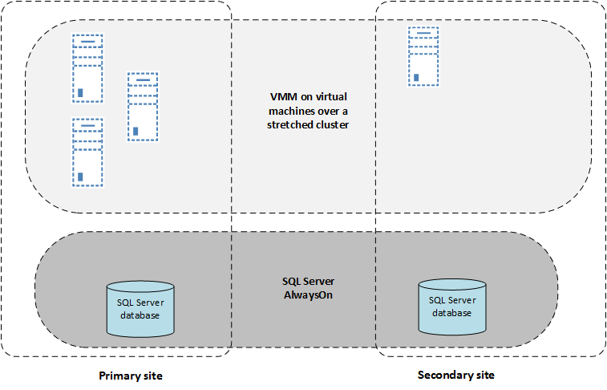

<properties
	pageTitle="Set up protection with a single VMM server"
	description="Azure Site Recovery coordinates the replication, failover and recovery of virtual machines located in on-premises VMM clouds to Azure or to a secondary VMM cloud."
	services="site-recovery"
	documentationCenter=""
	authors="rayne-wiselman"
	manager="jwhit"
	editor=""/>

<tags
	ms.service="site-recovery"
	ms.devlang="na"
	ms.topic="article"
	ms.tgt_pltfrm="na"
	ms.workload="backup-recovery"
	ms.date="05/04/2015"
	ms.author="raynew"/>

#  Set up protection with a single VMM server

## Overview

Azure Site Recovery contributes to your business continuity and disaster recovery (BCDR) strategy by orchestrating replication, failover and recovery of virtual machines in a number of deployment scenarios. For a full list of deployment scenarios see  [Azure Site Recovery overview](hyper-v-recovery-manager-overview).

If you only have a single VMM server in your infrastructure you can deploy Site Recovery to replicate virtual machines in VMM clouds to Azure, or you can replicate between clouds on a single VMM server. We recommend that you only do this if you're unable to deploy two VMM servers (one in each site) since failover and recovery isn't seamless in this deployment. For recovery you'll need to manually fail over the VMM server from outside the Azure Site Recovery console (using Hyper-V Replica in the Hyper-V Manager console).

You can set up replication using a single VMM server in a couple of ways:

### Standalone deployment

Deploy a standalone VMM server as a virtual machine in a primary site, and replicate this virtual machine to a secondary site with Site Recovery and Hyper-V Replica. To reduce downtime the SQL Server can be installed on the VMM virtual machine. If VMM is using a remote SQL Server you'll need to recover that first before recovering the VMM server.

### Cluster deployment

To make VMM highly available it can be deployed as a virtual machine in a Windows failover cluster. This is useful if critical workloads are being managed by VMM because it ensures workload availability and protects against hardware failover of the host on which VMM is running. To deploy a single VMM server with Site Recovery the VMM virtual machine should be deployed over a stretch cluster across geographically separate sites. The SQL Server database used by VMM should be protected with SQL Server AlwaysOn availability groups with a replica on the secondary site. If disaster occurs the VMM server and it's corresponding SQL Server database are failed over and accessed from the secondary site.

## Before you start

- The walkthrough steps explain how to deploy Site Recovery with a single standalone VMM server.
- Make sure you have the [prerequisites](site-recovery-vmm-to-vmm/#before-you-start) in place before you start deployment.
- The single VMM server must have at least two clouds configured. One cloud will act as the protected cloud and the other is performing protection.
- The clouds that you want to protect must contain the following:
	- One or more VMM host groups
	- One or more Hyper-V host servers in each host group
	- One or more Hyper-V virtual machines on each host server

If you run into problems setting up this scenario post your questions on the [Azure Recovery Services Forum](https://social.msdn.microsoft.com/Forums/azure/home?forum=hypervrecovmgr).

## Configure a single server deployment

1. If VMM isn't deployed, set up VMM on a virtual machine with a SQL Server database installed. Read [system requirements](https://technet.microsoft.com/library/dn771747.aspx) 
2. Set up at least two clouds on the VMM server. Learn more at:

	- [What’s New in Private Cloud with System Center 2012 R2 VMM](http://channel9.msdn.com/Events/TechEd/NorthAmerica/2013/MDC-B357#fbid=) and in [VMM 2012 and the clouds](http://www.server-log.com/blog/2011/8/26/vmm-2012-and-the-clouds.html). 
	- [Configuring the VMM cloud fabric](https://msdn.microsoft.com/library/azure/dn469075.aspx#BKMK_Fabric)
	- [Creating a private cloud in VMM](https://technet.microsoft.com/library/jj860425.aspx) and [Walkthrough: Creating private clouds with System Center 2012 SP1 VMM](http://blogs.technet.com/b/keithmayer/archive/2013/04/18/walkthrough-creating-private-clouds-with-system-center-2012-sp1-virtual-machine-manager-build-your-private-cloud-in-a-month.aspx).
3. Add the source Hyper-V host server on which the virtual machine you want to protect is located to the cloud you're going to protect (the source cloud). Add the target Hyper-V host server to the cloud on the VMM server that will be providing the protection.
4. [Create](site-recovery-vmm-to-vmm/#step-1-create-a-site-recovery-vault) an Azure Site Recovery vault and generate a vault registration key.
4. [Install](site-recovery-vmm-to-vmm/#step-3-install-the-azure-site-recovery-provider) the Azure Site Recovery Provider on the VMM server and register the server in the vault. 
5. Make sure that the clouds appear in the Site Recovery portal, and [configure cloud protection settings](site-recovery-vmm-to-vmm/#step-4-configure-cloud-protection-settings).
	- In **Source Location** and **Target Location**, specify the name of the single VMM server.
	- In **Replication Method**, select **Over the network** for the initial replication because the clouds are located on the same server.

6. Optionally [configure network mapping](site-recovery-vmm-to-vmm/#step-5-configure-network-mapping):

	- In **Source** and **Target** specify the name of the single VMM server.
	- In **Network on Source** select the VM network that’s configured for the cloud you’re protecting.
	- In **Network on Target** select the VM network that’s configured for the cloud you want to use for protection.
	- Network mapping can be configured between two virtual machine (VM) networks on the same VMM server. If the same VMM network exists in two different sites, you can map between the same networks.
7. [Enable protection](site-recovery-vmm-to-vmm/#step-7-enable-virtual-machine-protection) for virtual machines in the VMM cloud you want to protect. 
7. In the Hyper-V Manager console, set up replication for the VMM virtual machine with Hyper-V Replica. The VMM virtual machine shouldn't be added to any VMM clouds.

## Failover and recover

### Create recovery plans

Recovery plans group together virtual machines that should be failed over and recovered together. 

1. When you create a recovery plan in **Source** and **Target** specify the name of the single VMM server. In **Select Virtual Machines**, virtual machines that are associated with the primary cloud will be displayed.
2. Then [create and customize recovery plans](https://msdn.microsoft.com/library/azure/dn337331.aspx).

### Recovery

In the event of a disaster workloads can be recovered using the following steps:

1. Manually fail over the replica VMM virtual machine to the recovery site from the Hyper-V Manager console.
2. After the VMM virtual machine has been recovered, you can log into the Hyper-V Recovery Manager console from the portal and do an unplanned failover of the virtual machines from the primary to the recovery site.
3.  After the unplanned failover finishes users can access all the resources at the primary site.

