<properties
	pageTitle="Protect on-premises VMware virtual machines or physical servers with Azure Site Recovery" 
	description="This article describes how to set up Azure Site Recovery to coordinate the replication, failover and recovery of on-premises VMware virtual machines or Windows/Linux physical servers to Azure." 
	services="site-recovery"
	documentationCenter=""
	authors="rayne-wiselman"
	manager="jwhit"
	editor=""/>

<tags
	ms.service="site-recovery"
	ms.workload="backup-recovery"
	ms.tgt_pltfrm="na"
	ms.devlang="na"
	ms.topic="article"
	ms.date="06/11/2015"
	ms.author="raynew"/>

# Protect on-premises VMware virtual machines or physical servers with Azure Site Recovery

This article describes how to deploy Site Recovery to:

- **Protect VMware virtual machines**—Coordinate replication, failover, and recovery of on-premises VMware virtual machines to Azure
- **Protect physical servers**—Coordinate replication, failover, and recovery on-premises physical Windows and Linux servers to Azure using the Azure Site Recovery service.

The article includes an overview of the scenario, deployment prerequisites, and set up instructions. At the end of the article you'll test failover to Azure to make sure it's working properly. 
If you run into problems, post your questions on the [Azure Recovery Services Forum](https://social.msdn.microsoft.com/forums/azure/home?forum=hypervrecovmgr).

## What is Azure Site Recovery?

The Azure Site Recovery contributes to your business continuity and disaster recovery (BCDR) strategy by orchestrating replication, failover and recovery of virtual machines and physical servers. Machines can be replicated to Azure, or to a secondary on-premises data center. Read more about [Azure Site Recovery](site-recovery-overview.md).

## How does it protect on-premises resources?

Site Recovery helps protect your on-premises resources by orchestrating, simplifying replication, failover and failback in a number of [deployment scenarios](site-recovery-overview.md). If you want to protect your on-premises VMware virtual machines or Windows or Linux physical servers here's how Site Recovery can help:

- Allows VMware users to replicate virtual machines to Azure.
- Allows the replication of physical on-premises servers to Azure.
- Provides a single location to setup and manage replication, failover, and recovery.
- Provides easy failover from your on-premises infrastructure to Azure, and failback (restore) from Azure to on-premises.
- Implements recovery plans for easy failover of workloads that are tiered over multiple machines.
- Provides multi VM consistency so that virtual machines and physical servers running specific workloads can be recovered together to a consistent data point.
- Supports data replication over the Internet, over a site-to-site VPN connection, or over Azure ExpressRoute.
- Provides automated discovery of VMware virtual machines.

This feature is currently in preview. Read the [Supplemental Terms of Use for Previews](preview-supplemental-terms).

## What do I need?

This diagram shows the deployment components.

Here's what you'll need:

**Component** | **Deployment** | **Details**
--- | --- | ---
**Configuration server** | 
Deploy as a Azure standard A3 virtual machine in the same subscription as Site Recovery.
 
You set up in the Site Recovery portal
 | It coordinates communication between protected machines, the process server, and master target servers in Azure. It sets up replication and coordinates recovery in Azure when failover occurs.
**Master target server** | 
Deploy as Azure virtual machine — Windows server based on a Windows Server 2012 R2 gallery image (to protect Windows machines) or as a Linux server based on a OpenLogic CentOS 6.6 gallery image (to protect Linux machines).
 
Two sizing options are available – standard A3 and standard D14.

The server is connected to the same Azure network as the configuration server.

You set up in the Site Recovery portal
 | 
It receives and retains replicated data from your protected machines using attached VHDs created on blob storage in your Azure storage account.
   
**Process server** | 
Deploy as an on-premises virtual or physical server running Windows Server 2012 R2
 
We recommend it's placed on the same network and LAN segment as the machines that you want to protect, but it can run on a different network as long as protected machines have L3 network visibility to it.D
You set it up and register it to the configuration server in the Site Recovery portal.
 | 
Protected machines send replication data to the on-premises process server. It has a disk-based cache to cache replication data that it receives. It performs a number of actions on that data.

It optimizes data by caching, compressing, and encrypting it before sending it on to the master target server.

It handles push installation of the Mobility Service.

It performs automatic discovery of VMware virtual machines.

**On-premises machines** | On-premises virtual  machines running on a VMware hypervisor, or physical servers running Windows or Linux. | You set up replication settings that apply to virtual machines and servers. You can fail over an individual machine or more commonly, as part of a recovery plan containing multiple virtual machines that fail over together.
**Mobility service** | 
Installs on each virtual machine or physical server you want to protect

Can be installed manually or pushed and installed automation by the process server. | The service takes a VSS snapshot of data on each protected machine and moves it to the process server, which in turn replicates it to the master target server.
**Azure Site Recovery vault** | Set up after you've subscribed to the Site Recovery service. | You register servers in a Site Recovery vault. The vault coordinates and orchestrates data replication, failover, and recovery between your on-premises site and Azure.
**Replication mechanism** | 
**Over the Internet**—Communicates and replicates data from protected on-premises servers and Azure using a secure SSL/TLS communication channel over a public internet connection. This is the default option.

**VPN/ExpressRoute**—Communicates and replicates data between on-premises servers and Azure over a VPN connection. You'll need to set up a site-to-site VPN or an [ExpressRoute](expressroute-introduction.md) connection between the on-premises site and your Azure network.

You'll select how you want to replicate during Site Recovery deployment. You can't change the mechanism after it's configured without impacting protection on already protected servers.| 
Neither option requires you to open any inbound network ports on protected machines. All network communication is initiated from the on-premises site.
 

## Capacity planning

- For optimal performance and to take advantage of the multi VM consistency feature that recovers multiple protected machines to a consistent data point, we recommend that you gather virtual machines into protection groups by workload.
- You can't protect a single machine across multiple master target servers because as disks replicate, a VHD that mirrors the size of the disk is created on Azure blob storage and attached as a data disk to the master target server. Obviously you can protect multiple machines with a single master target server.
- The master target server virtual machine can be Azure standard A4 or D14:
	- With a standard A4 master target you can add 16 data disks (maximum of 1023 GB per data disk) to each virtual machine.
	- With a standard D14 master target you can add 32 data disks (maximum of 1023 GB per data disk) to each virtual machine.
- Note that one disk attached to the master target server is reserved as a retention drive. Azure Site Recovery allows you to define retention windows and recover protected machines to a recovery point within that window. The retention drive maintains a journal of disk changes for the duration of the window.  This reduces the maximum disks available for repliation on an A4 to 15 and on a D14 to 31.
- To scale your deployment you add multiple process servers and master target servers. You should deploy a second master target server if you don't have enough free disks on an existing master target server. A standard D14 sized master target server is required only if you wish to protect a server that has more than 15 disks attached to it; for all other configurations you can deploy standard A4 sized master target servers. You should deploy an additional process server if the data change rate of protected machines exceeds the capacity of an existing process server. Note that process servers and master target servers don't require one-to-one mapping. You can deploy the first process server with the second master target server and so on.
The process server uses disk based cache. Ensure that there's enough free space C:/ for the cache. Cache sizing will be affected by the data change rate of the machines you're protecting. Generally we recommend a cache directory size of 600 GB for medium size deployments but you can use the following guidelines.

	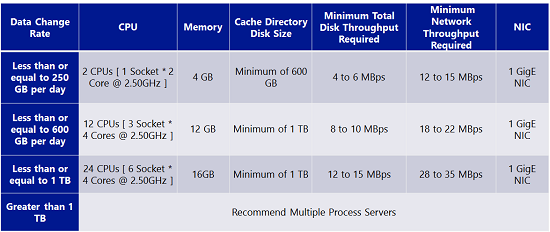

## Before you start

**Component** | **Requirements** | **Details**
--- | --- | --- 
**Azure account** | You'll need a [Microsoft Azure](http://azure.microsoft.com/) account. You can start with a [free trial](pricing/free-trial/).
**Azure storage** | 
You'll need an Azure storage account to store replicated data

The account should have geo-replication enabled.

It must in the same region as the Azure Site Recovery service, and be associated with the same subscription.

To learn more read [Introduction to Microsoft Azure Storage](storage-introduction.md)

**Azure virtual network** | You'll need an Azure virtual network on which the configuration server and master target server will be deployed. It should be in the same subscription and region as the Azure Site Recovery vault.
**Azure resources** | Make sure you have enough Azure resources to deploy all components. Read more in [Azure Subscription Limits](azure-subscription-service-limits.md).
**Azure virtual machines** | 
Virtual machines you want to protect should conform with [Azure prerequisites](site-recovery-best-practices.md).

**Disk count**—A maximum of 31 disks can be supported on a single protected server

**Disk sizes**—Individual disk capacity shouldn't be more than 1023 GB

**Clustering**—Clustered servers aren't supported

**Boot**—Unified Extensible Firmware Interface(UEFI)/Extensible Firmware Interface(EFI) boot isn't supported

**Volumes**—Bitlocker encrypted volumes aren't supported

 **Server names**—Names should contain between 1 and 63 characters (letters, numbers and hyphens). The name must start with a letter or number and end with a letter or number. After a machine is protected you can modify the Azure name.

**Configuration server** | 
Standard A3 virtual machine based on an Azure Site Recovery Windows Server 2012 R2 gallery image will be created in your subscription for the configuration server. It's created as the first instance in a new cloud service with a reserved public IP address.

The installation path should be in English characters only.

**Master target server** | 
Azure virtual machine, standard A4 or D14.

The installation path  should be in English characters only. For example the path should be **/usr/local/ASR** for a master target server running Linux.

**Process server** | 
You can deploy the process server on physical or virtual machine running Windows Server 2012 R2 with the latest updates. Install on C:/.

We recommend you place the server on the same network and subnet as the machines you want to protect.

Install VMware vSphere CLI 5.5.0 on the process server. The VMware vSphere CLI component is required on the process server in order to discover virtual machines managed by a vCenter server or virtual machines running on an ESXi host.

The installation path should be in English characters only.

**VMware** | 
A VMware vCenter server managing your VMware vSphere hypervisors. It should be running vCenter version 5.1 or 5.5 with the latest updates.

One or more vSphere hypervisors containing VMware virtual machines you want to protect. The hypervisor should be running ESX/ESXi version 5.1 or 5.5 with the latest updates.

VMware virtual machines should have VMware tools installed and running.

**Windows machines** | 
Protected physical servers or VMware virtual machines running Windows have a number of requirements.

A supported 64-bit operating system: Windows Server 2012 R2, Windows Server 2012, or Windows Server 2008 R2 with at least SP1.

The host name, mount points, device names, Windows system path (eg: C:\Windows) should be in English only.

The operating system should be installed on C:\ drive.

Only basic disks are supported. Dynamic disks aren't supported.

<Firewall rules on protected machines should allow them to reach the configuration and master target servers in Azure.p>
You'll need to provide an administrator account (must be a local administrator on the Windows machine) to push install the Mobility Service on Windows servers. If the provided account is a non-domain account you'll need to disable Remote User Access control on the local machine. To do this add the LocalAccountTokenFilterPolicy DWORD registry entry with a value of 1 under HKEY_LOCAL_MACHINE\SOFTWARE\Microsoft\Windows\CurrentVersion\Policies\System. To add the registry entry from a CLI open cmd or powershell and enter **`REG ADD HKEY_LOCAL_MACHINE\SOFTWARE\Microsoft\Windows\CurrentVersion\Policies\System /v LocalAccountTokenFilterPolicy /t REG_DWORD /d 1`**. [Learn more](https://msdn.microsoft.com/library/aa826699.aspx) about access control.

After failover, if you want connect to Windows virtual machines in Azure with Remote Desktop make sure that Remote Desktop is enabled for the on-premises machine. If you're not connecting over VPN, firewall rules should allow Remote Desktop connections over the internet.

**Linux machines** | 
 A supported 64 bit operating system: Centos 6.4, 6.5, 6.6; Oracle Enterprise Linux  6.4, 6.5 running either the Red Hat compatible kernel or Unbreakable Enterprise Kernel Release 3 (UEK3), SUSE Linux Enterprise Server 11 SP3.

Firewall rules on protected machines should allow them to reach the configuration and master target servers in Azure.

/etc/hosts files on protected machines should  contain entries that map the local host name to IP addresses associated with all NICs 

If you want to connect to an Azure virtual machine running Linux after failover using a Secure Shell client (ssh), ensure that the Secure Shell service on the protected machine is set to start automatically on system boot, and that firewall rules allow an ssh connection to it.

The host name, mount points, device names, and Linux system paths and file names (eg /etc/; /usr) should be in English only.

Protection can be enabled for on-premises machines with the following storage: File system: EXT3, ETX4, ReiserFS, XFS/Multipath software-Device Mapper (multipath)/Volume manager: LVM2\Physical servers with HP CCISS controller storage are not supported.

**Third-party** | Some deployment components in this scenario depend on third-party software to function properly. For a complete list see [THIRD-PARTY SOFTWARE NOTICES AND INFORMATION](#third-party)

## Deployment

The graphic summarizes the deployment steps.

## Step 1: Create a vault

1. Sign in to the [Management Portal](https://portal.azure.com).

2. Expand **Data Services** > **Recovery Services** and click **Site Recovery Vault**.

3. Click **Create New** > **Quick Create**.

4. In **Name**, enter a friendly name to identify the vault.

5. In **Region**, select the geographic region for the vault. To check supported regions see Geographic Availability in [Azure Site Recovery Pricing Details](href="http://go.microsoft.com/fwlink/?LinkId=389880)

6. Click **Create vault**.

	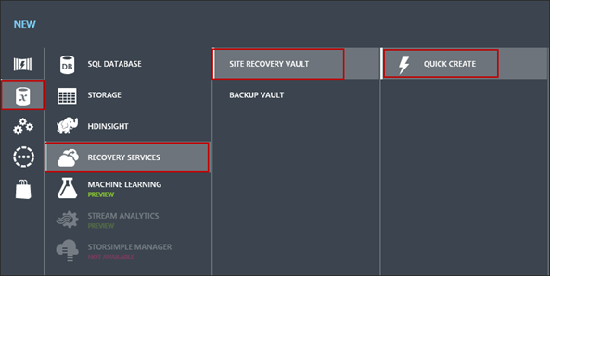

Check the status bar to confirm that the vault was successfully created. The vault will be listed as **Active** on the main **Recovery Services** page.

## Step 2: Deploy a configuration server

### Configure server settings

1. In the **Recovery Services** page, click the vault to open the Quick Start page. Quick Start can also be opened at any time using the icon.

	

2. In the dropdown list, select **Between an on-premises site with VMware/physical servers and Azure**.
3. In **Prepare Target(Azure) Resources** click **Deploy Configuration Server**.

	

4. Specify configuration server details and credentials to connect to the server. Select the Azure network on which the server should be located. Specify the internal IP address and subnet to assign to the server. When you click **OK** a standard A3 virtual machine based on an Azure Site Recovery Windows Server 2012 R2 gallery image will be created in your subscription for the configuration server. It's created as the first instance in a new cloud service with a reserved public IP address.

    **Note:** The first four IP addresses in any subnet are reserved for internal Azure usage. Specify any other available IP address.

	

5. You can monitor progress in the **Jobs** tab.

	

6.  After the configuration server is deployed note the public IP address assigned to it on the **Virtual Machines** page in the Azure portal. Then on the **Endpoints** tab note the public HTTPS port mapped to private port 443. You'll need this information later when you register the master target and process servers with the configuration server. The configuration server is deployed with these endpoints:

	- HTTPS: Public port is used to coordinate communication between component servers and Azure over the internet. Private port 443 is used to coordinate communication between component servers and Azure over VPN.
	- Custom: Public port is used for failback tool communication over the internet. Private port 9443 is used for failback tool communication over VPN.
	- PowerShell: Private port 5986
	- Remote desktop: Private port 3389
	
	

    >[AZURE.WARNING] Don't delete or change the public or private port number of any of the endpoints created during the configuration server deployment.

The Configuration server is deployed in an auto created Azure cloud service with a reserved IP address. The reserved IP address is required in order to ensure that the Configuration Server cloud service IP address remains the same across reboots of the virtual machines (including the configuration server) on the cloud service. The reserved public IP address will need to be manually unreserved when the configuration server is decomissioned or else the IP address will continue to remain reserved. There is a default limit of 20 reserved public IP addresses per subscription. You can find out more about reserved IP addresses and how to unreserve them [here.](https://msdn.microsoft.com/library/azure/dn630228.aspx)

### Register the configuration server in the vault

1. In **Prepare Target Resources**, click **Download a registration key**. The key file is generated automatically. It's valid for 5 days after it's generated. Copy the file to the configuration server.
2. On the **Dashboard** page of the virtual machine click **Connect**. Use the downloaded RDP file to log in to the configuration server using Remote Desktop.  When you log in for the first time the Azure Site Recovery Installation and Registration wizard runs automatically.

	

3. Follow the wizard instructions. You'll need to download and install MySQL Server and specify credentials for it. On the **Azure Site Recovery Registration** page browse to the key file you copied to the server.

	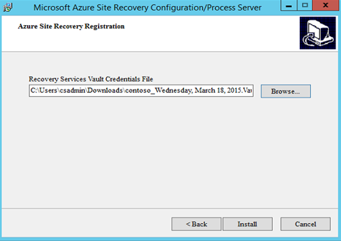

4. After registration finishes a passphrase is generated. Copy it to a secure location. You'll need it to authenticate and register the process and master target servers with the configuration server. It's also used to ensure channel integrity in configuration server communications. You can regenerate the passphrase but then you'll need to reregister the master target and process servers using the new passphrase.

	

After registration the configuration server will be listed on the **Configuration Servers** page in the vault. To route configuration server internet communication via a proxy server, run C:\Program Files\Microsoft Azure Site Recovery Provider\DRConfigurator.exe and specify the  proxy server to use. You'll need to re-register to Azure Site Recovery using the registration key you downloaded and copied to the configuration server. Ensure that firewall rules if any are configured to allow connections between the configuration server and the following URIs:-

- The URI for connecting to the Azure Site Recovery: *.hypervrecoverymanager.windowsazure.com
- *.accesscontrol.windows.net
- *.backup.windowsazure.com
- *.blob.core.windows.net
- *.store.core.windows.net

If you have ip address based firewall rules ensure that the rules are set to allow communication from the configuration server to the IP addresses described in [Azure Datacenter IP Ranges](http://go.microsoft.com/fwlink/?linkid=511094&clcid=0x409) and HTTPS (443) protocol. You would have to white-list IP ranges of the Azure region that you plan to use and that of West US.

### Set up a VPN connection to connect to the server (optional)
**Please note that setting up a VPN connection is optional**

You can connect to the configuration server over the internet or using a VPN or ExpressRoute connection. An internet connection uses the endpoints of the virtual machine in conjunction with the public virtual IP address of the server. VPN uses the internal IP address of the server together with the endpoint private ports.

The choice of whether to communicate (control and replication data) from your on-premises servers to the various ASR component servers (configuration server, master target server etc.) running in Azure over a VPN connection or over the internet is a one time decision that you'll need to make at deployment time. This choice cannot be changed later and will require deploying a new configuration server and protecting your servers again. 

You can configure a VPN connection to the server as follows:

1. If you don't have a site-to-site or Azure ExpressRoute connection set up you can learn more here:

	- [ExpressRoute or VPN - What's right for me](http://azure.microsoft.com/blog/2014/06/10/expressroute-or-virtual-network-vpn-whats-right-for-me/)
	- [Configure a site-to-site connection to an Azure virtual machine](https://msdn.microsoft.com/library/azure/dn133795.aspx)
	- [Configure ExpressRoute](https://msdn.microsoft.com/library/azure/dn606306.aspx)

2. In the vault click **Servers** > **Configuration Servers** > configuration server > **Configure**.
3. In **Connectivity Settings** set **Connectivity Type** to **VPN**. Note that if you have VPN set up and no internet access from the on-premises site, make sure you select the VPN option. If you don't, the process server won't be able to send replication data to the master target server on its public endpoints.

	

## Step 3: Deploy the master target server

1. In **Prepare Target(Azure) Resources**, click **Deploy master target server**.
2. Specify the master target server details and credentials. The server will be deployed in the same Azure network as the configuration server you register it to. When you click to complete an Azure virtual machine will be created with a Windows or Linux gallery image.

	

    **Note:** The first four IP addresses in any subnet are reserved for internal Azure usage. Specify any other available IP address.

3. A Windows master target server virtual machine is created with these endpoints:

	- Custom: Public port is used by the process server to send replication data over the internet. Private port 9443 is used by the process server to send replication data to the master target server over VPN.
	- Custom1: Public port is used by the process server to send control meta-data over the internet. Private port 9080 is used by process server to send control meta-data to the master target server over VPN.
	- PowerShell: Private port 5986
	- Remote desktop: Private port 3389

    >[AZURE.WARNING] Don't delete or change the public or private port number of any of the endpoints created during the master target server deployment.

4. A Linux master target server virtual machine is created with these endpoints:

	- Custom: Public port is used by the process server to send replication data over the internet. Private port 9443 is used by the process server to send replication data to the master target server over VPN.
	- Custom1: Public port is used by the process server to send control meta-data over the internet. Private port 9080 is used by the process server to send control data to the master target server over VPN
	- SSH: Private port 22

    >[AZURE.WARNING] Don't delete or change the public or private port number of any of the endpoints created during the master target server deployment.

5. In **Virtual Machines** wait for the virtual machine to start.

	- If you've configured the server with Windows note down the remote desktop details.
	- If you configured with Linux and you're connecting over VPN note the internal IP address of the virtual machine. If you're connecting over the internet note the public IP address.

6.  Log onto the server to complete installation and register it with the configuration server. If you're running Windows:

	1. Initiate a remote desktop connection to the virtual machine. The first time you log on a script will run in a PowerShell window. Don't close it. When it finishes the Host Agent Config tool opens automatically to register the server.
	2. In **Host Agent Config** specify the internal IP address of the configuration server and port 443. You can use the internal address and private port 443 even if you're not connecting over VPN mode because the virtual machine is attached to the same Azure network as the configuration server. Leave **Use HTTPS** enabled. Enter the passphrase for the configuration server that you noted earlier. Click **OK** to register server. Note that you can ignore the NAT options on the page. They're not used.

	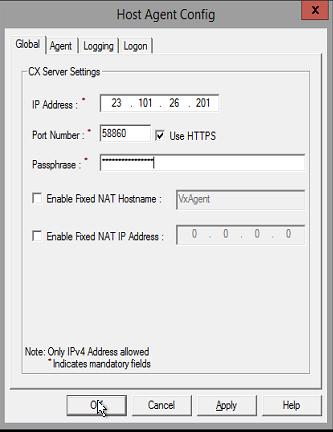

7. If you're running Linux:
	1. In **Prepare Target(Azure) Resources** click **Download and Install additional software (only for Linux Master Target Server)** to download the Linux master target server package. Copy the downloaded tar file to the virtual machine using an sftp client. Alternatively you can log in to the deployed linux master target server and use *wget http://go.microsoft.com/fwlink/?LinkID=529757&clcid=0x409* to download the the file.
	2. Log onto the server using a Secure Shell client. Note that if you're connected to the Azure network over VPN use the internal IP address. Otherwise use the external IP address and the SSH public endpoint.
	3. Extract the files from the gzipped installer by running: **tar –xvzf Microsoft-ASR_UA_8.2.0.0_RHEL6-64***
	
	4. Make sure you're in the directory to which you extracted the contents of the tar file.
	5. Copy the configuration server passphrase to a local file using the command **echo *`<passphrase>`* >passphrase.txt**
	6. Run the command “**sudo ./install -t both -a host -R MasterTarget -d /usr/local/ASR -i *`<Configuration server internal IP address>`* -p 443 -s y -c https -P passphrase.txt**”.

	

8. Wait for a few minutes (10-15) and on the **Servers** > **Configuration Servers** page check that the master target server is listed as registered on the **Server Details** tab. If you're running Linux and  it didn't register run the host config tool again from /usr/local/ASR/Vx/bin/hostconfigcli. You'll need to set access permissions by running chmod as root.

	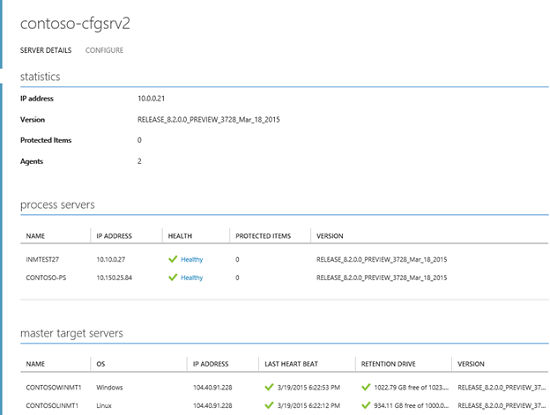

>[AZURE.NOTE] Please note that it may take upto 15 minutes after registration is complete for the master target server to get listed under the configuration server. To update immediately, refresh the configuration server by clicking on the refresh button at the bottom of the configuration servers page.

## Step 4: Deploy on-premises process server

>[AZURE.NOTE] It is recommended that you configure a static IP address on the process server so that it is guaranteed to be persistent across reboots.

1. Click Quick Start > **Install Process Server on-premises** > **Download and install the process server**.

	

2. Copy the downloaded zip file to the server on which you're going to install the process server. The zip file contains two installation files:

	- Microsoft-ASR_CX_TP_8.2.0.0_Windows*
	- Microsoft-ASR_CX_8.2.0.0_Windows*

3. Unzip the archive and copy the installation files to a location on the server.
4. Run the **Microsoft-ASR_CX_TP_8.2.0.0_Windows*** installation file and follow the instructions. This installs third-party components needed for the deployment.
5. Then run **Microsoft-ASR_CX_8.2.0.0_Windows***.
6. On the **Server Mode** page select **Process Server**.
7.	In **Configuration Server Details** if you're connecting over VPN specify the internal IP address of the configuration server and 443 for the port. Otherwise specify the public virtual IP address and mapped public HTTP endpoint.
8.	Clear **Verify Mobility service software signature** if you want to disable verification when you use automatic push to install the service. Signature verification needs internet connectivity from the process server.
9.	Type in the passphrase of the configuration server.

	

10. Finish installing the server. Remember that you'll need to install VMware vSphere CLI 5.5.0 on the server to be able to discover vCenter Servers. If you install VMware vSphere CLI 5.5.0 after the process server installation is completed, remember to reboot the process server. 
	>[AZURE.IMPORTANT]**Only VMware vSphere CLI 5.5.0 is supported. The process server doesn't inter-operate with other versions or updates of vSphere CLI.** 
	Download vSphere CLI 5.5.0 from [here.](https://my.vmware.com/web/vmware/details?downloadGroup=VCLI550&productId=352)

Validate that the process server registered successfully in the vault > **Configuration Server** > **Server Details**.

>[AZURE.NOTE]Please note that it may take up to 15 minutes after registration is complete for the process server to get listed under the configuration server. To update immediately, refresh the configuration server by clicking on the refresh button at the bottom of the configuration server page
 
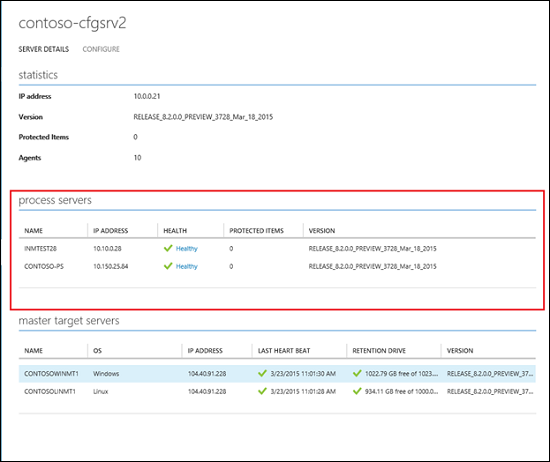

Note that if you didn't disable signature verification for the Mobility service when you registered the process server you can do it later as follows:

1. Log onto the process server as an administrator and open the file C:\pushinstallsvc\pushinstaller.conf for editing. Under the section **[PushInstaller.transport]** add this line: **SignatureVerificationChecks=”0”**. Save and close the file.
2. Restart the InMage PushInstall service.

## Step 5: Install latest updates

Before proceeding, ensure that you have the latest updates installed. Remember to install the updates in the following order:

1. Log onto the configuration server using the **Virtual Machines** page in Azure and download the latest update from: [http://go.microsoft.com/fwlink/?LinkID=533809](http://go.microsoft.com/fwlink/?LinkID=533809). Follow the installer instructions to install the update
2. On the server that you installed the process server, download the latest update from [http://go.microsoft.com/fwlink/?LinkID=533810](http://go.microsoft.com/fwlink/?LinkID=533810) and install it using the installer instructions
3.	On the server that you have installed the master target server(s), install the latest update
	1. For Windows master target server(s), log onto the Windows master target server(s) using the **Virtual Machines** page in Azure and download the latest update from [http://go.microsoft.com/fwlink/?LinkID=533811](http://go.microsoft.com/fwlink/?LinkID=533811). Follow the installer instructions to install the update
	2. For Linux master target server(s), copy the installer tar file that is available at [http://go.microsoft.com/fwlink/?LinkID=533812](http://go.microsoft.com/fwlink/?LinkID=533812) using a sftp client. Alternatively you can log onto the Linux master target server(s) using the **Virtual Machines** page in Azure use wget to download the file. Extract the files from the gzipped installer and run the command “sudo ./install” to install the update

## Step 6: Add vCenter servers or ESXi hosts

1. On the **Servers** > **Configuration Servers** tab select the configuration server and click the **ADD VCENTER SERVER** button in the bottom pane to add a vCenter server or ESXi host.

	

2. Specify details for the vCenter server or ESXi host and select the process server that will be used to discover it. If the vCenter server is not running on the default 443 port specify the port number on which the vCenter server is running. The process server must be on the same network as the vCenter server/ESXi host and should have VMware vSphere CLI 5.5.0 installed.

	

3. After discovery completes the vCenter server will be listed under the configuration server details.

	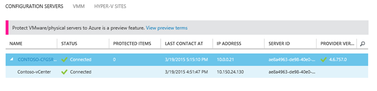

4. If you are using a non administrator account to add the vCenter server or ESXi host, then ensure that the following role privileges are set for the account.
	- vCenter accounts used to discover virtual machines should have the Datacenter, Datastore, Folder, Host, Network, Resource, Storage views, Virtual machine and vSphere Distributed Switch privileges enabled
	- ESXi host accounts used to discover virtual machines should have the Datacenter, Datastore, Folder, Host, Network, Resource, Virtual machine and vSphere Distributed Switch privileges enabled 
 

## Step 7: Create a protection group

1. Open **Protected Items** > **Protection Group** and click to add a protection group.

	

2. On the **Specify Protection Group Settings** page specify a name for the group and select the configuration server on which you want to create the group.

	

3. On the **Specify Replication Settings** page configure the replication settings that will be used for all the machines in the group.

	

4. Settings:
	- **Multi VM consistency**: If you turn this on it creates shared application-consistent recovery points across the machines in the protection group. This setting is most relevant when all of the machines in the protection group are running the same workload. All machines will be recovered to the same data point. Only available for Windows servers.
	- **RPO threshold**: Alerts will be generated when the continuous data protection replication RPO exceeds the configured RPO threshold value.
	- **Recovery point retention**: Specifies the retention window. Protected machines can be recovered to any point within this window.
	- **Application-consistent snapshot frequency**: Specifies how frequently recovery points containing application-consistent snapshots will be created.

You can monitor the protection group as they're created on the **Protected Items** page.

## Step 8: Set up machines you want to protect

### Install the Mobility service automatically

When you add machines to a protection group the  Mobility service is automatically pushed and installed on each machine by the process server. You could also choose to manually install the mobility service on your source machines. To learn how to do this refer to [step 14](#step-14-manually-install-the-mobility-service-on-source-machines)

**To automatically push install the mobility service on Windows servers, you'll need to complete the following prerequisites:** 

1. Latest [patch updates](#step-7-install-latest-updates) for process server should be installed and the process server should be available. 
2. Ensure network connectivity exists between the source machine and the process server, and that the source machine is accessible from the process server.  
3. Configure the Windows firewall to allow **File and Printer Sharing** and **Windows Management Instrumentation**. Under Windows Firewall settings, select the option “Allow an app or feature through Firewall” and select the applications as shown in the picture below. For machines that belong to a domain you can configure the firewall policy with a Group Policy Object.
	 
4. The account used to perform the push installation must be in the Administrators group on the machine you want to protect. Note that these credentials are only used for push installation of the Mobility service. You'll provide these credentials when you add a machine to a protection group.
	  
5. If the provided account isn't a domain account you'll need to disable Remote User Access control on the local machine. To do this add the LocalAccountTokenFilterPolicy DWORD registry entry with a value of 1 under HKEY_LOCAL_MACHINE\SOFTWARE\Microsoft\Windows\CurrentVersion\Policies\System. To add the registry entry from a CLI open cmd or powershell and enter **`REG ADD HKEY_LOCAL_MACHINE\SOFTWARE\Microsoft\Windows\CurrentVersion\Policies\System /v LocalAccountTokenFilterPolicy /t REG_DWORD /d 1`**. 

**To automatically push install the mobility service on Linux servers, you'll need to complete the following prerequisites:**

1. Latest [patch updates](#step-7-install-latest-updates) for process server should be installed and the process server should be available. 
2. Ensure network connectivity exists between the source machine and the process server, and that the source machine is accessible from the process server.  
3. Make sure the account is a root user on the source Linux server.
4. Ensure that the /etc/hosts file on the source Linux server contains entries that map the local host name to IP addresses associated with all NICs.
5. Install the latest openssh, openssh-server, openssl packages on the machine you want to protect.
6. Ensure SSH is enabled and running on port 22. 
7. Enable SFTP subsystem and password authentication in the sshd_config file: 	
	a. Log in as root. 
	b. In the file /etc/ssh/sshd_config file, find the line that begins with PasswordAuthentication, uncomment the line and change the value from “no” to “yes”. 
	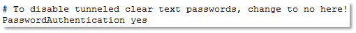	 
	c. Find the line that begins with Subsystem and uncomment the line. 
		
8. Ensure source machine Linux variant is supported. 

### Install the Mobility service manually

The software packages to be used to install the Mobility service can be found on the process server under C:\pushinstallsvc\repository. Login to the process server and copy the appropriate installation package to the source machine based on the table below:-

| Source Operating System                           	| Mobility service package on Process server                                                           	|
|---------------------------------------------------	|------------------------------------------------------------------------------------------------------	|
| Windows Server (64 bit only)                      	| `C:\pushinstallsvc\repository\Microsoft-ASR_UA_8.2.0.0_Windows_PREVIEW_20Mar2015_Release.exe`         |
| CentOS 6.4, 6.5, 6.6 (64 bit only)                	| `C:\pushinstallsvc\repository\Microsoft-ASR_UA_8.2.0.0_RHEL6-64_PREVIEW_20Mar2015_Release.tar.gz`     |
| SUSE Linux Enterprise Server 11 SP3 (64 bit only) 	| `C:\pushinstallsvc\repository\Microsoft-ASR_UA_8.2.0.0_SLES11-SP3-64_PREVIEW_20Mar2015_Release.tar.gz`|
| Oracle Enterprise Linux 6.4, 6.5 (64 bit only)    	| `C:\pushinstallsvc\repository\Microsoft-ASR_UA_8.2.0.0_OL6-64_PREVIEW_20Mar2015_Release.tar.gz`       |

- To install the Mobility service on a Windows server do the following:-
  - Copy the `Microsoft-ASR_UA_8.2.0.0_Windows_PREVIEW_20Mar2015_Release.exe` package from the process server directory path listed in the table above to the source machine.
  - Install the mobility service by running the executable on the source machine.
  - Follow the installer instructions.
  - Select Mobility service as the role and click next.

	    
  - Leave the installation directory as the default installation path and click install.
  - Provide the configuration server ip address and https port (specify the public virtual ip address and public https endpoint as the port if connecting to the configuration server over the internet; specify the configuration server internal ip address and 443 as the port if connecting to the configuration server over a VPN connection.) Leave the Use HTTPS option checked. Specify the configuration server passphrase and click OK to register the Mobility service with the configuration server.
  
        

- To install the Mobility service on a Linux Server do the following:-
  - Copy the appropriate tar archive based on the table above, from the process server to the source machine.
  - Open a shell program and extract the zipped tar archive to a local path by executing `tar -xvzf Microsoft-ASR_UA_8.2.0.0*`
  - Create a passphrase.txt file in the local directory to which you extracted the contents of the tar archive by entering *`echo <passphrase> >passphrase.txt`* from shell.
  - Install the Mobility service by entering *`sudo ./install -t both -a host -R Agent -d /usr/local/ASR -i <IP address> -p <port> -s y -c https -P passphrase.txt`*. If you are connecting to the configuration server over the internet specify the configuration server's virtual public IP address and public https endpoint port as the values for the `<IP address>` and `<port>` variables. If you are connecting to the configuration server over a VPN connection specify the configuration server's internal IP address and 443 as the values for the `<IP address>` and `<port>` variables.

Push installation of the mobility service when adding machines to a protection group is skipped, if the source machine already has the appropriate version of the Mobility service installed and registered with the configuration server, .
 

### Add machines to a protection group

**Please note that it may take up to 15 minutes for your virtual machines to show up after you discover the vCenter server or ESXi host. Virtual machines are discovered every 15 minutes and environment changes on the virtual machine (such as VMware tools installation) may take upto 15 minutes to get updated in ASR. You can check the last discovered time by looking at the LAST CONTACT AT field for the vCenter server/ESXi host under the configuration server in the configuration servers page**

1. Open **Protected Items** > **Protection Group** > **Machines** tab. Click on the **ADD MACHINES** button from the action pane at the bottom of the page. To protect VMware virtual machines running on a discovered ESXi host or managed by a discovered vCenter server select Virtual machines from the add machines list. To protect a Physical machine select Physical machines from the add machines list. We recommend that protection groups should mirror your workloads so that you add machines running a specific application to the same group.
	>[AZURE.NOTE] When you add virtual machines or physical machines to a protection group, the  Process server automatically pushes and installs the Mobility service on the source server(If the Mobility service is not already installed and registered with the configuration server).  For the automatic push mechanism to work make sure you've set up your protected machines as described in the previous step.
	
2. **Protecting VMware virtual machines:** In the  **Select Virtual Machine** wizard select the vCenter server that is managing your virtual machines (or the ESXi host on which the virtual machines are running), and then select machines from it.

	

    If you had a protection group already created and added a vCenter Server or ESXi host after that, it takes fifteen minutes for the Azure Site Recovery portal to refresh and for virtual machines to get listed in the Add machines to a protection group dialog. If you would like to proceed immediately with adding machines to protection group, please highlight the configuration server (don’t click it) and hit the Refresh button in the bottom action pane.
3. **Protecting Physical machines:** In the **Add Physical Machines** wizard, provide the IP address, Friendly Name and then select Operating System Family.

	

4. Select the master target servers and storage to use for replication.

	

5. Provide the user credentials for the source server. This is required to automatically install the Mobility service on the source machines. For Windows server the account should have administrator privileges on the source server. For Linux the  account must be root.

	

6. Click the check mark to finish adding machines to the protection group and to start initial replication for each machine. You can monitor status on the **Jobs** page.

	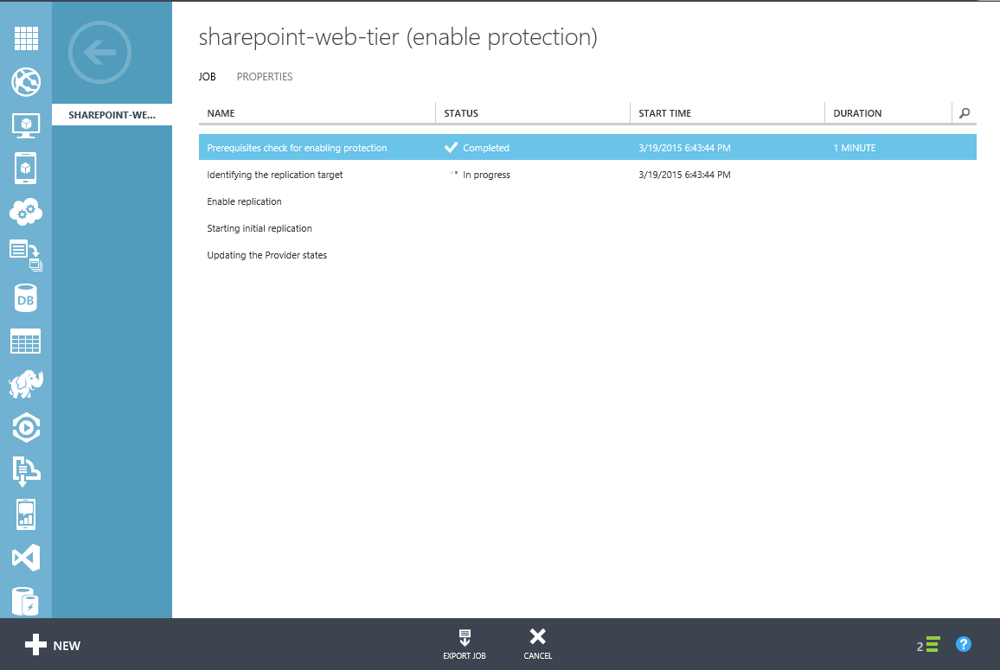

7. In addition click **Protected Items** > <protection group> > **Virtual Machines** to monitor protection status. After initial replication completes and the machines are synchronizing data they will show **Protected** status.

	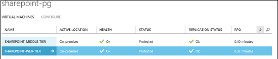

### Set protected machine properties

1. After a machines has a **Protected** status you can configure its failover properties. In the protection group details select the machine and open the **Configure** tab.
2. You can modify the name that will be given to the machine in Azure after failover and the Azure virtual machine size. You can also select the Azure network to which the machine will be connected after failover. Note that:

	- The name of the Azure machine must comply with the Azure requirements described in the Prerequisites.
	- By default replicated virtual machines in Azure aren't connected to an Azure network. If you want replicated virtual machines to communicate make sure to set the same Azure network for them.

	

## Step 9: Run a failover

1. On the **Recovery Plans** page and add a recovery plan. Specify details for the plan and select **Azure** as the target.

	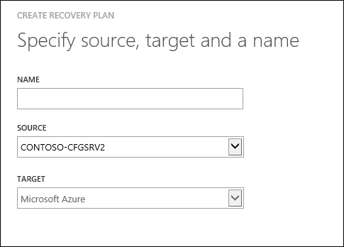

2. In **Select Virtual Machine** select a protection group and then select machines in the group to add to the recovery plan.

	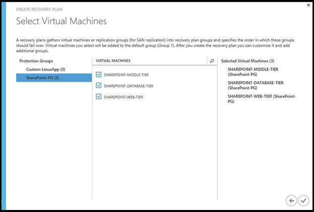

3. If required you can customize the plan to create groups and sequence the order in which machines in the recovery plan are failed over. You can also add prompts for manual actions and scripts. The scripts when recovering to Azure can be added by using [Azure Automation Runbooks](site-recovery-runbook-automation.md).

	

5. In the **Recovery Plans** page select the plan and click **Unplanned Failover**.
6. In **Confirm Failover** verify the failover direction (To Azure) and select the recovery point to fail over to.
7. Wait for the failover job to complete and then verify that the failover worked as expected and that the replicated virtual machines start successfully in Azure.

>[AZURE.NOTE] Currently only unplanned failovers are possible for protected VMware virtual machines and Physical Windows or Linux servers. The source machines wont be shut down as part of an unplanned failover. Performing an unplanned failover will stop data replication for the protected servers. You'll need to delete the machines from the protection group and add them again in order to start protecting machines again after performing a failover.

##Next steps

After you've tested your failover to Azure, learn more about failing back your failed over machines running in Azure to your on-premises VMware environment read the [failback documentation.](site-recovery-failback-azure-to-vmware.md)

## THIRD-PARTY SOFTWARE NOTICES AND INFORMATION

Do Not Translate or Localize

The software and firmware running in the Microsoft product or service is based on or incorporates material from the projects listed below (collectively, “Third Party Code”).  Microsoft is the not original author of the Third Party Code.  The original copyright notice and license, under which Microsoft received such Third Party Code, are set forth below.

The information in Section A is regarding Third Party Code components from the projects listed below. Such licenses and information are provided for informational purposes only.  This Third Party Code is being relicensed to you by Microsoft under Microsoft's software licensing terms for the Microsoft product or service.  

The information in Section B is regarding Third Party Code components that are being made available to you by Microsoft under the original licensing terms.

The complete file may be found on the [Microsoft Download Center](http://go.microsoft.com/fwlink/?LinkId=530254). Microsoft reserves all rights not expressly granted herein, whether by implication, estoppel or otherwise.

