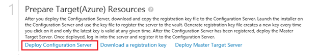
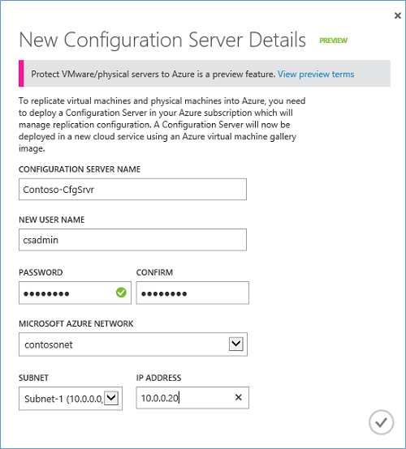
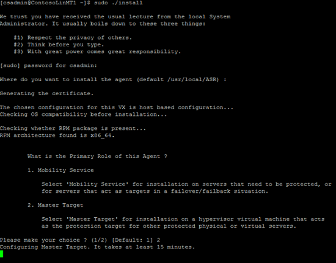
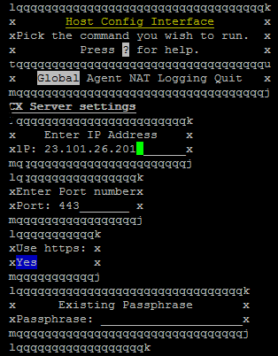
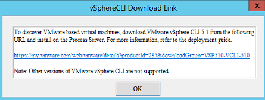

<properties 
	pageTitle="Set up protection between on-premises VMWare virtual machines or physical servers and Azure" 
	description="Azure Site Recovery coordinates the replication, failover and recovery of virtual machines located on on-premises VMWare servers to Azure and between physical on-premises servers and Azure." 
	services="site-recovery" 
	documentationCenter="" 
	authors="rayne-wiselman" 
	manager="jwhit" 
	editor="tysonn"/>

<tags 
	ms.service="site-recovery" 
	ms.workload="backup-recovery" 
	ms.tgt_pltfrm="na" 
	ms.devlang="na" 
	ms.topic="article" 
	ms.date="04/01/2015" 
	ms.author="raynew"/>

# Set up protection between on-premises VMWare virtual machines or physical servers and Azure

Azure Site Recovery contributes to your business continuity and disaster recovery (BCDR) strategy by orchestrating replication, failover and recovery of virtual machines and physical servers. Read about possible deployment scenarios in the [Azure Site Recovery overview](hyper-v-recovery-manager-overview.md).

This walkthrough describes how to deploy Site Recovery to:

- **Protect on-premises VMWare virtual machines to Azure**
- **Protect on-premises physical Windows and Linux servers to Azure**

Business advantages include:

- Protection of physical Windows or Linux servers.
- Simple replication, failover, and recovery using the Azure Site Recovery portal.
- Data replication over the Internet, a site-to-site VPN connection, or over Azure ExpressRoute.   
- Failback (restore) from Azure to an on-premises VMWare infrastructure. 
- Simplified discovery of VMWare virtual machines.
- Multi VM consistency so that virtual machines and physical servers running specific workloads can be recovered together to a consistent data point.
- Recovery plans for simplified failover and recovery of workloads tiered over multiple machines.

This feature is currently in preview. Read the [Supplemental Terms of Use for Previews](preview-supplemental-terms).

## About this article

The article includes an overview and deployment prerequisites. It walks you through setting up all the deployment components and enabling protection for virtual machines and servers. It finishes up by testing failover to make sure everything's working as expected.

If you run into problems post your questions on the [Azure Recovery Services Forum](http://go.microsoft.com/fwlink/?LinkId=313628).

## Overview

This diagram illustrates the deployment components.

### Deployment components

- **On-premises machines**—Your on-premises site has machines that you want to protect. These are either virtual machines running on a VMWare hypervisor, or physical servers running Windows or Linux.

- **On-premises process server**—Protected machines send replication data to the on-premises process server. The process server performs a number of actions on that data. It optimizes it before sending it on to the master target server in Azure. It has a disk-based cache to cache replication data that it receives. It also handles push installation of the Mobility Service which must be installed on each virtual machine or physical server you want to protect, and performs automatic discovery of VMWare vCenter servers. The process server is a virtual or physical server running Windows Server 2012 R2. We recommend it's placed on the same network and LAN segment as the machines that you want to protect, but it can run on a different network as long as protected machines have L3 network visibility to it. During deploy you'll set up the process server and register it to the configuration server.

- **Azure Site Recovery vault**—The vault coordinates and orchestrates data replica, failover, and recovery between your on-premises site and Azure.

- **Azure configuration server**—The configuration server coordinates communication between protected machines, the process server, and master target servers in Azure. It sets up replication and coordinates recovery in Azure when failover occurs. The configuration server runs on an Azure Standard A3 virtual machine in your Azure subscription. During deployment you'll set up the server and register it to the Azure Site Recovery vault.

- **Master target server**—The master target server in Azure holds replicated data from your protected machines using attached VHDs created on blob storage in your Azure storage account. You deploy it as an Azure virtual machine as a Windows server based on a Windows Server 2012 R2 gallery  image (to protect Windows machines) or as a Linux server based on a OpenLogic CentOS 6.6 gallery image (to protect Linux machines). Two sizing options are available – standard A3 and standard D14. The server is connected to the same Azure network as the configuration server. During deployment you'll create the server and register it to the configuration server.

- **Mobility service**—You install the Mobility service on each VMWare virtual machine or Windows/Linux physical server that you want to protect. The service sends replication data to the process server, which in turn sends it to the master target server in Azure. The process server can automatically install the Mobility service on protected machines, or you can deploy the service manually using your internal software deployment process.

- **Data communication and replication channel**—There are a couple of options. Note that neither option requires you to open any inbound network ports on protected machines. All network communication is initiated from the on-premises site.
	- **Over the Internet**—Communicates and replicates data from protected on-premises servers and Azure over a secure public internet connection. This is the default option.
	- **VPN/ExpressRoute**—Communicates and replicates data between on-premises servers and Azure over a VPN connection. You'll need to set up a site-to-site VPN or an [ExpressRoute](expressroute) connection between the on-premises site and your Azure network. 

 
## Capacity planning

- For optimal performance and to take advantage of the multi VM consistency feature that recovers multiple protected machines to a consistent data point, we recommend that you gather virtual machines into protection groups by workload.
- You can't protect a single machine across multiple master target servers because as disks replicate, a VHD that mirrors the size of the disk is created on Azure blob storage and attached as a data disk to the master target server. Obviously you can protect multiple machines with a single master target server.
- The master target server virtual machine can be Azure standard A4 or D14:
	- With a standard A4 disk you can add 16 data disks (maximum of 1023 GB per data disk) to each virtual machine.
	- With a standard D14 disk you can add 32 data disks (maximum of 1023 GB per data disk) to each virtual machine.
- Note that one disk attached to the master target server is reserved as a retention drive. Azure Site Recovery allows you to define retention windows and recovery protected machines at any time within that window. The retention drive maintains a journal of disk changes for the duration of the windows.  This reduces the maximum disks for A4 to 15 and D14 to 31. 
- To scale your deployment you add multiple process servers and master target servers. You should deploy a second master target server if you don't have enough free disks on an existing master target server. You should deploy an additional process server if the data change rate of protected machines exceeds the capacity of an existing process server. Note that process servers and master target servers don't require one-to-one mapping. You can deploy the first process server with the second master target server and so on.
The process server uses disk based cache. Ensure that there's enough free space C:/ for the cache. Cache sizing will be affected by the data change rate of the machines you're protecting. Generally we recommend a cache directory size of 600 GB for medium size deployments but you can use the following guidelines.

	

## Before you start

### Azure prerequisites

- You'll need a [Microsoft Azure](http://azure.microsoft.com/) account. You can start with a [free trial](http://aka.ms/try-azure). 
- You'll need an Azure storage account to store replicated data. The account needs geo-replication enabled. It should be in the same region as the Azure Site Recovery vault and be associated with the same subscription. To learn more read [Introduction to Microsoft Azure Storage](http://go.microsoft.com/fwlink/?LinkId=398704).
- You'll need an Azure virtual network on which the configuration server and master target server will be deployed. It should be in the same subscription and region as the Azure Site Recovery vault.
- Make sure you have enough Azure resources to deploy all components. Read more in [Azure Subscription Limits](azure-subscription-service-limits).
- Check that machines you want to protect comply with Azure virtual machine requirements. 

	- **Disk count**—A maximum of 31 disks can be supported on a single protected server
	- **Disk sizes**—Individual disk capacity shouldn't be more than 1023 GB
	- **Clustering**—Clustered servers aren't supported
	- **Boot**—Unified Extensible Firmware Interface(UEFI)/Extensible Firmware Interface(EFI) boot isn't supported
	- **Volumes**—Bitlocker encrypted volumes aren't supported
	- **Server names**—Names should contain between 1 and 63 characters (letters, numbers and hyphens). The name must start with a letter or number and end with a letter or number. After a machine is protected you can modify the Azure name.	

	Read more about Azure requirements in [Virtual machine support](https://msdn.microsoft.com/library/azure/dn469078.aspx#BKMK_E2A).

### Scenario component prerequisites

- Process server:
	- You can deploy the process server on physical or virtual machine running Windows Server 2012 R2 with the latest updates. Install on C:/.
	- The server needs at least 8 processor cores 64 GB RAM and 300 GB free space on C: is recommended.
	- We recommend you place the server on the same network and subnet as the machines you want to protect.
	- Install VMware vSphere CLI 5.1 on the server so it can perform automatic discover of VMWare vCenter servers.
- The installation path for the configuration server, master target server, process server, and failback servers should be in English characters only. For example the path should be **/usr/local/ASR** for a master target server running Linux.

### VMWare prerequisites

- A VMWare vCenter server managing your VMware vSphere hypervisors. It should be running vCenter version 5.0 or later with the latest updates. 
- One or more vSphere hypervisors containing VMWare virtual machines you want to protect. The hypervisor should be running version ESX/ESXi version 5.0 or later with the latest updates.
- VMWare virtual machines discovered through a vCenter server should have VMware tools installed and running.

### Protected Windows machine prerequisites

Protected physical servers or VMWare virtual machines running Windows should have:

- A supported 64-bit operating system: Windows Server 2012 R2, Windows Server 2012, or Windows Server 2008 R2 with at least SP1.
- The host name, mount points, device names, Windows system path (eg: C:\Windows) should be in English only.
- The operating system should be installed on C:\ drive.
- Regular storage options for Windows servers are supported.
- Firewall rules on protected machines should allow them to reach the configuration and master target servers in Azure. 
- After failover, if you want connect to Windows virtual machines in Azure with Remote Desktop make sure that Remote Desktop is enabled for the on-premises machine. If you're not connecting over VPN firewall rules should allow Remote Desktop connections over the internet.

### Protected Linux machine prerequisites

Protected physical servers or VMWare virtual machines running Linux should have:

- A supported operating system: Centos 6.4, 6.5, 6.6 (32 or 64-bit); Oracle Enterprise Linux  6.4, 6.5 (32 or 64-bit) running either the Red Hat compatible kernel or Unbreakable Enterprise Kern Release 3 (UEK3), SUSE Linux Enterprise Server 11 SP3 (32 bit or 64 bit)
- The host name, mount points, device names, and Linux system paths and file names (eg /etc/; /usr) should be in English only.
- Protection can be enabled for on-premises machines with the following storage:
	- File system: EXT3, ETX4, ReiserFS, XFS
	- Multipath software: Device Mapper - multipath
	- Volume manager: LVM2
	- Physical servers with HP CCISS controller storage are not supported.
- Firewall rules on protected machines should allow them to reach the configuration and master target servers in Azure.
- If you want to connect to Azure virtual machine running Linux after failover using a Secure Shell client (ssh), ensure that the Secure Shell service on the protected machine is set to start automatically on system boot, and that firewall rules allow an ssh connection to it.  

### Third-party prerequisites

Some deployment components in this scenario depend on third-party software to function properly. For a complete list see [THIRD-PARTY SOFTWARE NOTICES AND INFORMATION](#third-party)  

## Step 1: Create a vault

1. Sign in to the [Management Portal](https://portal.azure.com).

2. Expand **Data Services** > **Recovery Services** and click **Site Recovery Vault**.

3. Click **Create New** > **Quick Create**.
	
4. In **Name**, enter a friendly name to identify the vault.

5. In **Region**, select the geographic region for the vault. To check supported regions see Geographic Availability in [Azure Site Recovery Pricing Details](href="http://go.microsoft.com/fwlink/?LinkId=389880)

6. Click **Create vault**. 

	

Check the status bar to confirm that the vault was successfully created. The vault will be listed as **Active** on the main **Recovery Services** page.

## Step 2: Deploy a configuration server

1. In the **Recovery Services** page, click the vault to open the Quick Start page. Quick Start can also be opened at any time using the icon.

	

2. In the dropdown list, select **Between an on-premises site with VMware/physical servers and Azure**.
3. In **Prepare Target Resources** click **Deploy Configuration Server**.

	

4. Specify configuration server details and credentials to connect to the server. Select the Azure network on which the server should be located. Specify the internal IP address anad subnet to assign to the server. When you click **OK** a standard A3 virtual machine based on an Azure Site Recovery Windows Server 2012 R2 gallery image will be created in your subscription for the configuration server. It's created as the first instance in a new cloud service with an reserved public IP address.

	

5. You can monitor progress in the **Jobs** tab.

	

8.  After the configuration server is deployed note the public IP address assigned to it on the **Virtual Machines** page in the Azure portal. Then on the **Endpoints** tab note the public HTTPS port mapped to private port 443. You'll need this information later when you register the master target and process servers with the configuration server. The configuration server is deployed with 4 public endpoints:

	- 443: HTTPS channel used to coordinate communication between component servers and Azure.
	- 9443: Used for the failback tool and failback communication.
	- Remote Desktop
	- PowerShell

## Step 3: Register the configuration server in the vault

1. In **Prepare Target Resources**, click **Download a registration key**. The key file is generated automatically. It's valid for 5 days after it's generated. Copy the file to the configuration server.
2. On the **Dashboard** page of the virtual machine click **Connect**. Use the downloaded RDP file to log on o the configuration server with Remote Desktop.  When you log for the first time the Azure Site Recovery Installation and Registration wizard runs automatically.

	

3. Follow the wizard instructions. You'll need to download and install MySQL Server and specify credentials for it. On the **Azure Site Recovery Registration** page browse to the key file you copied to the server.

	

4. After registration finishes a passphrase is generated. Copy it to a secure location. You'll need it to authenticate and register the process and master target servers with the configuration server. It's also used to ensure channel integrity in configuration server communications. You can regenerate the passphrase but then you'll need to reregister the master target and process servers using the new passphrase.

	

After registration the configuration server will be listed on the **Configuration Servers** page in the vault.

## Step 4: Set up a VPN connection
 
You can connect to the configuration server over the internet or using a VPN or ExpressRoute connection. An internet connection uses the endpoints of the virtual machine in conjunction with the public virtual IP address of the server. VPN uses the internal IP address of the server together with the endpoint private ports.
 
You can configure a VPN connection to the server as follows:

1. If you don't have a site-to-site or Azure ExpressRoute connection set up you can learn more here:

	- [ExpressRoute or VPN - What's right for me](http://azure.microsoft.com/blog/2014/06/10/expressroute-or-virtual-network-vpn-whats-right-for-me/) 
	- [Configure a site-to-site connection to an Azure virtual machine](https://msdn.microsoft.com/library/azure/dn133795.aspx)
	- [Configure ExpressRoute](https://msdn.microsoft.com/library/azure/dn606306.aspx) 
	
2. In the vault click **Servers** > **Configuration Servers** > configuration server > **Configure**.
3. In **Connectivity Settings** set **Connectivity Type** to **VPN**. Note that if you have VPN set up and no internet access from the on-premises site make sure you select the VPN option. If you don't the process server won't be able to send replication data to the master target server on its public endpoints.

	

## Step 5: Deploy the master target server

1. In **Prepare Target Resources**, click **Deploy master target server**.
2. Specify the master target server details and credentials. The server will be deployed in the same Azure network as the configuration server you register it to. When you click to complete an Azure virtual machine will be created with a Windows or Linux gallery image. 

	

3. A Windows master server virtual machine is created with these public TCP endpoints:

	- Custom: Public port is used to send replication data over the internet. Private port 9443 is used by the process server to send data to the master target server over VPN.
	- Custom1: Private port 9080 is used by process server to send data to he  target server over VPN.
	- PowerShell: Private port: 5986
	- Remote desktop: Private port: 3389

4. A Linux master server virtual machine is created with these endpoints:

	- Custom: Public port is used to send replication data over the internet. Private port 9443 is used by the process server to send data to the master target server over VPN.
	- Custom1: Private port 9080 is used by the process server to send data to the master target server over VPN
	- SSH: Private port 22

5. In **Virtual Machines** wait for the virtual machine to start. 

	- If you've configured the server with Windows note down the remote desktop details.
	- If you configured with Linux and you're connecting over VPN note the internal IP address of the virtual machine. If you're connecting over the internet note the public IP address.
6.  Log onto the server to complete installation and register it with the configuration server. If you're running Windows:

	1. Initiate a remote desktop connection to the virtual machine. The first time you log on a script will run in a PowerShell window. Don't close it. When it finishes the Host Agent Config tool opens automatically to register the server.
	2. In **Host Agent Config** specify the internal IP address of the configuration server and port 443. You can use the internal address and private port 443 even if you're not connecting over VPN mode because the virtual machine is attached to the same Azure network as the configuration server. Leave **Use HTTPS** enabled. Enter the passphrase for the configuration server that you noted earlier. Click **OK** to register server. Note that you can ignore the NAT options on the page. They're not used.

	

6. If you're running Linux:
	1. Copy the [server installer tar file](http://go.microsoft.com/fwlink/?LinkID=529757&clcid=0x409) to the virtual machine using an sftp client.Alternatively you can log on and use wget to download the the file from the link in the Quick Start page. 
	2. Log onto the server using a Secure Shell client. Note that if you're connected to the Azure network over VPN use the internal IP address. Otherwise use the external IP address and the SSH public endpoint.
	3. Extract the files from the gzipped installer by running: **tar –xvzf Microsoft-ASR_UA_8.2.0.0_RHEL6-64***.”   

		

	4. Make sure you're in the directory to which you extracted the contents of the tar file and run the command “**sudo ./install.sh**”. Select option **2. Master Target**. Leave the other options with the default settings.

		

	5. After the installation finishes the command line **Host Config Interface** appears. Don't resize the window. 
	6. Use the arrow keys to select **Global** and press Enter.
	7. In **Enter the IP address** enter  the internal address of the configuration server and port 22.
	8.  Specify the passphrase of the configuration server that you noted down earlier, and press enter. Select **Quit** to finish installation. Note that if you're using PuTTY client to ssh into the virtual machne you can use Shift+Insert to paste. 
	9.  Use the right arrow key to quit and press Enter.

		

7. Wait for a few minutes (5-10) and on the **Servers** > **Configuration Servers** page check that the master target server is listed as registered on the **Server Details** tab. If you're running Linux and  it didn't register run the host config tool again from /usr/local/ASR/Vx/bin/hostconfigcli. You'll need to set access permissions by running chmod as super user.

	

## Step 6: Deploy on-premises process server

1. Click Quick Start > **Install Process Server on-premises** > **Download and install the process server**.

	

2. Copy the downloaded zip file to the server on which you're going to install the process server. The zip file contains two installation files:

	- Microsoft-ASR_CX_TP_8.2.0.0_Windows*
	- Microsoft-ASR_CX_8.2.0.0_Windows*

3. Unzip the archive and copy the installation files to a location on the server.
4. Run the **Microsoft-ASR_CX_TP_8.2.0.0_Windows*** installation file and follow the instructions. This installs third-party components needed for the deployment.
5. Then run **Microsoft-ASR_CX_8.2.0.0_Windows***.
6. On the **Server Mode** page select **Process Server**.
7.	In **Configuration Server Details** if you're connecting over VPN specify the internal IP address of the configuration server and 443 for the port. Otherwise specify the public virtual IP address and mapped public HTTP endpoint.
8.	Clear **Verify Mobility service software signature** if you want to disable verification when you use automatic push to install the service. Signature verification needs internet connectivity from the process server.
9.	Type in the passphrase of the configuration server.

	

8. Finish installing the server. Remember that you'll need to install VMware vSphere CLI 5.1 on the server to be able to discover vCenter Servers.

	

Validate that the process server registered successfully in the vault > **Configuration Server** > **Server Details**.

Note that if you didn't disable signature verification for the Mobility service when you registered the process server you can do it later as follows:

1. Log onto the process server as an administrator and open the file C:\pushinstallsvc\pushinstaller.conf for editing. Under the section **[PushInstaller.transport]** add this line: **SignatureVerificationChecks=”0”**. Save and close the file.
1. Restart the InMage PushInstall service.

## Step 7: Add vCenter servers

1. On the **Servers** > **Configuration Servers** tab select the configuration server and click to add a vCenter server.

	

2. Specify details for the vCenter server and select the process server that will be used to discover it.  The process server must be on the same network as the vCenter server and should have VMware vSphere CLI 5.1 installed.
3. After discovery completes the vCenter server will be listed under the configuration server details.
	
	

## Step 8: Create a protection group

1. Open **Protected Items** > **Protection Group** and click to add a protection group.

	

2. On the **Specify Protection Group Settings** page specify a name for the group and select the configuration server on which you want to create the group.

	

3. On the **Specify Replication Settings** page configure the replication settings that will be used for all the machines in the group.   

	

4. Settings:
	- **Multi VM consistency**: If you turn this on it creates shared application-consistent recovery points across the machines in the protection group. This setting is most relevant when all of the machines in the protection group are running the same workload. All machines will be recovered to the same data point. Only available for Windows servers. 
	- **RPO threshold**: Alerts will be generated when the continuous data protection replication RPO exceeds the configured RPO threshold value.
	- **Recovery point retention**: Specifies the retention window. Protected machines can be recovered to any point within this window.
	- **Application-consistent snapshot frequency**: Specifies how frequently recovery points containing application-consistent snapshots will be created.

You can monitor the protection group as they're created on the **Protected Items** page. 

## Step 9: Push the Mobility service

When you add machines to a protection group the  Mobility service is automatically pushed and installed on each machine by the process server. If you want use this automatic push mechanism for protected machines running Windows you'll need to do the following on each machine:

1. Configure the Windows firewall to allow **File and Printer Sharing** and **Windows Management Instrumentation**. For machines that belong to a domain you can configure the firewall policy with a GPO.
2. The account used to perform the push installation must be in the Administrators group on the machine you want to protect. Note that these credentials are only use for the push installation. They're not stored anywhere by the Mobility service and are discarded after the server is protected. You'll provide these credentials when you add a machine to a protection group.

	

3. If the admin account isn't a domain account you'll need to disable Remote User Access control on the local machine. To do this in HKEY_LOCAL_MACHINE\SOFTWARE\Microsoft\Windows\CurrentVersion\Policies\System create the entry LocalAccountTokenFilterPolicy if it doesn't exist and assign it a DWORD value of 

If you want to protect machines running Linux you'll need to do the following:

1. Make sure the account is a root user on the source Linux server
1. Install the latest openssh, openssh-server,  openssl packages on the machine you want to protect.
1. Enable ssh port 22.
2. Enable Sftp subsystem and password authentication in the sshd config file:
	1. Log in under the root user account.
	2. In the file /etc/ssh/sshd_config file the line that begins with “PasswordAuthentication”. Uncomment the line and change the value from “no” to “yes”. 

		

	4. Find the line that begins with “Subsystem” and uncomment the line. 

		

## Step 10: Add machines to a protection group

1. Open **Protected Items** > **Protection Group** > **Machines** tab and add virtual or physical machines managed by a discovered vCenter server. We recommend that protection groups should mirror your workloads so that you add machines running a specific application to the same group.

	

2. In the  **Select Virtual Machine** page of **Add Virtual Machine** select a V-Center server and then select machines from it.

	

3. When you add machines to a protection group, the Mobility service is automatically installed from the on-premises process server. For the automatic push mechanism to work make sure you've set up your protected machines as described in the previous step.
4. In **Select Virtual Machines** select the vCenter server that management the machines you want to protect and then select the virtual machines.

4. Select the servers and storage to use for replication. 

	

5. Provide the user credentials for the source server. This is required to automatically install the Mobility service on the source machines. For Windows server the account should have administrator privileges on the source server. For Linux the  account must have super user privileges on the server.

	

6. Click the check mark to finish adding machines to the protection group and to start initial replication for each machine. You can monitor status on the **Jobs** page.

	

7. In addition click **Protected Items** > <protection group> > **Virtual Machines** to monitor protection status. After initial replication completes and the machines are synchronizing data they will show **Protected** status.

	

## Step 11: Set protected machine properties

1. After a machines has a **Protected** status you can configure its failover properties. In the protection group details select the machine and open the **Configure** tab.
2. You can modify the name that will be given to the machine in Azure after failover and the Azure size. You can also select the Azure network to which the machine will be connected after failover. Note that:

	- The name of the Azure machine must comply with the Azure requirements described in the Prerequisites.
	- By default replicated virtual machines in Azure aren't connected to an Azure network. If you want replicated virtual machines to communicate make sure to set the same Azure network for them.

	

## Step 12: Run a failover

1. On the **Recovery Plans** page and add a recovery plan. Specify details for the plan and select **Azure** as the target.

	

2. In **Select Virtual Machine** select a protection group and then select machines in the group to add to the recovery plan.

	

3. If required you can customize the plan to create groups and sequence the order in which machines in the recovery plan are failed over. You can also add prompts for manual actions and scripts. The scripts when recovering to Azure can be added by using [Azure Automation Runbooks](site-recovery-runbook-automation.md).

	

5. In the **Recovery Plans** page select the plan and click **Test Failover**.
6. In **Confirm Failover** verify the failover direction (To Azure) and select the recovery point to fail over to. 
7. Wait for the failover job to complete and then verify that the failover worked as expected and that the replicated virtual machines start successfully in Azure.

## THIRD-PARTY SOFTWARE NOTICES AND INFORMATION

Do Not Translate or Localize

The software and firmware running in the Microsoft product or service is based on or incorporates material from the projects listed below (collectively, “Third Party Code”).  Microsoft is the not original author of the Third Party Code.  The original copyright notice and license, under which Microsoft received such Third Party Code, are set forth below.

The information in Section A is regarding Third Party Code components from the projects listed below. Such licenses and information are provided for informational purposes only.  This Third Party Code is being relicensed to you by Microsoft under Microsoft's software licensing terms for the Microsoft product or service.  

The information in Section B is regarding Third Party Code components that are being made available to you by Microsoft under the original licensing terms. 

The complete file may be found on the [Microsoft Download Center](http://go.microsoft.com/fwlink/?LinkId=530254)  h. Microsoft reserves all rights not expressly granted herein, whether by implication, estoppel or otherwise.

