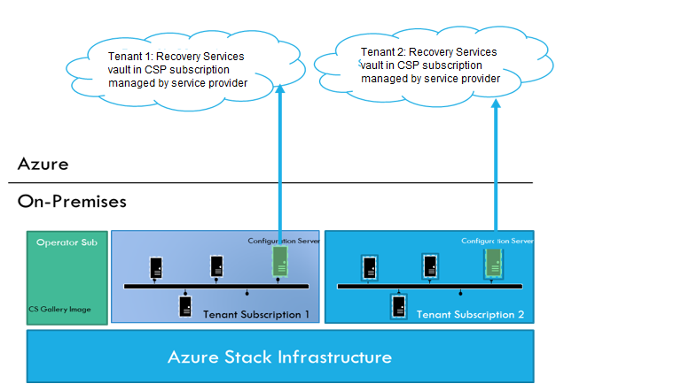
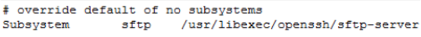
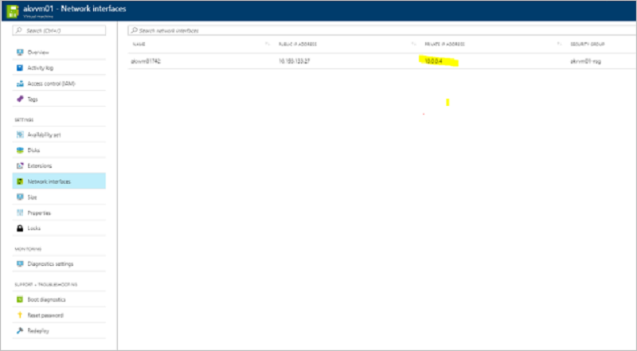
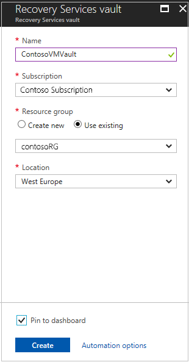
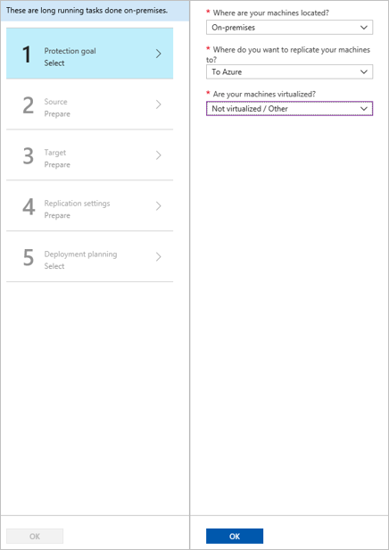
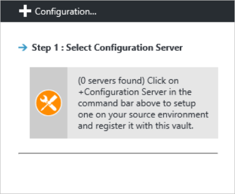

# Replicate Azure Stack VMs to Azure

This article shows you how to set up disaster recovery Azure Stack VMs to Azure, using the [Azure Site Recovery service](site-recovery-overview.md).

Site Recovery contributes to your business continuity and disaster recovery (BCDR) strategy. The service ensures that your VM workloads remain available when expected and unexpected outages occur.

- Site Recovery orchestrates and manages replication of VMs to Azure storage.
- When an outage occurs in your primary site, you use Site Recovery to fail over to Azure.
- On failover, Azure VMs are created from the stored VM data, and users can continue accessing workloads running on those Azure VMs.
- When everything's up and running again, you can fail back Azure VMs to your primary site, and start replicating to Azure storage again.

In this article, you learn how to:

> [!div class="checklist"]
> * **Step 1: Prepare Azure stack VMs for replication**. Check that VMs comply with Site Recovery requirements, and prepare for installation of the Site Recovery Mobility service. This service is installed on each VM you want to replicate.
> * **Step 2: Set up a Recovery Services vault**. Set up a vault for Site Recovery, and specify what you want to replicate. Site Recovery components and actions are configured and managed in the vault.
> * **Step 3: Set up the source replication environment**. Set up a Site Recovery configuration server. The configuration server is a single Azure Stack VM that runs all the components needed by Site Recovery. After you've set up the configuration server, you register it in the vault.
> * **Step 4: Set up the target replication environment**. Select your Azure account, and the Azure storage account and network that you want to use. During replication, VM data is copied to Azure storage. After failover, Azure VMs are joined to the specified network.
> * **Step 5: Enable replication**. Configure replication settings, and enable replication for VMs. The Mobility service will be installed on a VM when replication is enabled. Site Recovery performs an initial replication of the VM, and then ongoing replication begins.
> * **Step 6: Run a disaster recovery drill**: After replication is up and running, you verify that failover will work as expected by running a drill. To initiate the drill, you run a test failover in Site Recovery. The test failover doesn't impact your production environment.

With these steps complete, you can then run a full failover to Azure as and when you need to.

## Architecture

**Location** | **Component** |**Details**
--- | --- | ---
**Configuration server** | Runs on a single Azure Stack VM. | In each subscription you set up a configuration server VM. This VM runs the following Site Recovery components:   - Configuration server: Coordinates communications between on-premises and Azure, and manages data replication. - Process server: Acts as a replication gateway. It receives replication data, optimizes with caching, compression, and encryption; and sends it to Azure storage.   If VMs you want to replicate exceed the limits stated below, you can set up a separate standalone process server. [Learn more](vmware-azure-set-up-process-server-scale.md).
**Mobility service** | Installed on each VM you want to replicate. | In the steps in this article, we prepare an account so that the Mobility service is installed automatically on a VM when replication is enabled. If you don't want to install the service automatically, there are a number of other methods you can use. [Learn more](vmware-azure-install-mobility-service.md).
**Azure** | In Azure you need a Recovery Services vault, a storage account, and a virtual network. |  Replicated data is stored in the storage account. Azure VMs are added to the Azure network when failover occurs.

Replication works as follows:

1. In the vault, you specify the replication source and target, set up the configuration server, create a replication policy, and enable replication.
2. The Mobility service is installed on the machine (if you've used push installation), and machines begin replication in accordance with the replication policy.
3. An initial copy of the server data is replicated to Azure storage.
4. After initial replication finishes, replication of delta changes to Azure begins. Tracked changes for a machine are held in a .hrl file.
5. The configuration server orchestrates replication management with Azure (port HTTPS 443 outbound).
6. The process server receives data from source machines, optimizes and encrypts it, and sends it to Azure storage (port 443 outbound).
7. Replicated machines communicate with the configuration server (port HTTPS 443 inbound, for replication management. Machines send replication data to the process server (port HTTPS 9443 inbound - can be modified).
8. Traffic is replicated to Azure storage public endpoints, over the internet. Alternately, you can use Azure ExpressRoute public peering. Replicating traffic over a site-to-site VPN from an on-premises site to Azure isn't supported.

## Prerequisites

Here's what you need to set up this scenario.

**Requirement** | **Details**
--- | ---
**Azure subscription account** | If you don't have an Azure subscription, create a [free account](https://azure.microsoft.com/pricing/free-trial/).
**Azure account permissions** | The Azure account you use needs permissions to:   - Create a Recovery Service vault   - Create a virtual machine in the resource group and virtual network you use for the scenario   - Write to the storage account you specify   Note that:   -If you create an account, you're the administrator of your subscription and can perform all actions.   - If you use an existing subscription and you're not the administrator, you need to work with the admin to assign you Owner or Contributor permissions.   - If you need more granular permissions, review [this article](site-recovery-role-based-linked-access-control.md).
**Azure Stack VM** | You need an Azure Stack VM in the tenant subscription, that will be deployed as the Site Recovery configuration server.

### Prerequisites for the configuration server

[!INCLUDE [site-recovery-config-server-reqs-physical](../../includes/site-recovery-config-server-reqs-physical.md)]

## Step 1: Prepare Azure Stack VMs

### Verify the operating system

Make sure that the VMs are running one of the operating systems summarized in the table.

**Operating system** | **Details**
--- | ---
**64-bit Windows** | Windows Server 2019, Windows Server 2016, Windows Server 2012 R2, Windows Server 2012, Windows Server 2008 R2 (from SP1)
**CentOS** | 5.2 to 5.11, 6.1 to 6.9, 7.0 to 7.3
**Ubuntu** | 14.04 LTS server, 16.04 LTS server. Review [supported kernels](vmware-physical-azure-support-matrix.md#ubuntu-kernel-versions)

### Prepare for Mobility service installation

Every VM you want to replicate must have the Mobility service installed. In order for the process server to install the service automatically on the VM when replication is enabled, verify the VM settings.

#### Windows machines

- You need network connectivity between the VM on which you want to enable replication, and the machine running the process server (by default this is the configuration server VM).
- You need an account with admin rights (domain or local) on the machine for which you enable replication.
    - You specify this account when you set up Site Recovery. Then the process server uses this account to install the Mobility service when replication is enabled.
    - This account will only be used by Site Recovery for the push installation, and to update the Mobility service.
    - If you're not using a domain account, you need to disable Remote User Access control on the VM:
        - In the registry, create DWORD value **LocalAccountTokenFilterPolicy** under HKEY_LOCAL_MACHINE\SOFTWARE\Microsoft\Windows\CurrentVersion\Policies\System.
        - Set the value to 1.
        - To do this at the command prompt, type the following: **REG ADD HKEY_LOCAL_MACHINE\SOFTWARE\Microsoft\Windows\CurrentVersion\Policies\System /v LocalAccountTokenFilterPolicy /t REG_DWORD /d 1**.
- In the Windows Firewall on the VM you want to replicate, allow File and Printer Sharing, and WMI.
    - To do this, run **wf.msc** to open the Windows Firewall console. Right click **Inbound Rules** > **New Rule**. Select **Predefined**, and choose **File and Printer sharing** from the list. Complete the wizard, select to allow the connection > **Finish**.
    - For domain computers, you can use a GPO to do this.

#### Linux machines

- Ensure that there's network connectivity between the Linux computer and the process server.
- On the machine for which you enable replication, you need an account that's a root user on the source Linux server:
    - You specify this account when you set up Site Recovery. Then the process server uses this account to install the Mobility service when replication is enabled.
    - This account will only be used by Site Recovery for the push installation, and to update the Mobility service.
- Check that the /etc/hosts file on the source Linux server has entries that map the local hostname to IP addresses associated with all network adapters.
- Install the latest openssh, openssh-server, and openssl packages on the computer that you want to replicate.
- Ensure that Secure Shell (SSH) is enabled and running on port 22.
- Enable SFTP subsystem and password authentication in the sshd_config file:
    1. To do this, sign in as root.
    2. Find the line that begins with **PasswordAuthentication**, in the /etc/ssh/sshd_config file. Uncomment the line and change the value to **yes**.
    3. Find the line that begins with **Subsystem** and uncomment the line.

        

    4. Restart the sshd service.

### Note the VM private IP address

For each machine you want to replicate, find the IP address:

1. In the Azure Stack Portal, click on the VM.
2. On the **Resource** menu, click **Network Interfaces**.
3. Note down the private IP address.

    

## Step 2: Create a vault and select a replication goal

1. In the Azure portal, select **Create a resource** > **Management Tools** > **Backup and Site Recovery**.
2. In **Name**, enter a friendly name to identify the vault.
3. In **Resource group**, create or select a resource group. We're using **contosoRG**.
4. In **Location**, enter the Azure region. We're using **West Europe**.
5. To quickly access the vault from the dashboard, select **Pin to dashboard** > **Create**.

   

   The new vault appears on **Dashboard** > **All resources**, and on the main **Recovery Services vaults** page.

### Select a replication goal

1. In **Recovery Services vaults** > specify a vault name. We're using **ContosoVMVault**.
2. In **Getting Started**, select Site Recovery. Then select **Prepare Infrastructure**.
3. In **Protection goal** > **Where are your machines located**, select **On-premises**.
4. In **Where do you want to replicate your machines**, select **To Azure**.
5. In **Are your machines virtualized**, select **Not virtualized/Other**. Then select **OK**.

    

## Step 3: Set up the source environment

Set up the configuration server machine, register it in the vault, and discover machines you want to replicate.

1. Click **Prepare Infrastructure** > **Source**.
2. In **Prepare source**, click **+Configuration server**.

    

3. In **Add Server**, check that **Configuration Server** appears in **Server type**.
5. Download the Site Recovery Unified Setup installation file.
6. Download the vault registration key. You need the registration key when you run Unified Setup. The key is valid for five days after you generate it.

    

### Run Azure Site Recovery Unified Setup

To install and register the configuration server, do an RDP connection to the VM you want to use for the configuration server, and run Unified Setup.

Before you start, make sure that the clock is [synchronized with a time server](/windows-server/networking/windows-time-service/windows-time-service-top) on the VM before you start. Installation fails if the time is more than five minutes off local time.

Now install the configuration server:

[!INCLUDE [site-recovery-add-configuration-server](../../includes/site-recovery-add-configuration-server.md)]

> [!NOTE]
> The configuration server can also be installed from the command line. [Learn more](physical-manage-configuration-server.md#install-from-the-command-line).
>
> It can take 15 minutes or more for the account name to appear in the portal. To update immediately, select **Configuration Servers** > ***server name*** > **Refresh Server**.

## Step 4: Set up the target environment

Select and verify target resources.

1. In **Prepare infrastructure** > **Target**, select the Azure subscription you want to use.
2. Specify the target deployment model.
3. Site Recovery checks that you have one or more compatible Azure storage accounts and networks. If it doesn't find them, you need to create at least one storage account and virtual network, in order to complete the wizard.

## Step 5: Enable replication

### Create a replication policy

1. Click **Prepare Infrastructure** > **Replication Settings**.
2. In **Create replication policy**, specify a policy name.
3. In **RPO threshold**, specify the recovery point objective (RPO) limit.
    - Recovery points for replicated data are created in accordance with the time set.
    - This setting does not affect replication, which is continuous. It simply issues an alert if the threshold limit is reached without a recovery point being created.
4. In **Recovery point retention**, specify how long each recovery point is kept. Replicated VMs can be recovered to any point in the specified time window.
5. In **App-consistent snapshot frequency**, specify how often application-consistent snapshots are created.

    - An app-consistent snapshot is a point-in-time snapshot of the app data inside the VM.
    - Volume Shadow Copy Service (VSS) ensures that apps on the VM are in a consistent state when the snapshot is taken.
6. Select **OK** to create the policy.

### Confirm deployment planning

You can skip this step right now. In **Deployment Planning** dropdown list, click **Yes, I have done it**.

### Enable replication

Make sure you've completed all the tasks in [Step 1: Prepare machine](#step-1-prepare-azure-stack-vms). Then enable replication as follows:

1. Select **Replicate application** > **Source**.
2. In **Source**, select the configuration server.
3. In **Machine type**, select **Physical machines**.
4. Select the process server (configuration server). Then click **OK**.
5. In **Target**, select the subscription and the resource group in which you want to create the VMs after failover. Choose the deployment model that you want to use for the failed-over VMs.
6. Select the Azure storage account in which you want to store the replicated data.
7. Select the Azure network and subnet to which Azure VMs connect when they're created after failover.
8. Select **Configure now for selected machines** to apply the network setting to all machines you select for protection. Select **Configure later** if you want to select the Azure network separately for each machine.
9. In **Physical Machines**, click **+Physical machine**. Specify the name, IP address and OS type of each machine you want to replicate.

    - Use the internal IP address of the machine.
    - If you specify the public IP address, replication may not work as expected.

10. In **Properties** > **Configure properties**, select the account that the process server will use to automatically install Mobility Service on the machine.
11. In **Replication settings** > **Configure replication settings**, check that the correct replication policy is selected.
12. Click **Enable Replication**.
13. Track progress of the **Enable Protection** job in **Settings** > **Jobs** > **Site Recovery Jobs**. After the **Finalize Protection** job runs, the machine is ready for failover.

> [!NOTE]
> Site Recovery installs Mobility Service when replication is enabled for a VM.
>
> It can take 15 minutes or longer for changes to take effect and appear in the portal.
>
> To monitor VMs you add, check the last discovered time for VMs in **Configuration Servers** > **Last Contact At**. To add VMs without waiting for the scheduled discovery, highlight the configuration server (don't select it) and select **Refresh**.

## Step 6: Run a disaster recovery drill

You run a test failover to Azure to make sure that everything's working as expected. This failover won't affect your production environment.

### Verify machine properties

Before you run a test failover, verify the machine properties, and make sure that they comply with [Azure requirements](vmware-physical-azure-support-matrix.md#azure-vm-requirements). You can view and modify properties as follows:

1. In **Protected Items**, click **Replicated Items** > VM.
2. In the **Replicated item** pane, there's a summary of VM information, health status, and the latest available recovery points. Click **Properties** to view more details.
3. In **Compute** and **Network** settings, modify settings as needed.

    - You can modify the Azure VM name, resource group, target size, [availability set](../virtual-machines/windows/tutorial-availability-sets.md), and managed disk settings.
    - You can also view and modify network settings. These include the network/subnet to which the Azure VM is joined after failover, and the IP address that will be assigned to the VM.
1. In **Disks**, view information about the operating system and data disks on the VM.

### Run a test failover

When you run a test failover, the following happens:

1. A prerequisites check runs to make sure all of the conditions required for failover are in
   place.
2. Failover processes the data using the specified recovery point:
    - **Latest processed**: The machine fails over to the latest recovery point processed by Site Recovery. The time stamp is shown. With this option, no time is spent processing data, so it provides a low RTO (recovery time objective).
    - **Latest app-consistent**: The machine fails over to the latest app-consistent recovery point.
    - **Custom**: Select the recovery point used for failover.

3. An Azure VM is created using the processed data.
4. Test failover can automatically clean up Azure VMs created during the drill.

Run a test failover for a VM as follows:

1. In **Settings** > **Replicated Items**, click the VM > **+Test Failover**.
2. For this walkthrough, we'll select to use the **Latest processed** recovery point.
3. In **Test Failover**, select the target Azure network.
4. Click **OK** to begin the failover.
5. Track progress by clicking on the VM to open its properties. Or, click the **Test Failover** job in *vault name* > **Settings** > **Jobs** >**Site Recovery jobs**.
6. After the failover finishes, the replica Azure VM appears in the Azure portal > **Virtual Machines**. Check that the VM is the appropriate size, connected to the right network, and running.
7. You should now be able to connect to the replicated VM in Azure. [Learn more](site-recovery-test-failover-to-azure.md#prepare-to-connect-to-azure-vms-after-failover).
8. To delete Azure VMs created during the test failover, click **Cleanup test failover** on the VM. In **Notes**, save any observations associated with the test failover.

## Fail over and fail back

After you've set up replication, and run a drill to make sure everything's working, you can fail machines over to Azure as required.

Before you run a failover, if you want to connect to the machine in Azure after the failover, then [prepare to connect](site-recovery-test-failover-to-azure.md#prepare-to-connect-to-azure-vms-after-failover) before you start.

Then run a failover as follows:

1. In **Settings** > **Replicated Items**, click the machine > **Failover**.
2. Select the recovery point that you want to use.
3. In **Test Failover**, select the target Azure network.
4. Select **Shut down machine before beginning failover**. With this setting, Site Recovery tries to shut down the source machine before starting the failover. However failover continues even if shutdown fails.
5. Click **OK** to begin the failover. You can follow the failover progress on the **Jobs** page.
6. After the failover finishes, the replica Azure VM appears in the Azure portal > **Virtual Machines**. If you prepared to connect after failover, check that the VM is the appropriate size, connected to the right network, and running.
7. After verifying the VM, click **Commit** to finish the failover. This deletes all available recovery points.

> [!WARNING]
> Don't cancel a failover in progress: Before failover is started, VM replication is stopped. If you cancel a failover in progress, failover stops, but the VM won't replicate again.

### Fail back to Azure Stack

When your primary site is up and running again, you can fail back from Azure to Azure Stack. To do this, follow the steps listed out [here](/azure-stack/operator/site-recovery-failback).

## Conclusion

In this article we replicated Azure Stack VMs to Azure. With replication in place, we ran a disaster recovery drill to make sure failover to Azure worked as expected. The article also included steps for running a full failover to Azure, and failing back to Azure Stack.

## Next steps

After failing back, you can reprotect the VM and start replicating it to Azure again To do this, repeat the steps in this article.