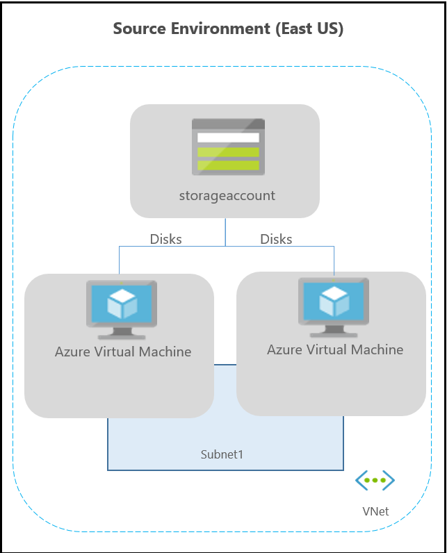
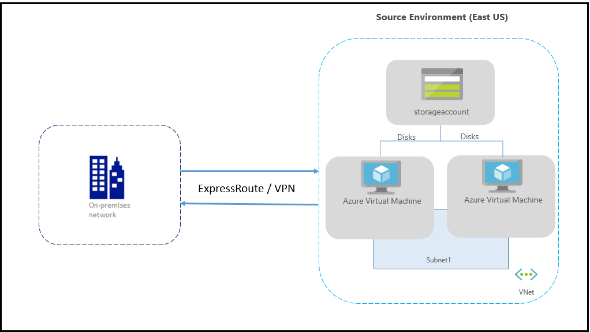
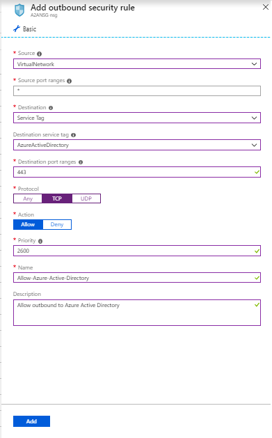
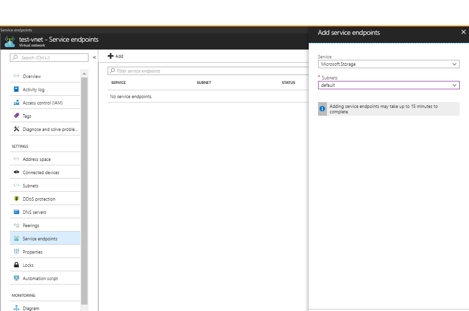

# About networking in Azure VM disaster recovery

This article provides networking guidance when you're replicating and recovering Azure VMs from one region to another, using [Azure Site Recovery](site-recovery-overview.md).

## Before you start

Learn how Site Recovery provides disaster recovery for [this scenario](azure-to-azure-architecture.md).

## Typical network infrastructure

The following diagram depicts a typical Azure environment, for applications running on Azure VMs:

If you're using Azure ExpressRoute or a VPN connection from your on-premises network to Azure, the environment is as follows:

Typically, networks are protected using firewalls and network security groups (NSGs). Firewalls use URL or IP-based whitelisting to control network connectivity. NSGs provide rules that use IP address ranges to control network connectivity.

>[!IMPORTANT]
> Using an authenticated proxy to control network connectivity isn't supported by Site Recovery, and replication can't be enabled.

## Outbound connectivity for URLs

If you are using a URL-based firewall proxy to control outbound connectivity, allow these Site Recovery URLs:

**URL** | **Details**
--- | ---
*.blob.core.windows.net | Required so that data can be written to the cache storage account in the source region from the VM. If you know all the cache storage accounts for your VMs, you can allow access to the specific storage account URLs (Ex: cache1.blob.core.windows.net and cache2.blob.core.windows.net) instead of *.blob.core.windows.net
login.microsoftonline.com | Required for authorization and authentication to the Site Recovery service URLs.
*.hypervrecoverymanager.windowsazure.com | Required so that the Site Recovery service communication can occur from the VM.
*.servicebus.windows.net | Required so that the Site Recovery monitoring and diagnostics data can be written from the VM.
*.vault.azure.net | Allows access to enable replication for ADE-enabled virtual machines via portal
*.automation.ext.azure.com | Allows enabling auto-upgrade of mobility agent for a replicated item via portal

## Outbound connectivity using Service Tags

If you are using an NSG to control outbound connectivity, these service tags need to be allowed.

- For the storage accounts in source region:
    - Create a [Storage service tag](../virtual-network/security-overview.md#service-tags) based NSG rule for the source region.
    - Allow these addresses so that data can be written to the cache storage account, from the VM.
- Create a [Azure Active Directory (AAD) service tag](../virtual-network/security-overview.md#service-tags) based NSG rule for allowing access to all IP addresses corresponding to AAD
- Create an EventsHub service tag based NSG rule for the target region, allowing access to Site Recovery monitoring.
- Create an AzureSiteRecovery service tag based NSG rule for allowing access to Site Recovery service in any region.
- Create an AzureKeyVault service tag based NSG rule. This is required only for enabling replication of ADE-enabled virtual machines via portal.
- Create a GuestAndHybridManagement service tag based NSG rule. This is required only for enabling auto-upgrade of mobility agent for a replicated item via portal.
- We recommend that you create the required NSG rules on a test NSG, and verify that there are no problems before you create the rules on a production NSG.

## Example NSG configuration

This example shows how to configure NSG rules for a VM to replicate.

- If you're using NSG rules to control outbound connectivity, use "Allow HTTPS outbound" rules to port:443 for all the required IP address ranges.
- The example presumes that the VM source location is "East US" and the target location is "Central US".

### NSG rules - East US

1. Create an outbound HTTPS (443) security rule for "Storage.EastUS" on the NSG as shown in the screenshot below.

      

2. Create an outbound HTTPS (443) security rule for "AzureActiveDirectory" on the NSG as shown in the screenshot below.

      

3. Similar to above security rules, create outbound HTTPS (443) security rule for "EventHub.CentralUS" on the NSG that correspond to the target location. This allows access to Site Recovery monitoring.

4. Create an outbound HTTPS (443) security rule for "AzureSiteRecovery" on the NSG. This allows access to Site Recovery Service in any region.

### NSG rules - Central US

These rules are required so that replication can be enabled from the target region to the source region post-failover:

1. Create an outbound HTTPS (443) security rule for "Storage.CentralUS" on the NSG.

2. Create an outbound HTTPS (443) security rule for "AzureActiveDirectory" on the NSG.

3. Similar to above security rules, create outbound HTTPS (443) security rule for "EventHub.EastUS" on the NSG that correspond to the source location. This allows access to Site Recovery monitoring.

4. Create an outbound HTTPS (443) security rule for "AzureSiteRecovery" on the NSG. This allows access to Site Recovery Service in any region.

## Network virtual appliance configuration

If you are using network virtual appliances (NVAs) to control outbound network traffic from VMs, the appliance might get throttled if all the replication traffic passes through the NVA. We recommend creating a network service endpoint in your virtual network for "Storage" so that the replication traffic does not go to the NVA.

### Create network service endpoint for Storage
You can create a network service endpoint in your virtual network for "Storage" so that the replication traffic does not leave Azure boundary.

- Select your Azure virtual network and click on 'Service endpoints'

    

- Click 'Add' and 'Add service endpoints' tab opens
- Select 'Microsoft.Storage' under 'Service' and the required subnets under 'Subnets' field and click 'Add'

>[!NOTE]
>Do not restrict virtual network access to your storage accounts used for ASR. You should allow access from 'All networks'

### Forced tunneling

You can override Azure's default system route for the 0.0.0.0/0 address prefix with a [custom route](../virtual-network/virtual-networks-udr-overview.md#custom-routes) and divert VM traffic to an on-premises network virtual appliance (NVA), but this configuration is not recommended for Site Recovery replication. If you're using custom routes, you should [create a virtual network service endpoint](azure-to-azure-about-networking.md#create-network-service-endpoint-for-storage) in your virtual network for "Storage" so that the replication traffic does not leave the Azure boundary.

## Next steps
- Start protecting your workloads by [replicating Azure virtual machines](site-recovery-azure-to-azure.md).
- Learn more about [IP address retention](site-recovery-retain-ip-azure-vm-failover.md) for Azure virtual machine failover.
- Learn more about disaster recovery of [Azure virtual machines with ExpressRoute](azure-vm-disaster-recovery-with-expressroute.md).
