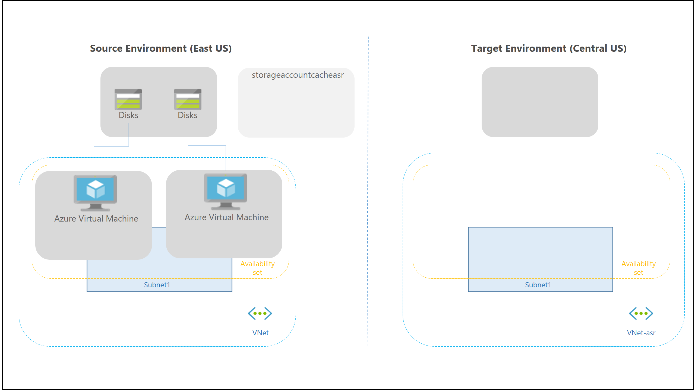
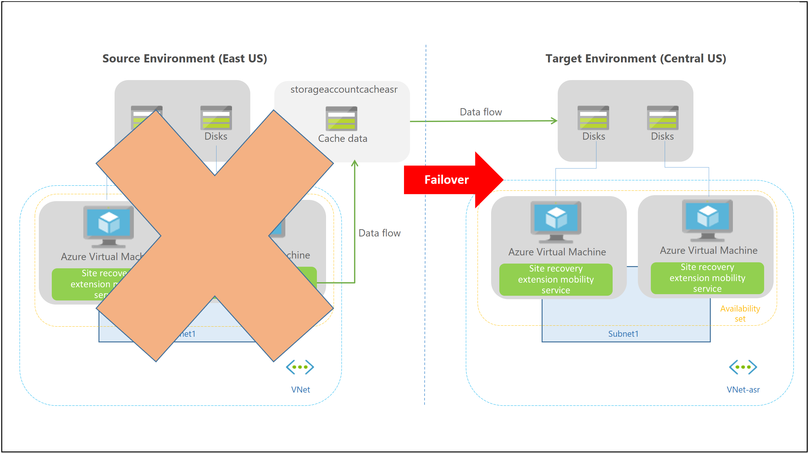

# Azure to Azure disaster recovery architecture

This article describes the architecture, components, and processes used when you deploy disaster recovery for Azure virtual machines (VMs)  using the [Azure Site Recovery](site-recovery-overview.md) service. With disaster recovery set up, Azure VMs continuously replicate to a different target region. If an outage occurs, you can fail over VMs to the secondary region, and access them from there. When everything's running normally again, you can fail back and continue working in the primary location.

## Architectural components

The components involved in disaster recovery for Azure VMs are summarized in the following table.

**Component** | **Requirements**
--- | ---
**VMs in source region** | One of more Azure VMs in a [supported source region](azure-to-azure-support-matrix.md#region-support).   VMs can be running any [supported operating system](azure-to-azure-support-matrix.md#replicated-machine-operating-systems).
**Source VM storage** | Azure VMs can be managed, or have non-managed disks spread across storage accounts.  [Learn about](azure-to-azure-support-matrix.md#replicated-machines---storage) supported Azure storage.
**Source VM networks** | VMs can be located in one or more subnets in a virtual network (VNet) in the source region. [Learn more](azure-to-azure-support-matrix.md#replicated-machines---networking) about networking requirements.
**Cache storage account** | You need a cache storage account in the source network. During replication, VM changes are stored in the cache before being sent to target storage.  Cache storage accounts must be Standard.   Using a cache ensures minimal impact on production applications that are running on a VM.   [Learn more](azure-to-azure-support-matrix.md#cache-storage) about cache storage requirements. 
**Target resources** | Target resources are used during replication, and when a failover occurs. Site Recovery can set up target resource by default, or you can create/customize them.   In the target region, check that you're able to create VMs, and that your subscription has enough resources to support VM sizes that will be needed in the target region. 

## Target resources

When you enable replication for a VM, Site Recovery gives you the option of creating target resources automatically. 

**Target resource** | **Default setting**
--- | ---
**Target subscription** | Same as the source subscription.
**Target resource group** | The resource group to which VMs belong after failover.   It can be in any Azure region except the source region.   Site Recovery creates a new resource group in the target region, with an "asr" suffix.
**Target VNet** | The virtual network (VNet) in which replicated VMs are located after failover. A network mapping is created between source and target virtual networks, and vice versa.   Site Recovery creates a new VNet and subnet, with the "asr" suffix.
**Target storage account** |  If the VM doesn't use a managed disk, this is the storage account to which data is replicated.   Site Recovery creates a new storage account in the target region, to mirror the source storage account.
**Replica managed disks** | If the VM uses a managed disk, this is the managed disks to which data is replicated.   Site Recovery creates replica managed disks in the storage region to mirror the source.
**Target availability sets** |  Availability set in which replicating VMs are located after failover.   Site Recovery creates an availability set in the target region with the suffix "asr", for VMs that are located in an availability set in the source location. If an availability set exists, it's used and a new one isn't created.
**Target availability zones** | If the target region supports availability zones, Site Recovery assigns the same zone number as that used in the source region.

### Managing target resources

You can manage target resources as follows:

- You can modify target settings as you enable replication. Please note that the default SKU for the target region VM is the same as the SKU of the source VM (or the next best available SKU in comparison to the source VM SKU). The dropdown list only shows relevant SKUs of the same family as the source VM (Gen 1 or Gen 2).
- You can modify target settings after replication is already working. Similar to other resources such as the target resource group, target name, and others, the target region VM SKU can also be updated after replication is in progress. A resource which cannot be updated is the availability type (single instance, set or zone). To change this setting, you need to disable replication, modify the setting, and then reenable. 

## Replication policy 

When you enable Azure VM replication, Site Recovery creates a new replication policy with the default settings summarized in the table, by default.

**Policy setting** | **Details** | **Default**
--- | --- | ---
**Recovery point retention** | Specifies how long Site Recovery keeps recovery points. | 1 day
**App-consistent snapshot frequency** | How often Site Recovery takes an app-consistent snapshot. | 0 hours (Disabled)

### Managing replication policies

You can manage and modify the settings of default replication policies as follows:
- You can modify the settings as you enable replication.
- You can create a replication policy at any time, and then apply it when you enable replication.

>[!NOTE]
>High recovery point retention period may have an implication on the storage cost since more recovery points may need to be saved. 

### Multi-VM consistency

If you want VMs to replicate together, and have shared crash-consistent and app-consistent recovery points at failover, you can gather them together into a replication group. Multi-VM consistency impacts workload performance, and should only be used for VMs running workloads that need consistency across all machines. 

## Snapshots and recovery points

Recovery points are created from snapshots of VM disks taken at a specific point in time. When you fail over a VM, you use a recovery point to restore the VM in the target location.

When failing over, we generally want to ensure that the VM starts with no corruption or data loss, and that the VM data is consistent for the operating system, and for apps that run on the VM. This depends on the type of snapshots taken.

Site Recovery takes snapshots as follows:

1. Site Recovery takes crash-consistent snapshots of data by default, and app-consistent snapshots if you specify a frequency for them.
2. Recovery points are created from the snapshots, and stored in accordance with retention settings in the replication policy.

### Consistency

The following table explains different types of consistency.

### Crash-consistent

**Description** | **Details** | **Recommendation**
--- | --- | ---
A crash consistent snapshot captures data that was on the disk when the snapshot was taken. It doesn't include anything in memory.   It contains the equivalent of the on-disk data that would be present if the VM crashed or the power cord was pulled from the server at the instant that the snapshot was taken.   A crash-consistent doesn't guarantee data consistency for the operating system, or for apps on the VM. | Site Recovery creates crash-consistent recovery points every five minutes by default. This setting can't be modified.    | Today, most apps can recover well from crash-consistent points.   Crash-consistent recovery points are usually sufficient for the replication of operating systems, and apps such as DHCP servers and print servers.

### App-consistent

**Description** | **Details** | **Recommendation**
--- | --- | ---
App-consistent recovery points are created from app-consistent snapshots.   An app-consistent snapshot contain all the information in a crash-consistent snapshot, plus all the data in memory and transactions in progress. | App-consistent snapshots use the Volume Shadow Copy Service (VSS):     1) Azure Site Recovery uses Copy Only backup (VSS_BT_COPY) method which does not change Microsoft SQL's transaction log backup time and sequence number    2) When a snapshot is initiated, VSS perform a copy-on-write (COW) operation on the volume.     3) Before it performs the COW, VSS informs every app on the machine that it needs to flush its memory-resident data to disk.     4) VSS then allows the backup/disaster recovery app (in this case Site Recovery) to read the snapshot data and proceed. | App-consistent snapshots are taken in accordance with the frequency you specify. This frequency should always be less than you set for retaining recovery points. For example, if you retain recovery points using the default setting of 24 hours, you should set the frequency at less than 24 hours.  They're more complex and take longer to complete than crash-consistent snapshots.   They affect the performance of apps running on a VM enabled for replication. 

## Replication process

When you enable replication for an Azure VM, the following happens:

1. The Site Recovery Mobility service extension is automatically installed on the VM.
2. The extension registers the VM with Site Recovery.
3. Continuous replication begins for the VM.  Disk writes are immediately transferred to the cache storage account in the source location.
4. Site Recovery processes the data in the cache, and sends it to the target storage account, or to the replica managed disks.
5. After the data is processed, crash-consistent recovery points are generated every five minutes. App-consistent recovery points are generated according to the setting specified in the replication policy.

**Replication process**

## Connectivity requirements

 The Azure VMs you replicate need outbound connectivity. Site Recovery never needs inbound connectivity to the VM. 

### Outbound connectivity (URLs)

If outbound access for VMs is controlled with URLs, allow these URLs.

| **Name**                  | **Commercial**                               | **Government**                                 | **Description** |
| ------------------------- | -------------------------------------------- | ---------------------------------------------- | ----------- |
| Storage                   | `*.blob.core.windows.net`                  | `*.blob.core.usgovcloudapi.net` | Allows data to be written from the VM to the cache storage account in the source region. |
| Azure Active Directory    | `login.microsoftonline.com`                | `login.microsoftonline.us`                   | Provides authorization and authentication to Site Recovery service URLs. |
| Replication               | `*.hypervrecoverymanager.windowsazure.com` | `*.hypervrecoverymanager.windowsazure.us`	  | Allows the VM to communicate with the Site Recovery service. |
| Service Bus               | `*.servicebus.windows.net`                 | `*.servicebus.usgovcloudapi.net`             | Allows the VM to write Site Recovery monitoring and diagnostics data. |
| Key Vault                 | `*.vault.azure.net`                        | `*.vault.usgovcloudapi.net`                  | Allows access to enable replication for ADE-enabled virtual machines via portal |
| Azure Automation          | `*.automation.ext.azure.com`               | `*.azure-automation.us`                      | Allows enabling auto-upgrade of mobility agent for a replicated item via portal |

### Outbound connectivity for IP address ranges

To control outbound connectivity for VMs using IP addresses, allow these addresses.
Please note that details of network connectivity requirements can be found in [networking white paper](azure-to-azure-about-networking.md#outbound-connectivity-using-service-tags) 

#### Source region rules

**Rule** |  **Details** | **Service tag**
--- | --- | --- 
Allow HTTPS outbound: port 443 | Allow ranges that correspond to storage accounts in the source region | Storage.\<region-name>
Allow HTTPS outbound: port 443 | Allow ranges that correspond to Azure Active Directory (Azure AD)  | AzureActiveDirectory
Allow HTTPS outbound: port 443 | Allow ranges that correspond to Events Hub in the target region. | EventHub.\<region-name>
Allow HTTPS outbound: port 443 | Allow ranges that correspond to Azure Site Recovery  | AzureSiteRecovery
Allow HTTPS outbound: port 443 | Allow ranges that correspond to Azure Key Vault (This is required only for enabling replication of ADE-enabled virtual machines via portal) | AzureKeyVault
Allow HTTPS outbound: port 443 | Allow ranges that correspond to Azure Automation Controller (This is required only for enabling auto-upgrade of mobility agent for a replicated item via portal) | GuestAndHybridManagement

#### Target region rules

**Rule** |  **Details** | **Service tag**
--- | --- | --- 
Allow HTTPS outbound: port 443 | Allow ranges that correspond to storage accounts in the target region | Storage.\<region-name>
Allow HTTPS outbound: port 443 | Allow ranges that correspond to Azure AD  | AzureActiveDirectory
Allow HTTPS outbound: port 443 | Allow ranges that correspond to Events Hub in the source region. | EventHub.\<region-name>
Allow HTTPS outbound: port 443 | Allow ranges that correspond to Azure Site Recovery  | AzureSiteRecovery
Allow HTTPS outbound: port 443 | Allow ranges that correspond to Azure Key Vault (This is required only for enabling replication of ADE-enabled virtual machines via portal) | AzureKeyVault
Allow HTTPS outbound: port 443 | Allow ranges that correspond to Azure Automation Controller (This is required only for enabling auto-upgrade of mobility agent for a replicated item via portal) | GuestAndHybridManagement

#### Control access with NSG rules

If you control VM connectivity by filtering network traffic to and from Azure networks/subnets using [NSG rules](../virtual-network/network-security-groups-overview.md), note the following requirements:

- NSG rules for the source Azure region should allow outbound access for replication traffic.
- We recommend you create rules in a test environment before you put them into production.
- Use [service tags](../virtual-network/network-security-groups-overview.md#service-tags) instead of allowing individual IP addresses.
    - Service tags represent a group of IP address prefixes gathered together to minimize complexity when creating security rules.
    - Microsoft automatically updates service tags over time. 
 
Learn more about [outbound connectivity](azure-to-azure-about-networking.md#outbound-connectivity-using-service-tags) for Site Recovery, and [controlling connectivity with NSGs](concepts-network-security-group-with-site-recovery.md).

### Connectivity for multi-VM consistency

If you enable multi-VM consistency, machines in the replication group communicate with each other over port 20004.
- Ensure that there is no firewall appliance blocking the internal communication between the VMs over port 20004.
- If you want Linux VMs to be part of a replication group, ensure the outbound traffic on port 20004 is manually opened as per the guidance of the specific Linux version.

## Failover process

When you initiate a failover, the VMs are created in the target resource group, target virtual network, target subnet, and in the target availability set. During a failover, you can use any recovery point.

## Next steps

[Quickly replicate](azure-to-azure-quickstart.md) an Azure VM to a secondary region.
