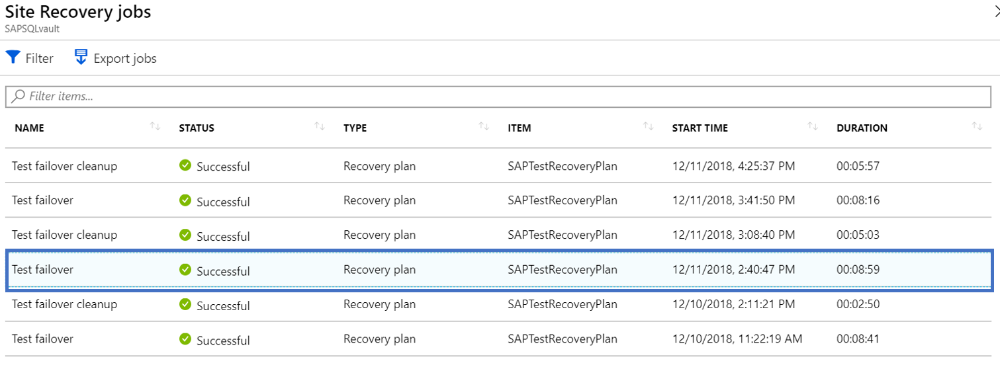

# Common questions: Azure-to-Azure disaster recovery

This article provides answers to common questions about disaster recovery of Azure VMs to another Azure region by using [Site Recovery](site-recovery-overview.md). 

## General

### How is Site Recovery priced?
Review [Azure Site Recovery pricing](https://azure.microsoft.com/blog/know-exactly-how-much-it-will-cost-for-enabling-dr-to-your-azure-vm/) details.
### How does the free tier for Azure Site Recovery work?
Every instance that is protected with Azure Site Recovery is free for the first 31 days of protection. From the 32nd day onwards, protection for the instance is charged at the rates above.
### During the first 31 days, will I incur any other Azure charges?
Yes, even though Azure Site Recovery is free during the first 31 days of a protected instance, you might incur charges for Azure Storage, storage transactions and data transfer. A recovered virtual machine might also incur Azure compute charges. Get complete details on pricing [here](https://azure.microsoft.com/pricing/details/site-recovery)

### Where can I find best practices for Azure VM disaster recovery? 
1. [Understand Azure-to-Azure architecture](azure-to-azure-architecture.md)
2. [Review the supported and not-supported configurations](azure-to-azure-support-matrix.md)
3. [Set up disaster recovery for Azure VMs](azure-to-azure-how-to-enable-replication.md)
4. [Run a test failover](azure-to-azure-tutorial-dr-drill.md)
5. [Fail over and fail back to the primary region](azure-to-azure-tutorial-failover-failback.md)

### How is capacity guaranteed in the target region?
The Site Recovery team works with the Azure capacity management team to plan sufficient infrastructure capacity, and to help ensure that VMs protected by Site Recovery for will successfully be deployed target region when failover is initiated.

## Replication

### Can I replicate VMs enabled through Azure disk encryption?

Yes, Site Recovery supports disaster recovery of VMs with Azure disk encryption (ADE) enabled. When you enable replication, all the required disk encryption keys and secrets are copied from the source region to the target region in the user context. If you don't have appropriate permission, a ready-to-use script can be handed to the security administrator, to copy the keys and secrets.

- Site Recovery supports ADE for Azure VMs running Windows.
- Site recovery supports ADE version 0.1, with a schema using Azure Active Directory (AAD), and version 1.1, without AAD. [Learn more](../virtual-machines/extensions/azure-disk-enc-windows.md#extension-schemata).
- ADE version 1.1, the Windows VMs must be used managed disks.
- [Learn more](azure-to-azure-how-to-enable-replication-ade-vms.md) about enabling replication for encrypted VMs.

### Can I replicate VMs to another subscription?
Yes, you can replicate Azure VMs to a different subscription within the same Azure AD tenant.
Configuring DR [across subscriptions](https://azure.microsoft.com/blog/cross-subscription-dr) is simple. You can select another subscription at the time of replication.

### Can I replicate zone-pinned Azure VMs to another region?
Yes, you can [replicate zone-pinned VMs](https://azure.microsoft.com/blog/disaster-recovery-of-zone-pinned-azure-virtual-machines-to-another-region) to another region.

### Can I exclude disks?

Yes, you can exclude disks at the time of protection by using PowerShell. For more information, refer [article](azure-to-azure-exclude-disks.md)

### Can I add new disks to replicated VMs and enable replication for them?

Yes, this is supported for Azure VMs with managed disks. When you add a new disk to an Azure VM that’s enabled for replication, replication health for the VM shows a warning, with a note specifying that one or more disks on the VM are available for protection. You can enable replication for added disks.
- If you enable protection for the added disks, the warning will disappear after the initial replication.
- If you choose not to enable replication for the disk, you can select to dismiss the warning.
- When you fail over a VM to which you add a disk and enable replication for it, replication points will show the disks that are available for recovery. For example, if a VM has a single disk and you add a new one, replication points that were created before you added the disk will show that the replication point consists of "1 of 2 disks".

Site Recovery doesn’t support “hot remove” of a disk from a replicated VM. If you remove a VM disk, you need to disable and then re-enable replication for the VM.

### How often can I replicate to Azure?
Replication is continuous when you're replicating Azure VMs to another Azure region. For more information, see the [Azure-to-Azure replication architecture](https://docs.microsoft.com/azure/site-recovery/azure-to-azure-architecture#replication-process).

### Can I replicate virtual machines within a region? I need this to migrate VMs.
You can't use an Azure-to-Azure DR solution to replicate VMs within a region.

### Can I replicate VMs to any Azure region?
With Site Recovery, you can replicate and recover VMs between any two regions within the same geographic cluster. Geographic clusters are defined with data latency and sovereignty in mind. For more information, see the Site Recovery [region support matrix](https://docs.microsoft.com/azure/site-recovery/azure-to-azure-support-matrix#region-support).

### Does Site Recovery require internet connectivity?

No, Site Recovery does not require internet connectivity. But it does require access to Site Recovery URLs and IP ranges, as mentioned in [this article](https://docs.microsoft.com/azure/site-recovery/azure-to-azure-about-networking#outbound-connectivity-for-ip-address-ranges).

### Can I replicate the application having separate resource group for separate tiers?
Yes, you can replicate the application and keep the disaster recovery configuration in separate resource group too.
For example, if you have an application with each tiers app, db and web in separate resource group, then you have to click the [replication wizard](https://docs.microsoft.com/azure/site-recovery/azure-to-azure-how-to-enable-replication#enable-replication) thrice to protect all the tiers. Site Recovery will replicate these three tiers in three different resource groups.

## Replication policy

### What is a replication policy?
It defines the settings for the retention history of recovery points and the frequency of app-consistent snapshots. By default, Azure Site Recovery creates a new replication policy with default settings of:

* 24 hours for the retention history of recovery points.
* 60 minutes for the frequency of app-consistent snapshots.

[Learn more](https://docs.microsoft.com/azure/site-recovery/azure-to-azure-tutorial-enable-replication#configure-replication-settings).

### What is a crash-consistent recovery point?
A crash-consistent recovery point represents the on-disk data as if the VM crashed or the power cord was pulled from the server at the time snapshot was taken. It doesn’t include anything that was in memory when the snapshot was taken.

Today, most applications can recover well from crash-consistent snapshots. A crash-consistent recovery point is usually enough for no-database operating systems and applications like file servers, DHCP servers, and print servers.

### What is the frequency of crash-consistent recovery point generation?
Site Recovery creates a crash-consistent recovery point every 5 minutes.

### What is an application-consistent recovery point?
Application-consistent recovery points are created from application-consistent snapshots. Application-consistent recovery points capture the same data as crash-consistent snapshots, with the addition of all data in memory and all transactions in process.
Because of their extra content, application-consistent snapshots are the most involved and take the longest to perform. We recommend application-consistent recovery points for database operating systems and applications such as SQL Server.

### What is the impact of application-consistent recovery points on application performance?
Considering application-consistent recovery points captures all the data in memory and in process it requires the framework like VSS on windows to quiesce the application. This, if done very frequently can have performance impact if the workload is already very busy. It is usually suggested not to use low frequency for app-consistent recovery points for non- database workloads and even for database workload 1 hour is enough.

### What is the minimum frequency of application-consistent recovery point generation?
Site Recovery can creates an application-consistent recovery point with a minimum frequency of in 1 hour.

### How are recovery points generated and saved?
To understand how Site Recovery generates recovery points, let's take an example of a replication policy that has a recovery point retention window of 24 hours and an app-consistent frequency snapshot of 1 hour.

Site Recovery creates a crash-consistent recovery point every 5 minutes. The user can't change this frequency. So for the last 1 hour, the user will have 12 crash-consistent points and 1 app-consistent point to choose from. As the time progresses, Site Recovery prunes all the recovery points beyond the last 1 hour and saves only 1 recovery point per hour.

The following screenshot illustrates the example. In the screenshot:

1. For time less than the last 1 hour, there are recovery points with a frequency of 5 minutes.
2. For time beyond the last 1 hour, Site Recovery keeps only 1 recovery point.

   

### How far back can I recover?
The oldest recovery point that you can use is 72 hours.

### What will happen if I have a replication policy of 24 hours and a problem prevents Site Recovery from generating recovery points for more than 24 hours? Will my previous recovery points be lost?
No, Site Recovery will keep all your previous recovery points. Depending upon the recovery points retention window, 24 hours in this case, Site Recovery replaces oldest point only if there is a generation of new points. In this case, as there won't be any new recovery point generated due to some issue, all the old points will remain intact  once we reach the window of retention.

### After replication is enabled on a VM, how do I change the replication policy?
Go to **Site Recovery Vault** > **Site Recovery Infrastructure** > **Replication policies**. Select the policy that you want to edit and save the changes. Any change will apply to all the existing replications too.

### Are all the recovery points a complete copy of the VM or a differential?
The first recovery point that's generated has the complete copy. Any successive recovery points have delta changes.

### Does increasing the retention period of recovery points increase the storage cost?
Yes. If you increase the retention period from 24 hours to 72 hours, Site Recovery will save the recovery points for an additional 48 hours. The added time will incur storage charges. For example, if a single recovery point has delta changes of 10 GB and the per-GB cost is $0.16 per month, the additional charges would be $1.6 * 48 per month.

## Multi-VM consistency

### What is Multi-VM consistency?
It means making sure that the recovery point is consistent across all the replicated virtual machines.
Site Recovery provides an option of "Multi-VM consistency," which, when you select it, creates a replication group to replicate all the machines together that are part of the group.
All the virtual machines will have shared crash-consistent and app-consistent recovery points when they're failed over.
Go through the tutorial to [enable Multi-VM consistency](https://docs.microsoft.com/azure/site-recovery/azure-to-azure-tutorial-enable-replication#enable-replication-for-a-vm).

### Can I failover single virtual machine within a Multi-VM consistency replication group?
By selecting the "Multi-VM consistency" option, you are stating that the application has a dependency on all the virtual machines within a group. Hence, single virtual machine failover is not allowed.

### How many virtual machines can I replicate as a part of a Multi-VM consistency replication group?
You can replicate 16 virtual machines together in a replication group.

### When should I enable Multi-VM consistency ?
Because it is CPU intensive, enabling Multi-VM consistency can affect workload performance. It should be used only if machines are running the same workload and you need consistency across multiple machines. For example, if you have two SQL Server instances and two web servers in an application, you should have Multi-VM consistency for the SQL Server instances only.

## Failover

### How is capacity assured in target region for Azure VMs?
The Site Recovery team works with Azure capacity management team to plan for sufficient infrastructure capacity, to help ensure that VMs enabled for disaster recovery will be deployed successfully in the target region when failover is initiated.

### Is failover automatic?

Failover isn't automatic. You start failovers with a single click in the portal, or you can use [PowerShell](azure-to-azure-powershell.md) to trigger a failover.

### Can I retain a public IP address after failover?

The public IP address of the production application can't be retained after failover.
- Workloads brought up as part of the failover process must be assigned an Azure public IP resource that's available in the target region.
- You can do this manually, or automate it with a recovery plan.
- Learn how to [set up public IP addresses after failover](concepts-public-ip-address-with-site-recovery.md#public-ip-address-assignment-using-recovery-plan).  

### Can I retain a private IP address during failover?
Yes, you can keep a private IP address. By default, when you enable disaster recovery for Azure VMs, Site Recovery creates target resources based on source resource settings. - For Azure VMs configured with static IP addresses, Site Recovery tries to provision the same IP address for the target VM, if it's not in use.
Learn about [retaining IP addresses during failover](site-recovery-retain-ip-azure-vm-failover.md).

### After failover, why is the server assigned a new IP address?

Site Recovery tries to provide the IP address at the time of failover. If another virtual machine is taking that address, Site Recovery sets the next available IP address as the target.
Learn more about [setting up network mapping and IP addressing for VNets](azure-to-azure-network-mapping.md#set-up-ip-addressing-for-target-vms).

### What are **Latest (lowest RPO)** recovery points?
The **Latest (lowest RPO)** option first processes all the data that has been sent to the Site Recovery service, to create a recovery point for each VM before failing over to it. This option provides the lowest recovery point objective (RPO), because the VM created after failover has all the data replicated to Site Recovery when the failover was triggered.

### Do **Latest (lowest RPO)** recovery points have an impact on failover RTO?
Yes. Site Recovery processes all pending data before failing over, so this option has a higher recovery time objective (RTO) as compared to other options.

### What does the **Latest processed** option in recovery points mean?
The **Last processed** option fails over all VMs in the plan to the latest recovery point that Site Recovery processed. To see the latest recovery point for a specific VM, check **Latest Recovery Points** in the VM settings. This option provides a low RTO, because no time is spent processing unprocessed data.

### What happens if my primary region experiences an unexpected outage?
You can trigger a failover after the outage. Site Recovery doesn't need connectivity from the primary region to perform the failover.

### What is a RTO of a VM failover ?
Site Recovery has a [RTO SLA of 2 hours](https://azure.microsoft.com/support/legal/sla/site-recovery/v1_2/). However, most of the time, Site Recovery fail over virtual machines within minutes. You can calculate the RTO by going to the failover Jobs which shows the time it took to bring up the VM. For Recovery plan RTO, refer below section.

## Recovery plans

### What is a recovery plan?
A recovery plan in Site Recovery orchestrates the failover recovery of VMs. It helps make the recovery consistently accurate, repeatable, and automated. A recovery plan addresses the following needs for the user:

- Defining a group of virtual machines that fail over together
- Defining the dependencies between virtual machines so that the application comes up accurately
- Automating the recovery along with custom manual actions to achieve tasks other than the failover of virtual machines

[Learn more](site-recovery-create-recovery-plans.md) about recovery plans.

### How is sequencing achieved in a recovery plan?

In a recovery plan, you can create multiple groups to achieve sequencing. Every group fails over at one time. VMs that are part of the same group fail over together, followed by another group. To learn how to model an application by using a recovery plan, see [About recovery plans](recovery-plan-overview.md#model-apps).

### How can I find the RTO of a recovery plan?
To check the RTO of a recovery plan, do a test failover for the recovery plan and go to **Site Recovery jobs**.
In the following example, the job called SAPTestRecoveryPlan took 8 minutes and 59 seconds to fail over all the virtual machines and perform specified actions.

### Can I add automation runbooks to the recovery plan?
Yes, you can integrate Azure Automation runbooks into your recovery plan. [Learn more](site-recovery-runbook-automation.md).

## Reprotection and failback

### After a failover from the primary region to a disaster recovery region, are VMs in a DR region protected automatically?
No. When you [fail over](https://docs.microsoft.com/azure/site-recovery/azure-to-azure-tutorial-failover-failback) Azure VMs from one region to another, the VMs start up in the DR region in an unprotected state. To fail back the VMs to the primary region, you need to [reprotect](https://docs.microsoft.com/azure/site-recovery/azure-to-azure-how-to-reprotect) the VMs in the secondary region.

### At the time of reprotection, does Site Recovery replicate complete data from the secondary region to the primary region?
It depends on the situation. For example, if the source region VM exists, only changes between the source disk and the target disk are synchronized. Site Recovery computes the differentials by comparing the disks, and then it transfers the data. This process usually takes a few hours. For more information about what happens during reprotection, see [Reprotect failed over Azure VMs to the primary region]( https://docs.microsoft.com/azure/site-recovery/azure-to-azure-how-to-reprotect#what-happens-during-reprotection).

### How much time does it take to fail back?
After reprotection, the amount of time for failback is generally similar to the time that was needed for failover from the primary region to a secondary region.

## Capacity

### How is capacity assured in target region for Azure VMs?
The Site Recovery team works with Azure capacity management team to plan for sufficient infrastructure capacity, to help ensure that VMs enabled for disaster recovery will successfully be deployed in the target region when failover is initiated.

### Does Site Recovery work with reserved instances?
Yes, You can purchase [reserve instances](https://azure.microsoft.com/pricing/reserved-vm-instances/) in the disaster recovery region, and Site Recovery failover operations will use them.   No additional configuration is needed.

## Security

### Is replication data sent to the Site Recovery service?
No, Site Recovery doesn't intercept replicated data, and  doesn't have any information about what's running on your VMs. Only the metadata needed to orchestrate replication and failover is sent to the Site Recovery service.  
Site Recovery is ISO 27001:2013, 27018, HIPAA, DPA certified, and is in the process of SOC2 and FedRAMP JAB assessments.

### Does Site Recovery encrypt replication?
Yes, both encryption-in-transit and [encryption at-rest in Azure](https://docs.microsoft.com/azure/storage/storage-service-encryption) are supported.

## Next steps
* [Review](azure-to-azure-support-matrix.md) support requirements.
* [Set up](azure-to-azure-tutorial-enable-replication.md) Azure to Azure replication.
- If you have questions after reading this article, post them on the [Azure Recovery Services forum](https://social.msdn.microsoft.com/Forums/azure/home?forum=hypervrecovmgr).
