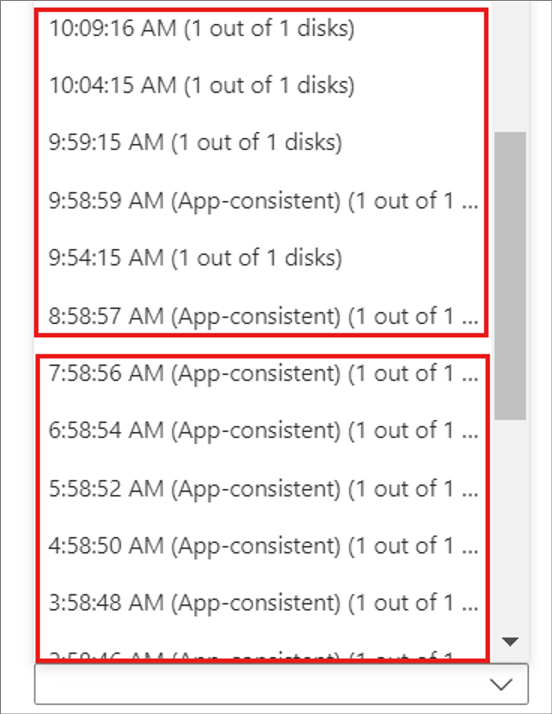

# Common questions: Azure-to-Azure disaster recovery

This article answers common questions about disaster recovery of Azure virtual machines to another Azure region, using the [Azure Site Recovery](site-recovery-overview.md) service.

## General

### How is Site Recovery priced?

Learn about [costs](https://azure.microsoft.com/blog/know-exactly-how-much-it-will-cost-for-enabling-dr-to-your-azure-vm/) for Azure virtual machine disaster recovery.

### How does the free tier work?

Every instance that's protected with Site Recovery is free for the first 31 days of protection. After that period, protection for each instance is at the rates summarized in [pricing details](https://azure.microsoft.com/pricing/details/site-recovery/). You can estimate costs using the [Azure pricing calculator](https://azure.microsoft.com/pricing/calculator/?service=site-recovery).

### Do I incur other Azure charges in the first 31 days?

Yes. Even though Azure Site Recovery is free during the first 31 days of a protected instance, you might incur charges for Azure Storage, storage transactions, and data transfers. A recovered VM might also incur Azure compute charges.

### How do I get started with Azure virtual machine disaster recovery?

1. [Understand](azure-to-azure-architecture.md) the Azure virtual machine disaster recovery architecture.
2. [Review](azure-to-azure-support-matrix.md) support requirements.
3. [Set up](azure-to-azure-how-to-enable-replication.md) disaster recovery for Azure virtual machines.
4. [Run a disaster recovery drill](azure-to-azure-tutorial-dr-drill.md) with a test failover.
5. [Run a full failover](azure-to-azure-tutorial-failover-failback.md) to a secondary Azure region.
6. [Fail back](azure-to-azure-tutorial-failback.md) from the secondary region to the primary region.

### How do we ensure capacity in the target region?

The Site Recovery team, and the Azure capacity management team, plan for sufficient infrastructure capacity. When you start a failover, the teams also help ensure that virtual machine instances protected by Site Recovery deploy to the target region.

## Replication

### Can I replicate virtual machines with disk encryption?

Yes. Site Recovery supports disaster recovery of virtual machines that have Azure Disk Encryption (ADE) enabled. When you enable replication, Azure copies all the required disk encryption keys and secrets from the source region to the target region, in the user context. If you don't have required permissions, your security administrator can use a script to copy the keys and secrets.

- Site Recovery supports ADE for Azure virtual machines running Windows.
- Site Recovery supports:
    - ADE version 0.1, which has a schema that requires Microsoft Entra ID.
    - ADE version 1.1, which doesn't require Microsoft Entra ID. For version 1.1, Microsoft Azure virtual machines must have managed disks.
    - [Learn more](../virtual-machines/extensions/azure-disk-enc-windows.md#extension-schema) about the extension schemas.

[Learn more](azure-to-azure-how-to-enable-replication-ade-vms.md) about enabling replication for encrypted virtual machines.

See the [support matrix](azure-to-azure-support-matrix.md#replicated-machines---storage) for information about support for other encryption features.

### Can I select an automation account from a different resource group?

When you allow Site Recovery to manage updates for the Mobility service extension running on replicated Azure virtual machines, it deploys a global runbook (used by Azure services), via an Azure Automation account. You can use the automation account that Site Recovery creates, or select to use an existing automation account.

Currently, in the portal, you can only select an automation account in the same resource group as the vault. You can select an automation account from a different resource group using PowerShell. [Learn more](azure-to-azure-autoupdate.md#enable-automatic-updates) about enabling automatic updates.

### If I use a customer automation account that's not in the vault resource group, can I delete the default runbook?

Yes, you can delete it if you don't need it.

### Does upgrading kernel firmware on a server protected by Azure Site Recovery for disaster recovery have any impact?

No, it won't have any impact on the ongoing replication because the server is already protected through Azure Site Recovery.

### Can I replicate virtual machines to another subscription?

Yes, you can replicate Azure virtual machines to any subscription within the same Microsoft Entra tenant. When you enable disaster recovery for virtual machines, by default the target subscription shown is that of the source virtual machine. You can modify the target subscription, and other settings (such as resource group and virtual network), are populated automatically from the selected subscription.

### Can I replicate virtual machines in an availability zone to another region?

Yes, you can replicate virtual machines in availability zones to another Azure region.

### Can I replicate non-zone virtual machines to a zone within the same region?

This isn't supported.

### Can I replicate zoned virtual machines to a different zone in the same region?

Support for this is limited to a few regions. [Learn more](azure-to-azure-how-to-enable-zone-to-zone-disaster-recovery.md).

### Can I exclude disks from replication?

Yes, you can exclude disks when you set up replication, using PowerShell. [Learn more](azure-to-azure-exclude-disks.md) about excluding disks.

### Can I replicate new disks added to replicated virtual machines?

For replicated virtual machines with managed disks, you can add new disks, and enable replication for them. When you add a new disk, the replicated virtual machine shows a warning message that one or more disks on the virtual machine are available for protection.

- If you enable replication for the added disks, the warning disappears after the initial replication.
- If you don't want to enable replication for the disk, you can dismiss the warning.
- If you fail over a virtual machine with added disks, replication points show the disks available for recovery. For example, if you add a second disk to a virtual machine with one disk, a replication point created before you added shows as "1 of 2 disks."

Site Recovery doesn't support "hot remove" of disks from a replicated virtual machine. If you remove a virtual machine disk, you need to disable and then reenable replication for the virtual machine.

### How often can I replicate to Azure?

Replication is continuous when replicating Azure virtual machines to another Azure region. [Learn more](./azure-to-azure-architecture.md#replication-process) about the replication process.

### Can I replicate non-zoned virtual machines within a region?

You can't use Site Recovery to replicate non-zoned virtual machines within a region. But you can replicate zoned machines to a different zone in the same region.

### Can I replicate virtual machine instances to any Azure region?

You can replicate and recover virtual machines between any two regions. 

### Does Site Recovery need internet connectivity?

No, but virtual machines need access to Site Recovery URLs and IP ranges. [Learn more](./azure-to-azure-about-networking.md#outbound-connectivity-for-urls).

### Can I replicate an application tiered across resource groups?

Yes, you can replicate the app, and keep the disaster recovery configuration in a separate resource group.

For example, if the apps have three tiers (application/database/web) in different resource groups, you need to enable replication three times, to protect all tiers. Site Recovery replicates the three tiers into three different resource groups.

### Can I move storage accounts across resource groups?

No, this is unsupported. If you accidentally move storage accounts to a different resource group and delete the original resource group, then you can create a new resource group with the same name as the old resource group, and then move the storage account to this resource group.

## Replication policy

### What is a replication policy?

A replication policy defines the retention history of recovery points, and the frequency of app-consistent snapshots.  Site Recovery creates a default replication policy as follows:

- Retain recovery points for one day.
- App-consistent snapshots are disabled and aren't created by default.

[Learn more](azure-to-azure-how-to-enable-replication.md) about replication settings.

### What's a crash-consistent recovery point?

A crash-consistent recovery point contains on-disk data, as if you pulled the power cord from the server during the snapshot. It doesn't include anything that was in memory when the snapshot was taken.

Today, most apps can recover well from crash-consistent snapshots. A crash-consistent recovery point is enough for nondatabase operating systems, and apps such as file servers, DHCP servers, and print servers.

Site Recovery automatically creates a crash-consistent recovery point every five minutes.

### What's an application-consistent recovery point?

App-consistent recovery points are created from app-consistent snapshots. They capture the same data as crash-consistent snapshots, and in addition capture data in memory, and all transactions in process.

Because of extra content, app-consistent snapshots are the most involved, and take the longest. We recommend app-consistent recovery points for database operating systems, and apps such as SQL Server. For Windows, app-consistent snapshots use the Volume Shadow Copy Service (VSS).

### Do app-consistent recovery points impact performance?

 Because app-consistent recovery points capture all data in memory and process, if they capture frequently, it can affect performance when the workload is already busy. We don't recommend that you capture too often for nondatabase workloads. Even for database workloads, one hour should be enough.

### What's the minimum frequency for generating app-consistent recovery points?

Site Recovery can create app-consistent recovery points with a minimum frequency of one hour.

### Can I enable app-consistent replication for Linux virtual machines?

Yes. The Mobility agent for Linux support custom scripts for app-consistency. A custom script with pre and post-options is used by the agent. [Learn more](site-recovery-faq.yml)

### How are recovery points generated and saved?

To understand how Site Recovery generates recovery points, let's use an example.

- A replication policy retains recovery points for one day, and takes an app-consistent snapshot every hour.
- Site Recovery creates a crash-consistent recovery point every five minutes. You can't change this frequency.
- Site Recovery prunes recovery points after two hours, saving one point per hour.

So, for the recent two hours, you can choose from 24 crash-consistent points, and two app-consistent points, as shown in the graphic.

   

### How far back can I recover?

The oldest recovery point that you can use is 15 days with Managed disk and three days with Unmanaged disk.

### How does the pruning of recovery points happen?

Crash-consistent recovery points are generated in every five minutes. App-consistent snapshots are generated based on the input frequency entered by you. Beyond two hours, pruning of recovery points may happen based on the retention period that you input. Following are the scenarios:

|**Retention Period input**        | **Pruning mechanism**                               |
|----------------------------------|-----------------------------------------------------|
|0 day|No recovery point saved. You can fail over only to the latest point|
|1 day|One recovery point saved per hour beyond the last two hours|
|2 - 7 days|One recovery point saved per two hours beyond the last two hours|
|8 - 15 days|One recovery point saved per two hours beyond the last two hours for seven days. Post that, one recovery point saved per four hours.
App-consistent snapshots will also be pruned based on the duration mentioned above in the table even if you had input lesser app-consistent snapshot frequency.|

### What happens if Site Recovery can't generate recovery points for more than one day?

If you have a replication policy of one day, and Site Recovery can't generate recovery points for more than one day, your old recovery points remain. Site Recovery only replaces the oldest point if it generates new points. Until there are new recovery points, all the old points remain after you reach the retention window.

### Can I change the replication policy after replication is enabled?

Yes. In the vault  > **Site Recovery Infrastructure** > **Replication policies**, select and edit the policy. Changes apply to existing policies too.

### Are all recovery points a complete virtual machine copy?

The first recovery point that's generated has the complete copy. Successive recovery points have delta changes.

### Do increases in recovery point retention increase storage costs?

Yes. For example, if you increase retention from one day to three days, Site Recovery saves recovery points for an additional two days. The added time incurs storage changes. Earlier, it was saving recovery points per hour for one day. Now, it is saving recovery points per two hours for 3 days. Refer [pruning of recovery points](#how-does-the-pruning-of-recovery-points-happen). So additional 12 recovery points are saved.  As an example only, if a single recovery point had delta changes of 10 GB, with a per-GB cost of $0.16 per month, then additional charges would be $1.60 × 12 per month.

## Multi-VM consistency

### What is multi-VM consistency?

Multi-VM consistency ensures that recovery points are consistent across replicated virtual machines.

- When you enable multi-VM consistency, Site Recovery creates a replication group of all the machines with the option enabled.
- When you fail over the machines in the replication group, they have shared crash-consistent and app-consistent recovery points.

[Learn](azure-to-azure-tutorial-enable-replication.md#enable-replication) how to enable multi-VM consistency.

### Can I fail over a single virtual machine in a replication group?

No. When you enable multi-VM consistency, it infers that an app has a dependency on all virtual machines in the replication group, and single virtual machine failover isn't allowed.

### How many virtual machines can I replicate together in a group?

You can replicate 16 virtual machines together in a replication group.

### When should I enable multi-VM consistency?

Multi-VM consistency is CPU intensive, and enabling it can affect workload performance. Enable only if virtual machines are running the same workload, and you need consistency across multiple machines. For example, if you have two SQL Server instances and two web servers in an application, enable multi-VM consistency for the SQL Server instances only.

### Can I add a replicating virtual machine to a replication group?

When you enable replication for a virtual machine, you can add it to a new replication group, or to an existing group. You can't add a virtual machine that's already replicating to a group.

## Failover

### How do we ensure capacity in the target region?

The Site Recovery team, and Azure capacity management team, plan for sufficient infrastructure capacity on a best-effort basis. When you start a failover, the teams also help ensure virtual machine instances that are protected by Site Recovery can deploy to the target region. 

### Is failover automatic?

Failover isn't automatic. You can start a failover with a single click in the portal, or use  [PowerShell](azure-to-azure-powershell.md) to trigger a failover.

### Can I keep a public IP address after  failover?

You can't keep the public IP address for a production app after a failover.

When you bring up a workload as part of the failover process, you need to assign an Azure public IP address resource to it. The resource must be available in the target region. You can assign the Azure public IP address resource manually, or you can automate it with a recovery plan. [Learn](concepts-public-ip-address-with-site-recovery.md#public-ip-address-assignment-using-recovery-plan) how to set up public IP addresses after failover.

### Can I keep a private IP address after failover?

Yes. By default, when you enable disaster recovery for Azure virtual machines, Site Recovery creates target resources, based on source resource settings. For Azure virtual machines configured with static IP addresses, Site Recovery tries to provision the same IP address for the target virtual machine, if it's not in use.
[Learn more about](site-recovery-retain-ip-azure-vm-failover.md) keeping IP addresses after failover.

### Why is a virtual machine assigned a new IP address after failover?

Site Recovery tries to provide the IP address at the time of failover. If another virtual machine uses that address, Site Recovery sets the next available IP address as the target.

[Learn more about](azure-to-azure-network-mapping.md#set-up-ip-addressing-for-target-vms) setting up network mapping and IP addressing for virtual networks.

### What's the *Latest* recovery point?

The *Latest (lowest RPO)* recovery point option provides the lowest recovery point objective (RPO). It first processes all the data that has been sent to Site Recovery service, to create a recovery point for each virtual machine, before failing over to it. It initially attempts to process and apply all data sent to Site Recovery service in the target location and create a recovery point using the processed data. However, if at the time failover was triggered, there is no data uploaded to Site Recovery service waiting to be processed, Azure Site Recovery won't perform any processing and hence, won't create a new recovery point. In this scenario, it will instead failover using the previously processed recovery point only.

### Do *latest* recovery points impact failover RTO?

Yes. Site Recovery processes all pending data before failing over, so this option has a higher recovery time objective (RTO) than other options.

### What's the *Latest processed* recovery option?

The *Latest processed* option does the following:

1. It fails over all virtual machines to the latest recovery point processed by Site Recovery. This option provides a low RTO, because no time is spent processing unprocessed data.

### What if there's an unexpected outage in the primary region?

You can start failover. Site Recovery doesn't need connectivity from the primary region to do the failover.

### What is the RTO of a virtual machine failover?

Site Recovery has an RTO SLA of [two hours](https://azure.microsoft.com/support/legal/sla/site-recovery/v1_2/). Most of the time, Site Recovery fails over virtual machines within minutes. To calculate the RTO, review the failover job, which shows the time it took to bring up a virtual machine.

## Recovery plans

### What's a recovery plan?

A [recovery plan](site-recovery-create-recovery-plans.md) in Site Recovery orchestrates the failover and recovery of virtual machines. It helps make recovery consistently accurate, repeatable, and automated. It does the following:

- Defines a group of virtual machines that fail over together
- Defines the dependencies between virtual machines, so that the application comes up accurately.
- Automates recovery, with the option of custom manual actions for tasks other than virtual machine failover.

### How does sequencing work?

In a recovery plan, you can create up to 7 groups of virtual machine for sequencing. Groups failover one at a time, so that virtual machines that are part of the same group failover together. [Learn more](recovery-plan-overview.md#model-apps).

### How can I find the RTO of a recovery plan?

To check the RTO of a recovery plan, do a test failover for the recovery plan. In **Site Recovery jobs**, check the test failover duration. In the example  screenshot, the **SAPTestRecoveryPlan** test failover job took 8 minutes and 59 seconds.

### Can I add automation runbooks to recovery plans?

Yes. [Learn more](site-recovery-runbook-automation.md).

## Reprotection and failback

### After failover, are virtual machines in the secondary region protected automatically?

No. When you fail over virtual machines from one region to another, the virtual machines start up in the target disaster recovery region in an unprotected state. To [reprotect](./azure-to-azure-how-to-reprotect.md) virtual machines in the secondary region, you enable replication back to the primary region.

### When I reprotect, is all data replicated from the secondary region to primary?

It depends. If the source region virtual machine exists, then only changes between the source disk and the target disk are synchronized. Site Recovery compares the disks to what's different, and then it transfers the data. This process usually takes a few hours. [Learn more](azure-to-azure-how-to-reprotect.md#what-happens-during-reprotection).

### How long does it take fail back?

After reprotection, failback takes about the same amount of time it took to fail over from the primary region to a secondary region.

## Capacity

### How do we ensure capacity in the target region?

The Site Recovery team and Azure capacity management team plan for sufficient infrastructure capacity on a best-effort basis. When you start a failover, the teams also help ensure virtual machine instances that are protected by Site Recovery can deploy to the target region.

### Does Site Recovery work with Capacity Reservation?

Yes, you can create a Capacity Reservation for your virtual machine SKU in the disaster recovery region and/or zone, and configure it in the Compute properties of the Target virtual machine. Once done, site recovery will use the earmarked capacity for the failover. [Learn more](../virtual-machines/capacity-reservation-overview.md).

### Why should I reserve capacity using Capacity Reservation at the destination location?

While Site Recovery makes a best effort to ensure that capacity is available in the recovery region, it does not guarantee the same. Site Recovery's best effort is backed by a 2-hour RTO SLA. But if you require further assurance and _guaranteed compute capacity,_ then we recommend you to purchase [Capacity Reservations](https://aka.ms/on-demand-capacity-reservations-docs)  

### Does Site Recovery work with reserved instances?

Yes, you can purchase [reserved Azure virtual machines](https://azure.microsoft.com/pricing/reserved-vm-instances/) in the disaster recovery region, and Site Recovery failover operations use them. No additional configuration is needed.

## Security

### Is replication data sent to the Site Recovery service?

No, Site Recovery doesn't intercept replicated data, and it doesn't have any information about what's running on your virtual machines. Only the metadata needed to orchestrate replication and failover is sent to the Site Recovery service.

Site Recovery is ISO 27001:2013, 27018, HIPAA, and DPA certified. The service is undergoing SOC2 and FedRAMP JAB assessments.

### Does Site Recovery encrypt replication?

Yes, both encryption in transit and [encryption at rest in Azure](../storage/common/storage-service-encryption.md) are supported.

## Disk network access

### What network access do the disks created by Azure Site Recovery have?

Azure Site Recovery creates [replica](./azure-to-azure-architecture.md#target-resources) and target disks. *Replica disks* are disks where the data is replicated and *target disks* are disks that are attached to failover (or test failover) virtual machines. Azure Site Recovery creates these disks with public access enabled. However, you can manually disable the public access for these disks by following these steps:

1. Go to the **Replicated items** section of your recovery services vault. 
1. Select the virtual machine for which you want to change the disk network access policy.
1. Find the target subscription name and target resource group name in the **Compute** tab.
    The replica disks are in the target subscription and target resource group. The failover and test failover virtual machines are also created in the target resource group within target subscription.

    :::image type="content" source="media/azure-to-azure-common-questions/replicated-items.png" alt-text="Screenshot of replicated items."lightbox="media/azure-to-azure-common-questions/replicated-items.png":::
 
1. Go to the **Disks** tab of the replicated items to identify the replica disk names and target disk names corresponding to each source disk. 
    You can find the replica disks in the target resource group obtained from the previous step. Similarly, when you complete the failover, you get target disks attached to recovery virtual machine in the target resource group.

    :::image type="content" source="media/azure-to-azure-common-questions/disks-tab.png" alt-text="Screenshot of disks tab."lightbox="media/azure-to-azure-common-questions/disks-tab.png":::
 
1. For each replica disk, do the following:
    1. Go to the **Disk Export** tab under the **Settings** of the disk. The disk should have SAS Access taken by Azure Site Recovery by default.
    1. Cancel the export using the **Cancel export** option before making any network access changes. 
    
        :::image type="content" source="media/azure-to-azure-common-questions/disk-export.png" alt-text="Screenshot of disk export tab."lightbox="media/azure-to-azure-common-questions/disk-export.png":::

 
        Azure Site Recovery needs SAS on replica disks for replication. Canceling the export may briefly impact Azure Site Recovery replication, but Site Recovery automatically gets the SAS back in a few minutes.
 
    1. Go to the **Networking** tab under the **Settings** options of the disk. By default, the disk is created with *Enable public access from all networks* setting enabled. 
    1. Change the network access to either **Disable public access and enable private access** or **Disable public and private access** per your requirement, after cancel export is successful.
    
        If you want to change disk network access to **Disable public access and enable private access**, the disk access resource to be used should already be present in the target region within the target subscription. Find the steps to [create a disk access resource here](../virtual-machines/disks-enable-private-links-for-import-export-portal.yml).
        
        :::image type="content" source="media/azure-to-azure-common-questions/disk-networking.png" alt-text="Screenshot of Disk networking."lightbox="media/azure-to-azure-common-questions/disk-networking.png":::

    > [!NOTE]
    > You can change the network access of the disk only if you have cancelled the export. If you do not cancel the export, network access change for the disk is disabled.
        

After completing the failover or test failover, the recovery virtual machine created in the target location also have the disks with public access enabled. These disks won't have SAS taken by Azure Site Recovery. To change the network access for these disks, go to the **Networking** tab of the disk and change the disk network access as needed according to step 5. 

During reprotection and failback as well, Azure Site Recovery creates disks with public access enabled. You can change the network access of those disks as well as discussed in the steps above based on your requirements.

## Next steps

- [Review Azure-to-Azure support requirements](azure-to-azure-support-matrix.md).
- [Set up Azure-to-Azure replication](azure-to-azure-tutorial-enable-replication.md).
- If you have questions after reading this article, post them on the [Microsoft Q&A question page for Azure Recovery Services](/answers/topics/azure-site-recovery.html).
