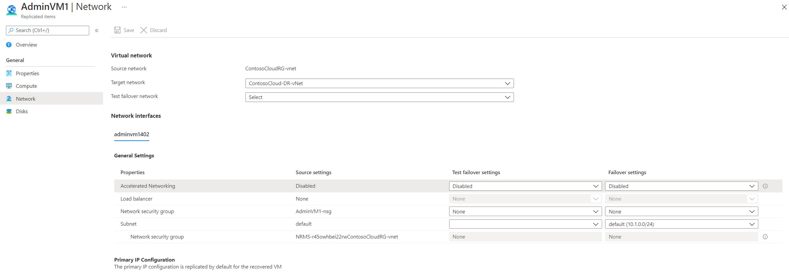
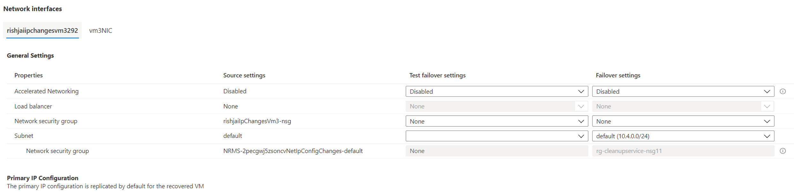

# Customize networking configurations of the target Azure VM

This article provides guidance on customizing networking configurations on the target Azure virtual machine (VM) when you're replicating and recovering Azure VMs from one region to another, using [Azure Site Recovery](site-recovery-overview.md).

## Before you start

Learn how Site Recovery provides disaster recovery for [this scenario](azure-to-azure-architecture.md).

## Supported networking resources

You can provide the following key resource configurations for the failover VM while replicating Azure VMs:

- [Internal load balancer](https://docs.microsoft.com/azure/load-balancer/load-balancer-overview)
- [Public IP](https://docs.microsoft.com/azure/virtual-network/virtual-network-ip-addresses-overview-arm#public-ip-addresses)
- [Network security group](https://docs.microsoft.com/azure/virtual-network/manage-network-security-group) both for the subnet and for the NIC

## Prerequisites

- Ensure that you plan your recovery side configurations in advance.
- Create the networking resources in advance. Provide it as an input so that Azure Site Recovery service can honor these settings and ensure that the failover VM adheres to these settings.

## Customize failover and test failover networking configurations

1. Go to **Replicated Items**. 
2. Select the desired Azure VM.
3. Select **Compute and Network** and select **Edit**. Notice that the NIC configuration settings include the corresponding resources at the source. 

     

4. Select a test failover virtual network. You can choose to leave it blank and select one at the time of test failover.
5. Failover network is Select **Edit** near the NIC you want to configure. In the next blade that opens, select the corresponding pre-created resources in the test failover and failover location.

     

6. Select **OK**.

Site Recovery will now honor these settings and ensure that the VM on failover is connected to the selected resource via the corresponding NIC.

When you trigger the test failover via Recovery Plan, it will always ask the Azure virtual network. This virtual network will be used for test failover for the machines that did not have test failover settings pre-configured.

## Troubleshooting

### Unable to view or select a resource

If you can't select or view a networking resource, go through the following checks and conditions:

- The target field for a networking resource is enabled only if the source VM had a corresponding input. This is based on the principle that for a disaster recovery scenario, you would want either the exact or a scaled-down version of your source.
- For each networking resource, some filters are applied in the drop-down list to ensure that the failover VM can attach itself to the resource selected and the failover reliability is maintained. These filters are based on the same networking conditions that would have been verified when you configured the source VM.

Internal load balancer validations:

- The Subscription and Region of the load balancer and the target VM should be the same.
- The virtual network associated with the internal load balancer and that of the target VM should be the same.
- The target VM’s public IP SKU and the internal load balancer's SKU should be the same.
- If the target VM is configured to be placed in an availability zone, then check if the load balancer is zone redundant or part of any availability zone. (Basic SKU load balancers don't support zones and won't be shown in the drop-down list in this case.)
- Ensure that the internal load balancer has a pre-created back-end pool and front-end configuration.

Public IP address:

- The Subscription and Region of the public IP and the target VM should be the same.
- The target VM’s public IP SKU and the internal load balancer's SKU should be the same.

Network security group:
- The Subscription and Region of the network security group and the target VM should be the same.

> [!WARNING]
> If the target VM is associated with an availability set, then you need to associate the public IP and internal load balancer of the same SKU with that of the other VM's public IP and internal load balancer in the availability set. If you don't, failover might not succeed.
