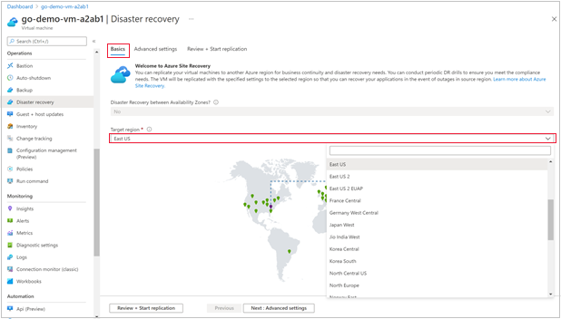

# Enable global disaster recovery using Azure Site Recovery

This article describes how to replicate, failover, and failback Azure virtual machines from one Availability Zone to another, within the same or a different Azure region.

>[!NOTE]
> Azure Site Recovery does not move or store data out of the source and target region chosen by you. You may select a Recovery Services Vault from a different (third) region. The Recovery Services Vault contains metadata but no actual customer data.

Azure Site Recovery service contributes to your business continuity and disaster recovery strategy by keeping your business apps up and running, during planned and unplanned outages. We recommend Disaster Recovery option to keep your applications up and running if there are regional outages.

## Disaster recovery for global Azure regions

Azure was the first large public cloud provider to launch a first-class cloud native disaster recovery solution with Azure-to-Azure Disaster Recovery. This offering  was allowing you to replicate and fail over your applications from one Azure region to another, in the same continent. also supporting zone-to-zone Disaster Recovery.   

Azure Site Recovery now supports global disaster recovery. You can now replicate and fail over your applications from any Azure region, across continents.

Many of you run global businesses and would like to host and replicate your applications across the world by leveraging Azure’s global presence. This is where you can leverage global disaster recovery via Azure Site Recovery. This new offering removes the continental boundaries of Azure to Azure Disaster Recovery. Supported by our powerful global networking backbone, you can replicate and fail over your applications to any Azure region of your choice, around the globe.  

This offering completes the native-public cloud disaster recovery portfolio of zone-to-zone disaster recovery, within-continent disaster recovery, and global disaster recovery.

>[!NOTE]
>Choosing a disaster recovery (DR) region on a distant continent does have a minor impact on recovery point objective (RPO) but is not significant enough to impact any of the Azure Site Recovery’s SLAs.

This offering completes the native-public cloud disaster recovery portfolio of zone-to-zone disaster recovery, within-continent disaster recovery, and global disaster recovery.  

## Before you begin
This article assumes that you've prepared for Azure Site Recovery deployment, as described in the [Azure to Azure disaster recovery tutorial](azure-to-azure-tutorial-enable-replication.md).

Ensure the prerequisites are met and you have created a Recovery Services vault.

>[!NOTE]
> See [support matrix](azure-to-azure-support-matrix.md) before enabling replication on your virtual machine(s).

## Supported Platform features

| **Feature** | **Support statement** |
| --- | --- |
| Classic VMs | No |
| ARM VMs |  Yes |
| Azure Disk Encryption v1 (dual pass, with Microsoft Entra ID) |  Yes |
| Azure Disk Encryption v2 (single pass, without Microsoft Entra ID) |  Yes |
|     |  No |
| Managed disks |  Yes |
| Customer-managed keys |   Yes |
| Proximity placement groups |  Yes |
| Backup interoperability | File level backup and restore are supported. Disk and VM level backup and restore are not supported. |
| Hot add/remove | Disks can be added after enabling zone-to-zone replication. Removal of disks after enabling zone-zone replication is not supported. |

## Enable replication

Use the following steps for quickly replicating your appliances:

1. In the portal, go to the virtual machine.

2. On the left, under **Operations**, select **Disaster Recovery**

3. From **Basics**, select the **Target region**.

   All the available Azure regions across the globe are displayed under the drop-down menu. Choose the target region as per your preference.  

   

   You can make other configuration changes as required by you.

4. Click **Advanced Settings** for other settings such as  **Target Subscription**, **Target Virtual Network**, **Target Availability**, **Target Proximity Placement Group**.

5. Click **Review + Start replication**.

## Next steps

- Learn about [zone-to-zone disaster recovery](azure-to-azure-how-to-enable-zone-to-zone-disaster-recovery.md).
- Learn about [Azure to Azure disaster recovery architecture](azure-to-azure-architecture.md)
