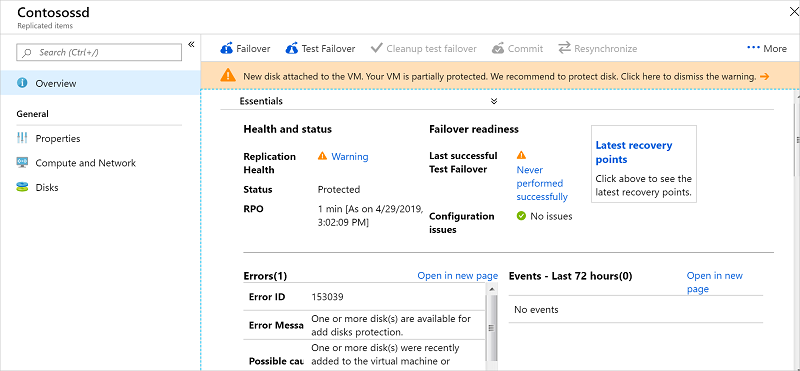
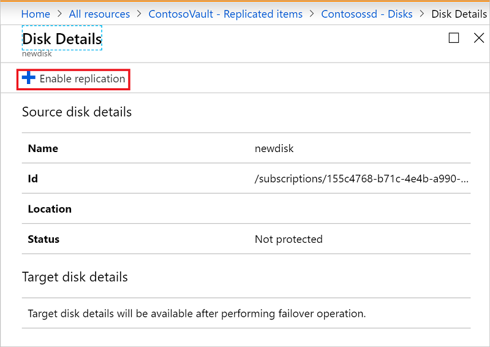

# Enable replication for a disk added to an Azure VM

This article describes how to enable replication for data disks that are added to an Azure VM that's already enabled for disaster recovery to another Azure region, using [Azure Site Recovery](site-recovery-overview.md).

Enabling replication for a disk you add to a VM is supported for Azure VMs with managed disks.

When you add a new disk to an Azure VM that's replicating to another Azure region, the following occurs:

-	Replication health for the VM shows a warning, and a note in the portal informs you that one or more disks are available for protection.
-	If you enable protection for the added disks, the warning will disappear after initial replication of the disk.
-	If you choose not to enable replication for the disk, you can select to dismiss the warning.

## Before you start

This article assumes that you've already set up disaster recovery for the VM to which you're adding the disk. If you haven't, follow the [Azure to Azure disaster recovery tutorial](azure-to-azure-tutorial-enable-replication.md).

## Enable replication for an added disk

To enable replication for an added disk, do the following:

1. In the vault > **Replicated Items**, click the VM to which you added the disk.
2. Click **Disks**, and then select the data disk for which you want to enable replication (these disks have a **Not protected** status).
3.	In **Disk Details**, click **Enable replication**.

    

After the enable replication job runs and the initial replication finishes, the replication health warning for the disk issue is removed.

## Next steps

[Learn more](site-recovery-test-failover-to-azure.md) about running a test failover.
