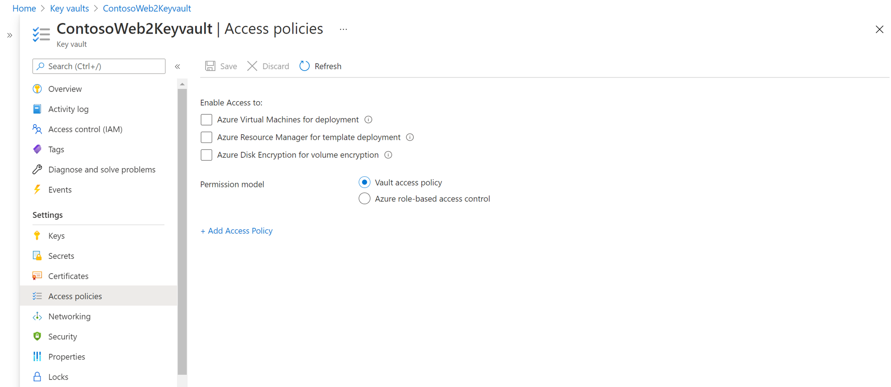
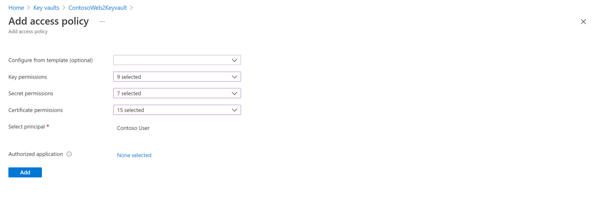
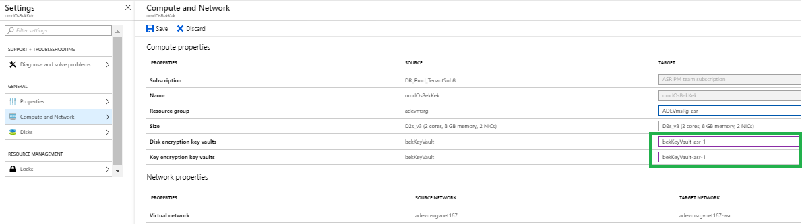

# Replicate Azure Disk Encryption-enabled virtual machines to another Azure region

This article describes how to replicate Azure VMs with Azure Disk Encryption (ADE) enabled, from one Azure region to another.

>[!NOTE]
> Site Recovery currently supports ADE, with and without Azure Active Directory (AAD) for VMs running Windows operating systems. For Linux operating systems, we only support ADE without AAD. Moreover, for machines running ADE 1.1 (without AAD), the VMs must be using managed disks. VMs with unmanaged disks aren't supported. If you switch from ADE 0.1 (with AAD) to 1.1 , you need to disable replication and enable replication for a VM after enabling 1.1.

##  Required user permissions
Site Recovery requires the user to have permissions to create the key vault in the target region and copy keys from source region key vault to the target region key vault.

To enable replication of Disk Encryption-enabled VMs from the Azure portal, the user needs the following permissions on both the **source region and target region** key vaults.

- Key vault permissions
    - List, Create and Get
    
- Key vault secret permissions
    - Secret Management Operations
    	- Get, List and Set
	
- Key vault key permissions (required only if the VMs use key encryption key to encrypt disk encryption keys)
    - Key Management Operations
    	- Get, List and Create
    - Cryptographic Operations
    	- Decrypt and Encrypt

To manage permissions, go to the key vault resource in the portal. Add the required permissions for the user. The following example shows how to enable permissions to the key vault *ContosoWeb2Keyvault*, which is in the source region.

1. Go to **Home** > **Keyvaults** > **ContosoWeb2KeyVault > Access policies**.

   

2. You can see that there are no user permissions. Select **Add new**. Enter the user and permissions information.

   

If the user who's enabling disaster recovery (DR) doesn't have permissions to copy the keys, a security administrator who has appropriate permissions can use the following script to copy the encryption secrets and keys to the target region.

To troubleshoot permissions, refer to [key vault permission issues](#trusted-root-certificates-error-code-151066) later in this article.

>[!NOTE]
>To enable replication of Disk Encryption-enabled VMs from the portal, you need at least "List" permissions on the key vaults, secrets, and keys.

## Copy Disk Encryption keys to the DR region by using the PowerShell script

1. [Open the "CopyKeys" raw script code](https://aka.ms/ade-asr-copy-keys-code).
2. Copy the script to a file, and name it **Copy-keys.ps1**.
3. Open the Windows PowerShell application, and go to the folder where you saved the file.
4. Execute Copy-keys.ps1.
5. Provide Azure credentials to sign in.
6. Select the **Azure subscription** of your VMs.
7. Wait for the resource groups to load, and then select the **Resource group** of your VMs.
8. Select the VMs from the list that's displayed. Only VMs that are enabled for disk encryption are on the list.
9. Select the **Target location**.

    - **Disk encryption key vaults**
    - **Key encryption key vaults**

   By default, Site Recovery creates a new key vault in the target region. The vault's name has an "asr" suffix that's based on the source VM disk encryption keys. If a key vault already exists that was created by Site Recovery, it's reused. Select a different key vault from the list if necessary.

## Enable replication

For this example, the primary Azure region is East Asia, and the secondary region is South East Asia.

1. In the vault, select **+Replicate**.
2. Note the following fields.
    - **Source**: The point of origin of the VMs, which in this case is **Azure**.
    - **Source location**: The Azure region where you want to protect your virtual machines. For this example, the source location is "East Asia."
    - **Deployment model**: The Azure deployment model of the source machines.
    - **Source subscription**: The subscription to which your source virtual machines belong. It can be any subscription that's in the same Azure Active Directory tenant as your recovery services vault.
    - **Resource Group**: The resource group to which your source virtual machines belong. All the VMs in the selected resource group are listed for protection in the next step.

3. In **Virtual Machines** > **Select virtual machines**, select each VM that you want to replicate. You can only select machines for which replication can be enabled. Then, select **OK**.

4. In **Settings**, you can configure the following target-site settings.

    - **Target location**: The location where your source virtual machine data will be replicated. Site Recovery provides a list of suitable target regions based on the selected machine's location. We recommend that you use the same location as the Recovery Services vault's location.
    - **Target subscription**: The target subscription that's used for disaster recovery. By default, the target subscription is the same as the source subscription.
    - **Target resource group**: The resource group to which all your replicated virtual machines belong. By default, Site Recovery creates a new resource group in the target region. The name gets the "asr" suffix. If a resource group already exists that was created by Azure Site Recovery, it's reused. You can also choose to customize it, as shown in the following section. The location of the target resource group can be any Azure region except the region where the source virtual machines are hosted.
    - **Target virtual network**: By default, Site Recovery creates a new virtual network in the target region. The name gets the "asr" suffix. It's mapped to your source network and used for any future protection. [Learn more](site-recovery-network-mapping-azure-to-azure.md) about network mapping.
    - **Target storage accounts (if your source VM doesn't use managed disks)**: By default, Site Recovery creates a new target storage account by mimicking your source VM storage configuration. If a storage account already exists, it's reused.
    - **Replica managed disks (if your source VM uses managed disks)**: Site Recovery creates new replica managed disks in the target region to mirror the source VM's managed disks of the same storage type (standard or premium) as the source VM's managed disks.
    - **Cache storage accounts**: Site Recovery needs an extra storage account called *cache storage* in the source region. All the changes on the source VMs are tracked and sent to the cache storage account. They're then replicated to the target location.
    - **Availability set**: By default, Site Recovery creates a new availability set in the target region. The name has the "asr" suffix. If an availability set that was created by Site Recovery already exists, it's reused.
    - **Disk encryption key vaults**: By default, Site Recovery creates a new key vault in the target region. It has an "asr" suffix that's based on the source VM disk encryption keys. If a key vault that was created by Azure Site Recovery already exists, it's reused.
    - **Key encryption key vaults**: By default, Site Recovery creates a new key vault in the target region. The name has an "asr" suffix that's based on the source VM key encryption keys. If a key vault created by Azure Site Recovery already exists, it's reused.
    - **Replication policy**: Defines the settings for recovery point retention history and app-consistent snapshot frequency. By default, Site Recovery creates a new replication policy with default settings of *24 hours* for recovery point retention and *60 minutes* for app-consistent snapshot frequency.

## Customize target resources

Follow these steps to modify the Site Recovery default target settings.

1. Select **Customize** next to "Target subscription" to modify the default target subscription. Select the subscription from the list of subscriptions that are available in the Azure AD tenant.

2. Select **Customize** next to "Resource group, Network, Storage, and Availability sets" to modify the following default settings:
	- For **Target resource group**, select the resource group from the list of resource groups in the target location of the subscription.
	- For **Target virtual network**, select the network from a list of virtual networks in the target location.
	- For **Availability set**, you can add availability set settings to the VM, if they're part of an availability set in the source region.
	- For **Target Storage accounts**, select the account to use.

2. Select **Customize** next to "Encryption settings" to modify the following default settings:
   - For **Target disk encryption key vault**, select the target disk encryption key vault from the list of key vaults in the target location of the subscription.
   - For **Target key encryption key vault**, select the target key encryption key vault from the list of key vaults in the target location of the subscription.

3. Select **Create target resource** > **Enable Replication**.
4. After the VMs are enabled for replication, you can check the VMs' health status under **Replicated items**.

>[!NOTE]
>During initial replication, the status might take some time to refresh, without apparent progress. Click **Refresh**  to get the latest status.

## Update target VM encryption settings
In the following scenarios, you'll be required to update the target VM encryption settings:
  - You enabled Site Recovery replication on the VM. Later, you enabled disk encryption on the source VM.
  - You enabled Site Recovery replication on the VM. Later, you changed the disk encryption key or key encryption key on the source VM.

You can use [a script](#copy-disk-encryption-keys-to-the-dr-region-by-using-the-powershell-script) to copy the encryption keys to the target region and then update the target encryption settings in **Recovery services vault** > *replicated item* > **Properties** > **Compute and Network**.

## Troubleshoot key vault permission issues during  Azure-to-Azure VM replication

Azure Site Recovery requires at least read permission on the Source region Key vault and write permission on the target region key vault to read the secret and copy it to the target region key vault. 

**Cause 1:** You don't have "GET" permission on the **source region Key vault** to read the keys.  
**How to fix:** Regardless of whether you are a subscription admin or not, it is important that you have get permission on the key vault.

1. Go to source region Key vault which in this example is "ContososourceKeyvault" > **Access policies** 
2. Under **Select Principal** add your user name for example: "dradmin@contoso.com"
3. Under **Key permissions** select GET 
4. Under **Secret Permission** select GET 
5. Save the access policy

**Cause 2:** You don't have required permission on the **Target region Key vault** to write the keys.  

*For example*: You try to replicate a VM that has key vault *ContososourceKeyvault* on a source region.
You have all the permissions on the source region key vault. But during protection, you select the already-created key vault ContosotargetKeyvault, which doesn't have permissions. An error occurs.

Permission required on [target Key vault](#required-user-permissions)

**How to fix:** Go to **Home** > **Keyvaults** > **ContosotargetKeyvault** > **Access policies** and add the appropriate permissions.

## Next steps

[Learn more](site-recovery-test-failover-to-azure.md) about running a test failover.
