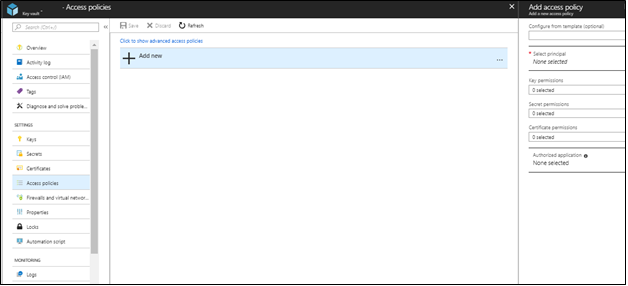

# Replicate Azure disk encryption (ADE) enabled virtual machines to another Azure region

This article describes how to enable replication of Azure disk encryption (ADE) enabled VMs, from one Azure region to another.

>[!NOTE]
>Only Azure VMs running Windows OS and [enabled for encryption with Azure AD app](https://aka.ms/ade-aad-app) are currently supported by Azure Site Recovery.
>

## Required user permissions

To enable replication of ADE VMs from portal, the user should have the below permissions.
- Key vault permissions
    - list
    - Create
    - Get

-	Key vault secret permissions
    - List
    - Create
    - Get

- Key vault key permissions (required only if the VMs use Key Encryption Key to encrypt Disk Encryption keys)
    - List
    - Get
    - Create
    - Encrypt
    - Decrypt

You can manage the permissions by navigating to key vault resource in portal and adding the required permissions to the user.

If the user enabling disaster recovery (DR) does not have the required permissions to copy the keys, the below script can be given to the security administrator with appropriate permissions to copy the encryption secrets and keys to the target region.

>[!NOTE]
>To enable replication of ADE VM from portal, you at least need "List" permissions on the key vaults, secrets and keys
>

## Copy ADE keys to DR region using PowerShell Script

1. Open the 'CopyKeys' raw script code in a browser window by clicking on [this link](https://aka.ms/ade-asr-copy-keys-code).
2. Copy the script to a file and name it 'Copy-keys.ps1'.
2. Open the Windows PowerShell application and go to the folder location where the file exists.
3. Launch 'Copy-keys.ps1'
4. Provide the Azure login credentials.
5. Select the **Azure subscription** of your VMs.
6. Wait for the resource groups to load and then select the **resource group** of your VMs.
7. Select the VMs from the list of VMs displayed. Only VMs enabled with Azure disk encryption are shown in the list.
8. Select the **target location**.
9. **Disk encryption key vaults**: By default, Azure Site Recovery creates a new key vault in the target region with name having "asr" suffix based on the source VM disk encryption keys. In case key vault created by Azure Site Recovery already exists, it is reused. You can select a different key vault from the list if necessary.
10. **Key encryption key vaults**: By default, Azure Site Recovery creates a new key vault in the target region with name having "asr" suffix based on the source VM key encryption keys. In case key vault created by Azure Site Recovery already exists, it is reused. You can select a different key vault from the list if necessary.

## Enable replication

This procedure assumes that the primary Azure region is East Asia, and the secondary region is South East Asia.

1. In the vault, click **+Replicate**.
2. Note the following fields:
    - **Source**: The point of origin of the VMs, which in this case is **Azure**.
    - **Source location**: The Azure region from where you want to protect your virtual machines. For this illustration, the source location is 'East Asia'
    - **Deployment model**: Azure deployment model of the source machines.
    - **Source subscription**: The subscription to which your source virtual machines belong. This can be any subscription within the same Azure Active Directory tenant where your recovery services vault exists.
    - **Resource Group**: The resource group to which your source virtual machines belong. All the VMs under the selected resource group are listed for protection in the next step.

3. In **Virtual Machines > Select virtual machines**, click, and select each VM that you want to replicate. You can only select machines for which replication can be enabled. Then, click **OK**.

4. In **Settings**, you can optionally configure target site settings:

    - **Target Location**: The location where your source virtual machine data will be replicated. Depending upon your selected machines location, Site Recovery will provide you the list of suitable target regions. We recommend that you keep the target location the same as the Recovery Services vault location.
    - **Target subscription**: The target subscription used for disaster recovery. By default, the target subscription will be same as the source subscription.
    - **Target resource group**: The resource group to which all your replicated virtual machines belong. By default Azure Site Recovery creates a new resource group in the target region with name having "asr" suffix. In case resource group created by Azure Site Recovery already exists, it is reused. You can also choose to customize it as shown in the section below. The location of the target resource group can be any Azure region except the region in which the source virtual machines are hosted.
    - **Target Virtual Network**: By default, Site Recovery creates a new virtual network in the target region with name having "asr" suffix. This is mapped to your source network, and used for any future protection. [Learn more](site-recovery-network-mapping-azure-to-azure.md) about network mapping.
    - **Target Storage accounts (If your source VM does not use managed disks)**: By default, Site Recovery creates a new target storage account mimicking your source VM storage configuration. In case storage account already exists, it is reused.
    - **Replica managed disks (If your source VM uses managed disks)**: Site Recovery creates new replica managed disks in the target region to mirror the source VM's managed disks with the same storage type (Standard or premium) as the source VM's managed disk.
    - **Cache Storage accounts**: Site Recovery needs extra storage account called cache storage in the source region. All the changes happening on the source VMs are tracked and sent to cache storage account before replicating those to the target location.
    - **Availability set**: By default, Azure Site Recovery creates a new availability set in the target region with name having "asr" suffix. In case availability set created by Azure Site Recovery already exists, it is reused.
    - **Disk encryption key vaults**: By default, Azure Site Recovery creates a new key vault in the target region with name having "asr" suffix based on the source VM disk encryption keys. In case key vault created by Azure Site Recovery already exists, it is reused.
    - **Key encryption key vaults**: By default, Azure Site Recovery creates a new key vault in the target region with name having "asr" suffix based on the source VM key encryption keys. In case key vault created by Azure Site Recovery already exists, it is reused.
    - **Replication Policy**: It defines the settings for recovery point retention history and app consistent snapshot frequency. By default, Azure Site Recovery creates a new replication policy with default settings of ‘24 hours’ for recovery point retention and ’60 minutes’ for app consistent snapshot frequency.

## Customize target resources

You can modify the default target settings used by Site Recovery.

1. Click **Customize:** next to 'Target subscription' to modify the default target subscription. Select the subscription from the list of all the subscriptions available in the same Azure Active Directory (AAD) tenant.

2. Click **Customize:** next to 'Resource group, Storage, Network, and Availability sets to modify the below default settings:
	- In **Target resource group**, select the resource group from the list of all the resource groups in the target location of the subscription.
	- In **Target virtual network**, select the network from a list of all the virtual network in the target location.
	- In **Availability set**, you can add availability set settings to the VM, if they're part of an availability set in the source region.
	- In **Target Storage accounts**, select the account you want to use.

2. Click **Customize:** next to 'Encryption settings' to modify the below default settings:
	- In **Target disk encryption key vault**, select the target disk encryption key vault from the list of all the key vaults in the target location of the subscription.
  - In **Target key encryption key vault**, select the target key encryption key vault from the list of all the key vaults in the target location of the subscription.

3. Click **Create target resource** > **Enable Replication**.
4. After the VMs are enabled for replication, you can check the status of VM health under **Replicated items**

>[!NOTE]
>During initial replication the status might take some time to refresh, without progress. Click the **Refresh** button, to get the latest status.
>

## Update target VM encryption settings
In the below scenarios, you will be required to update the target VM encryption settings.
  - You enabled Site recovery replication on the VM and enabled Azure Disk Encryption (ADE) on the source VM at a later date
  - You enabled Site recovery replication on the VM and changed the disk encryption key and/or key encryption key on the source VM at a later date

You can use [the script](#copy-ade-keys-to-dr-region-using-powershell-script) to copy the encryption keys to target region and then update the target encryption settings in **Recovery services vault -> replicated item -> Properties -> Compute and Network.**

## Next steps

[Learn more](site-recovery-test-failover-to-azure.md) about running a test failover.
