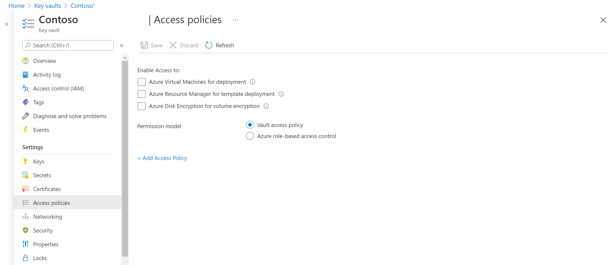
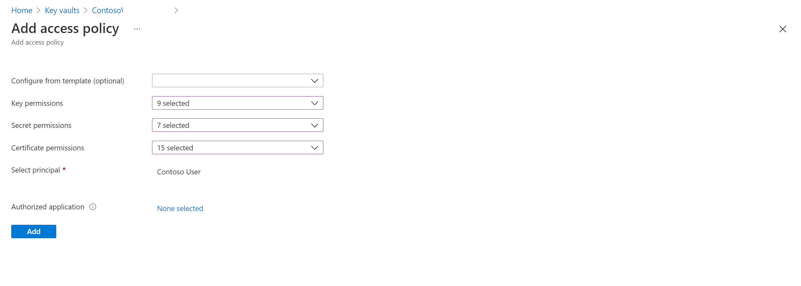

# Replicate Azure disk encryption-enabled virtual machines to another Azure region

This article describes how to enable replication of Azure disk encryption (ADE)-enabled VMs from one Azure region to another.

>[!NOTE]
>Only Azure VMs running a Windows OS and [enabled for encryption with [Azure Active Directory](https://aka.ms/ade-aad-app) are currently supported by Azure Site Recovery.>

## Required user permissions
Site Recovery requires the user to have a permission to create the key vault in the target region and copy keys to the region.

To enable replication of ADE VMs from the portal, the user needs the following permissions:

- Key vault permissions
    - List
    - Create
    - Get

-	Key vault secret permissions
    - List
    - Create
    - Get

- Key vault key permissions (required only if the VMs use Key Encryption Key to encrypt Disk Encryption keys)
    - List
    - Get
    - Create
    - Encrypt
    - Decrypt

To manage permissions, go to the key vault resource in the portal. Aadd the required permissions to the user. The following example shows how to enable for the key vault "ContosoWeb2Keyvault", which is in the source region.

-  Go to **Home** > **Keyvaults** > **ContosoWeb2KeyVault > Access policies**.

   

- You can see there are no user persimmons. Select **Add new**. Enter the user and permissions info.

If the user who is enabling disaster recovery (DR) doesn't have permissions to copy the keys, a security administrator who has appropriate permissions can use the following script to copy the encryption secrets and keys to the target region.

To troubleshoot, refer to [key vault permission issues](#trusted-root-certificates-error-code-151066) later in this article.
>[!NOTE]
>To enable replication of ADE VM from the portal, you at least need "List" permissions on the key vaults, secrets, and keys.

## Copy ADE keys to DR region by using PowerShell script

1. [Open the "CopyKeys" raw script code](https://aka.ms/ade-asr-copy-keys-code).
2. Copy the script to a file and name it **Copy-keys.ps1**.
3. Open the Windows PowerShell application, and go to the folder location where you saved the file.
4. Launch Copy-keys.ps1.
5. Provide Azure credentials to sign in.
6. Select the **Azure subscription** of your VMs.
7. Wait for the resource groups to load, and then select the **Resource group** of your VMs.
8. Select the VMs from the list of VMs displayed. Only VMs that are enabled with Azure disk encryption are on the list.
9. Select the **Target location**.

    - **Disk encryption key vaults**
    - **Key encryption key vaults**

   By default, Site Recovery creates a new key vault in the target region. The vault's name has an "Site Recovery" suffix based on the source VM disk encryption keys. If a key vault created by Site Recovery already exists, it's reused. Select a different key vault from the list if necessary.

## Enable replication

This procedure assumes that the primary Azure region is East Asia, and the secondary region is South East Asia.

1. In the vault, select **+Replicate**.
2. Note the following fields:
    - **Source**: The point of origin of the VMs, which in this case is **Azure**.
    - **Source location**: The Azure region from where you want to protect your virtual machines. For this example, the source location is "East Asia."
    - **Deployment model**: Azure deployment model of the source machines.
    - **Source subscription**: The subscription to which your source virtual machines belong. This can be any subscription within the same Azure Active Directory tenant where your recovery services vault exists.
    - **Resource Group**: The resource group to which your source virtual machines belong. All the VMs under the selected resource group are listed for protection in the next step.

3. In **Virtual Machines** > **Select virtual machines**, select each VM that you want to replicate. You can only select machines for which replication can be enabled. Then, select **OK**.

4. In **Settings**, you have the option to configure target site settings:

    - **Target Location**: The location where your source virtual machine data will be replicated. Depending on your selected machine's location, Site Recovery a list of suitable target regions. We recommend that you use the same location as the Recovery Services vault location.
    - **Target subscription**: The target subscription used for disaster recovery. By default, the target subscription is the same as the source subscription.
    - **Target resource group**: The resource group to which all your replicated virtual machines belong. By default, Site Recovery creates a new resource group in the target region. The name has the "asr" suffix. If a resource group created by Azure Site Recovery already exists, it is reused. You can also choose to customize it as shown in the following section. The location of the target resource group can be any Azure region except the region in which the source virtual machines are hosted.
    - **Target Virtual Network**: By default, Site Recovery creates a new virtual network in the target region. The name has the "asr" suffix. This is mapped to your source network and used for any future protection. [Learn more](site-recovery-network-mapping-azure-to-azure.md) about network mapping.
    - **Target Storage accounts (If your source VM doesn't use managed disks)**: By default, Site Recovery creates a new target storage account by mimicking your source VM storage configuration. If the storage account already exists, it is reused.
    - **Replica managed disks (If your source VM uses managed disks)**: Site Recovery creates new replica managed disks in the target region to mirror the source VM's managed disks of the same storage type (Standard or Premium) as the source VM's managed disk.
    - **Cache Storage accounts**: Site Recovery needs an extra storage account called cache storage in the source region. All the changes happening on the source VMs are tracked and sent to the cache storage account before they are replicated to the target location.
    - **Availability set**: By default, Site Recovery creates a new availability set in the target region. The name has the "asr" suffix. If an availability set created by Site Recovery already exists, it is reused.
    - **Disk encryption key vaults**: By default, Site Recovery creates a new key vault in the target region. Its has an "asr" suffix based on the source VM disk encryption keys. If a key vault created by Azure Site Recovery already exists, it is reused.
    - **Key encryption key vaults**: By default, Site Recovery creates a new key vault in the target region. The names has an "asr" suffix based on the source VM key encryption keys. If a key vault created by Azure Site Recovery already exists, it is reused.
    - **Replication Policy**: It defines the settings for recovery point retention history and app-consistent snapshot frequency. By default, Site Recovery creates a new replication policy with default settings of *24 hours* for recovery point retention and *60 minutes* for app-consistent snapshot frequency.

## Customize target resources

You can modify the default target settings used by Site Recovery.

1. Select **Customize** next to "Target subscription" to modify the default target subscription. Select the subscription from the list of all the available available in the Azure Active Directory (AAD) tenant.

2. Select **Customize** next to "Resource group, Network, Storage and Availability sets" to modify the following default settings:
	- For **Target resource group**, select the resource group from the list of all the resource groups in the target location of the subscription.
	- For **Target virtual network**, select the network from a list of all the virtual networks in the target location.
	- For **Availability set**, you can add availability set settings to the VM, if they're part of an availability set in the source region.
	- For **Target Storage accounts**, select the account  to use.

2. Select **Customize** next to "Encryption settings" to modify the following default settings:
   - For **Target disk encryption key vault**, select the target disk encryption key vault from the list of the key vaults in the target location of the subscription.
     - For **Target key encryption key vault**, select the target key encryption key vault from the list of the key vaults in the target location of the subscription.

3. Select **Create target resource** > **Enable Replication**.
4. After the VMs are enabled for replication, you can check the status of VM health under **Replicated items**

>[!NOTE]
>During initial replication the status might take some time to refresh, without apparent progress. Click **Refresh**  to get the latest status.>

## Update target VM encryption settings
In these scenarios, you'll be required to update the target VM encryption settings:
  - You enabled Site Recovery replication on the VM. Later, you enabled Azure Disk Encryption (ADE) on the source VM.
  - You enabled Site Recovery replication on the VM. Later, you changed the disk encryption key or key encryption key on the source VM.

You can use [a script](#copy-ade-keys-to-dr-region-using-powershell-script) to copy the encryption keys to the target region and then update the target encryption settings in **Recovery services vault -> replicated item -> Properties -> Compute and Network.**

## Troubleshoot Key vault permission issues during  Azure-to-Azure VM replication

**Cause 1:** You may have selected an already created key vault from the target region that doesn't have the required permissions. This is instead of Site Recovery creating it. Make sure that the key vault has the require permissions, as described earlier. 
*For example*: You try to replicate a VM that which has key vault *ContososourceKeyvault* on a source region.
You have all the permissions on the source region key vault but, during protection you select the already-created key vault ContosotargetKeyvault, which doesn't have permissions. You experience an error. 
**How to fix:** Got to **Home** > **Keyvaults** > **ContososourceKeyvault** > **Access policies** and add the appropriate permissions.

**Cause 2:** You may have selected an already created key vault from the Target region that doesn't have decrypt-encrypt permissions. This is instead of letting Site Recovery create one. Make sure that the user has decrypt-encrypt permissions in case you are encrypting the key also on the source region. 
*For example*: You try to replicate a VM that has a key vault *ContososourceKeyvault* on the source region. You have all the necssary permission on the source region key vault. But during protection, you select the already-created key vault ContosotargetKeyvault, which doesn't has permission to decrypt and encrypt. 
**How to fix:** Got to **Home** > **Keyvaults** > **ContososourceKeyvault** > **Access policies**. Add permissions under **Key permissions** > **Cryptographic Operations**.

## Next steps

[Learn more](site-recovery-test-failover-to-azure.md) about running a test failover.
