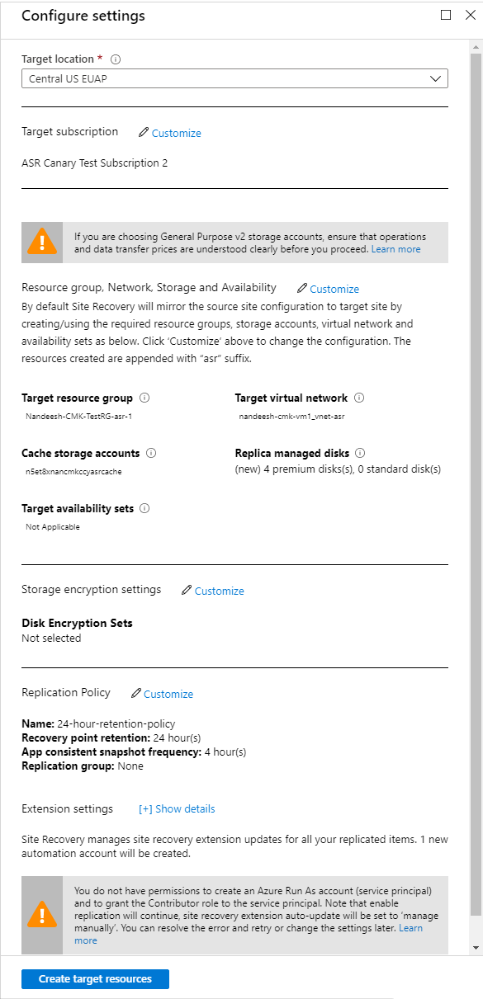
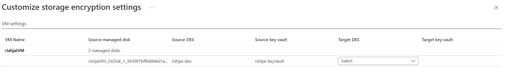

# Replicate machines with Customer-Managed Keys (CMK) enabled disks

This article describes how to replicate Azure VMs with Customer-Managed Keys (CMK) enabled managed disks, from one Azure region to another.

## Prerequisite
You must create the Disk Encryption set(s) in the target region for the target subscription before enabling replication for your virtual machines that have CMK-enabled managed disks.

## Enable replication

For this example, the primary Azure region is East Asia, and the secondary region is South East Asia.

1. In the vault, select **+Replicate**.
2. Note the following fields.
    - **Source**: The point of origin of the VMs, which in this case is **Azure**.
    - **Source location**: The Azure region where you want to protect your virtual machines. For this example, the source location is "East Asia."
    - **Deployment model**: The Azure deployment model of the source machines.
    - **Source subscription**: The subscription to which your source virtual machines belong. It can be any subscription that's in the same Azure Active Directory tenant as your recovery services vault.
    - **Resource Group**: The resource group to which your source virtual machines belong. All the VMs in the selected resource group are listed for protection in the next step.

3. In **Virtual Machines** > **Select virtual machines**, select each VM that you want to replicate. You can only select machines for which replication can be enabled. Then, select **OK**.

4. In **Settings**, you can configure the following target-site settings.

    - **Target location**: The location where your source virtual machine data will be replicated. Site Recovery provides a list of suitable target regions based on the selected machine's location. We recommend that you use the same location as the Recovery Services vault's location.
    - **Target subscription**: The target subscription that's used for disaster recovery. By default, the target subscription is the same as the source subscription.
    - **Target resource group**: The resource group to which all your replicated virtual machines belong. By default, Site Recovery creates a new resource group in the target region. The name gets the `asr` suffix. If a resource group already exists that was created by Azure Site Recovery, it's reused. You can also choose to customize it, as shown in the following section. The location of the target resource group can be any Azure region except the region where the source virtual machines are hosted.
    - **Target virtual network**: By default, Site Recovery creates a new virtual network in the target region. The name gets the `asr` suffix. It's mapped to your source network and used for any future protection. [Learn more](site-recovery-network-mapping-azure-to-azure.md) about network mapping.
    - **Target storage accounts (if your source VM doesn't use managed disks)**: By default, Site Recovery creates a new target storage account by mimicking your source VM storage configuration. If a storage account already exists, it's reused.
    - **Replica managed disks (if your source VM uses managed disks)**: Site Recovery creates new replica managed disks in the target region to mirror the source VM's managed disks of the same storage type (standard or premium) as the source VM's managed disks.
    - **Cache storage accounts**: Site Recovery needs an extra storage account called *cache storage* in the source region. All the changes on the source VMs are tracked and sent to the cache storage account. They're then replicated to the target location.
    - **Availability set**: By default, Site Recovery creates a new availability set in the target region. The name has the `asr` suffix. If an availability set that was created by Site Recovery already exists, it's reused.
    - **Disk encryption sets (DES)**: Site Recovery needs the disk encryption set(s) to be used for replica and target managed disks. You must pre-create DES in the target subscription and the target region before enabling the replication. By default, a DES is not selected. You must click on ‘Customize’ to choose a DES per source disk.
    - **Replication policy**: Defines the settings for recovery point retention history and app-consistent snapshot frequency. By default, Site Recovery creates a new replication policy with default settings of *24 hours* for recovery point retention and *60 minutes* for app-consistent snapshot frequency.

    

## Customize target resources

Follow these steps to modify the Site Recovery default target settings.

1. Select **Customize** next to "Target subscription" to modify the default target subscription. Select the subscription from the list of subscriptions that are available in the Azure AD tenant.

2. Select **Customize** next to "Resource group, Network, Storage, and Availability sets" to modify the following default settings:
	- For **Target resource group**, select the resource group from the list of resource groups in the target location of the subscription.
	- For **Target virtual network**, select the network from a list of virtual networks in the target location.
	- For **Availability set**, you can add availability set settings to the VM, if they're part of an availability set in the source region.
	- For **Target Storage accounts**, select the account to use.

3. Select **Customize** next to "Storage encryption settings" to select the target DES for every customer-managed key (CMK) enabled source managed disk. At the time of selection, you will also be able to see which target key vault the DES is associated with.

4. Select **Create target resource** > **Enable Replication**.
5. After the VMs are enabled for replication, you can check the VMs' health status under **Replicated items**.

>[!NOTE]
>During initial replication, the status might take some time to refresh, without apparent progress. Click **Refresh**  to get the latest status.

## FAQs

* I have enabled CMK on an existing replicated item, how can I ensure that CMK is applied on the target region as well?

    You can find out the name of the replica managed disk (created by Azure Site Recovery in the target region) and attach DES to this replica disk. However, you will not be able to see the DES details in the Disks blade once you attach it. Alternatively, you can choose to disable the replication of the VM and enable it again. It will ensure you see DES and key vault details in the Disks blade for the replicated item.

* I have added a new CMK enabled disk to the replicated item. How can I replicate this disk with Azure Site Recovery?

    Addition of a new CMK enabled disk to an existing replicated item is not supported. Disable the replication and enable the replication again for the virtual machine.

