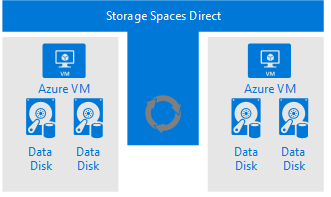
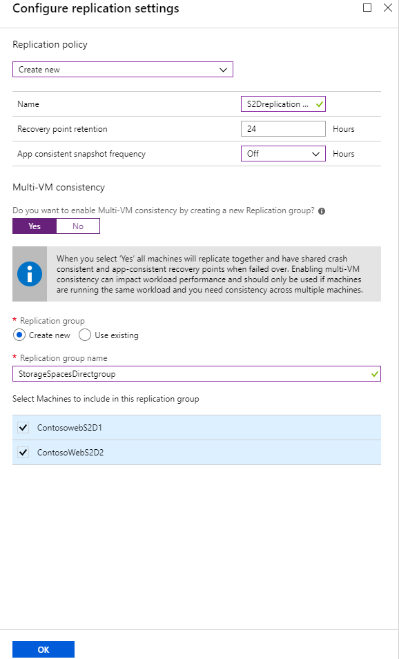
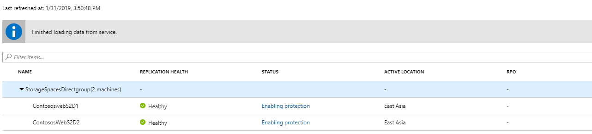
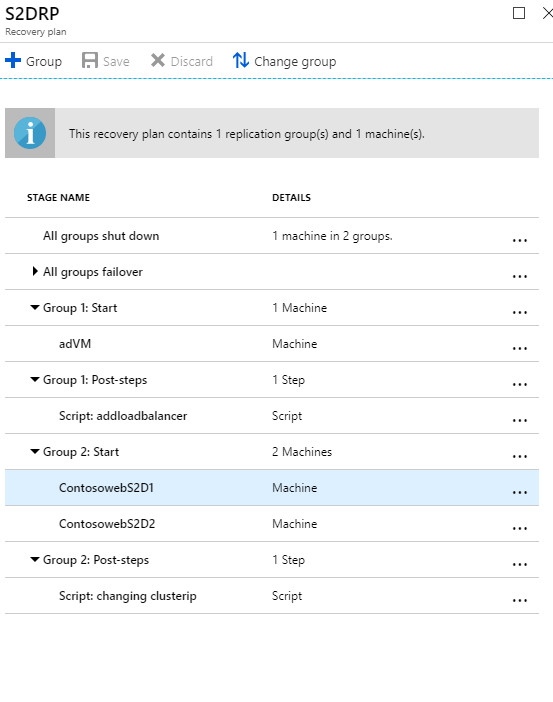

# Replicate Azure VMs running Storage Spaces Direct to another region

This article describes how to enable disaster recovery of Azure VMs running storage spaces direct.

>[!NOTE]
>Only crash consistent recovery points are supported for storage spaces direct clusters.
>

[Storage spaces direct (S2D)](https://docs.microsoft.com/windows-server/storage/storage-spaces/deploy-storage-spaces-direct) is software-defined storage, which provides a way to create [guest clusters](https://blogs.msdn.microsoft.com/clustering/2017/02/14/deploying-an-iaas-vm-guest-clusters-in-microsoft-azure) on Azure.  A guest cluster in Microsoft Azure is a failover cluster comprised of IaaS VMs. It allows hosted VM workloads to fail over across guest clusters, achieving higher availability SLA for applications, than a single Azure VM can provide. It is useful in scenarios where a VM hosts a critical application like SQL or scale-out file server.

## Disaster recovery with storage spaces direct

In a typical scenario, you may have virtual machines guest cluster on Azure for higher resiliency of your application like Scale out file server. While this can provide your application higher availability, you would like to protect these applications using Site Recovery for any region level failure. Site Recovery replicates the data from one region to another Azure region and brings up the cluster in disaster recovery region in an event of failover.

Below diagram shows a two-node Azure VM failover cluster using storage spaces direct.

- Two Azure virtual machines in a Windows Failover Cluster and each virtual machine have two or more data disks.
- S2D synchronizes the data on the data disk and presents the synchronized storage as a storage pool.
- The storage pool presents as a cluster shared volume (CSV) to the failover cluster.
- The Failover cluster uses the CSV for the data drives.

**Disaster Recovery Considerations**

1. When you are setting up [cloud witness](https://docs.microsoft.com/windows-server/failover-clustering/deploy-cloud-witness#CloudWitnessSetUp) for the cluster, keep witness in the Disaster Recovery region.
2. If you are going to fail over the virtual machines to the subnet on the DR region which is different from the source region then cluster IP address needs to be change after failover.  To change IP of the cluster you need to use the Site Recovery [recovery plan script.](https://docs.microsoft.com/azure/site-recovery/site-recovery-runbook-automation) 
[Sample script](https://github.com/krnese/azure-quickstart-templates/blob/master/asr-automation-recovery/scripts/ASR-Wordpress-ChangeMysqlConfig.ps1) to execute command inside VM using custom script extension 

### Enabling Site Recovery for S2D cluster:

1. Inside the recovery services vault, click “+replicate”
1. Select all the nodes in the cluster and make them part of a [Multi-VM consistency group](https://docs.microsoft.com/azure/site-recovery/azure-to-azure-common-questions#multi-vm-consistency)
1. Select replication policy with application consistency off* (only crash consistency support is available)
1. Enable the replication

   

2. Go to replicated items and you can see both the virtual machine status.
3. Both the virtual machines are getting protected and are also shown as part of multi-VM consistency group.

   

## Creating a recovery plan
A recovery plan supports the sequencing of various tiers in a multi-tier application during a failover. Sequencing helps maintain application consistency. When you create a recovery plan for a multi-tier web application, complete the steps described in [Create a recovery plan by using Site Recovery](site-recovery-create-recovery-plans.md).

### Adding virtual machines to failover groups

1.	Create a recovery plan by adding the virtual machines.
2.	Click on 'Customize' to group the VMs. By default, all VMs are part of 'Group 1'.

### Add scripts to the recovery plan
For your applications to function correctly, you might need to do some operations on the Azure virtual machines after the failover or during a test failover. You can automate some post-failover operations. For example, here we are attaching load balancer and changing cluster IP.

### Failover of the virtual machines 
Both the nodes of the VMs need to be fail over using the Site Recovery [recovery plan](https://docs.microsoft.com/azure/site-recovery/site-recovery-create-recovery-plans) 

## Run a test failover
1.	In the Azure portal, select your Recovery Services vault.
2.	Select the recovery plan that you created.
3.	Select **Test Failover**.
4.  To start the test failover process, select the recovery point and the Azure virtual network.
5.	When the secondary environment is up, perform validations.
6.	When validations are complete, to clean the failover environment, select **Cleanup test failover**.

For more information, see [Test failover to Azure in Site Recovery](site-recovery-test-failover-to-azure.md).

## Run a failover

1.	In the Azure portal, select your Recovery Services vault.
2.	Select the recovery plan that you created for SAP applications.
3.	Select **Failover**.
4.	To start the failover process, select the recovery point.

For more information, see [Failover in Site Recovery](site-recovery-failover.md).
## Next steps

[Learn more](https://docs.microsoft.com/azure/site-recovery/azure-to-azure-tutorial-failover-failback) about running failback.
