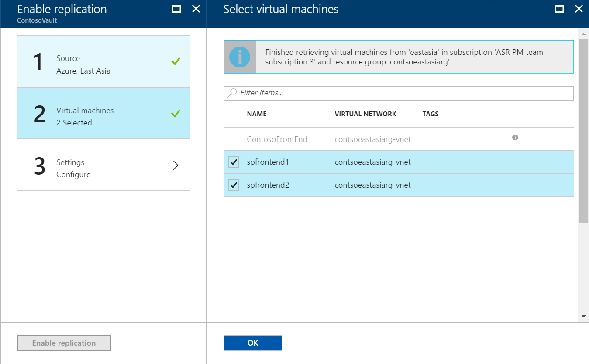
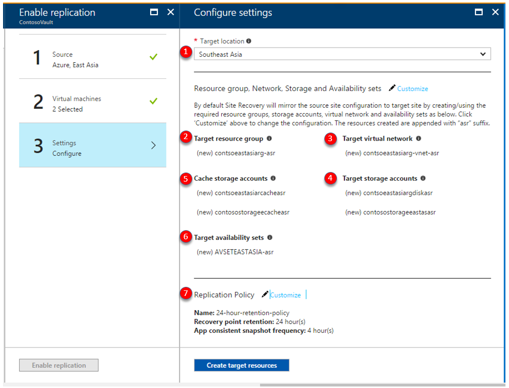
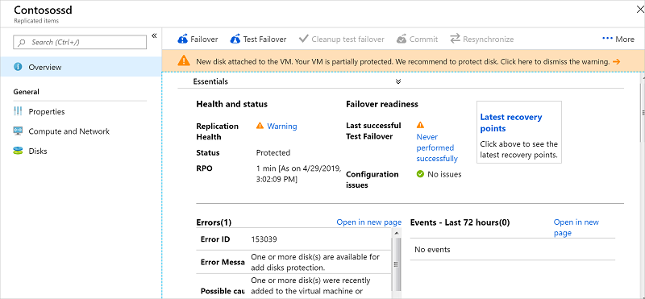
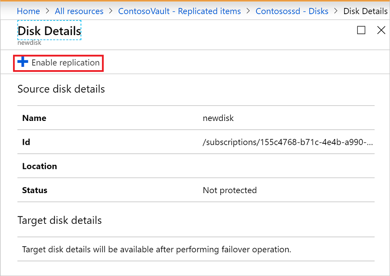
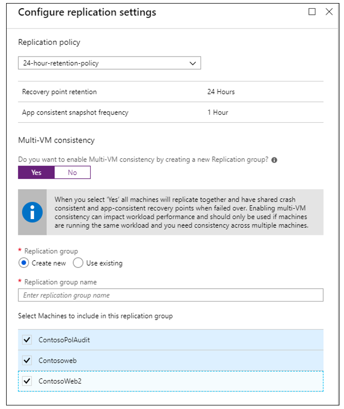

# Replicate Azure VMs to another Azure region

This article describes how to enable replication of Azure VMs, from one Azure region to another.

## Before you start

This article assumes that you've prepared for Site Recovery deployment, as described in the [Azure to Azure disaster recovery tutorial](azure-to-azure-tutorial-enable-replication.md).

Prerequisites should be in place, and you should have created a Recovery Services vault.

## Enable replication

Enable replication. This procedure assumes that the primary Azure region is East Asia, and the secondary region is South East Asia.

1. In the vault, click **+Replicate**.
2. Note the following fields:
   - **Source**: The point of origin of the VMs, which in this case is **Azure**.
   - **Source location**: The Azure region from where you want to protect your VMs. For this illustration, the source location is 'East Asia'
   - **Deployment model**: Azure deployment model of the source machines.
   - **Source subscription**: The subscription to which your source VMs belong. This can be any subscription within the same Azure Active Directory tenant where your recovery services vault exists.
   - **Resource Group**: The resource group to which your source virtual machines belong. All the VMs under the selected resource group are listed for protection in the next step.

     

3. In **Virtual Machines > Select virtual machines**, click and select each VM that you want to replicate. You can only select machines for which replication can be enabled. Then click **OK**.
   	

4. In **Settings**, you can optionally configure target site settings:

   - **Target Location**: The location where your source virtual machine data will be replicated. Depending upon your selected machines location, Site Recovery will provide you the list of suitable target regions. We recommend that you keep the target location the same as the Recovery Services vault location.
   - **Target subscription**: The target subscription used for disaster recovery. By default, the target subscription will be same as the source subscription.
   - **Target resource group**: The resource group to which all your replicated virtual machines belong.
       - By default Site Recovery creates a new resource group in the target region with an "asr" suffix in the name.
       - If the resource group created by Site Recovery already exists, it is reused.
       - You can customize the resource group settings.
       - The location of the target resource group can be any Azure region, except the region in which the source VMs are hosted.
   - **Target virtual network**: By default, Site Recovery creates a new virtual network in the target region with an "asr" suffix in the name. This is mapped to your source network, and used for any future protection. [Learn more](site-recovery-network-mapping-azure-to-azure.md) about network mapping.
   - **Target storage accounts (source VM doesn't use managed disks)**: By default, Site Recovery creates a new target storage account mimicking your source VM storage configuration. In case storage account already exists, it is reused.
   - **Replica-managed disks (source VM uses managed disks)**: Site Recovery creates new replica-managed disks in the target region to mirror the source VM's managed disks with the same storage type (Standard or premium) as the source VM's managed disk.
   - **Cache Storage accounts**: Site Recovery needs extra storage account called cache storage in the source region. All the changes happening on the source VMs are tracked and sent to cache storage account before replicating those to the target location. This storage account should be Standard.
   - **Target availability sets**: By default, Site Recovery creates a new availability set in the target region with the "asr" suffix in the name, for VMs that are part of an availability set in the source region. If the availability set created by Site Recovery already exists, it is reused.
   - **Target availability zones**: By default, Site Recovery assigns the same zone number as the source region in target region if the target region supports availability zones.

     If the target region does not support availability zones, the target VMs are configured as single instances by default. If required, you can configure such VMs to be part of availability sets in target region by clicking 'Customize'.

     >[!NOTE]
     >You cannot change the availability type - single instance, availability set or availability zone, after you enable replication. You need to disable and enable replication to change the availability type.
     >
    
   - **Replication Policy**: It defines the settings for recovery point retention history and app consistent snapshot frequency. By default, Azure Site Recovery creates a new replication policy with default settings of ‘24 hours’ for recovery point retention and ’4 hours’ for app consistent snapshot frequency.

     

### Enable replication for added disks

If you add disks to an Azure VM for which replication is enabled, the following occurs:
-	Replication health for the VM shows a warning, and a note informs telling you that one or more disks are available for protection.
-	If you enable protection for the added disks, the warning will disappear after the initial replication of the disk.
-	If you choose not to enable replication for the disk, you can select to dismiss the warning.

    
    

To enable replication for an added disk, do the following:

1.	In the vault > **Replicated Items**, click the VM to which you added the disk.
2.	Click **Disks**, and then select the data disk for which you want to enable replication (these disks have a **Not protected** status).
3.	In **Disk Details**, click **Enable replication**.

    

After the enable replication job runs, and the initial replication finishes, the replication health warning for the disk issue is removed.

  
## Customize target resources

You can modify the default target settings used by Site Recovery.

1. Click **Customize:** next to 'Target subscription' to modify the default target subscription. Select the subscription from the list of all the subscriptions available in the same Azure Active Directory (AAD) tenant.

2. Click **Customize:** to modify default settings:
	- In **Target resource group**, select the resource group from the list of all the resource groups in the target location of the subscription.
	- In **Target virtual network**, select the network from a list of all the virtual network in the target location.
	- In **Availability set**, you can add availability set settings to the VM, if they're part of an availability set in the source region.
	- In **Target Storage accounts**, select the account you want to use.

		
3. Click **Customize:** to modify replication settings.
4. In **Multi-VM consistency**, select the VMs that you want to replicate together.
    - All the machines in a replication group will have shared crash consistent and app-consistent recovery points when failed over.
    - Enabling multi-VM consistency can impact workload performance (as it is CPU intensive). It should only be enabled if machines are running the same workload, and you need consistency across multiple machines.
    - For example, if an application has 2 SQL Server virtual machines and two web servers, then you should add only the SQL Server VMs to a replication group.
    - You can choose to have a maximum of 16 VMs in a replication group.
    - If you enable multi-VM consistency, machines in the replication group communicate with each other over port 20004.
    - Ensure there's no firewall appliance blocking the internal communication between the VMs over port 20004.
    - If you want Linux VMs to be part of a replication group, ensure the outbound traffic on port 20004 is manually opened according to guidance for the specific Linux version.

    
5. Click **Create target resource** > **Enable Replication**.
6. After the VMs are enabled for replication, you can check the status of VM health under **Replicated items**

>[!NOTE]
>During initial replication the status might take some time to refresh, without progress. Click the **Refresh** button, to get the latest status.
>

## Next steps

[Learn more](site-recovery-test-failover-to-azure.md) about running a test failover.
