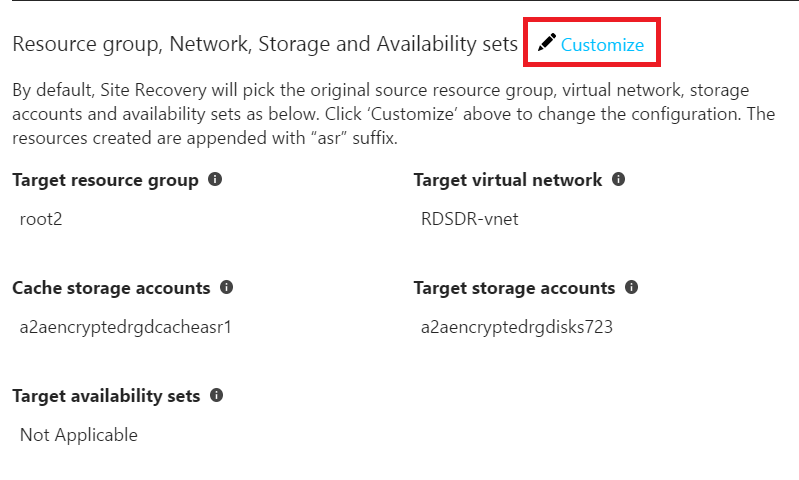
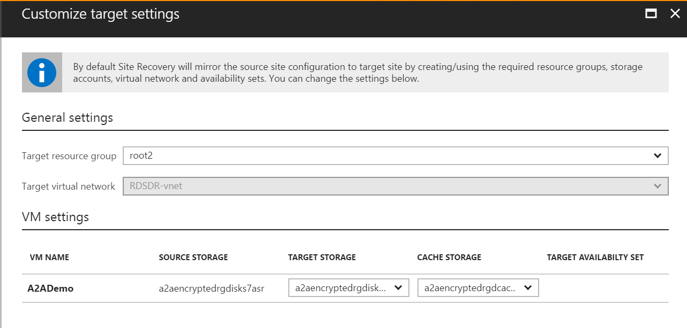

# Reprotect failed over Azure VMs to the primary region

When you [fail over](site-recovery-failover.md) Azure VMs from one region to another using [Azure Site Recovery](site-recovery-overview.md), the VMs boot up in the secondary region, in an **unprotected** state. If you want to fail back the VMs to the primary region, do the following tasks:

1. Reprotect the VMs in the secondary region, so that they start to replicate to the primary region.
1. After reprotection completes and the VMs are replicating, you can fail over from the secondary to primary region.

## Prerequisites

- The VM failover from the primary to secondary region must be committed.
- The primary target site should be available, and you should be able to access or create resources in that region.

## Reprotect a VM

1. In **Vault** > **Replicated items**, right-click the failed over VM, and select **Re-Protect**. The reprotection direction should show from secondary to primary.

   

1. Review the resource group, network, storage, and availability sets. Then click **OK**. If there are any resources marked as new, they're created as part of the reprotection process.
1. The reprotection job seeds the target site with the latest data. After the job finishes, delta replication takes place. Then, you can fail over back to the primary site. You can select the storage account or the network you want to use during reprotect, using the customize option.

   

### Customize reprotect settings

You can customize the following properties of the target VM during reprotection.

|Property |Notes  |
|---------|---------|
|Target resource group | Modify the target resource group in which the VM is created. As the part of reprotection, the target VM is deleted. You can choose a new resource group under which to create the VM after failover. |
|Target virtual network | The target network can't be changed during the reprotect job. To change the network, redo the network mapping. |
|Target storage (Secondary VM doesn't use managed disks) | You can change the storage account that the VM uses after failover. |
|Replica managed disks (Secondary VM uses managed disks) | Site Recovery creates replica managed disks in the primary region to mirror the secondary VM's managed disks. |
|Cache storage | You can specify a cache storage account to be used during replication. By default, a new cache storage account is created, if it doesn't exist. |
|Availability set | If the VM in the secondary region is part of an availability set, you can choose an availability set for the target VM in the primary region. By default, Site Recovery tries to find the existing availability set in the primary region, and use it. During customization, you can specify a new availability set. |

### What happens during reprotection?

By default, the following occurs:

1. A cache storage account is created in the region where the failed over VM is running.
1. If the target storage account (the original storage account in the primary region) doesn't exist, a new one is created. The assigned storage account name is the name of the storage account used by the secondary VM, suffixed with `asr`.
1. If your VM uses managed disks, replica managed disks are created in the primary region to store the data replicated from the secondary VM's disks.
1. If the target availability set doesn't exist, a new one is created as part of the reprotect job if necessary. If you've customized the reprotection settings, then the selected set is used.

When you trigger a reprotect job, and the target VM exists, the following occurs:

1. The target side VM is turned off if it's running.
1. If the VM is using managed disks, a copy of the original disk is created with an `-ASRReplica` suffix. The original disks are deleted. The `-ASRReplica` copies are used for replication.
1. If the VM is using unmanaged disks, the target VM's data disks are detached and used for replication. A copy of the OS disk is created and attached on the VM. The original OS disk is detached and used for replication.
1. Only changes between the source disk and the target disk are synchronized. The differentials are computed by comparing both the disks and then transferred. Check below to find the estimated time to complete the reprotection.
1. After the synchronization completes, the delta replication begins, and a recovery point is created in line with the replication policy.

When you trigger a reprotect job, and the target VM and disks don't exist, the following occurs:

1. If the VM is using managed disks, replica disks are created with `-ASRReplica` suffix. The `-ASRReplica` copies are used for replication.
1. If the VM is using unmanaged disks, replica disks are created in the target storage account.
1. The entire disks are copied from the failed over region to the new target region.
1. After the synchronization completes, the delta replication begins, and a recovery point is created in line with the replication policy.

#### Estimated time to do the reprotection

In most cases, Azure Site Recovery doesn't replicate the complete data to the source region.
The following conditions determine how much data is replicated:

1. If the source VM data is deleted, corrupted, or inaccessible for some reason, such as a resource group change/delete, then during reprotection a complete initial replication will happen because there's no data available on the source region to use.
1. If the source VM data is accessible, then only differentials are computed by comparing both the disks and then transferred. Check the table below to get the estimated time.

|Example situation | Time taken to reprotect |
|---|---|
|Source region has 1 VM with 1 TB standard disk. Only 127 GB data is used, and the rest of the disk is empty. Disk type is standard with 60 MBps throughput. No data change after failover.| Approximate time: 60-90 minutes.  During reprotection, Site Recovery will populate the checksum of all data. This operates at 45MBps, so the total time that it will take is 127 GB/45 MBps, approximately 45 minutes. Some overhead time is required for Site Recovery to auto scale, approximately 20-30 minutes. |
|Source region has 1 VM with 1 TB standard disk. Only 127 GB data is used and rest of the disk is empty. Disk type is standard with 60 MBps throughput. 45 GB data changes after failover.| Approximate time: 2.5-3 hours.  During reprotection, Site Recovery will populate the checksum of all data. This operates at 45MBps, so the total time that it will take is 127 GB/45 MBps, approximately 45 minutes. Transfer speed is approximately 16% of throughput, or 9.6MBps. Therefore, transfer time to apply changes of 45 GB that is 45 GB/9.6 MBps, approximately 80 minutes. Some overhead time is required for Site Recovery to auto scale, approximately 20-30 minutes. |
|Source region has 1 VM with 1 TB standard disk. Only 20 GB data is used and rest of the disk is empty. Disk type is standard with 60 MBps throughput. The initial data on the disk immediately after failover was 15 GB. There was 5 GB data change after failover. Total populated data is therefore 20 GB.| Approximate time: 1-1.5 hours. Since the data populated in the disk is less than 10% of the size of the disk, we perform a complete initial replication.  Transfer speed is approximately 16% of throughput, or 9.6MBps. Therefore, transfer time to apply changes of 20 GB that is 20 GB/9.6 MBps, approximately 36 minutes. Some overhead time is required for Site Recovery to auto scale, approximately 20-30 minutes. |
|Source region has 1 VM with 1 TB premium disk. Only 127 GB data is used, and the rest of the disk is empty. Disk type is premium with 200 MBps throughput. No data change after failover.| Approximate time: 45-60 minutes. During reprotection, Site Recovery will populate the checksum of all data. This operates at 80MBps, so the total time that it will take is 127 GB/80 MBps, approximately 27 minutes. Some overhead time is required for Site Recovery to auto scale, approximately 20-30 minutes. |
|Source region has 1 VM with 1 TB premium disk. Only 127 GB data is used and rest of the disk is empty. Disk type is premium with 200 MBps throughput. 45 GB data changes after failover.| Approximate time: 1.5-2 hours. During reprotection, Site Recovery will populate the checksum of all data. This operates at 80MBps, so the total time that it will take is 127 GB/80 MBps, approximately 27 minutes. Transfer speed is approximately 16% of throughput, or 32MBps. Therefore, transfer time to apply changes of 45 GB that is 45 GB/32 MBps, approximately 24 minutes. Some overhead time is required for Site Recovery to auto scale, approximately 20-30 minutes. |
|Source region has 1 VM with 1 TB premium disk. Only 20 GB data is used and rest of the disk is empty. Disk type is premium with 200 MBps throughput. The initial data on the disk immediately after failover was 15 GB. There was 5 GB data change after failover. Total populated data is therefore 20 GB| Approximate time: 30-45 minutes. Since the data populated in the disk is less than 10% of the size of the disk, we perform a complete initial replication. Transfer speed is approximately 16% of throughput, or 32MBps. Therefore, transfer time to apply changes of 20 GB that is 20 GB/32 MBps, approximately 11 minutes. Some overhead time is required for Site Recovery to auto scale, approximately 20-30 minutes |

When the VM is re-protected after failing back to the primary region (i.e., if the VM is re-protected from primary region to DR region), the target VM and associated NIC(s) are deleted.

When the VM is re-protected from the DR region to the primary region, we do not delete the erstwhile primary VM and associated NIC(s).

When the VM is re-protected after failing back to the primary region (i.e., if the VM is re-protected from primary region to DR region), the target VM and associated NIC(s) are deleted. 

When the VM is re-protected from the DR region to the primary region, we do not delete the erstwhile primary VM and associated NIC(s).

## Next steps

After the VM is protected, you can initiate a failover. The failover shuts down the VM in the secondary region and creates and boots the VM in the primary region, with brief downtime during this process. We recommend you choose an appropriate time for this process and that you run a test failover before initiating a full failover to the primary site. [Learn more](site-recovery-failover.md) about Azure Site Recovery failover.
