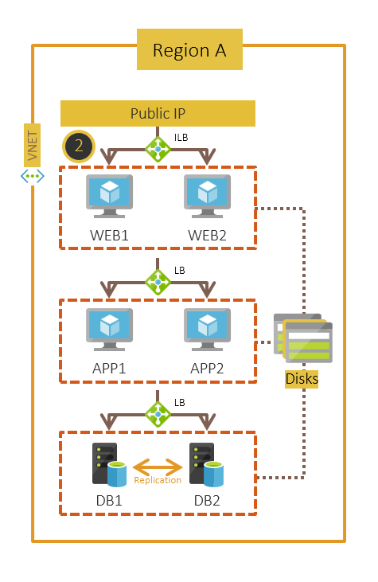
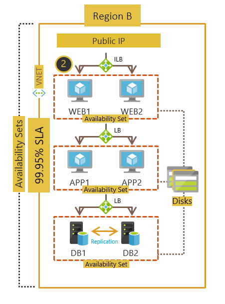
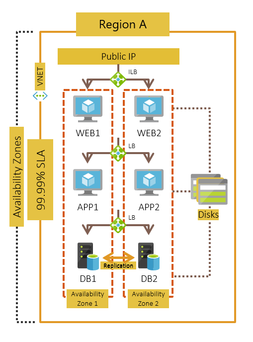
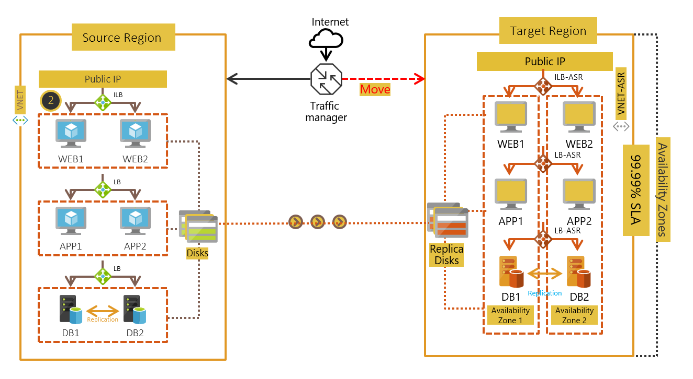
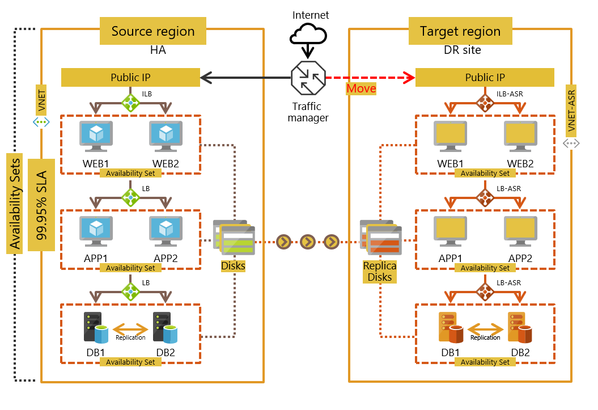
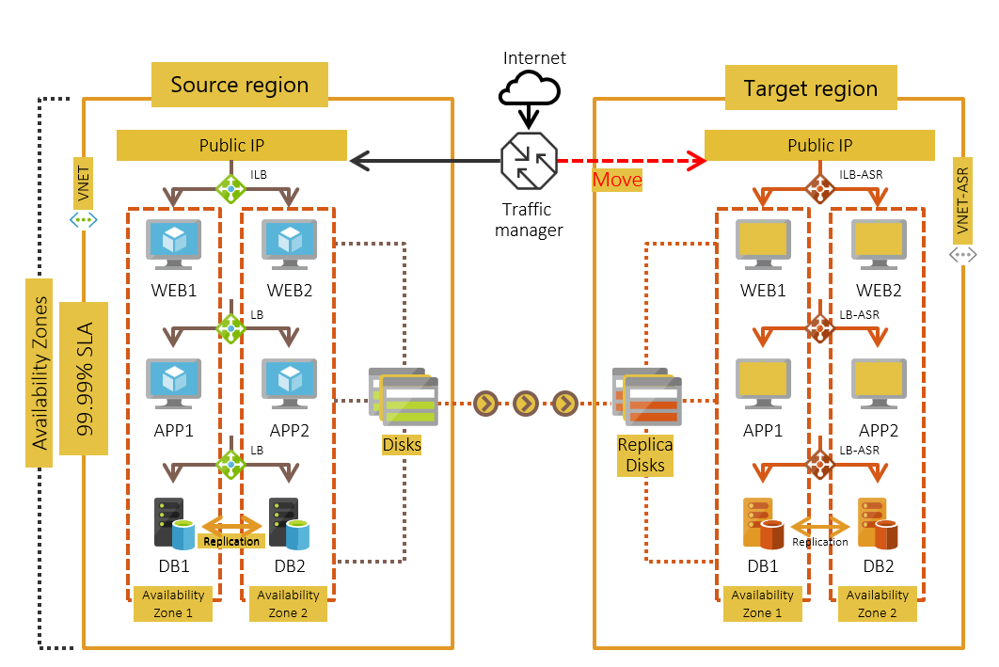
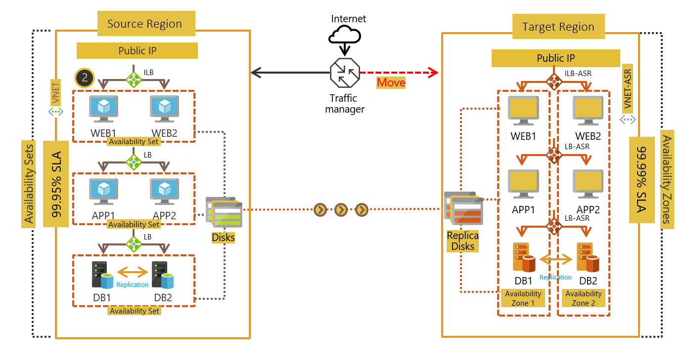

# Move Azure VMs to another region

Azure is growing extensively along with the customer base and is adding support for new regions with rising demands. There are also newer capabilities that get added on a monthly basis across services. Due to this, there are times when you'd want to move your VMs to a different region or into Availability Zones to increase availability.

This document walks through the various scenarios where you would want to move your VMs and a guide on how the architecture should be configured in the target to achieve higher availability. 
> [!div class="checklist"]
> * [Why would you move Azure VMs](#why-would-you-move-azure-vms)
> * [How to move Azure VMs](#how-to-move-azure-vms)
> * [Typical architectures](#typical-architectures-for-a-multi-tier-deployment)
> * [Move VMs as is to a target region](#move-azure-vms-to-another-region)
> * [Move VMs to increase availability](#move-vms-to-increase-availability)

## Why would you move Azure VMs

Customers move the VMs for the following reasons:-

- If you had already deployed in one region and a new region support was added, which is closer to the end users of your application or service then you'd want to **move your VMs as is, to the new region** to reduce latency. The same approach is taken if you want to consolidate subscriptions or there are governance / organization rules that require you to move. 
- If your VM was deployed as a single instance VM or as part of availability set and you want to increase the availability SLAs you can **move your VMs into an Availability Zone**. 

## How to move Azure VMs
Moving VMs involves the following steps:

1. Verify prerequisites 
2. Prepare the source VMs 
3. Prepare the target region 
4. Copy data to the target region - Use Azure Site Recovery replication technology to copy data from the source VM to the target region
5. Test the configuration: One the replication is complete, test the configuration by performing a test failover over to a non-production network.
6. Perform the move 
7. Discard the resources in the source region 

> [!IMPORTANT]
> Currently Azure Site Recovery supports moving VMs from on region to another and doesn't support moving within a region. 

> [!NOTE]
> Detailed guidance on these steps are provided in the documentation for each of the scenario as mentioned [here](#next-steps)

## Typical architectures for a multi-tier deployment
Below section walks through the most common deployment architectures customers adopt, for a multi-tier application in Azure. The example we are taking here is of a three tiered application with a public IP. Each of the tiers – Web, Application & Database have 2 VMs each, & are connected by a Load Balancer to the other tiers. The Database tier has SQL Always ON replication between the VMs for High Availability (HA).

1.	**Single instance VMs deployed across various tiers**- Each VM in a tier is configured as a single instance VM, connected by load balancers to the other tiers. This is the simplest configuration that customers adopt.

       

2. **VMs in each tier deployed across Availability Set** - Each VM in a tier is configured in an Availability set. [Availability sets](https://docs.microsoft.com/azure/virtual-machines/windows/tutorial-availability-sets) ensure that the VMs you deploy on Azure are distributed across multiple isolated hardware nodes in a cluster. Doing this ensures that if a hardware or software failure within Azure happens, only a subset of your VMs are impacted and that your overall solution remains available and operational. 
   
      

3. **VMs in each tier deployed across Availability Set** - Each VM in a tier is configured across [Availability Zones](https://docs.microsoft.com/azure/availability-zones/az-overview). An Availability Zone in an Azure region is a combination of a fault domain and an update domain. For example, if you create three or more VMs across three zones in an Azure region, your VMs are effectively distributed across three fault domains and three update domains. The Azure platform recognizes this distribution across update domains to make sure that VMs in different zones are not updated at the same time.

      

## Move VMs as is to a target region

Based on the above mentioned [architectures](#typical-architectures-for-a-multi-tier-deployment), heres how the deployments will look like once you perform the move as is to the target region.

1. **Single instance VMs deployed across various tiers** 

     

2. **VMs in each tier deployed across Availability Set**

     

3. **VMs in each tier deployed across Availability Zone**
      

     

## Move VMs to increase availability

1. **Single instance VMs deployed across various tiers** 

     

2. **VMs in each tier deployed across Availability Set** - You can choose to configure to place your VMs in an Availability set into separate Availability zones, when you choose to enable replication for your VM using Azure Site Recovery. The SLA for availability will be 99.9% once you complete the move operation.

     

## Next steps

In this document, you read about the general guidance for moving VMs. To know the step by step execution for this, read more:

> [!div class="nextstepaction"]
> * [Move Azure VMs to another region](azure-to-azure-tutorial-migrate.md)

> * [Move Azure VMs into Availability Zones](move-azure-VMs-AVset-Azone.md)

