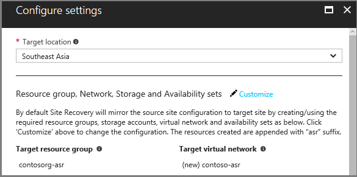
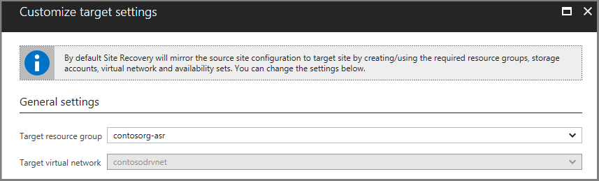
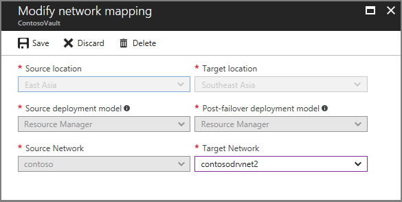

# Map virtual networks in different Azure regions

This article describes how to map two instances of Azure Virtual Network located in different Azure regions with each other. Network mapping ensures that when a replicated virtual machine is created in the target Azure region, the virtual machine is also created on the virtual network that's mapped to the virtual network of the source virtual machine.  

## Prerequisites
Before you map networks, ensure that you have created an [Azure virtual network](../virtual-network/virtual-networks-overview.md) in both the source region and the target Azure region.

## Map virtual networks

To map an Azure virtual network that's located in one Azure region (source network) to a virtual network that's located in another region (target network), for Azure virtual machines, go to **Site Recovery Infrastructure** > **Network Mapping**. Create a network mapping.

In the following example, the virtual machine is running in the East Asia region. The virtual machine is being replicated to the Southeast Asia region.

To create a network mapping from the East Asia region to the Southeast Asia region, select the location of the source network and the location of the target network. Then, select **OK**.

Repeat the preceding process to create a network mapping from the Southeast Asia region to the East Asia region.

## Map a network when you enable replication

When you replicate a virtual machine from one Azure region to another region for the first time, if no network mapping exists, you can set the target network when you set up replication. Based on this setting, Azure Site Recovery creates network mappings from the source region to the target region, and from the target region to the source region.   

By default, Site Recovery creates a network in the target region that is identical to the source network. Site Recovery creates a network by adding **-asr** as a suffix to the name of the source network. To choose a network that has already been created, select **Customize**.

If network mapping has already occurred, you can't change the target virtual network when you enable replication. In this case, to change the target virtual network, modify the existing network mapping.  

> [!IMPORTANT]
> If you modify a network mapping from region A to region B, ensure that you also modify the network mapping from region B to region A.
>
>

## Subnet selection
The subnet of the target virtual machine is selected based on the name of the subnet of the source virtual machine. If a subnet that has the same name as the source virtual machine is available in the target network, that subnet is set for the target virtual machine. If a subnet with the same name doesn't exist in the target network, the alphabetically first subnet is set as the target subnet.

To modify the subnet, go to the **Compute and Network** settings for the virtual machine.

## IP address

The IP address for each network interface of the target virtual machine is set as described in the following sections.

### DHCP
If the network interface of the source virtual machine uses DHCP, the network interface of the target virtual machine is also set to use DHCP.

### Static IP address
If the network interface of the source virtual machine uses  a static IP address, the network interface of the target virtual machine is also set to use a static IP address. The following sections describe how a static IP address is set.

### IP assignment behavior during Failover
#### 1. Same address space

If the source subnet and the target subnet have the same address space, the IP address of the network interface of the source virtual machine is set as the target IP address. If the same IP address is not available, the next available IP address is set as the target IP address.

#### 2. Different address spaces

If the source subnet and the target subnet have different address spaces, the next available IP address in the target subnet is set as the target IP address.

### IP assignment behavior during Test Failover
#### 1. If the target network chosen is the production vNet
- The recovery IP (Target IP) will be a static IP but it **will not be the same IP address** as reserved for Failover.
- The assigned IP address will be the next available IP from the end of the subnet address range.
- For e.g., if Source VM static IP is configured to be: 10.0.0.19 and Test Failover was attempted with the configured production network: ***dr-PROD-nw***, with subnet range as 10.0.0.0/24.  
The failed-over VM would be assigned with - The next available IP from the end of the subnet address range that is: 10.0.0.254  

**Note:** The terminology **production vNet** is referred to the 'Target network' mapped during the disaster recovery configuration.
#### 2. If the target network chosen is not the production vNet but has the same subnet range as production network

- The recovery IP (Target IP) will be a static IP with the **same IP address** (i.e., configured static IP address) as reserved for Failover. Provided the same IP address is available.
- If the configured static IP is already assigned to some other VM/device, then the recovery IP will be the next available IP from the end of the subnet address range.
- For e.g., if Source VM static IP is configured to be: 10.0.0.19 and Test Failover was attempted with a test network: ***dr-NON-PROD-nw***, with same subnet range as production network - 10.0.0.0/24.  
  The failed-over VM would be assigned with following static IP  
    - configured static IP: 10.0.0.19 if IP is available.
    - Next available IP: 10.0.0.254 if the IP address 10.0.0.19 is already in use.

To modify the target IP on each network interface, go to the **Compute and Network** settings for the virtual machine. 
As a best practice it is always suggested to choose a test network to perform Test Failover.
## Next steps

* Review [networking guidance for replicating Azure virtual machines](site-recovery-azure-to-azure-networking-guidance.md).
