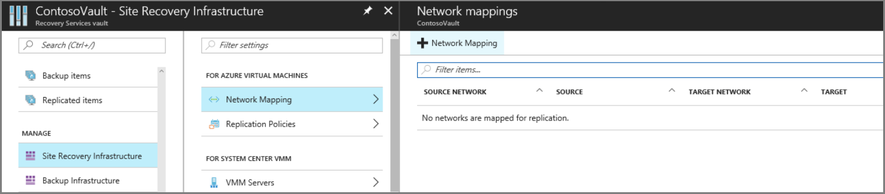
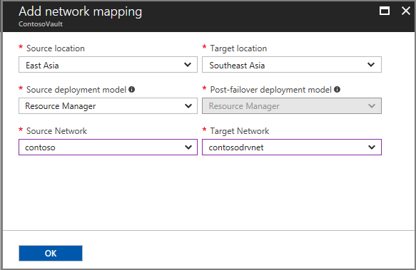
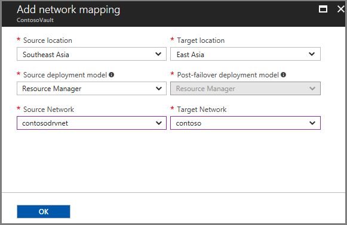
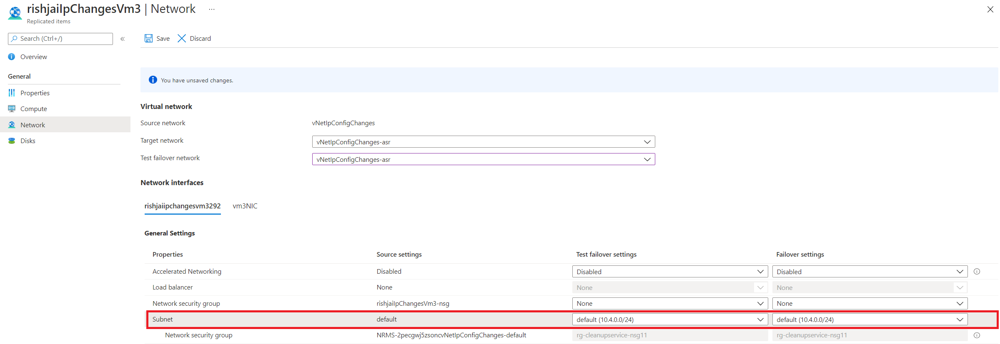

# Set up network mapping and IP addressing for VNets

This article describes how to map two instances of Azure virtual networks (VNets) located in different Azure regions, and how to set up IP addressing between networks. Network mapping provides a default behavior for target network selection based on source network at the time of enabling replication.

## Prerequisites

Before you map networks, you should have [Azure VNets](../virtual-network/virtual-networks-overview.md) in the source and target Azure regions. 

## Set up network mapping manually (Optional)

Map networks as follows:

1. In **Site Recovery Infrastructure**, click **+Network Mapping**.

    

3. In **Add network mapping**, select the source and target locations. In our example, the source VM is running in the East Asia region, and replicates to the Southeast Asia region.

    
3. Now create a network mapping in the opposite direction. In our example, the source will now be Southeast Asia, and the target will be East Asia.

    

## Map networks when you enable replication

If you haven't prepared network mapping before you configure disaster recovery for Azure VMs, you can specify a target network when you [set up and enable replication](azure-to-azure-how-to-enable-replication.md). When you do this the following happens:

- Based on the target you select, Site Recovery automatically creates network mappings from the source to target region, and from the target to source region.
- By default, Site Recovery creates a network in the target region that's identical to the source network. Site Recovery adds **-asr** as a suffix to the name of the source network. You can customize the target network.
- If network mapping has already occurred for a source network, the mapped target network will always be the default at the time of enabling replications for more VMs. You can choose to change the target virtual network by choosing other available options from the dropdown. 
- To change the default target virtual network for new replications, you need to modify the existing network mapping.
- If you wish to modify a network mapping from region A to region B, ensure that you first delete the network mapping from region B to region A. After reverse mapping deletion, modify the network mapping from region A to region B and then create the relevant reverse mapping.

>[!NOTE]
>* Modifying the network mapping only changes the defaults for new VM replications. It does not impact the target virtual network selections for existing replications. 
>* If you wish to modify the target network for an existing replication, go to Compute and Network Settings of the replicated item.

## Specify a subnet

The subnet of the target VM is selected based on the name of the subnet of the source VM.

- If a subnet with the same name as the source VM subnet is available in the target network, that subnet is set for the target VM.
- If a subnet with the same name doesn't exist in the target network, the first subnet in the alphabetical order is set as the target subnet.
- You can modify the target subnet in the **Compute and Network** settings for the VM.

    

## Set up IP addressing for target VMs

The IP address for each NIC on a target virtual machine is configured as follows:

- **DHCP**: If the NIC of the source VM uses DHCP, the NIC of the target VM is also set to use DHCP.
- **Static IP address**: If the NIC of the source VM uses static IP addressing, the target VM NIC will also use a static IP address.

## IP address assignment during failover

**Source and target subnets** | **Details**
--- | ---
Same address space | IP address of the source VM NIC is set as the target VM NIC IP address.   If the address isn't available, the next available IP address is set as the target.
Different address space | The next available IP address in the target subnet is set as the target VM NIC address.

## IP address assignment during test failover

**Target network** | **Details**
--- | ---
Target network is the failover VNet | - Target IP address will be static with the same IP address.     - If the same IP address is already assigned, then the IP address is the next one available at the end of the subnet range. For example: If the source IP address is 10.0.0.19 and failover network uses range 10.0.0.0/24, then the next IP address assigned to the target VM is 10.0.0.254.
Target network isn't the failover VNet | - Target IP address will be static with the same IP address.    - If the same IP address is already assigned, then the IP address is the next one available at the end of the subnet range.   For example: If the source static IP address is 10.0.0.19 and failover is on an network that isn't the failover network, with the range 10.0.0.0/24, then the target static IP address will be 10.0.0.0.19 if available, and otherwise it will be 10.0.0.254.

- The failover VNet is the target network that you select when you set up disaster recovery.
- We recommend that you always use a non-production network for test failover.
- You can modify the target IP address in the **Compute and Network** settings of the VM.

## Next steps

- Review [networking guidance](site-recovery-azure-to-azure-networking-guidance.md) for Azure VM disaster recovery.
- [Learn more](site-recovery-retain-ip-azure-vm-failover.md) about retaining IP addresses after failover.
