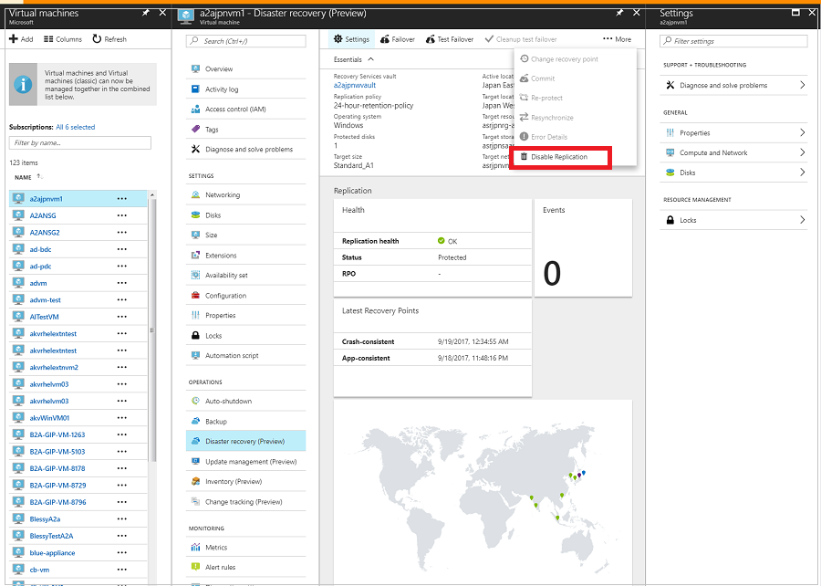

# Replicate an Azure VM to another Azure region

The [Azure Site Recovery](site-recovery-overview.md) service contributes to your business continuity and disaster recovery (BCDR) strategy by keeping your business apps up and running available during planned and unplanned outages. Site Recovery manages and orchestrates disaster recovery of on-premises machines and Azure virtual machines (VMs), including replication, failover, and recovery.

This quickstart describes how to replicate an Azure VM to a different Azure region.

>[!NOTE]
>
> Azure VM replication to a secondary region is currently in preview. 

If you don't have an Azure subscription, create a [free account](https://azure.microsoft.com/free/?WT.mc_id=A261C142F) before you begin.

## Log in to Azure

Log in to the Azure portal at http://portal.azure.com.

## Enable replication for the Azure VM

1. In the Azure portal, click **Virtual machines**, and select the VM you want to replicate.

2. In **Settings**, click **Disaster recovery (preview)**.

   

3. In **Configure disaster recovery** > **Target region** select the target region to which you'll replicate.
4. For this Quickstart, accept the other default settings. 
5. Click **Enable replication**. This starts a job to enable replication for the VM.

## Verify settings

After the replication job has finished, you can check the replication status, modify replication settings
settings, and test the deployment. 

1. In the VM menu, click **Disaster recovery (preview)** .
2. Check replication health, recovery points that have been created, and source and target regions on the map. 

   

## Clean up resources

The VM in the primary region stops replicating when you disable replication for it:

- The source replication settings are cleaned up automatically.
- Site Recovery billing for the
VM also stops.

Stop replication as follows:

1. Select the VM.
2. In **Disaster recovery (preview)**, click **More**.
3. Click **Disable Replication**.

   

## Next steps

In this quickstart, you replicated a single VM to a secondary region. To configure full disaster recovery for an Azure VM, follow the steps in this
[tutorial](azure-to-azure-tutorial-enable-replication.md).
