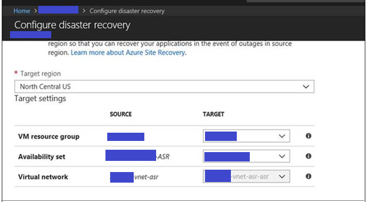
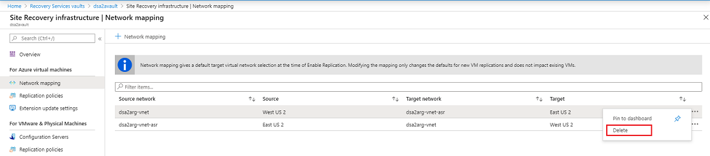
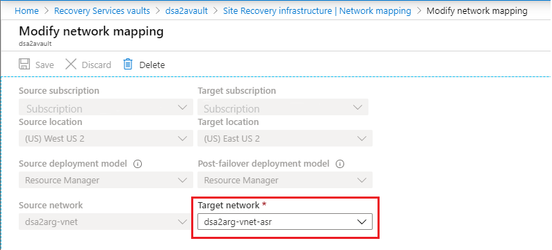
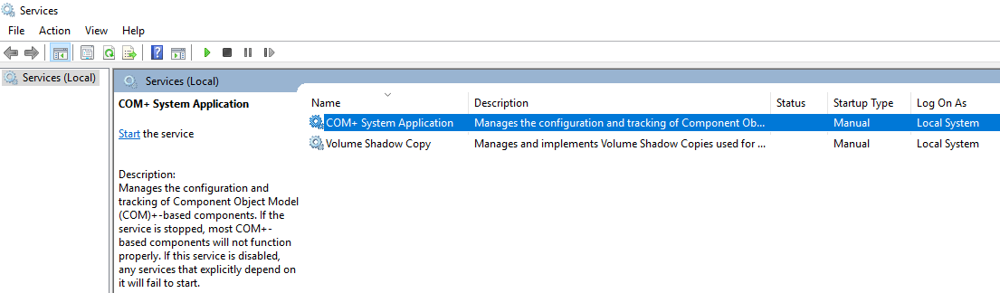

# Troubleshoot Azure-to-Azure VM replication issues

This article describes the common issues in Azure Site Recovery when replicating and recovering Azure virtual machines from one region to another region and explains how to troubleshoot them. For more information about supported configurations, see the [support matrix for replicating Azure VMs](site-recovery-support-matrix-azure-to-azure.md).

## Azure resource quota issues (error code 150097)
Your subscription should be enabled to create Azure VMs in the target region that you plan to use as your disaster recovery region. Also, your subscription should have sufficient quota enabled to create VMs of specific size. By default, Site Recovery picks the same size for the target VM as the source VM. If the matching size isn't available, the closest possible size is picked automatically. If there's no matching size that supports source VM configuration, this error message appears:

**Error code** | **Possible causes** | **Recommendation**
--- | --- | ---
150097  **Message**: Replication couldn't be enabled for the virtual machine VmName. | - Your subscription ID might not be enabled to create any VMs in the target region location.  - Your subscription ID might not be enabled or doesn't have sufficient quota to create specific VM sizes in the target region location.  - A suitable target VM size that matches the source VM NIC count (2) isn't found for the subscription ID in the target region location.| Contact [Azure billing support](https://docs.microsoft.com/azure/azure-supportability/resource-manager-core-quotas-request) to enable VM creation for the required VM sizes in the target location for your subscription. After it's enabled, retry the failed operation.

### Fix the problem
You can contact [Azure billing support](https://docs.microsoft.com/azure/azure-supportability/resource-manager-core-quotas-request) to enable your subscription to create VMs of required sizes in the target location.

If the target location has a capacity constraint, disable replication and enable it to a different location where your subscription has sufficient quota to create VMs of the required sizes.

## Trusted root certificates (error code 151066)

If all the latest trusted root certificates aren't present on the VM, your "enable replication" job might fail. Without the certificates, the authentication and authorization of Site Recovery service calls from the VM fail. The error message for the failed "enable replication" Site Recovery job appears:

**Error code** | **Possible cause** | **Recommendations**
--- | --- | ---
151066  **Message**: Site Recovery configuration failed. | The required trusted root certificates used for authorization and authentication aren't present on the machine. | - For a VM running the Windows operating system, ensure that the trusted root certificates are present on the machine. For information, see  [Configure trusted roots and disallowed certificates](https://technet.microsoft.com/library/dn265983.aspx).  - For a VM running the Linux operating system, follow the guidance for trusted root certificates published by the Linux operating system version distributor.

### Fix the problem
**Windows**

Install all the latest Windows updates on the VM so that all the trusted root certificates are present on the machine. If you're in a disconnected environment, follow the standard Windows update process in your organization to get the certificates. If the required certificates aren't present on the VM, the calls to the Site Recovery service fail for security reasons.

Follow the typical Windows update management or certificate update management process in your organization to get all the latest root certificates and the updated certificate revocation list on the VMs.

To verify that the issue is resolved, go to login.microsoftonline.com from a browser in your VM.

**Linux**

Follow the guidance provided by your Linux distributor to get the latest trusted root certificates and the latest certificate revocation list on the VM.

Because SuSE Linux uses symlinks to maintain a certificate list, follow these steps:

1.	Sign in as a root user.

2.	Run this command to change the directory.

      ``# cd /etc/ssl/certs``

3. Check if the Symantec root CA cert is present.

      ``# ls VeriSign_Class_3_Public_Primary_Certification_Authority_G5.pem``

4. If the Symantec root CA cert is not found, run the following command to download the file. Check for any errors and follow recommended action for network failures.

      ``# wget https://www.symantec.com/content/dam/symantec/docs/other-resources/verisign-class-3-public-primary-certification-authority-g5-en.pem -O VeriSign_Class_3_Public_Primary_Certification_Authority_G5.pem``

5. Check if the Baltimore root CA cert is present.

      ``# ls Baltimore_CyberTrust_Root.pem``

6. If the Baltimore root CA cert is not found, download the certificate.  

    ``# wget http://www.digicert.com/CACerts/BaltimoreCyberTrustRoot.crt.pem -O Baltimore_CyberTrust_Root.pem``

7. Check if the DigiCert_Global_Root_CA cert is present.

    ``# ls DigiCert_Global_Root_CA.pem``

8. If the DigiCert_Global_Root_CA is not found, run the following commands to download the certificate.

    ``# wget http://www.digicert.com/CACerts/DigiCertGlobalRootCA.crt``

    ``# openssl x509 -in DigiCertGlobalRootCA.crt -inform der -outform pem -out DigiCert_Global_Root_CA.pem``

9. Run rehash script to update the certificate subject hashes for the newly downloaded certificates.

    ``# c_rehash``

10. Check if the subject hashes as symlinks are created for the certificates.

    - Command

      ``# ls -l | grep Baltimore``

    - Output

      ``lrwxrwxrwx 1 root root   29 Jan  8 09:48 3ad48a91.0 -> Baltimore_CyberTrust_Root.pem
      -rw-r--r-- 1 root root 1303 Jun  5  2014 Baltimore_CyberTrust_Root.pem``

    - Command

      ``# ls -l | grep VeriSign_Class_3_Public_Primary_Certification_Authority_G5``

    - Output

      ``-rw-r--r-- 1 root root 1774 Jun  5  2014 VeriSign_Class_3_Public_Primary_Certification_Authority_G5.pem
      lrwxrwxrwx 1 root root   62 Jan  8 09:48 facacbc6.0 -> VeriSign_Class_3_Public_Primary_Certification_Authority_G5.pem``

    - Command

      ``# ls -l | grep DigiCert_Global_Root``

    - Output

      ``lrwxrwxrwx 1 root root   27 Jan  8 09:48 399e7759.0 -> DigiCert_Global_Root_CA.pem
      -rw-r--r-- 1 root root 1380 Jun  5  2014 DigiCert_Global_Root_CA.pem``

11. Create a copy of the file VeriSign_Class_3_Public_Primary_Certification_Authority_G5.pem with filename b204d74a.0

    ``# cp VeriSign_Class_3_Public_Primary_Certification_Authority_G5.pem b204d74a.0``

12. Create a copy of the file Baltimore_CyberTrust_Root.pem with filename 653b494a.0

    ``# cp Baltimore_CyberTrust_Root.pem 653b494a.0``

13. Create a copy of the file DigiCert_Global_Root_CA.pem with filename 3513523f.0

    ``# cp DigiCert_Global_Root_CA.pem 3513523f.0``  

14. Check if the files are present.  

    - Command

      ``# ls -l 653b494a.0 b204d74a.0 3513523f.0``

    - Output

      ``-rw-r--r-- 1 root root 1774 Jan  8 09:52 3513523f.0
      -rw-r--r-- 1 root root 1303 Jan  8 09:52 653b494a.0
      -rw-r--r-- 1 root root 1774 Jan  8 09:52 b204d74a.0``

## Outbound connectivity for Site Recovery URLs or IP ranges (error code 151037 or 151072)

For Site Recovery replication to work, outbound connectivity to specific URLs or IP ranges is required from the VM. If your VM is behind a firewall or uses network security group (NSG) rules to control outbound connectivity, you might face one of these issues.

### Issue 1: Failed to register Azure virtual machine with Site Recovery (151037)  
- **Possible cause**  
  - You're using NSG to control outbound access on the VM and the required IP ranges aren't whitelisted for outbound access.
  - You're using third-party firewall tools and the required IP ranges/URLs are not whitelisted.

- **Resolution**
   - If you're using firewall proxy to control outbound network connectivity on the VM, ensure that the prerequisite URLs or datacenter IP ranges are whitelisted. For information, see [firewall proxy guidance](https://aka.ms/a2a-firewall-proxy-guidance).
   - If you're using NSG rules to control outbound network connectivity on the VM, ensure that the prerequisite datacenter IP ranges are whitelisted. For information, see [network security group guidance](https://aka.ms/a2a-nsg-guidance).
   - To whitelist [the required URLs](azure-to-azure-about-networking.md#outbound-connectivity-for-urls) or the [required IP ranges](azure-to-azure-about-networking.md#outbound-connectivity-for-ip-address-ranges), follow the steps in the [networking guidance document](site-recovery-azure-to-azure-networking-guidance.md).

### Issue 2: Site Recovery configuration failed (151072)
- **Possible cause**  
  - Connection cannot be established to Site Recovery service endpoints

- **Resolution**
   - If you're using firewall proxy to control outbound network connectivity on the VM, ensure that the prerequisite URLs or datacenter IP ranges are whitelisted. For information, see [firewall proxy guidance](https://aka.ms/a2a-firewall-proxy-guidance).
   - If you're using NSG rules to control outbound network connectivity on the VM, ensure that the prerequisite datacenter IP ranges are whitelisted. For information, see [network security group guidance](https://aka.ms/a2a-nsg-guidance).
   - To whitelist [the required URLs](azure-to-azure-about-networking.md#outbound-connectivity-for-urls) or the [required IP ranges](azure-to-azure-about-networking.md#outbound-connectivity-for-ip-address-ranges), follow the steps in the [networking guidance document](site-recovery-azure-to-azure-networking-guidance.md).

### Issue 3: A2A replication failed when the network traffic goes through on-premise proxy server (151072)
 - **Possible cause**  
   - The custom proxy settings are invalid and ASR Mobility Service agent did not auto-detect the proxy settings from IE

 - **Resolution**
  1.	Mobility Service agent detects the proxy settings from IE on Windows and /etc/environment on Linux.
  2.  If you prefer to set proxy only for ASR Mobility Service, then you can provide the proxy details in ProxyInfo.conf located at: 
      - ``/usr/local/InMage/config/`` on ***Linux***
      - ``C:\ProgramData\Microsoft Azure Site Recovery\Config`` on ***Windows***
  3.	The ProxyInfo.conf should have the proxy settings in the following INI format.  
                   *[proxy]* 
                   *Address=http://1.2.3.4* 
                   *Port=567* 
  4. ASR Mobility Service agent supports only ***un-authenticated proxies***.

### Fix the problem
To whitelist [the required URLs](azure-to-azure-about-networking.md#outbound-connectivity-for-urls) or the [required IP ranges](azure-to-azure-about-networking.md#outbound-connectivity-for-ip-address-ranges), follow the steps in the [networking guidance document](site-recovery-azure-to-azure-networking-guidance.md).

## Disk not found in the machine (error code 150039)

A new disk attached to the VM must be initialized.

**Error code** | **Possible causes** | **Recommendations**
--- | --- | ---
150039  **Message**: Azure data disk (DiskName) (DiskURI) with logical unit number (LUN) (LUNValue) was not mapped to a corresponding disk being reported from within the VM that has the same LUN value. | - A new data disk was attached to the VM but it wasn't initialized.  - The data disk inside the VM is not correctly reporting the LUN value at which the disk was attached to the VM.| Ensure that the data disks are initialized, and then retry the operation.  For Windows: [Attach and initialize a new disk](https://docs.microsoft.com/azure/virtual-machines/windows/attach-managed-disk-portal).  For Linux: [Initialize a new data disk in Linux](https://docs.microsoft.com/azure/virtual-machines/linux/add-disk).

### Fix the problem
Ensure that the data disks have been initialized, and then retry the operation:

- For Windows: [Attach and initialize a new disk](https://docs.microsoft.com/azure/virtual-machines/windows/attach-managed-disk-portal).
- For Linux: [add a new data disk in Linux](https://docs.microsoft.com/azure/virtual-machines/linux/add-disk).

If the problem persists, contact support.

## Unable to see the Azure VM for selection in "enable replication"

 **Cause 1:  Resource group and source Virtual machine are in different location**  
Azure Site Recovery currently mandated that source region resource group and virtual machines should be in same location. If that is not the case then you would not be able to find the virtual machine during the time of protection.

**Cause 2: Resource group is not part of selected subscription**  
You might not be able to find the resource group at the  time of protection if it is not part of the given subscription. Make sure that the resource group belongs to the subscription which is being used.

 **Cause 3: Stale Configuration**  
If you don't see the VM you want to enable for replication, it might be because of a stale Site Recovery configuration left on the Azure VM. The stale configuration could be left on an Azure VM in the following cases:

- You enabled replication for the Azure VM by using Site Recovery and then deleted the Site Recovery vault without explicitly disabling replication on the VM.
- You enabled replication for the Azure VM by using Site Recovery and then deleted the resource group containing the Site Recovery vault without explicitly disabling replication on the VM.

### Fix the problem

You can use [Remove stale ASR configuration script](https://gallery.technet.microsoft.com/Azure-Recovery-ASR-script-3a93f412) and remove the stale Site Recovery configuration on the Azure VM. You should be able to see the VM after removing the stale configuration.

## Unable to select Virtual machine for protection 
 **Cause 1:  Virtual machine has some extension installed in a failed or unresponsive state**  
 Go to Virtual machines > Setting > Extensions and check if there are any extensions in a failed state. Uninstall the failed extension and retry protecting the virtual machine. 
 **Cause 2:  [VM's provisioning state is not valid](#vms-provisioning-state-is-not-valid-error-code-150019)**

## VM's provisioning state is not valid (error code 150019)

To enable replication on the VM, the provisioning state should be **Succeeded**. You can check the VM state by following the steps below.

1.	Select the **Resource Explorer** from **All Services** in Azure portal.
2.	Expand the **Subscriptions** list and select your subscription.
3.	Expand the **ResourceGroups** list and select the resource group of the VM.
4.	Expand the **Resources** list and select your virtual machine
5.	Check the **provisioningState** field in Instance view on right hand side.

### Fix the problem

- If **provisioningState** is **Failed**, contact support with details to troubleshoot.
- If **provisioningState** is **Updating**, another extension could be getting deployed. Check if there are any ongoing operations on the VM, wait for them to complete and retry the failed Site Recovery **Enable replication** job.

## Unable to select Target virtual network - network selection tab is grayed out.

**Cause 1: If your VM is attached to a network that is already mapped to a 'Target network'.**
- If the source VM is part of a virtual network and another VM from the same virtual network is already mapped with a network in target resource group, then by default network selection drop down will be disabled.

**Cause 2: If you previously protected the VM using Azure Site Recovery and disabled the replication.**
 - Disabling replication of a VM does not delete the Network Mapping. It has to be deleted from the recovery service vault where the VM was protected.  
 Navigate to recovery service vault > Site Recovery Infrastructure > Network mapping.  
 
 - Target network configured during the disaster recovery setup can be changed after the initial set up, after the VM is protected.  
 
 - Note that changing network mapping affects all protected VMs that use that specific network mapping.

## COM+/Volume Shadow Copy service error (error code 151025)
**Error code** | **Possible causes** | **Recommendations**
--- | --- | ---
151025  **Message**: Site recovery extension failed to install | - 'COM+ System Application' service disabled.  - 'Volume Shadow Copy' service is disabled.| Set 'COM+ System Application' and 'Volume Shadow Copy' services to automatic or manual start up mode.

### Fix the problem

You can open 'Services' console and ensure the 'COM+ System Application' and 'Volume Shadow Copy' are not set to 'Disabled' for 'Startup Type'.
  

## Next steps
[Replicate Azure virtual machines](site-recovery-replicate-azure-to-azure.md)
