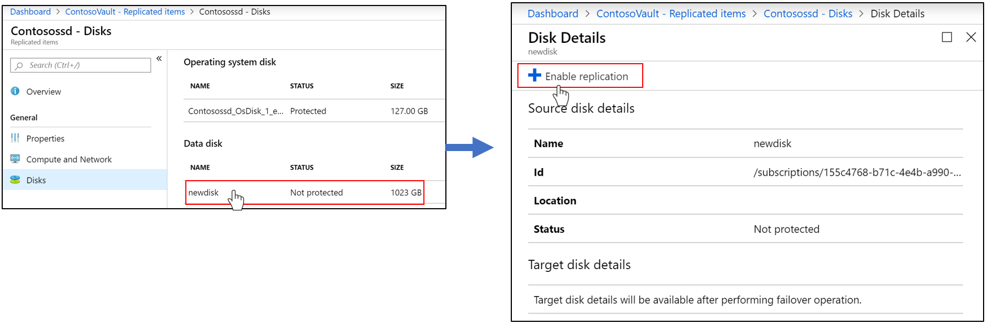
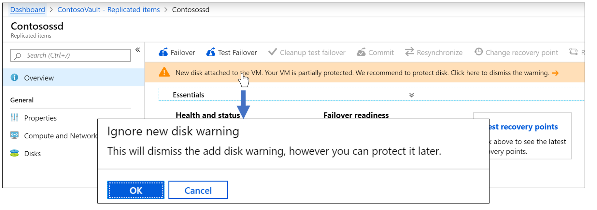
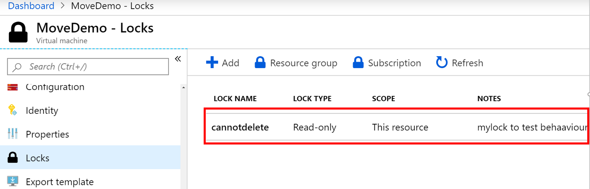

# Troubleshoot Azure-to-Azure VM replication errors

This article describes how to troubleshoot common errors in Azure Site Recovery during replication and recovery of Azure virtual machines (VMs) from one region to another. For more information about supported configurations, see the [support matrix for replicating Azure VMs](site-recovery-support-matrix-azure-to-azure.md).

## List of errors

- [Azure resource quota issues (error code 150097)](#azure-resource-quota-issues-error-code-150097)
- [Trusted root certificates (error code 151066)](#trusted-root-certificates-error-code-151066)
- [Outbound connectivity for Site Recovery (error code 151195)](#issue-1-failed-to-register-azure-virtual-machine-with-site-recovery-151195-br)

## <a name="azure-resource-quota-issues-error-code-150097"></a>Azure resource quota issues (error code 150097)

Make sure your subscription is enabled to create Azure VMs in the target region that you plan to use as your disaster-recovery region. Also make sure your subscription has sufficient quota to create VMs of the necessary sizes. By default, Site Recovery chooses a target VM size that's the same as the source VM size. If the matching size isn't available, Site Recovery automatically chooses the closest available size.

If there's no size that supports the source VM configuration, this error message appears:

> "Replication couldn't be enabled for the virtual machine *VmName*."

### Possible causes

- Your subscription ID isn't enabled to create any VMs in the target region location.
- Your subscription ID isn't enabled, or doesn't have sufficient quota, to create specific VM sizes in the target region location.
- No suitable target VM size is found to match the source VM's network interface card (NIC) count (2), for the subscription ID in the target region location.

### Fix the problem

Contact [Azure billing support](https://docs.microsoft.com/azure/azure-supportability/resource-manager-core-quotas-request) to enable your subscription to create VMs of the required sizes in the target location. Then, retry the failed operation.

If the target location has a capacity constraint, disable replication to it. Then, enable replication to a different location where your subscription has sufficient quota to create VMs of the required sizes.

## <a name="trusted-root-certificates-error-code-151066"></a>Trusted root certificates (error code 151066)

If not all the latest trusted root certificates are present on the VM, your "enable replication" Site Recovery job might fail. Authentication and authorization of Site Recovery service calls from the VM fail without these certificates. 

If the "enable replication" job fails, this error message appears:

> "Site Recovery configuration failed."

### Possible cause

The trusted root certificates required for authorization and authentication aren't present on the virtual machine.

### Fix the problem

#### Windows

For a VM running the Windows operating system, install all the latest Windows updates on the VM so that all the trusted root certificates are present on the machine. Follow the typical Windows update-management or certificate update-management process in your organization to get all the latest root certificates and the updated certificate-revocation list on the VMs.

If you're in a disconnected environment, follow the standard Windows update process in your organization to get the certificates. If the required certificates aren't present on the VM, the calls to the Site Recovery service fail for security reasons.

To verify that the issue is resolved, go to login.microsoftonline.com from a browser in your VM.

For more information, see  [Configure trusted roots and disallowed certificates](https://technet.microsoft.com/library/dn265983.aspx).

**Linux**

Follow the guidance provided by the distributor of your Linux operating system version to get the latest trusted root certificates and the latest certificate-revocation list on the VM.

Because SuSE Linux uses symbolic links (or *symlinks*) to maintain a certificate list, follow these steps:

1. Sign in as a root user.

1. Run this command to change the directory:

    **# cd /etc/ssl/certs**

1. Check whether the Symantec root CA certificate is present:

    **# ls VeriSign_Class_3_Public_Primary_Certification_Authority_G5.pem**

1. If the Symantec root CA certificate is not found, run the following command to download the file. Check for any errors and follow recommended actions for network failures.

    **# wget https://www.symantec.com/content/dam/symantec/docs/other-resources/verisign-class-3-public-primary-certification-authority-g5-en.pem -O VeriSign_Class_3_Public_Primary_Certification_Authority_G5.pem**

1. Check whether the Baltimore root CA certificate is present:

    **# ls Baltimore_CyberTrust_Root.pem**

1. If the Baltimore root CA certificate is not found, run this command to download the certificate:

    **# wget https://www.digicert.com/CACerts/BaltimoreCyberTrustRoot.crt.pem -O Baltimore_CyberTrust_Root.pem**

1. Check whether the DigiCert_Global_Root_CA certificate is present:

    **# ls DigiCert_Global_Root_CA.pem**

1. If the DigiCert_Global_Root_CA is not found, run the following commands to download the certificate:

    **# wget http://www.digicert.com/CACerts/DigiCertGlobalRootCA.crt**

    **# openssl x509 -in DigiCertGlobalRootCA.crt -inform der -outform pem -out DigiCert_Global_Root_CA.pem**

1. Run the rehash script to update the certificate subject hashes for the newly downloaded certificates:

    **# c_rehash**

1. Run these commands to check whether the subject hashes as symlinks have been created for the certificates:

    - Command:

              **# ls -l | grep Baltimore**

    - Output:

            ``lrwxrwxrwx 1 root root   29 Jan  8 09:48 3ad48a91.0 -> Baltimore_CyberTrust_Root.pem
        -rw-r--r-- 1 root root 1303 Jun  5  2014 Baltimore_CyberTrust_Root.pem``

    - Command:

            **# ls -l | grep VeriSign_Class_3_Public_Primary_Certification_Authority_G5**

    - Output:

            ``-rw-r--r-- 1 root root 1774 Jun  5  2014 VeriSign_Class_3_Public_Primary_Certification_Authority_G5.pem``

            ``lrwxrwxrwx 1 root root   62 Jan  8 09:48 facacbc6.0 -> VeriSign_Class_3_Public_Primary_Certification_Authority_G5.pem``

    - Command:

            **# ls -l | grep DigiCert_Global_Root**

    - Output:

            ``lrwxrwxrwx 1 root root   27 Jan  8 09:48 399e7759.0 -> DigiCert_Global_Root_CA.pem
        -rw-r--r-- 1 root root 1380 Jun  5  2014 DigiCert_Global_Root_CA.pem``

1. Create a copy of the file VeriSign_Class_3_Public_Primary_Certification_Authority_G5.pem with filename b204d74a.0:

    **# cp VeriSign_Class_3_Public_Primary_Certification_Authority_G5.pem b204d74a.0**

1. Create a copy of the file Baltimore_CyberTrust_Root.pem with filename 653b494a.0:

    **# cp Baltimore_CyberTrust_Root.pem 653b494a.0**

1. Create a copy of the file DigiCert_Global_Root_CA.pem with filename 3513523f.0:

    **# cp DigiCert_Global_Root_CA.pem 3513523f.0**

1. Check whether the files are present:

    - Command:

              **# ls -l 653b494a.0 b204d74a.0 3513523f.0**

    - Output

              ``-rw-r--r-- 1 root root 1774 Jan  8 09:52 3513523f.0
          -rw-r--r-- 1 root root 1303 Jan  8 09:52 653b494a.0
          -rw-r--r-- 1 root root 1774 Jan  8 09:52 b204d74a.0``

## Outbound connectivity for Site Recovery URLs or IP ranges (error code 151037 or 151072)

For Site Recovery replication to work, outbound connectivity is required from the VM to specific URLs or IP ranges. If your VM is behind a firewall or uses network security group (NSG) rules to control outbound connectivity, you might face one of these issues.

### <a name="issue-1-failed-to-register-azure-virtual-machine-with-site-recovery-151195-br"></a>Issue 1: Failed to register the Azure virtual machine with Site Recovery (151195)

#### Possible cause 

The connection to Site Recovery endpoints can't be established because of a DNS resolution failure.

This problem happens most frequently during reprotection, when you have failed over the virtual machine but the DNS server is not reachable from the disaster-recovery (DR) region.

#### Fix the problem

If you're using a custom DNS, make sure that the DNS server is accessible from the disaster-recovery region. To find out whether you have a custom DNS, on the VM, go to ***disaster recovery network*** > **DNS servers**.


Try accessing the DNS server from the virtual machine. If the server is not accessible, make it accessible either by failing over the DNS server or by creating the line of site between the DR network and the DNS.

### Issue 2: Site Recovery configuration failed (151196)

#### Possible cause

The connection to Office 365 authentication and identity IP4 endpoints can't be established.

#### Fix the problem

Site Recovery requires access to Office 365 IP ranges for authentication.
If you're using Azure network security group (NSG) rules or firewall proxy to control outbound network connectivity on the VM, be sure you allow communication to Office 365 IP ranges. Create an NSG rule based on an [Azure Active Directory (Azure AD) service tag](../virtual-network/security-overview.md#service-tags), allowing access to all IP addresses corresponding to Azure AD. If new addresses are added to Azure AD in the future, you must create new NSG rules.

> [!NOTE]
> If VMs are behind a *Standard* internal load balancer, the load balancer by default does not have access to Office 365 IP ranges (that is, login.microsoftonline.com). Either change the internal load balancer type to *Basic* or create outbound access as described in the article [Configure load balancing and outbound rules](https://aka.ms/lboutboundrulescli).

### Issue 3: Site Recovery configuration failed (151197)

#### Possible cause

The connection can't be established to Site Recovery service endpoints.

#### Fix the problem

Site Recovery requires access to [Site Recovery IP ranges](https://docs.microsoft.com/azure/site-recovery/azure-to-azure-about-networking#outbound-connectivity-for-ip-address-ranges), depending on the region. Make sure that the required IP ranges are accessible from the virtual machine.

### Issue 4: Azure-to-Azure replication failed when the network traffic goes through an on-premises proxy server (151072)

#### Possible cause

The custom proxy settings are invalid, and the Site Recovery Mobility Service agent did not auto-detect the proxy settings from Internet Explorer.

#### Fix the problem

The Mobility Service agent detects the proxy settings from Internet Explorer on Windows and from /etc/environment on Linux.

If you prefer to set the proxy only for the Mobility Service, you can provide the proxy details in the ProxyInfo.conf file in these locations:

- **Linux**: /usr/local/InMage/config/
- **Windows**: C:\ProgramData\Microsoft Azure Site Recovery\Config

In ProxyInfo.conf, provide the proxy settings in the following initialization-file format:

> [*proxy*]

> Address=*http://1.2.3.4*

> Port=*567*


> [!NOTE]
> Azure Site Recovery Mobility Service agent supports only *un-authenticated proxies*.

### More information

To specify [required URLs](azure-to-azure-about-networking.md#outbound-connectivity-for-urls) or [required IP ranges](azure-to-azure-about-networking.md#outbound-connectivity-for-ip-address-ranges), follow the guidance in [About networking in Azure to Azure replication](site-recovery-azure-to-azure-networking-guidance.md).

## Disk not found in the machine (error code 150039)

A new disk attached to the VM must be initialized.

**Message**: Azure data disk (DiskName) (DiskURI) with logical unit number (LUN) (LUNValue) was not mapped to a corresponding disk being reported from within the VM that has the same LUN value. 

### Possible causes

- A new data disk was attached to the VM but it wasn't initialized.
- The data disk inside the VM is not correctly reporting the LUN value at which the disk was attached to the VM.
- 
### Resolution

Ensure that the data disks are initialized, and then retry the operation.

For Windows: [Attach and initialize a new disk](https://docs.microsoft.com/azure/virtual-machines/windows/attach-managed-disk-portal).

For Linux: [Initialize a new data disk in Linux](https://docs.microsoft.com/azure/virtual-machines/linux/add-disk).

### Fix the problem
Ensure that the data disks have been initialized, and then retry the operation:

- For Windows: [Attach and initialize a new disk](https://docs.microsoft.com/azure/virtual-machines/windows/attach-managed-disk-portal).
- For Linux: [add a new data disk in Linux](https://docs.microsoft.com/azure/virtual-machines/linux/add-disk).

If the problem persists, contact support.

## One or more disk(s) are available for protection(error code 153039)

### Possible causes**

- If one or more disk(s) were recently added to the virtual machine after the protection. 
- If one or more disk(s) were initialized later after the protection of the virtual machine.

### Fix the problem

You can either choose to  protect the disks or ignore the warning to make the replication status of the VM healthy again.

1. To protect the disk(s). Navigate to Replicated Items > VM > Disks > click on unprotected disk >Enable Replication.
 

1. To dismiss the warning. Go to Replicated items > VM > Click on the dismiss alert under overview section.


## Remove the virtual machine from the vault completed with information  (error code 150225)

At the time of protecting the virtual machine, Azure Site Recovery creates some links on the source virtual machine. When you remove the protection or disable replication, Azure Site Recovery remove these links as a part of cleanup job. In case the virtual machine has a resource lock then the job gets completed with the information. It tells that the virtual machine has been removed from the Recovery services vault but some of the stale links couldn't be cleaned up from the source machine.

You can ignore this warning if you never intend to protect this virtual machine again in future. However, if you have to protect this virtual machine later then you should clean up the links as mentioned in the steps below. 

**If you don't do the clean up then:**

1. During the time of enabling the replication through Recovery services vault, virtual machine will not be listed. 
1. If you try to protect the VM through **Virtual machine>Settings> Disaster Recovery** it will failed with the error "*Replication cannot be enabled because of the existing stale resource links on the VM*".

### Fix the problem

>[!NOTE]
>
>Azure Site Recovery doesn't delete source virtual machine or impact it in any way while performing below steps.
>

1. Remove the lock from the VM or VM resource group. For example: Below VM name "MoveDemo" has the resource lock that needs to be deleted.

   
1. Download script [Remove stale Azure Site Recovery configuration](https://github.com/AsrOneSdk/published-scripts/blob/master/Cleanup-Stale-ASR-Config-Azure-VM.ps1).
1. Execute the script *Cleanup-stale-asr-config-Azure-VM.ps1*.
1. Provide the subscription ID, VM Resource Group and VM name as a parameter.
1. If asked Azure credentials, please provide that and  check that the script gets executed without any failures. 

## Replication can't be enabled because of the existing stale resource links on the VM (error code 150226)

### Cause

Virtual machine has stale configuration left from previous Site Recovery protection**

The stale configuration could be left on an Azure VM in the following cases:

- You enabled replication for the Azure VM by using Site Recovery and then disable replication but the **source VM had a resource lock**.
- You enabled replication for the Azure VM by using Site Recovery and then deleted the Site Recovery vault without explicitly disabling replication on the VM.
- You enabled replication for the Azure VM by using Site Recovery and then deleted the resource group containing the Site Recovery vault without explicitly disabling replication on the VM.

### Fix the problem

>[!NOTE]
>
>Azure Site Recovery doesn't delete source virtual machine or impact it in any way while performing below steps.


1. Remove the lock from the VM or VM resource group, if there are any. *For example:* Below VM name "MoveDemo" has the resource lock that needs to be deleted.

   
1. Download script [Remove stale Azure Site Recovery configuration](https://github.com/AsrOneSdk/published-scripts/blob/master/Cleanup-Stale-ASR-Config-Azure-VM.ps1).
1. Execute the script *Cleanup-stale-asr-config-Azure-VM.ps1*.
1. Provide the subscription ID, VM Resource Group and VM name as a parameter.
1. If asked Azure credentials, please provide that and  check that the script gets executed without any failures.  

## Unable to see the Azure VM or Resource group  for selection in "enable replication"

 ### Cause 1:  Resource group and source Virtual machine are in different location**
 
Azure Site Recovery currently mandates that source region resource group and virtual machines should be in same location. If that is not the case then you would not be able to find the virtual machine or resource group during the time of protection. 

**As a workaround**, you can Enable replication from the VM instead of the Recovery services vault. Go to Source VM > Properties > Disaster Recovery and Enable the replication.

### Cause 2: Resource group is not part of selected subscription

You might not be able to find the resource group at the  time of protection if it is not part of the given subscription. Make sure that the resource group belongs to the subscription which is being used.

### Cause 3: Stale Configuration
 
If you don't see the VM you want to enable for replication, it might be because of a stale Site Recovery configuration left on the Azure VM. The stale configuration could be left on an Azure VM in the following cases:

- You enabled replication for the Azure VM by using Site Recovery and then deleted the Site Recovery vault without explicitly disabling replication on the VM.
- You enabled replication for the Azure VM by using Site Recovery and then deleted the resource group containing the Site Recovery vault without explicitly disabling replication on the VM.

- You enabled replication for the Azure VM by using Site Recovery and then disable replication but the source VM had a resource lock.

### Fix the problem

> [!NOTE]
>
> Make sure to update the ""AzureRM.Resources"" module before using the below script. Azure Site Recovery doesn't delete source virtual machine or impact it in any way while performing below steps.
>

1. Remove the lock from the VM or VM resource group, if there are any. *For example:* Below VM name "MoveDemo" has the resource lock that needs to be deleted.

   
1. Download script [Remove stale configuration](https://github.com/AsrOneSdk/published-scripts/blob/master/Cleanup-Stale-ASR-Config-Azure-VM.ps1).
1. Execute the script *Cleanup-stale-asr-config-Azure-VM.ps1*.
1. Provide the subscription ID, VM Resource Group and VM name as a parameter.
1. If asked Azure credentials, please provide that and  check that the script gets executed without any failures.

## Unable to select Virtual machine for protection

### Cause 1: Virtual machine has some extension installed in a failed or unresponsive state

Go to Virtual machines > Setting > Extensions and check if there are any extensions in a failed state. Uninstall the failed extension and retry protecting the virtual machine.

### Cause 2: [VM's provisioning state is not valid](#vms-provisioning-state-is-not-valid-error-code-150019)

## VM's provisioning state is not valid (error code 150019)

To enable replication on the VM, the provisioning state should be **Succeeded**. You can check the VM state by following the steps below.

1. Select the **Resource Explorer** from **All Services** in Azure portal.
1. Expand the **Subscriptions** list and select your subscription.
1. Expand the **ResourceGroups** list and select the resource group of the VM.
1. Expand the **Resources** list and select your virtual machine
1. Check the **provisioningState** field in Instance view on right hand side.

### Fix the problem

- If **provisioningState** is **Failed**, contact support with details to troubleshoot.
- If **provisioningState** is **Updating**, another extension could be getting deployed. Check if there are any ongoing operations on the VM, wait for them to complete and retry the failed Site Recovery **Enable replication** job.

## Unable to select Target virtual network - network selection tab is grayed out.

### Cause 1: If your VM is attached to a network that is already mapped to a 'Target network'

- If the source VM is part of a virtual network and another VM from the same virtual network is already mapped with a network in target resource group, then by default network selection drop down will be disabled.


### Cause 2: If you previously protected the VM using Azure Site Recovery and disabled the replication.

- Disabling replication of a VM does not delete the Network Mapping. It has to be deleted from the recovery service vault where the VM was protected.

  Navigate to recovery service vault > Site Recovery Infrastructure > Network mapping.
  

- Target network configured during the disaster recovery setup can be changed after the initial set up, after the VM is protected. </br>
  

- Note that changing network mapping affects all protected VMs that use that specific network mapping.

## COM+/Volume Shadow Copy service error (error code 151025)

**Message**: Site Recovery extension failed to install 

### Possible causes

- 'COM+ System Application' service disabled.
- 'Volume Shadow Copy' service is disabled.
 
### Recommendations

Set 'COM+ System Application' and 'Volume Shadow Copy' services to automatic or manual start up mode.

### Fix the problem

You can open 'Services' console and ensure the 'COM+ System Application' and 'Volume Shadow Copy' are not set to 'Disabled' for 'Startup Type'.

  

## Unsupported Managed Disk Size (error code 150172)

**Message**: Protection couldn't be enabled for the virtual machine as it has (DiskName) with size (DiskSize) that is lesser than the minimum supported size 1024 MB. 

### Possible cause

The disk is less than supported size of 1024 MB.

### Recommendations

Ensure that the disk sizes are within the supported size range and retry the operation.

## <a name="enable-protection-failed-as-device-name-mentioned-in-the-grub-configuration-instead-of-uuid-error-code-151126"></a>Enable protection failed as device name mentioned in the GRUB configuration instead of UUID (error code 151126)

### Possible Cause

The GRUB configuration files ("/boot/grub/menu.lst", "/boot/grub/grub.cfg", "/boot/grub2/grub.cfg" or "/etc/default/grub") may contain the value for the parameters **root** and **resume** as the actual device names instead of UUID. Site Recovery mandates UUID approach as devices name may change across reboot of the VM as VM may not come-up with the same name on failover resulting in issues. For example:

- The following line is from the GRUB file **/boot/grub2/grub.cfg**.

  *linux   /boot/vmlinuz-3.12.49-11-default **root=/dev/sda2**  ${extra_cmdline} **resume=/dev/sda1** splash=silent quiet showopts*

- The following line is from the GRUB file **/boot/grub/menu.lst**

  *kernel /boot/vmlinuz-3.0.101-63-default **root=/dev/sda2** **resume=/dev/sda1** splash=silent crashkernel=256M-:128M showopts vga=0x314*

If you observe the bold string above, GRUB has actual device names for the parameters "root" and "resume" instead of UUID.

### Fix the problem

The device names should be replaced with the corresponding UUID.

1. Find the UUID of the device by executing the command "blkid \<device name>". For example:
   ```
   blkid /dev/sda1
   ```<br>
   ```/dev/sda1: UUID="6f614b44-433b-431b-9ca1-4dd2f6f74f6b" TYPE="swap" ```<br>
   ```blkid /dev/sda2```<br>
   ```/dev/sda2: UUID="62927e85-f7ba-40bc-9993-cc1feeb191e4" TYPE="ext3"
   ```<br>
   ```

1. Now replace the device name with its UUID in the format like "root=UUID=\<UUID>". For example, if we replace the device names with UUID for root and resume parameter mentioned above in the files "/boot/grub2/grub.cfg", "/boot/grub2/grub.cfg" or "/etc/default/grub: then the lines in the files looks like. <br>
   *kernel /boot/vmlinuz-3.0.101-63-default **root=UUID=62927e85-f7ba-40bc-9993-cc1feeb191e4** **resume=UUID=6f614b44-433b-431b-9ca1-4dd2f6f74f6b** splash=silent crashkernel=256M-:128M showopts vga=0x314*

1. Restart the protection again.

## Enable protection failed as device mentioned in the GRUB configuration doesn't exist(error code 151124)

### Possible cause

The GRUB configuration files ("/boot/grub/menu.lst", "/boot/grub/grub.cfg", "/boot/grub2/grub.cfg" or "/etc/default/grub") may contain the parameters "rd.lvm.lv" or "rd_LVM_LV" to indicate the LVM device that should be discovered at the time of booting. If these LVM devices doesn't exist, then the protected system itself will not boot and stuck in the boot process. Even the same will be observed with the failover VM. Below are few examples:

1. The following line is from the GRUB file **"/boot/grub2/grub.cfg"** on RHEL7. </br>
   *linux16 /vmlinuz-3.10.0-957.el7.x86_64 root=/dev/mapper/rhel_mup--rhel7u6-root ro crashkernel=128M\@64M **rd.lvm.lv=rootvg/root rd.lvm.lv=rootvg/swap** rhgb quiet LANG=en_US.UTF-8*</br>
   Here the highlighted portion shows that the GRUB has to detect two LVM devices with names **"root"** and **"swap"** from the volume group "rootvg".

1. The following line is from the GRUB file **"/etc/default/grub"** on RHEL7 </br>
   *GRUB_CMDLINE_LINUX="crashkernel=auto **rd.lvm.lv=rootvg/root rd.lvm.lv=rootvg/swap** rhgb quiet"*</br>
   Here the highlighted portion shows that the GRUB has to detect two LVM devices with names **"root"** and **"swap"** from the volume group "rootvg".

1. The following line is from the GRUB file **"/boot/grub/menu.lst"** on RHEL6 </br>
   *kernel /vmlinuz-2.6.32-754.el6.x86_64 ro root=UUID=36dd8b45-e90d-40d6-81ac-ad0d0725d69e rd_NO_LUKS LANG=en_US.UTF-8 rd_NO_MD SYSFONT=latarcyrheb-sun16 crashkernel=auto rd_LVM_LV=rootvg/lv_root  KEYBOARDTYPE=pc KEYTABLE=us rd_LVM_LV=rootvg/lv_swap rd_NO_DM rhgb quiet* </br>
   Here the highlighted portion shows that the GRUB has to detect two LVM devices with names **"root"** and **"swap"** from the volume group "rootvg".<br>

### Fix the problem

If the LVM device doesn't exist, fix either by creating it or remove the parameter for the same from the GRUB configuration files and then retry the enable protection. </br>

## Site Recovery mobility service update completed with warnings (error code 151083)

Site Recovery mobility service has many components, one of which is called filter driver. Filter driver gets loaded into system memory only at a time of system reboot. Whenever there are  Site Recovery mobility service updates that has filter driver changes, we update the machine but still gives you warning that some fixes require a reboot. It means that the filter driver fixes can only be realized when a new filter driver is loaded which can happen only at the time of system reboot.<br>

**Please note** that this is just a warning and existing replication keeps on working even after the new agent update. You can choose to reboot anytime you want to get the benefits of new filter driver but if you don't reboot than also old filter driver keeps on working. Apart from filter driver, **benefits of  any other enhancements and fixes in mobility service get realized without any reboot when the agent gets updated.**  

## Protection couldn't be enabled as replica managed disk 'diskname-replica' already exists without expected tags in the target resource group( error code 150161

### Possible cause

It can occur if the virtual machine was protected earlier in the past and during disabling the replication, replica disk was not cleaned due to some reason.

### Fix the problem
Delete the mentioned replica disk in the error message and restart the failed protection job again.

## Next steps
[Replicate Azure virtual machines](site-recovery-replicate-azure-to-azure.md)
