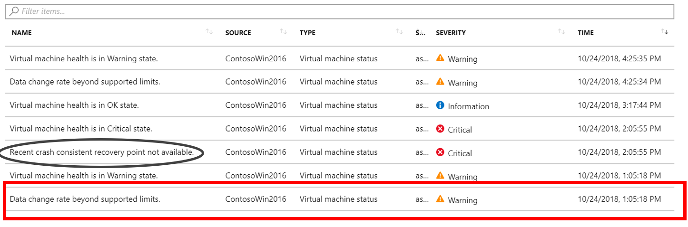
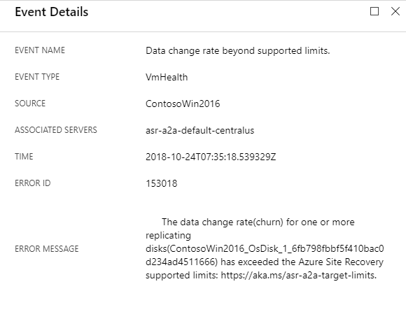

# Troubleshoot replication in Azure VM disaster recovery

This article describes common problems in Azure Site Recovery when you're replicating and recovering Azure virtual machines from one region to another region. It also explains how to troubleshoot them. For more information about supported configurations, see the [support matrix for replicating Azure VMs](site-recovery-support-matrix-azure-to-azure.md).

Azure Site Recovery consistently replicates data from the source region to the disaster recovery region and creates a crash-consistent recovery point every 5 minutes. If Site Recovery can't create recovery points for 60 minutes, it alerts you with this information:

Error message: "No crash consistent recovery point available for the VM in the last 60 minutes." 
Error ID: 153007  

The following sections describe causes and solutions.

## High data change rate on the source virtual machine
Azure Site Recovery fires an event if the data change rate on the source virtual machine is higher than the supported limits. To check if the problem is due to high churn, go to **Replicated items** > **VM** > **Events -last 72 hours**.
You should see the event “Data change rate beyond supported limits”:

If you select the event, you should see the exact disk information:

### Azure Site Recovery limits
The following table provides the Azure Site Recovery limits. These limits are based on our tests, but they can't cover all possible application I/O combinations. Actual results can vary based on your application I/O mix. 

There are two limits to consider, data churn per disk and data churn per virtual machine. For example, let's look at the Premium P20 disk in the following table. Site Recovery can handle 5 MB/s of churn per disk with a maximum of five such disks per VM, due to the limit of 25 MB/s of total churn per VM.

**Replication storage target** | **Average I/O size for source disk** |**Average data churn for source disk** | **Total data churn per day for source data disk**
---|---|---|---
Standard storage | 8 KB	| 2 MB/s | 168 GB per disk
Premium P10 or P15 disk | 8 KB	| 2 MB/s | 168 GB per disk
Premium P10 or P15 disk | 16 KB | 4 MB/s |	336 GB per disk
Premium P10 or P15 disk | 32 KB or greater | 8 MB/s | 672 GB per disk
Premium P20 or P30 or P40 or P50 disk | 8 KB	| 5 MB/s | 421 GB per disk
Premium P20 or P30 or P40 or P50 disk | 16 KB or greater |10 MB/s | 842 GB per disk

### Solution
Azure Site Recovery has limits on data change rate, based on the type of disk. To know if this problem is recurring or momentary, find the data change rate of the affected virtual machine. Go to the source virtual machine, find the metrics under **Monitoring**, and add the metrics as shown in this screenshot:

1. Select **Add metric**, and add **OS Disk Write Bytes/Sec** and **Data Disk Write Bytes/Sec**.
2. Monitor the spike as shown in the screenshot.
3. View the total write operations happening across OS disks and all data disks combined. These metrics might not give you information at the per-disk level, but they indicate the total pattern of data churn.

If a spike is from an occasional data burst and the data change rate is greater than 10 MB/s (for Premium) and 2 MB/s (for Standard) for some time and comes down, replication will catch up. But if the churn is well beyond the supported limit most of the time, consider one of these options if possible:

* **Exclude the disk that's causing a high data-change rate**: You can exclude the disk by using [PowerShell](./azure-to-azure-exclude-disks.md).To exclude the disk you have to disable the replication first. 
* **Change the tier of the disaster recovery storage disk**: This option is possible only if the disk data churn is less than 20 MB/s. Let's say a VM with a P10 disk is having a data churn of greater than 8 MB/s but less than 10 MB/s. If the customer can use a P30 disk for target storage during protection, the problem can be solved. Note that this solution is only possible for machines that are using Premium Managed Disks. Follow the below steps:
    - Navigate to the Disks blade of the impacted replicated machine and copy the replica disk name
    - Navigate to this replica managed disk
    - You may see a banner on the Overview blade saying that a SAS URL has been generated. Click on this banner and cancel the export. Ignore this step if you do not see the banner.
    - As soon as the SAS URL is revoked, go to Configuration blade of the Managed Disk and increase the size so that Site Recovery supports the observed churn rate on source disk

## Network connectivity problems

### Network latency to a cache storage account
Site Recovery sends replicated data to the cache storage account. You might see network latency if uploading the data from a virtual machine to the cache storage account is slower than 4 MB in 3 seconds. 

To check for a problem related to latency, use [azcopy](https://docs.microsoft.com/azure/storage/common/storage-use-azcopy) to upload data from the virtual machine to the cache storage account. If the latency is high, check if you're using a network virtual appliance (NVA) to control outbound network traffic from VMs. The appliance might get throttled if all the replication traffic passes through the NVA. 

We recommend creating a network service endpoint in your virtual network for "Storage" so that the replication traffic doesn't go to the NVA. For more information, see [Network virtual appliance configuration](https://docs.microsoft.com/azure/site-recovery/azure-to-azure-about-networking#network-virtual-appliance-configuration).

### Network connectivity
For Site Recovery replication to work, outbound connectivity to specific URLs or IP ranges is required from the VM. If your VM is behind a firewall or uses network security group (NSG) rules to control outbound connectivity, you might face one of these problems. To make sure all the URLs are connected, see [Outbound connectivity for Site Recovery URLs](https://docs.microsoft.com/azure/site-recovery/azure-to-azure-about-networking#outbound-connectivity-for-ip-address-ranges). 

## Error ID 153006 - No app-consistent recovery point available for the VM in the last 'XXX' minutes

Some of the most common issues are listed below

#### Cause 1: Known issue in SQL server 2008/2008 R2 
**How to fix** : There is a known issue with SQL server 2008/2008 R2. Please refer this KB article [Azure Site Recovery Agent or other non-component VSS backup fails for a server hosting SQL Server 2008 R2](https://support.microsoft.com/help/4504103/non-component-vss-backup-fails-for-server-hosting-sql-server-2008-r2)

#### Cause 2: Azure Site Recovery jobs fail on servers hosting any version of SQL Server instances with AUTO_CLOSE DBs 
**How to fix** : Refer Kb [article](https://support.microsoft.com/help/4504104/non-component-vss-backups-such-as-azure-site-recovery-jobs-fail-on-ser) 

#### Cause 3: Known issue in SQL Server 2016 and 2017
**How to fix** : Refer Kb [article](https://support.microsoft.com/help/4493364/fix-error-occurs-when-you-back-up-a-virtual-machine-with-non-component) 

#### Cause 4: You are using Storage spaces direct configuration
**How to fix** : Azure Site Recovery cannot create application consistent recovery point for Storage spaces direct configuration. Please refer article to correctly [configure the replication policy](https://docs.microsoft.com/azure/site-recovery/azure-to-azure-how-to-enable-replication-s2d-vms)

### More causes due to VSS related issues:

To troubleshoot further, Check the files on the source machine to get the exact error code for failure:
	
	C:\Program Files (x86)\Microsoft Azure Site Recovery\agent\Application Data\ApplicationPolicyLogs\vacp.log

How to locate the errors in the file?
Search for the string "vacpError"  by opening the vacp.log file in an editor
		
	Ex: vacpError:220#Following disks are in FilteringStopped state [\\.\PHYSICALDRIVE1=5, ]#220|^|224#FAILED: CheckWriterStatus().#2147754994|^|226#FAILED to revoke tags.FAILED: CheckWriterStatus().#2147754994|^|

In the above example **2147754994** is the error code that tells you about the failure as shown below

#### VSS writer is not installed - Error 2147221164 

*How to fix*: To generate application consistency tag, Azure Site Recovery uses Microsoft Volume Shadow copy Service (VSS). It installs a VSS Provider for its operation to take app consistency snapshots. This VSS Provider is installed as a service. In case the VSS Provider service is not installed, the application consistency snapshot creation fails with the error ID 0x80040154  "Class not registered".  
Refer [article for VSS writer installation troubleshooting](https://docs.microsoft.com/azure/site-recovery/vmware-azure-troubleshoot-push-install#vss-installation-failures) 

#### VSS writer is disabled - Error 2147943458

**How to fix**: To generate application consistency tag, Azure Site Recovery uses Microsoft Volume Shadow copy Service (VSS). It installs a VSS Provider for its operation to take app consistency snapshots. This VSS Provider is installed as a service. In case the VSS Provider service is disabled, the application consistency snapshot creation fails with the error ID "The specified service is disabled and cannot be started(0x80070422)".  

- If VSS is disabled,
    - Verify that the startup type of the VSS Provider service is set to **Automatic**.
    - Restart the following services:
        - VSS service
        - Azure Site Recovery VSS Provider
        - VDS service

####  VSS PROVIDER NOT_REGISTERED - Error 2147754756

**How to fix**: To generate application consistency tag, Azure Site Recovery uses Microsoft Volume Shadow copy Service (VSS). 
Check if the Azure Site Recovery  VSS Provider service is installed or not.  

- Retry the Provider installation using the following commands:
- Uninstall existing provider: C:\Program Files (x86)\Microsoft Azure Site Recovery\agent\InMageVSSProvider_Uninstall.cmd
- Reinstall: C:\Program Files (x86)\Microsoft Azure Site Recovery\agent\InMageVSSProvider_Install.cmd
 
Verify that the startup type of the VSS Provider service is set to **Automatic**.
    - Restart the following services:
        - VSS service
        - Azure Site Recovery VSS Provider
        - VDS service
