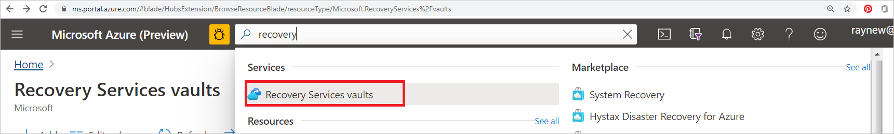
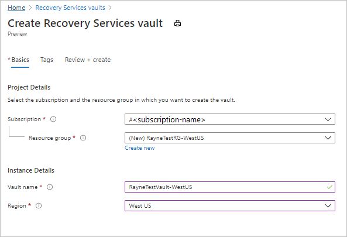
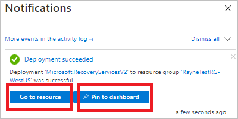
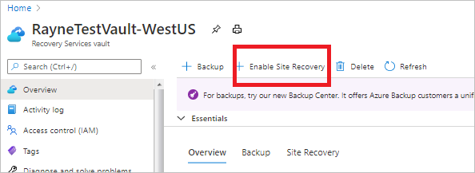
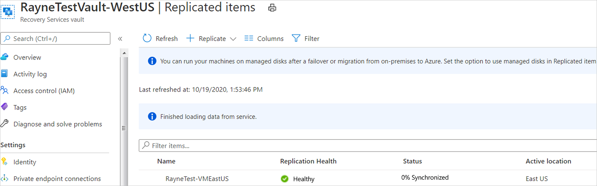

# Tutorial: Set up disaster recovery for Azure VMs

This tutorial shows you how to set up disaster recovery for Azure VMs using [Azure Site Recovery](site-recovery-overview.md). In this article, you learn how to:

> [!div class="checklist"]
> * Verify Azure settings and permissions
> * Prepare VMs you want to replicate
> * Create a Recovery Services vault
> * Enable VM replication

When you enable [replication](azure-to-azure-quickstart.md) for a VM to set up disaster recovery, the Site Recovery Mobility service extension installs on the VM, and registers it with Azure Site Recovery. During replication, VM disk writes are sent to a cache storage account in the source region. Data is sent from there to the target region, and recovery points are generated from the data. When you fail over a VM during disaster recovery, a recovery point is used to restore the VM in the target region. [Learn more](azure-to-azure-architecture.md) about the architecture.

> [!NOTE]
> Tutorials provide instructions with the simplest default settings. If you want to set up Azure VM disaster recovery with customized settings, review [this article](azure-to-azure-how-to-enable-replication.md).

If you don’t have an Azure subscription, create a [free account](https://azure.microsoft.com/free/?WT.mc_id=A261C142F) before you begin.

## Prerequisites

Before you start this tutorial:

- [Review supported regions](azure-to-azure-support-matrix.md#region-support). 
- You need one or more Azure VMs. Verify that [Windows](azure-to-azure-support-matrix.md#windows) or [Linux](azure-to-azure-support-matrix.md#replicated-machines---linux-file-systemguest-storage) VMs are supported.
- Review VM [compute](azure-to-azure-support-matrix.md#replicated-machines---compute-settings), [storage](azure-to-azure-support-matrix.md#replicated-machines---storage), and [networking](azure-to-azure-support-matrix.md#replicated-machines---networking) requirements.
- This tutorial presumes that VMs aren't encrypted. If you want to set up disaster recovery for encrypted VMs, [follow this article](azure-to-azure-how-to-enable-replication-ade-vms.md).

## Check Azure settings

Check permissions and settings in the target region.

### Check permissions

Your Azure account needs permissions to create a Recovery Services vault, and to create VMs in the target region.

- If you just created a free Azure subscription, you're the account admin, and no further action is needed.
- If you aren't the admin, work with the admin to get the permissions you need.
    - **Azure Active Directory**: Application owner and application developer roles to enable replication.
    - **Create a vault**: Admin or owner permissions on the subscription.
    - **Manage Site Recovery operations in the vault**: The *Site Recovery Contributor* built-in Azure role.
    - **Create Azure VMs in the target region**: Either the built-in *Virtual Machine Contributor* role, or specific permissions to:
        - Create a VM in the selected virtual network.
        - Write to an Azure storage account.
        - Write to an Azure-managed disk.

### Verify target settings

During disaster recovery, when you fail over from the source region, VMs are created in the target region.

Check that your subscription has enough resources in the target region. You need to be able to create VMs with sizes that match VMs in the source region. When you set up disaster recovery, Site Recovery picks the same size (or the closest possible size) for the target VM.

## Prepare VMs

Make sure VMs have outbound connectivity, and the latest root certificates.

### Set up VM connectivity

VMs that you want to replicate need outbound network connectivity.

> [!NOTE]
> Site Recovery doesn't support using an authentication proxy to control network connectivity.

#### Outbound connectivity for URLs

If you're using a URL-based firewall proxy to control outbound connectivity, allow access to these URLs:

| **Name**                  | **Commercial**                               | **Government**                                 | **Description** |
| ------------------------- | -------------------------------------------- | ---------------------------------------------- | ----------- |
| Storage                   | `*.blob.core.windows.net`                  | `*.blob.core.usgovcloudapi.net` | Allows data to be written from the VM to the cache storage account in the source region. |
| Azure Active Directory    | `login.microsoftonline.com`                | `login.microsoftonline.us`                   | Provides authorization and authentication to Site Recovery service URLs. |
| Replication               | `*.hypervrecoverymanager.windowsazure.com` | `*.hypervrecoverymanager.windowsazure.com`   | Allows the VM to communicate with the Site Recovery service. |
| Service Bus               | `*.servicebus.windows.net`                 | `*.servicebus.usgovcloudapi.net`             | Allows the VM to write Site Recovery monitoring and diagnostics data. |

#### Outbound connectivity for IP address ranges

If you're using network security groups (NSGs) to control connectivity, create a service-tag based NSG rules that allow HTTPS outbound to port 443 for these [service tags](../virtual-network/service-tags-overview.md#available-service-tags)(groups of IP addresses):

**Tag** | **Allow**
--- | ---
Storage tag	 |Allows data to be written from the VM to the cache storage account.
Azure AD tag | Allows access to all IP addresses that correspond to Azure AD.
EventsHub tag | Allows access to Site Recovery monitoring.
AzureSiteRecovery tag | Allows access to the Site Recovery service in any region.
GuestAndHybridManagement tag | Use if you want to automatically upgrade the Site Recovery Mobility agent that's running on VMs enabled for replication.

[Learn more](azure-to-azure-about-networking.md#outbound-connectivity-using-service-tags) about required tags and tagging examples.

### Verify VM certificates

Check that the VMs have the latest root certificates. Otherwise, the VM can't be registered with Site Recovery because of security constraints.

- **Windows VMs**: Install all the latest Windows updates on the VM, so that all the trusted root certificates are on the machine. In a disconnected environment, follow your standard processes for Windows Update, and certificate updates.
- **Linux VMs**: Follow the guidance provided by your Linux distributor, to get the latest trusted root certificates and certificate revocation list (CRL).

## Create a Recovery Services vault

Create a Recovery Services vault in any region, except in the source region from which you want to replicate VMs.

1. Sign in to the [Azure portal](https://portal.azure.com).
2. In the search box, type *recovery*. Under **Services**, select **Recovery Services vaults**.

    

3. In **Recovery Services vaults**, select **Add**.
4. In **Create Recovery Services vault** > **Basics**, select the subscription in which to create the vault.
5. In **Resource group**, select an existing resource group for the vault, or create a new one.
6. In **Vault name**, specify a friendly name to identify the vault.
7. In **Region**, select the Azure region in which to place the vault. [Check supported regions](https://azure.microsoft.com/pricing/details/site-recovery/).
8. Select **Review + create**.

   

9. In **Review + create**, select **Create**.

10. Vault deployment begins. Follow progress in the notifications.
11. After the vault is deployed, select **Pin to dashboard** to save it for quick reference. Select **Go to resource** to open the new vault.

    

### Enable Site Recovery

In the vault settings, select **Enable Site Recovery**.

## Enable replication

Select the source settings and enable VM replication.

### Select source settings

1. In the vault > **Site Recovery** page, under **Azure virtual machines**, select **Enable replication**.

    

2. In the **Enable replication** page, under **Source** tab, do the following:
    - **Region**: Select the source Azure region in which VMs are currently running.
    - **Subscription**: Select the subscription in which VMs are running. You can select any subscription that's in the same Azure Active Directory (Azure AD) tenant as the vault.
    - **Resource group**: Select the desired resource group from the drop-down.
    - **Virtual machine deployment model**: Retain the default **Resource Manager** setting.
    - **Disaster recovery between availability zones**: Retain the default **No** setting.
        
         :::image type="Set up source" source="./media/azure-to-azure-tutorial-enable-replication/source.png" alt-text="Screenshot showing how to set up source.":::

3. Select **Next**.

### Select the VMs

Site Recovery retrieves the VMs associated with the selected subscription/resource group.

1. In **Virtual machines**, select the VMs you want to enable for disaster recovery. You can select up to 10 VMs.

     :::image type="Virtual machine selection" source="./media/azure-to-azure-tutorial-enable-replication/virtual-machine-selection.png" alt-text="Screenshot that highlights where you select virtual machines.":::

2. Select **Next**.

### Review replication settings

1. In **Replication settings**, review the settings. Site Recovery creates default settings/policy for the target region. For the purposes of this tutorial, we use the default settings.
    >[!Note]
    >Azure Site Recovery has a *High Churn* option that you can choose to protect VMs with high data change rate. With this, you can use a *Premium Block Blob* type of storage account. By default, the **Normal Churn** option is selected. For more information, see [Azure VM Disaster Recovery - High Churn Support](./concepts-azure-to-azure-high-churn-support.md). You can select the **High Churn** option from  **Storage** > **View/edit storage configuration** > **Churn for the VM**.
    >:::image type="Churn" source="media/concepts-azure-to-azure-high-churn-support/churns.png" alt-text="Screenshot of churn."::: 

2. Select **Next**.
  
    :::image type="enable replication" source="./media/azure-to-azure-tutorial-enable-replication/enable-vm-replication.png" alt-text="Screenshot to customize settings and enable replication.":::

### Manage

1. In **Manage**, do the following:
    1. Under **Replication policy**,
       - **Replication policy**: Select the replication policy. Defines the settings for recovery point retention history and app-consistent snapshot frequency. By default, Site Recovery creates a new replication policy with default settings of 24 hours for recovery point retention.
       - **Replication group**: Create replication group to replicate VMs together to generate Multi-VM consistent recovery points. Note that enabling multi-VM consistency can impact workload performance and should only be used if machines are running the same workload and you need consistency across multiple machines.
    1. Under **Extension settings**, 
       - Select **Update settings** and **Automation account**.
         :::image type="manage" source="./media/azure-to-azure-tutorial-enable-replication/manage.png" alt-text="Screenshot showing manage tab.":::

1. Select **Next**.

### Review

In **Review**, review the VM settings and select **Enable replication**.

:::image type="vm settings" source="./media/azure-to-azure-tutorial-enable-replication/review.png" alt-text="Screenshot showing vm settings.":::

The VMs you enable appear on the vault > **Replicated items** page.

## Next steps

In this tutorial, you enabled disaster recovery for an Azure VM. Now, [run a disaster recovery drill](azure-to-azure-tutorial-dr-drill.md) to check that failover works as expected.
