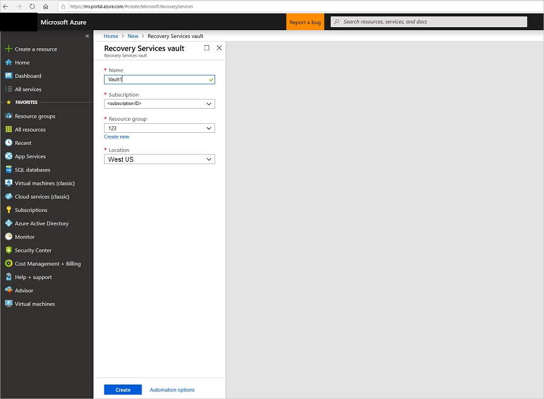
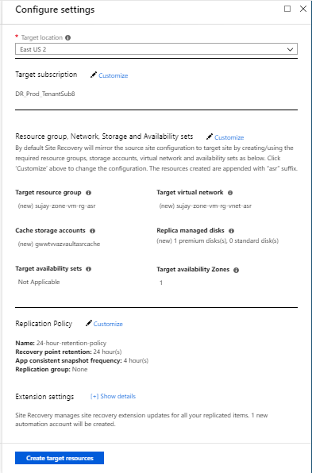

# Set up disaster recovery for Azure VMs to a secondary Azure region

The [Azure Site Recovery](site-recovery-overview.md) service contributes to your disaster recovery strategy by managing and orchestrating replication, failover, and failback of on-premises machines, and Azure virtual machines (VMs).

This tutorial shows you how to set up disaster recovery to a secondary Azure region for Azure VMs. In this tutorial, you learn how to:

> [!div class="checklist"]
> * Create a Recovery Services vault
> * Verify target resource settings
> * Set up outbound access for VMs
> * Enable replication for a VM

## Prerequisites

To complete this tutorial:

- Make sure that you understand the [scenario architecture and components](concepts-azure-to-azure-architecture.md).
- Review the [support requirements](site-recovery-support-matrix-azure-to-azure.md) for all components.

## Create a vault

Create the vault in any region, except the source region.

1. Sign in to the [Azure portal](https://portal.azure.com) > **Recovery Services**.
2. Click **Create a resource** > **Monitoring & Management** > **Backup and Site Recovery**.
3. In **Name**, specify a friendly name to identify the vault. If you have more than one
   subscription, select the appropriate one.
4. Create a resource group or select an existing one. Specify an Azure region. To check supported
   regions, see geographic availability in
   [Azure Site Recovery Pricing Details](https://azure.microsoft.com/pricing/details/site-recovery/).
5. To quickly access the vault from the dashboard, click **Pin to dashboard** and then
   click **Create**.

   

   The new vault is added to the **Dashboard** under **All resources**, and on the main **Recovery Services vaults** page.

## Verify target resources

1. Verify that your Azure subscription allows you to create VMs in the target region used for
   disaster recovery. Contact support to enable the required quota.

2. Make sure your subscription has enough resources to support VMs with sizes that match your source
   VMs. Site Recovery picks the same size or the closest possible size for the target VM.

## Configure outbound network connectivity

For Site Recovery to work as expected, you need to make some changes in outbound network connectivity,
from VMs that you want to replicate.

- Site Recovery doesn't support use of an authentication proxy to control network connectivity.
- If you have an authentication proxy, replication can't be enabled.

### Outbound connectivity for URLs

If you're using a URL-based firewall proxy to control outbound connectivity, allow access
to the following URLs used by Site Recovery.

| **URL** | **Details** |
| ------- | ----------- |
| *.blob.core.windows.net | Allows data to be written from the VM to the cache storage account in the source region. |
| login.microsoftonline.com | Provides authorization and authentication to Site Recovery service URLs. |
| *.hypervrecoverymanager.windowsazure.com | Allows the VM to communicate with the Site Recovery service. |
| *.servicebus.windows.net | Allows the VM to write Site Recovery monitoring and diagnostics data. |

### Outbound connectivity for IP address ranges

If you want to control outbound connectivity using IP addresses instead of URLs, whitelist the appropriate datacenter ranges; Office 365 addresses; and service endpoint addresses, for IP-based firewalls, proxy, or NSG rules.

  - [Microsoft Azure Datacenter IP Ranges](http://www.microsoft.com/en-us/download/details.aspx?id=41653)
  - [Windows Azure Datacenter IP Ranges in Germany](http://www.microsoft.com/en-us/download/details.aspx?id=54770)
  - [Windows Azure Datacenter IP Ranges in China](http://www.microsoft.com/en-us/download/details.aspx?id=42064)
  - [Office 365 URLs and IP address ranges](https://support.office.com/article/Office-365-URLs-and-IP-address-ranges-8548a211-3fe7-47cb-abb1-355ea5aa88a2#bkmk_identity)
  - [Site Recovery service endpoint IP addresses](https://aka.ms/site-recovery-public-ips)

You can use this [script](https://gallery.technet.microsoft.com/Azure-Recovery-script-to-0c950702) to create
required NSG rules.

## Verify Azure VM certificates

Check that all the latest root certificates are present on the Windows or Linux VMs you want to
replicate. If the latest root certificates aren't, the VM can't registered to Site
Recovery, due to security constraints.

- For Windows VMs, install all the latest Windows updates on the VM, so that all the trusted root
  certificates are on the machine. In a disconnected environment, follow the standard Windows
  Update and certificate update processes for your organization.

- For Linux VMs, follow the guidance provided by your Linux distributor, to get the latest trusted
  root certificates and certificate revocation list on the VM.

## Set permissions on the account

Azure Site Recovery provides three built-in roles to control Site Recovery management operations.

- **Site Recovery Contributor** - This role has all permissions required to manage Azure Site
  Recovery operations in a Recovery Services vault. A user with this role, however, can't create or
  delete a Recovery Services vault or assign access rights to other users. This role is best suited
  for disaster recovery administrators who can enable and manage disaster recovery for applications
  or entire organizations.

- **Site Recovery Operator** - This role has permissions to execute and manage Failover and
  Failback operations. A user with this role can't enable or disable replication, create or delete
  vaults, register new infrastructure, or assign access rights to other users. This role is best
  suited for a disaster recovery operator who can fail over virtual machines or applications when
  instructed by application owners and IT administrators. Post resolution of the disaster, the DR
  operator can reprotect and failback the virtual machines.

- **Site Recovery Reader** - This role has permissions to view all Site Recovery management
  operations. This role is best suited for an IT monitoring executive who can monitor the current
  state of protection and raise support tickets.

Learn more on [Azure RBAC built-in roles](../role-based-access-control/built-in-roles.md)

## Enable replication

### Select the source

1. In Recovery Services vaults, click the vault name > **+Replicate**.
2. In **Source**, select **Azure**.
3. In **Source location**, select the source Azure region where your VMs are currently running.
4. Select the **Azure virtual machine deployment model** for VMs: **Resource Manager** or
   **Classic**.
5. Select the **Source subscription** where the virtual machines are running. This can be any subscription within the same Azure Active Directory tenant where your recovery services vault exists.
6. Select the **Source resource group** for Resource Manager VMs, or **cloud service** for classic
      VMs.
7. Click **OK** to save the settings.

### Select the VMs

Site Recovery retrieves a list of the VMs associated with the subscription and resource group/cloud service.

1. In **Virtual Machines**, select the VMs you want to replicate.
2. Click **OK**.

### Configure replication settings

Site Recovery creates default settings and replication policy for the target region. You can change the settings based on
your requirements.

1. Click **Settings** to view the target and replication settings.
2. To override the default target settings, click **Customize** next to **Resource group, Network, Storage and Availability Sets**.

  

- **Target subscription**: The target subscription used for disaster recovery. By default, the target subscription will be same as the source subscription. Click 'Customize' to select a different target subscription within the same Azure Active Directory tenant.

- **Target location**: The target region used for disaster recovery. We recommend that the target
  location matches the location of the Site Recovery vault.

- **Target resource group**: The resource group in the target region that holds Azure VMs after
  failover. By default, Site Recovery creates a new resource group in the target region with an
  "asr" suffix. resource group location of the target resource group can be any region except the
region where your source virtual machines are hosted.

- **Target virtual network**: The network in the target region that VMs are located after failover.
  By default, Site Recovery creates a new virtual network (and subnets) in the target region with
  an "asr" suffix.

- **Cache storage accounts**: Site Recovery uses a storage account in the source region. Changes to
  source VMs are sent to this account before replication to the target location.

- **Target storage accounts (If source VM does not use managed disks)**: By default, Site Recovery creates a new storage account in the
  target region to mirror the source VM storage account.

- **Replica managed disks (If source VM uses managed disks)**: By default, Site Recovery creates replica managed disks in the
  target region to mirror the source VM's managed disks with the same storage type (Standard or premium) as the source VM's managed disk.

- **Target availability sets**: By default, Site Recovery creates a new availability set in the
  target region with the "asr" suffix. You can only add availability sets if VMs are part of a set in the source region.

To override the default replication policy settings, click **Customize** next to **Replication policy**.  

- **Replication policy name**: Policy name.

- **Recovery point retention**: By default, Site Recovery keeps recovery points for 24 hours. You
  can configure a value between 1 and 72 hours.

- **App-consistent snapshot frequency**: By default, Site Recovery takes an app-consistent snapshot
  every 4 hours. You can configure any value between 1 and 12 hours. A app-consistent snapshot is a point-in-time snapshot of the application data inside the VM. Volume Shadow Copy Service (VSS) ensures that app on the VM are in a consistent state when the snapshot is taken.

- **Replication group**: If your application needs multi-VM consistency across VMs, you can create a replication group for those VMs. By default, the selected VMs are not part of any replication group.

  Click **Customize** next to **Replication policy** and then select **Yes** for multi-VM consistency to make VMs part of a replication group. You can create a new replication group or use an existing replication group. Select the VMs to be part of the replication group and click **OK**.

> [!IMPORTANT]
  All the machines in a replication group will have shared crash consistent and app-consistent recovery points when failed over. Enabling multi-VM consistency can impact workload performance and should be used only if machines are running the same workload and you need consistency across multiple machines.

> [!IMPORTANT]
  If you enable multi-VM consistency, machines in the replication group communicate with each other over port 20004. Ensure that there is no firewall appliance blocking the internal communication between the VMs over port 20004. If you want Linux VMs to be part of a replication group, ensure the outbound traffic on port 20004 is manually opened as per the guidance of the specific Linux version.

### Configure encryption settings

If the source virtual machine has Azure disk encryption (ADE) enabled, the below encryption settings section will appear.

- **Disk encryption key vaults**: By default, Azure Site Recovery creates a new key vault in the target region with name having "asr" suffix based on the source VM disk encryption keys. In case key vault created by Azure Site Recovery already exists, it is reused.
- **Key encryption key vaults**: By default, Azure Site Recovery creates a new key vault in the target region with name having "asr" suffix based on the source VM key encryption keys. In case key vault created by Azure Site Recovery already exists, it is reused.

Click 'Customize' next to encryption settings to override the defaults and select custom key vaults.

>[!NOTE]
>Only Azure VMs running Windows OS and [enabled for encryption with Azure AD app](https://aka.ms/ade-aad-app) are currently supported by Azure Site Recovery.
>

### Track replication status

1. In **Settings**, click **Refresh** to get the latest status.

2. You can track progress of the **Enable protection** job in **Settings** > **Jobs** > **Site
   Recovery Jobs**.

3. In **Settings** > **Replicated Items**, you can view the status of VMs and the initial
   replication progress. Click the VM to drill down into its settings.

## Next steps

In this tutorial, you configured disaster recovery for an Azure VM. Next step is to test your configuration.

> [!div class="nextstepaction"]
> [Run a disaster recovery drill](azure-to-azure-tutorial-dr-drill.md)
