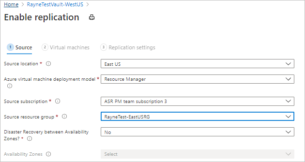

# Set up disaster recovery for Azure VMs

The [Azure Site Recovery](site-recovery-overview.md) service contributes to your disaster recovery strategy by managing and orchestrating replication, failover, and failback of on-premises machines and Azure virtual machines (VMs).

This tutorial shows you how to set up disaster recovery for Azure VMs by replicating them from one Azure region to another. In this tutorial, you learn how to:

> [!div class="checklist"]
> * Create a Recovery Services vault
> * Verify target resource settings
> * Set up outbound network connectivity for VMs
> * Enable replication for a VM

> [!NOTE]
> This article provides instructions for deploying disaster recovery with the simplest settings. If you want to learn about customized settings, review the articles under the [How To section](azure-to-azure-how-to-enable-replication.md).

## Prerequisites

To complete this tutorial:

- Review the [scenario architecture and components](concepts-azure-to-azure-architecture.md).
- Review the [support requirements](site-recovery-support-matrix-azure-to-azure.md) before you start.

## Create a Recovery Services vault

Create the vault in any region, except the source region.

1. Sign in to the [Azure portal](https://portal.azure.com) > **Recovery Services**.
2. Click **Create a resource** > **Management Tools** > **Backup and Site Recovery**.
3. In **Name**, specify a friendly name to identify the vault. If you have more than one
   subscription, select the appropriate one.
4. Create a resource group or select an existing one. Specify an Azure region. To check supported
   regions, see geographic availability in
   [Azure Site Recovery Pricing Details](https://azure.microsoft.com/pricing/details/site-recovery/).
5. To quickly access the vault from the dashboard, click **Pin to dashboard** and then
   click **Create**.

   

   The new vault is added to the **Dashboard** under **All resources**, and on the main **Recovery Services vaults** page.

## Verify target resource settings

1. Verify that your Azure subscription allows you to create VMs in the target region. Contact support to enable the required quota.
2. Make sure your subscription has enough resources to support VM sizes that match your source
   VMs. Site Recovery picks the same size, or the closest possible size, for the target VM.

## Set up outbound network connectivity for VMs

For Site Recovery to work as expected, you need to modify outbound network connectivity from the VMs that you want to replicate.

> [!NOTE]
> Site Recovery doesn't support using an authentication proxy to control network connectivity.

### Outbound connectivity for URLs

If you're using a URL-based firewall proxy to control outbound connectivity, allow access to these URLs.

| **URL** | **Details** |
| ------- | ----------- |
| *.blob.core.windows.net | Allows data to be written from the VM to the cache storage account in the source region. |
| login.microsoftonline.com | Provides authorization and authentication to Site Recovery service URLs. |
| *.hypervrecoverymanager.windowsazure.com | Allows the VM to communicate with the Site Recovery service. |
| *.servicebus.windows.net | Allows the VM to write Site Recovery monitoring and diagnostics data. |

### Outbound connectivity for IP address ranges

If you want to control outbound connectivity using IP addresses instead of URLs, allow these addresses for IP-based firewalls, proxy, or NSG rules.

  - [Microsoft Azure Datacenter IP Ranges](https://www.microsoft.com/download/details.aspx?id=41653)
  - [Windows Azure Datacenter IP Ranges in Germany](https://www.microsoft.com/download/details.aspx?id=54770)
  - [Windows Azure Datacenter IP Ranges in China](https://www.microsoft.com/download/details.aspx?id=42064)
  - [Office 365 URLs and IP address ranges](https://support.office.com/article/Office-365-URLs-and-IP-address-ranges-8548a211-3fe7-47cb-abb1-355ea5aa88a2#bkmk_identity)
  - [Site Recovery service endpoint IP addresses](https://aka.ms/site-recovery-public-ips)

If you're using NSG you can create a storage service tag NSG rules for the source region. [Learn more](azure-to-azure-about-networking.md#outbound-connectivity-for-ip-address-ranges).

## Verify Azure VM certificates

Check that the VMs you want to replicate have the latest root certificates. If they don't the VM can't registered to Site Recovery, due to security constraints.

- For Windows VMs, install all the latest Windows updates on the VM, so that all the trusted root certificates are on the machine. In a disconnected environment, follow the standard Windows Update and certificate update processes for your organization.
- For Linux VMs, follow the guidance provided by your Linux distributor, to get the latest trusted root certificates and certificate revocation list on the VM.

## Set permissions on the account

Azure Site Recovery provides three built-in roles to control Site Recovery management operations.

- **Site Recovery Contributor** - This role has all permissions required to manage Azure Site
  Recovery operations in a Recovery Services vault. A user with this role, however, can't create or
  delete a Recovery Services vault or assign access rights to other users. This role is best suited
  for disaster recovery administrators who can enable and manage disaster recovery for applications
  or entire organizations.

- **Site Recovery Operator** - This role has permissions to execute and manage Failover and
  Failback operations. A user with this role can't enable or disable replication, create or delete
  vaults, register new infrastructure, or assign access rights to other users. This role is best
  suited for a disaster recovery operator who can fail over virtual machines or applications when
  instructed by application owners and IT administrators. Post resolution of the disaster, the DR
  operator can reprotect and failback the virtual machines.

- **Site Recovery Reader** - This role has permissions to view all Site Recovery management
  operations. This role is best suited for an IT monitoring executive who can monitor the current
  state of protection and raise support tickets.

Learn more about [Azure RBAC built-in roles](../role-based-access-control/built-in-roles.md).

## Enable replication for a VM

### Select the source

1. In Recovery Services vaults, click the vault name > **+Replicate**.
2. In **Source**, select **Azure**.
3. In **Source location**, select the source Azure region where your VMs are currently running.
4. Select the **Source subscription** where the virtual machines are running. This can be any subscription within the same Azure Active Directory tenant where your recovery services vault exists.
5. Select the **Source resource group**, and click **OK** to save the settings.

    

### Select the VMs

Site Recovery retrieves a list of the VMs associated with the subscription and resource group/cloud service.

1. In **Virtual Machines**, select the VMs you want to replicate.
2. Click **OK**.

### Configure replication settings

Site Recovery creates default settings and replication policy for the target region. You can change the settings as required.

1. Click **Settings** to view the target and replication settings.
2. To override the default target settings, click **Customize** next to **Resource group, Network, Storage and Availability**.

   

3. Customize target settings as summarized in the table.

    **Setting** | **Details**
    --- | ---
    **Target subscription** | By default, the target subscription is the same as the source subscription. Click 'Customize' to select a different target subscription within the same Azure Active Directory tenant.
    **Target location** | The target region used for disaster recovery.   We recommend that the target location matches the location of the Site Recovery vault.
    **Target resource group** | The resource group in the target region that holds Azure VMs after failover.   By default, Site Recovery creates a new resource group in the target region with an "asr" suffix. The location of the target resource group can be any region except the region in which your source virtual machines are hosted.
    **Target virtual network** | The network in the target region that VMs are located after failover.   By default, Site Recovery creates a new virtual network (and subnets) in the target region with an "asr" suffix.
    **Cache storage accounts** | Site Recovery uses a storage account in the source region. Changes to source VMs are sent to this account before replication to the target location.   If you are using a firewall-enabled cache storage account, make sure that you enable **Allow trusted Microsoft services**. [Learn more.](https://docs.microsoft.com/azure/storage/common/storage-network-security#exceptions)
    **Target storage accounts (source VM uses non-managed disks)** | By default, Site Recovery creates a new storage account in the target region to mirror the source VM storage account.   Enable **Allow trusted Microsoft services** if you're using a firewall-enabled cache storage account.
    **Replica managed disks (If source VM uses managed disks)** | By default, Site Recovery creates replica managed disks in the target region to mirror the source VM's managed disks with the same storage type (Standard or premium) as the source VM's managed disk. You can only customize Disk type 
    **Target availability sets** | By default, Azure Site Recovery creates a new availability set in the target region with name having "asr" suffix for the VMs part of an availability set in source region. In case availability set created by Azure Site Recovery already exists, it is reused.
    **Target availability zones** | By default, Site Recovery assigns the same zone number as the source region in target region if the target region supports availability zones.   If the target region doesn't support availability zones, the target VMs are configured as single instances by default.   Click **Customize** to configure VMs as part of an availability set in the target region.   You can't change the availability type (single instance, availability set or availability zone) after you enable replication. You need to disable and enable replication to change the availability type.

4. To customize replication policy settings, click **Customize** next to **Replication policy**, and modify the settings as needed.

    **Setting** | **Details**
    --- | ---
    **Replication policy name** | Policy name.
    **Recovery point retention** | By default, Site Recovery keeps recovery points for 24 hours. You can configure a value between 1 and 72 hours.
    **App-consistent snapshot frequency** | By default, Site Recovery takes an app-consistent snapshot every 4 hours. You can configure any value between 1 and 12 hours.   An app-consistent snapshot is a point-in-time snapshot of the application data inside the VM. Volume Shadow Copy Service (VSS) ensures that app on the VM are in a consistent state when the snapshot is taken.
    **Replication group** | If your application needs multi-VM consistency across VMs, you can create a replication group for those VMs. By default, the selected VMs are not part of any replication group.

5. In **Customize**, select **Yes** for multi-VM consistency if you want to add VMs to a new or existing replication group. Then click **OK**. 

    >[!NOTE]
    >- All the machines in a replication group have shared crash consistent and app-consistent recovery points when failed over.
    >- Enabling multi-VM consistency can impact workload performance (it's CPU intensive). It should be used only if machines are running the same workload, and you need consistency across multiple machines.
    >- You can have a maximum of 16 VMs in a replication group.
    >- If you enable multi-VM consistency, machines in the replication group communicate with each other over port 20004. Make sure there's no firewall blocking the internal communication between the VMs over this port.
    >- For Linux VMs in a replication group, ensure the outbound traffic on port 20004 is manually opened in accordance with guidance for the Linux version.

### Configure encryption settings

If the source VM has Azure disk encryption (ADE) enabled, review the settings.

1. Verify the settings:
    - **Disk encryption key vaults**: By default, Site Recovery creates a new key vault on the source VM disk encryption keys, with an "asr" suffix. If the key vault already exists, it is reused.
    - **Key encryption key vaults**: By default, Site Recovery creates a new key vault in the target region. The name has an "asr" suffix, and is based on the source VM key encryption keys. If the key vault created by Site Recovery already exists, it's reused.

2. Click **Customize** to select custom key vaults.

>[!NOTE]
>Only Azure VMs running Windows operating systems and [enabled for encryption with Azure AD app](https://aka.ms/ade-aad-app) are currently supported by Azure Site Recovery.
>

### Track replication status

1. In **Settings**, click **Refresh** to get the latest status.
2. Track progress and status as follows:
    - Track progress of the **Enable protection** job in **Settings** > **Jobs** > **Site Recovery Jobs**.
    - In **Settings** > **Replicated Items**, you can view the status of VMs and the initial
   replication progress. Click the VM to drill down into its settings.

## Next steps

In this tutorial, you configured disaster recovery for an Azure VM. Now you can initiate a disaster recovery drill to check that failover is working as expected.

> [!div class="nextstepaction"]
> [Run a disaster recovery drill](azure-to-azure-tutorial-dr-drill.md)
