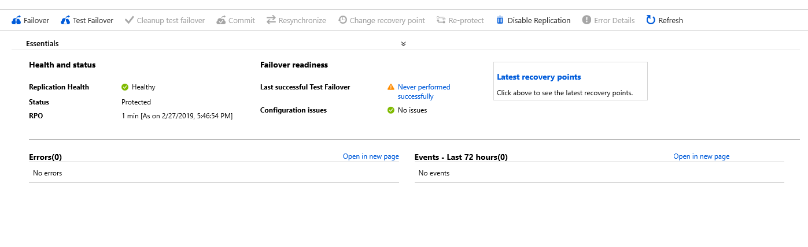

# Fail back an Azure VM between Azure regions

The [Azure Site Recovery](site-recovery-overview.md) service contributes to your disaster recovery strategy by managing and orchestrating replication, failover, and failback of on-premises machines and Azure virtual machines (VMs).

This tutorial describes how to fail back a single Azure VM. After you've failed over, you must fail back to the primary region when it's available. In this tutorial, you learn how to:

> [!div class="checklist"]
> 
> * Fail back the VM in the secondary region.
> * Reprotect the primary VM back to the secondary region.
> 
> [!NOTE]
> 
> This tutorial helps you to fail over a few VMs to a target region and back to the source region with minimum customizations. For more in-depth instructions, review the [how-to guides on Azure VMs](https://docs.microsoft.com/azure/virtual-machines/windows/).

## Before you start

* Make sure that the status of the VM is **Failover committed**.
* Check that the primary region is available, and that you're able to create and access new resources in it.
* Make sure that reprotection is enabled.

## Fail back to the primary region

After VMs are reprotected, you can fail back to the primary region as needed.

1. In the vault, select **Replicated items**, and then select the VM that was reprotected.

    

3. Select **Test failover** to perform a test failover back to the primary region.
4. Select the recovery point and virtual network for the test failover, and then select **OK**. You can review the test VM created in the primary region.
5. After the test failover finishes successfully, select **Cleanup test failover** to clean up resources created in the source region for the test failover.
6. In **Replicated items**, select the VM, and then select **Failover**.
7. In **Failover**, select a recovery point to fail over to:
    - **Latest (default)**: Processes all the data in the Site Recovery service and provides the lowest recovery point objective (RPO).
    - **Latest processed**: Reverts the VM to the latest recovery point that has been processed by Site Recovery.
    - **Custom**: Fails over to a particular recovery point. This option is useful for performing a test failover.

8. Select **Shut down machine before beginning failover** if you want Site Recovery to attempt a shutdown of source VMs before triggering the failover. The failover continues even if shutdown fails. Note that Site Recovery doesn't clean up the source after failover.
9. Follow the failover progress on the **Jobs** page.
10. After the failover is complete, validate the VM by logging in to it. You can change the recovery point as needed.
11. After you've verified the failover, select **Commit the failover**. Committing deletes all the available recovery points. The change recovery point option is no longer available.
12. The VM should show as failed over and failed back.

    

> [!NOTE]
> The disaster recovery VMs will remain in the shutdown/deallocated state. This is by design because Site Recovery saves the VM information, which might be useful for failover from the primary to the secondary region later. You aren't charged for the deallocated VMs, so they should be kept as they are.

## Next steps

[Learn more](azure-to-azure-how-to-reprotect.md#what-happens-during-reprotection) about the reprotection flow.
