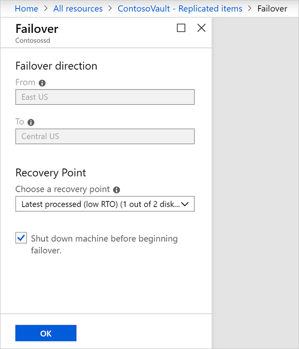

# Fail over and reprotect Azure VMs between regions

This tutorial describes how to fail over an Azure virtual machine (VM) to a secondary Azure region with the [Azure Site Recovery](site-recovery-overview.md) service. After you've failed over, you reprotect the VM. In this tutorial, you learn how to:

> [!div class="checklist"]
> * Fail over the Azure VM
> * Reprotect the secondary Azure VM, so that it replicates to the primary region.

> [!NOTE]
> This tutorial contains the simplest path with default settings and minimum customization. For more complex scenarios, use the articles under 'How To' for Azure VMs.

## Prerequisites

- Before you start, review [frequently asked questions](site-recovery-faq.md#failover) about failover.
- Make sure that you've completed a [disaster recovery drill](azure-to-azure-tutorial-dr-drill.md) to check everything is working as expected.
- Verify the VM properties before you run the test failover. The VM must comply with [Azure requirements](azure-to-azure-support-matrix.md#replicated-machine-operating-systems).

## Run a failover to the secondary region

1. In **Replicated items**, select the VM that you want to fail over > **Failover**

   

2. In **Failover**, select a **Recovery Point** to fail over to. You can use one of the
   following options:

   * **Latest** (default): Processes all the data in the Site Recovery service and
     provides the lowest Recovery Point Objective (RPO).
   * **Latest processed**: Reverts the virtual machine to the latest recovery point that
     has been processed by Site Recovery service.
   * **Custom**: Fails over to a particular recovery point. This option is useful
     for performing a test failover.

3. Select **Shut down machine before beginning failover** if you want Site Recovery to attempt to
   do a shutdown of source VMs before triggering the failover. Shutdown helps to ensure no data loss. Failover continues even
   if shutdown fails. Site Recovery does not clean up the source after failover.

4. Follow the failover progress on the **Jobs** page.

5. After the failover, validate the virtual machine by logging in to it. If you want to go another
   recovery point for the virtual machine, then you can use **Change recovery point** option.

6. Once you are satisfied with the failed over virtual machine, you can **Commit** the failover.
   Committing deletes all the recovery points available with the service. You won't now be able to change the recovery point.

> [!NOTE]
> When you fail over a VM to which you add a disk after you enabled replication for the VM, replication points will show the disks that are available for recovery. For example, if a VM has a single disk and you add a new one, replication points that were created before you added the disk will show that the replication point consists of "1 of 2 disks".

## Reprotect the secondary VM

After failover of the VM, you need to reprotect it so that it replicates back to the primary region.

1. Make sure that the VM is in the **Failover committed** state, and check that the primary region is available, and you're able to create and access new resources in it.
2. In **Vault** > **Replicated items**, right-click the VM that's been failed over, and then select **Re-Protect**.

   

2. Verify that the direction of protection, secondary to primary region, is already selected.
3. Review the **Resource group, Network, Storage, and Availability sets** information. Any
   resources marked as new are created as part of the reprotect operation.
4. Click **OK** to trigger a reprotect job. This job seeds the target site with the latest data. Then, it replicates the deltas to the primary region. The VM is now in a protected state.

## Next steps
- After reprotecting, [learn how to](azure-to-azure-tutorial-failback.md) fail back to the primary region when it's available.
- [Learn more](azure-to-azure-how-to-reprotect.md#what-happens-during-reprotection) about the reprotection flow.
