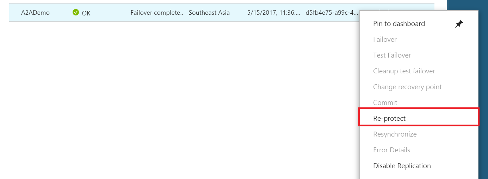

# Fail over and fail back Azure VMs between Azure regions

The [Azure Site Recovery](site-recovery-overview.md) service contributes to your disaster recovery strategy by managing and orchestrating replication, failover, and failback of on-premises machines, and Azure virtual machines (VMs).

This tutorial describes how to fail over a single Azure VM to a secondary Azure region. After you've failed over, you fail back to the primary region when it's available. In this tutorial, you learn how to:

> [!div class="checklist"]
> * Fail over the Azure VM
> * Reprotect the secondary Azure VM, so that it replicates to the primary region
> * Fail back the secondary VM
> * Reprotect the primary VM back to the secondary region

## Prerequisites

- Make that you've completed a [disaster recovery drill](azure-to-azure-tutorial-dr-drill.md) to check everything is working as
expected.
- Verify the VM properties before you run the test failover. The VM must comply with [Azure requirements](azure-to-azure-support-matrix.md#support-for-replicated-machine-os-versions).

## Run a failover to the secondary region

1. In **Replicated items**, select the VM that you want to fail over > **Failover**

   

2. In **Failover**, select a **Recovery Point** to fail over to. You can use one of the
   following options:

   * **Latest** (default): This option processes all the data in the Site Recovery service and
     provides the lowest Recovery Point Objective (RPO).
   * **Latest processed**: This option reverts the virtual machine to the latest recovery point that
     has been processed by Site Recovery service.
   * **Custom**: Use this option to fail over to a particular recovery point. This option is useful
     for performing a test failover.

3. Select **Shut down machine before beginning failover** if you want Site Recovery to attempt to
   do a shutdown of source virtual machines before triggering the failover. Failover continues even
   if shutdown fails.

4. Follow the failover progress on the **Jobs** page.

5. After the failover, validate the virtual machine by logging in to it. If you want to go another
   recovery point for the virtual machine, then you can use **Change recovery point** option.

6. Once you are satisfied with the failed over virtual machine, you can **Commit** the failover.
   Committing deletes all the recovery points available with the service. The **Change recovery
   point** option is no longer available.

## Reprotect the secondary VM

After failover of the VM, you need to reprotect it so that it replicates back to the primary region.

1. Make sure that the VM is in the **Failover committed** state, and check that the primary region is available, and you're able to create and access new resources in it.
2. In **Vault** > **Replicated items**, right-click the VM that's been failed over, and then select **Re-Protect**.

   

2. Notice that the direction of protection, secondary to primary region, is already selected.
3. Review the **Resource group, Network, Storage, and Availability sets** information. Any
   resources marked (new) are created as part of the reprotect operation.
4. Click **OK** to trigger a reprotect job. This job seeds the target site with the latest data. Then, it replicates the deltas to the primary region. The VM is now in a protected state.

## Fail back to the primary region

After VMs are reprotected,  you can fail back to the primary region as you need to. To do this, set up a failover from the secondary to primary region, as described in this article.
