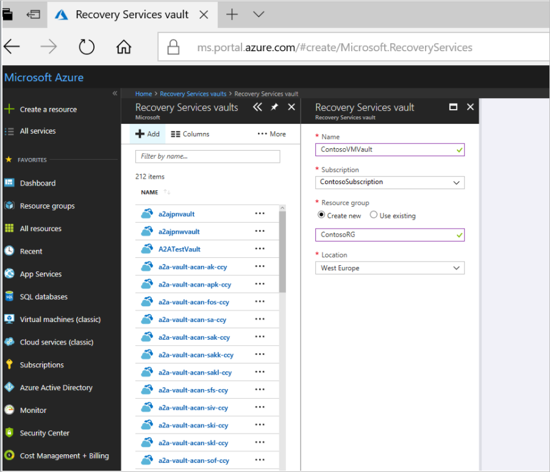

# Migrate Azure VMs to another region

In addition to using the [Azure Site Recovery](site-recovery-overview.md) service to manage and orchestrate disaster recovery of on-premises machines and Azure VMs for the purposes of business continuity and disaster recovery (BCDR), you can also use Site Recovery to manage migration of Azure VMs to a secondary region. To migrate Azure VMs, you enable replication for them, and fail them over from the primary region to the secondary region of your choice.

This tutorial shows you how to migrate Azure VMs to another region. In this tutorial, you learn how to:

> [!div class="checklist"]
> * Create a Recovery services vault
> * Enable replication for a VM
> * Run a failover to migrate the VM

This tutorial presumes you already have an Azure subscription. If you don't, create a [free account](https://azure.microsoft.com/pricing/free-trial/) before you begin.

## Prerequisites

- Make sure you have Azure VMs in the Azure region from which you want to migrate.
- Make sure that you understand the [scenario architecture and components](azure-to-azure-architecture.md).
- Review the [support limitations and requirements](azure-to-azure-support-matrix.md).

## Before you start

Before you set up replication, complete these steps.

### Verify target resources

1. Verify that your Azure subscription allows you to create VMs in the target region used for disaster recovery. Contact support to enable the required quota.

2. Make sure your subscription has enough resources to support VMs with sizes that match your source VMs. Site Recovery picks the same size or the closest possible size for the target VM.

### Verify account permissions

If you have just created your free Azure account then you are the administrator of your subscription. If you are not the subscription administrator, work with the administrator to assign the permissions you need. To enable replication for a new VM, you must have:

1. Permissions to create a VM in Azure resources. The 'Virtual Machine Contributor' built-in role has these permissions, which include:
    - Permission to create a VM in the selected resource group
    - Permission to create a VM in the selected virtual network
    - Permission to write to the selected storage account

2. You also need permission to manage Azure Site Recovery operations. The 'Site Recovery Contributor' role has all permissions required to manage Site Recovery operations in a Recovery Services vault.

### Verify VM outbound access

1. Make sure you're not using an authentication proxy to control network connectivity for VMs you want to migrate. 
2. For the purposes of this tutorial we assume that the VMs you want to migrate can access the internet, and are not using a firewall proxy to control outbound access. If you are, check the requirements [here](azure-to-azure-tutorial-enable-replication.md#configure-outbound-network-connectivity).

### Verify VM certificates

Check that all the latest root certificates are present on the Azure VMs you want to migrate. If the latest root certificates aren't, the VM can't be registered to Site
Recovery, due to security constraints.

- For Windows VMs, install all the latest Windows updates on the VM, so that all the trusted root certificates are on the machine. In a disconnected environment, follow the standard Windows Update and certificate update processes for your organization.
- For Linux VMs, follow the guidance provided by your Linux distributor, to get the latest trusted root certificates and certificate revocation list on the VM.

## Create a vault

Create the vault in any region, except the source region.

1. Sign in to the [Azure portal](https://portal.azure.com) > **Recovery Services**.
2. Click **Create a resource** > **Monitoring & Management** > **Backup and Site Recovery**.
3. In **Name**, specify the friendly name **ContosoVMVault**. If you have more than one
   subscription, select the appropriate one.
4. Create a resource group **ContosoRG**.
5. Specify an Azure region. To check supported regions, see geographic availability in [Azure Site Recovery Pricing Details](https://azure.microsoft.com/pricing/details/site-recovery/).
6. To quickly access the vault from the dashboard, click **Pin to dashboard** and then click **Create**.

   

The new vault is added to the **Dashboard** under **All resources**, and on the main **Recovery Services vaults** page.

## Select the source

1. In Recovery Services vaults, click **ConsotoVMVault** > **+Replicate**.
2. In **Source**, select **Azure**.
3. In **Source location**, select the source Azure region where your VMs are currently running.
4. Select the Resource Manager deployment model. Then select the **Source resource group**.
5. Click **OK** to save the settings.

## Enable replication for Azure VMs

Site Recovery retrieves a list of the VMs associated with the subscription and resource group.

1. In the Azure portal, click **Virtual machines**.
2. Select the VM you want to migrate. Then click **OK**.
3. In **Settings**, click **Disaster recovery**.
4. In **Configure disaster recovery** > **Target region** select the target region to which you'll replicate.
5. For this tutorial, accept the other default settings.
6. Click **Enable replication**. This starts a job to enable replication for the VM.

    

 

## Run a failover

1. In **Settings** > **Replicated items**, click the machine, and then click **Failover**.
2. In **Failover**, select **Latest**. The encryption key setting isn't relevant for this scenario.
3. Select **Shut down machine before beginning failover**. Site Recovery attempts to shut down the source VM before triggering the failover. Failover continues even if shutdown fails. You can follow the failover progress on the **Jobs** page.
4. Check that the Azure VM appears in Azure as expected.
5. In **Replicated items**, right-click the VM > **Commit**. This finishes the migration process,
6. After the commit finishes, click **Disable Replication**.  This stops replication for the VM.

## Next steps

In this tutorial you migrated an Azure VM to a different Azure region. Now you can configure disaster recovery for the migrated VM.

> [!div class="nextstepaction"]
> [Set up disaster recovery after migration](azure-to-azure-quickstart.md)

