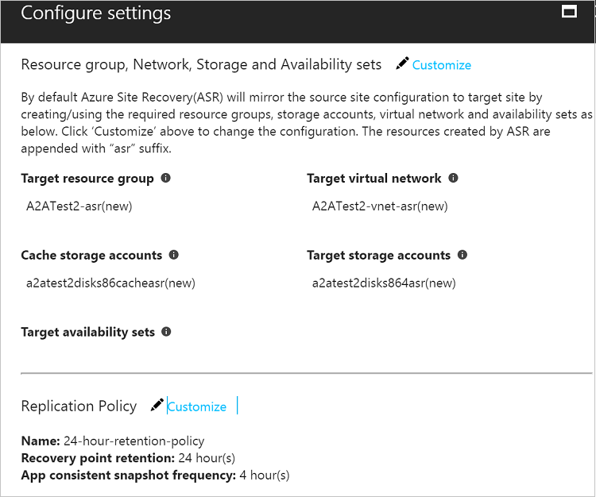
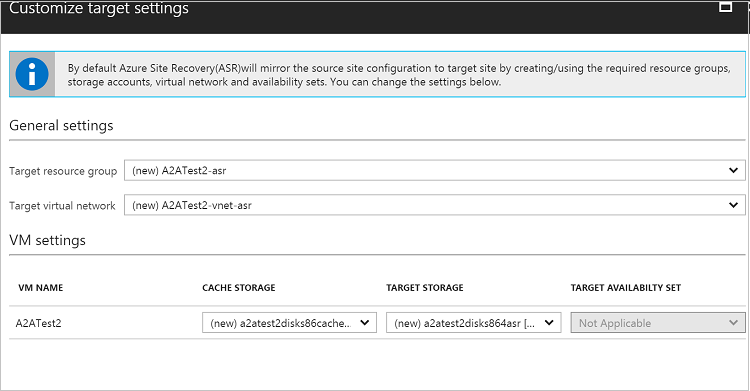
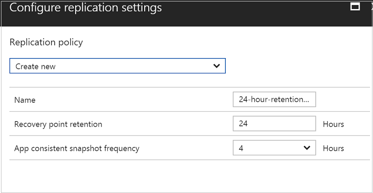

# Step 5: Enable replication for Azure VMs

After setting up a [Recovery Services vault](azure-to-azure-walkthrough-vault.md), use this article to enable replication of virtual machines (VMs), to another Azure region, with [Azure Site Recovery](site-recovery-overview.md). To enable replication, you set up source and target settings, verify the replication policy, and select VMs you want to replicate.

- When you finish the article, your Azure VMs should be replicating to the secondary Azure region.
- Post any comments at the bottom of this article, or ask questions in the [Azure Recovery Services Forum](https://social.msdn.microsoft.com/forums/azure/home?forum=hypervrecovmgr)

>[!NOTE]
>
> Azure VM replication is currently in preview.

## Select the source 

1. In Recovery Services vaults, click the vault name > **+Replicate**.
2. In **Source**, select **Azure - PREVIEW**.
2. In **Source location**, select the source Azure region where your VMs are currently running.
3. Select the **Azure virtual machine deployment model** for VMs: **Resource Manager** or **Classic**.
4. Select the **Source resource group** for Resource Manager VMs, or **cloud service** for classic VMs.
5. Click **OK** to save the settings.

    

## Select the VMs

Site Recovery retrieves a list of the VMs associated with the subscription and resource group/cloud service.

1. In **Virtual Machines**, select the VMs you want to replicate.
2. Click **OK**.

    

## Configure settings

Site Recovery provisions default settings for the target region (based on the source region settings), and the replication policy:

   - **Target location**: The target region you want to use for disaster recovery. We recommend that the target location matches the location of the Site Recovery vault.
   - **Target resource group**: Resource group to which Azure VMs in the target region will belong after failover. By default, Site Recovery creates a new resource group in the target region with an "asr" suffix. 
   - **Target virtual network**: The network in which Azure VMs in the target region will be located after failover. By default, Site Recovery creates a new virtual network (and subnets) in the target region with an "asr" suffix. This network is mapped to your source network. Note that you can assign a specific IP address after failover of a VM, if you need to retain the same IP address in the source and target locations. 
   - **Cache storage accounts**: Site Recovery uses a storage account in the source region. Changes on source VMs are sent to this account, before replication to the target location. 
   - **Target storage accounts**: By default, Site Recovery creates a new storage account in the target region, to mirror the source VM storage account.
   -  **Target availability sets**: By default, Site Recovery creates a new availability set in the target region, with the "asr" suffix. 
   - **Replication policy name**: Policy name.
   - **Recovery point retention**: By default Site Recovery keeps recovery points for 24 hours. You can configure a value between 1 and 72 hours.
   - **App-consistent snapshot frequency**: By default Site Recovery takes an app-consistent snapshot every 4 hours. You can configure any value between 1 and 12 hours. Data is replicated continuously:
    - Crash-consistent recovery points maintain consistent data write-order when created. This type of recovery point is usually sufficient if your app is designed to recover from a crash without data inconsistencies
    - Crash-consistent recovery points are generated every few minutes. Using these recovery points to fail over and recover your VMs provides a Recovery Point Objective (RPO) in the order of minutes.
    - App-consistent recovery points (in addition to write-order consistency) ensure that running apps complete all operations and flush buffers to disk (application quiescing). We recommend you use these recovery points for database apps such as SQL Server, Oracle, and Exchange.
        
    

### Modify settings

If you want to modify target and replication policy settings, do the following:

1. To view or modify target settings, click **Settings**.
2. To override the default target settings, click **Customize**. You can specify a target resource group, virtual network, availability set, and target storage account. You can only add availability sets if VMs are part of a set in the source region.

    

3. To override replication settings for recovery points and app-consistent snapshots, click **Customize** next to **Replication Policy**.
 
    

4. To start provisioning the target resources, click **Create target resources**. Provisioning takes a minute or so. Don't close the blade during provisioning, or you'll have to start over.

## Enable replication

1. In **Settings**, click **Enable replication**. This enables initial replication of the VMs you selected. Initial replication status might take some time to refresh. Click **Refresh** to get the latest status.

2. You can track progress of the **Enable protection** job in **Settings** > **Jobs** > **Site Recovery Jobs**.

3. In **Settings** > **Replicated Items**, you can view the status of VMs and the initial replication progress. Click the VM to drill down into its settings.

## Next steps

Go to [Step 6: Run a test failover](azure-to-azure-walkthrough-test-failover.md)
