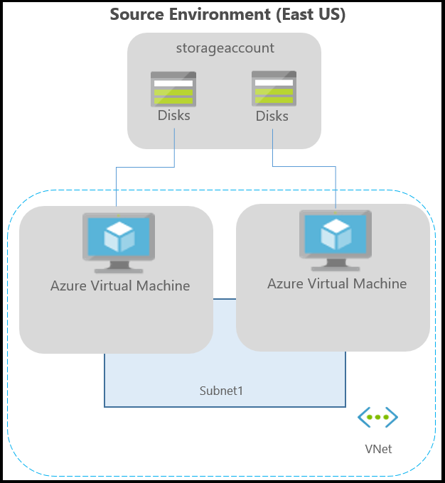

# Step 3: Plan networking for Azure VM replication

After you've verified the [deployment prerequisites](azure-to-azure-walkthrough-prerequisites.md), read this article to understand the networking considerations when replicating and recovering Azure virtual machines (VMs) from one Azure region to another, using the Azure Site Recovery service. 

- When you finish the article, you should have a clear understanding of how to set up outbound access for Azure VMs you want to replicate, and how to connect from  your on-premises site to those VMs.
- Post any comments at the bottom of this article, or ask questions in the [Azure Recovery Services Forum](https://social.msdn.microsoft.com/forums/azure/home?forum=hypervrecovmgr).

>[!NOTE]
> Azure VM replication with Site Recovery is currently in preview.

## Network overview

Typically your Azure VMs are located in an Azure virtual network/subnet, and there's a connection from your on-premises site to Azure using Azure ExpressRoute, or a VPN connection.

Networks are typically protected using firewalls, and/or network security groups (NSGs). Firewalls can use URL-based on IP-based lists, to control network connectivity. NSGs use IP range-based rules. 

For Site Recovery to work expected, you need to make some changes in outbound network connectivity, from VMs that you want to replicate. Site Recovery doesn't support use of an authentication proxy to control network connectivity. If you have an authentication proxy, replication can't be enabled. 

The following diagram depicts a typical environment for an application running on Azure VMs.

**Azure VM environment**

You might also have a connection to Azure set up from your on-premises site, using Azure ExpressRoute or a VPN connection. 

**On-premises connection to Azure**

## Outbound connectivity for URLs

If you are using a URL-based firewall proxy to control outbound connectivity, make sure you allow these URLs used by Site Recovery

**URL** | **Details**  
--- | ---
*.blob.core.windows.net | Allows data to be written from the VM, to the cache storage account in the source region.
login.microsoftonline.com | Provides authorization and authentication to Site Recovery service URLs.
*.hypervrecoverymanager.windowsazure.com | Allows communication with the Site Recovery service from the VM.
*.servicebus.windows.net | Required so that the Site Recovery monitoring and diagnostics data can be written from the VM.

## Outbound connectivity for IP address ranges

- You can automatically create the required rules on the NSG by downloading and running [this script](https://gallery.technet.microsoft.com/Azure-Recovery-script-to-0c950702).
- We recommend that you create the required NSG rules on a test NSG, and verify that there are no problems, before you create the rules on a production NSG.
- To create the required number of NSG rules, ensure that your subscription is whitelisted. Contact support to increase the NSG rule limit in your subscription.
If you are using any IP-based firewall proxy or NSG rules to control outbound connectivity, the following IP ranges need to be whitelisted, depending on the source and target locations of the virtual machines:

    - All IP address ranges that correspond to the source location. Download the [ranges](https://www.microsoft.com/download/confirmation.aspx?id=41653).) Whitelisting is required, so that data can be written to the cache storage account from the VM.
    - All IP ranges that correspond to Office 365 [authentication and identity IP V4 endpoints](https://support.office.com/article/Office-365-URLs-and-IP-address-ranges-8548a211-3fe7-47cb-abb1-355ea5aa88a2#bkmk_identity). If new IPs get added to Office 365 IP ranges, you need to create new NSG rules.
-     Site Recovery service endpoint IP addresses ([available in an XML file](https://aka.ms/site-recovery-public-ips)), which depend on your target location: 

   **Target location** | **Site Recovery service IPs** |  **Site Recovery monitoring IP**
   --- | --- | ---
   East Asia | 52.175.17.132 40.83.121.61 | 13.94.47.61
   Southeast Asia | 52.187.58.193 52.187.169.104 | 13.76.179.223
   Central India | 52.172.187.37 52.172.157.193 | 104.211.98.185
   South India | 52.172.46.220 52.172.13.124 | 104.211.224.190
   North Central US | 23.96.195.247 23.96.217.22 | 168.62.249.226
   North Europe | 40.69.212.238 13.74.36.46 | 52.169.18.8
   West Europe | 52.166.13.64 52.166.6.245 | 40.68.93.145
   East US | 13.82.88.226 40.71.38.173 | 104.45.147.24
   West US | 40.83.179.48 13.91.45.163 | 104.40.26.199
   South Central US | 13.84.148.14 13.84.172.239 | 104.210.146.250
   Central US | 40.69.144.231 40.69.167.116 | 52.165.34.144
   East US 2 | 52.184.158.163 52.225.216.31 | 40.79.44.59
   Japan East | 52.185.150.140 13.78.87.185 | 138.91.1.105
   Japan West | 52.175.146.69 52.175.145.200 | 138.91.17.38
   Brazil South | 191.234.185.172 104.41.62.15 | 23.97.97.36
   Australia East | 104.210.113.114 40.126.226.199 | 191.239.64.144
   Australia Southeast | 13.70.159.158 13.73.114.68 | 191.239.160.45
   Canada Central | 52.228.36.192 52.228.39.52 | 40.85.226.62
   Canada East | 52.229.125.98 52.229.126.170 | 40.86.225.142
   West Central US | 52.161.20.168 13.78.230.131 | 13.78.149.209
   West US 2 | 52.183.45.166 52.175.207.234 | 13.66.228.204
   UK West | 51.141.3.203 51.140.226.176 | 51.141.14.113
   UK South | 51.140.43.158 51.140.29.146 | 51.140.189.52

## Example NSG configuration

This section shows how to configure NSG rules, so that replications works for a VM. If you're using NSG rules to control outbound connectivity, use "Allow HTTPS outbound" rules for all the required IP ranges.

In this example, the VM source location is "East US". The replication target location is Central US.

### Example

#### East US

1. Create rules that correspond to [East US IP ranges](https://www.microsoft.com/download/confirmation.aspx?id=41653). This is required so that data can be written to the cache storage account from the VM.
2. Create rules for all IP ranges that correspond to Office 365 [authentication and identity IP V4 endpoints](https://support.office.com/article/Office-365-URLs-and-IP-address-ranges-8548a211-3fe7-47cb-abb1-355ea5aa88a2#bkmk_identity).
3. Create rules that correspond to the target location:

   **Location** | **Site Recovery service IPs** |  **Site Recovery monitoring IP**
    --- | --- | ---
   Central US | 40.69.144.231 40.69.167.116 | 52.165.34.144

#### Central US

These rules are required so that replication can be enabled from the target region to the source region, after failover.

1. Create rules that correspond to [Central US IP ranges](https://www.microsoft.com/download/confirmation.aspx?id=41653).
2. Create rules for all IP ranges that correspond to Office 365 [authentication and identity IP V4 endpoints](https://support.office.com/article/Office-365-URLs-and-IP-address-ranges-8548a211-3fe7-47cb-abb1-355ea5aa88a2#bkmk_identity).
3. Create rules that correspond to the source location:

   **Location** | **Site Recovery service IPs** |  **Site Recovery monitoring IP**
    --- | --- | ---
   East US | 13.82.88.226 40.71.38.173 | 104.45.147.24

## Existing on-premises connection

If you have an ExpressRoute or VPN connection between your on-premises site, and the source location in Azure, follow these guidelines:

**Configuration** | **Details**
--- | ---
**Forced tunneling** | Typically a default route (0.0.0.0/0) forces outbound internet traffic to flow through the on-premises location. We don't recommend this. Replication traffic and Site Recovery communications should stay within Azure.   As a solution, add user-defined routes (UDRs) for [these IP ranges](#outbound-connectivity-for-azure-site-recovery-ip-ranges), so that the traffic doesn’t go on-premises.
**Connectivity** | If apps need to connect to on-premises machines, or on-premises clients connect to the app over on-premises over VPN/ExpressRoute, make sure you have at least a [site-to-site connection](../vpn-gateway/vpn-gateway-howto-site-to-site-resource-manager-portal.md), between the target Azure region and the on-premises site.   If traffic volumes are high between the target Azure region and the on-premises site, create another [ExpressRoute connection](../expressroute/expressroute-introduction.md), between the target region and on-premises.   If you want to retain IPs for VMs after failover, keep the target region's site-to-site/ExpressRoute connection in a disconnected state. This ensures there are no range clashes between the source and target IP address ranges.
**ExpressRoute** | Create an ExpressRoute circuit in the source and target regions.   Create a connection between the source network and the ExpressRoute circuit, and between the target network and the circuit.   We recommend that you use different IP ranges in source and target regions. The circuit won't be able to connect to more than one Azure networks with the same IP ranges, at the same time.   You can create virtual networks with the same IP ranges in both regions, and then create ExpressRoute circuits in both regions. For failover, disconnect the circuit from the source virtual network, and connect the circuit in the target virtual network.   If the primary region is completely down, the disconnect operation might fail. In this case, the target virtual network won't get ExpressRoute connectivity.
**ExpressRoute Premium** | You can create circuits in the same geopolitical region.   To create circuits in different geopolitical regions, you need Azure ExpressRoute Premium.   With Premium, the cost is incremental. If you're already using it, there's no additional cost.   Learn more about [locations](../expressroute/expressroute-locations.md#azure-regions-to-expressroute-locations-within-a-geopolitical-region) and [pricing](https://azure.microsoft.com/pricing/details/expressroute/).

## Next steps

Go to [Step 4: Create a vault](azure-to-azure-walkthrough-vault.md)

