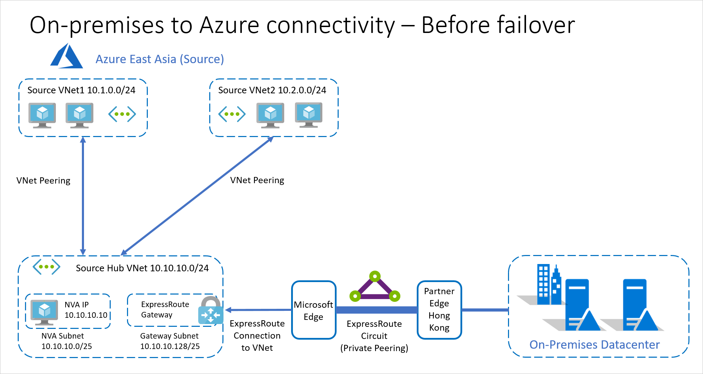
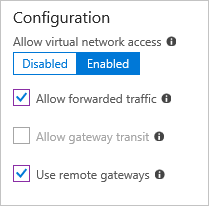
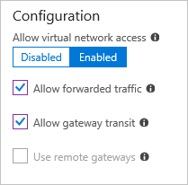

# Integrate Azure ExpressRoute with disaster recovery for Azure VMs

This article describes how to integrate Azure ExpressRoute with [Azure Site Recovery](site-recovery-overview.md), when you set up disaster recovery for Azure VMs to a secondary Azure region.

Site Recovery enables disaster recovery of Azure VMs by replicating Azure VM data to Azure.

- If Azure VMs use [Azure managed disks](../virtual-machines/windows/managed-disks-overview.md), VM data is replicated to an replicated managed disk in the secondary region.
- If Azure VMs don't use managed disks, VM data is replicated to an Azure storage account.
- Replication endpoints are public, but replication traffic for Azure VMs doesn't cross the internet.

ExpressRoute enables you to extend on-premises networks into the Microsoft Azure cloud over a private connection, facilitated by a connectivity provider. If you have ExpressRoute configured, it integrates with Site Recovery as follows:

- **During replication between Azure regions**: Replication traffic for Azure VM disaster recovery is within Azure only, and ExpressRoute isn't needed or used for replication. However, if you're connecting from an on-premises site to the Azure VMs in the primary Azure site, there are a number of issues to be aware of when you're setting up disaster recovery for those Azure VMs.
- **Failover between Azure regions**: When outages occur, you fail over Azure VMs from the primary to secondary Azure region. After failing over to a secondary region, there are a number of steps to take in order to access the Azure VMs in the secondary region using ExpressRoute.

## Before you begin

Before you begin, make sure you understand the following concepts:

- ExpressRoute [circuits](../expressroute/expressroute-circuit-peerings.md)
- ExpressRoute [routing domains](../expressroute/expressroute-circuit-peerings.md#routingdomains)
- ExpressRoute [locations](../expressroute/expressroute-locations.md).
- Azure VM [replication architecture](azure-to-azure-architecture.md)
- How to [set up replication](azure-to-azure-tutorial-enable-replication.md) for Azure VMs.
- How to [fail over](azure-to-azure-tutorial-failover-failback.md) Azure VMs.

## General recommendations

For best practice, and to ensure efficient Recovery Time Objectives (RTOs) for disaster recovery, we recommend you do the following when you set up Site Recovery to integrate with ExpressRoute:

- Provision networking components before failover to a secondary region:
    - When you enable replication for Azure VMs, Site Recovery can automatically deploy networking resources such as networks, subnets, and gateways in the target Azure region, based on source network settings.
    - Site Recovery can't automatically set up networking resources such as VNet gateways.
    - We recommend you provision these additional networking resources before failover. A small downtime is associated with this deployment, and it can impact the overall recovery time, if you didn't account for it during deployment planning.
- Run regular disaster recovery drills:
    - A drill validates your replication strategy without data loss or downtime, and doesn't affect your production environment. It helps avoid last-minute configuration issues that can adversely impact RTO.
    - When you run a test failover for the drill, we recommend that you use a separate Azure VM network, instead of the default network that's set up when you enable replication.
- Use different IP address spaces if you have a single ExpressRoute circuit.
    - We recommend that you use a different IP address space for the target virtual network. This avoids issues when establishing connections during regional outages.
    - If you can't use a separate address space, be sure to run the disaster recovery drill test failover on a separate test network with different IP addresses. You can’t connect two VNets with overlapping IP address space to the same ExpressRoute circuit.

## Replicate Azure VMs when using ExpressRoute

If you want to set up replication for Azure VMs in a primary site, and you're connecting to these VMs from your on-premises site over ExpressRoute, here's what you need to do:

1. [Enable replication](azure-to-azure-tutorial-enable-replication.md) for each Azure VM.
2. Optionally let Site Recovery set up networking:
    - When you configure and enable replication, Site Recovery sets up networks, subnets, and gateway subnets in the target Azure region, to match those in the source region. Site Recovery also maps between the source and target virtual networks.
    - If you don't want Site Recovery to do this automatically, create the target-side network resources before you enable replication.
3. Create other networking elements:
    - Site Recovery doesn't create route tables, VNet gateways, VNet gateway connections, VNet peering, or other networking resources and connections in the secondary region.
    - You need to create these additional networking elements in the secondary region,  any time before running a failover from the primary region.
    - You can use [recovery plans](site-recovery-create-recovery-plans.md) and automation scripts to set up and connect these networking resources.
1. If you have a network virtual appliance (NVA) deployed to control the flow of network traffic, note that:
    - Azure's default system route for Azure VM replication is 0.0.0.0/0.
    - Typically, NVA deployments also define a default route (0.0.0.0/0) that forces outbound Internet traffic to flow through the NVA. The default route is used when no other specific route configuration can be found.
    - If this is the case, the NVA might be overloaded if all replication traffic passes through the NVA.
    - The same limitation also applies when using default routes for routing all Azure VM traffic to on-premises deployments.
    - In this scenario, we recommend that you [create a network service endpoint](azure-to-azure-about-networking.md#create-network-service-endpoint-for-storage) in your virtual network for the Microsoft.Storage service, so that the replication traffic doesn't leave Azure boundary.

## Replication example

Typically enterprise deployments have workloads split across multiple Azure VNets, with a central connectivity hub for external connectivity to the internet and to on-premises sites. A hub and spoke topology is typically used together with ExpressRoute.

- **Region**. Apps are deployed in the Azure East Asia region.
- **Spoke vNets**. Apps are deployed in two spoke vNets:
    - **Source vNet1**: 10.1.0.0/24.
    - **Source vNet2**: 10.2.0.0/24.
    - Each spoke virtual network is connected to **Hub vNet**.
- **Hub vNet**. There's a hub vNet **Source Hub vNet**: 10.10.10.0/24.
  - This hub vNet acts as the gatekeeper.
  - All communications across subnets go through this hub.
    - **Hub vNet subnets**. The hub vNet has two subnets:
    - **NVA subnet**: 10.10.10.0/25. This subnet contains an NVA (10.10.10.10).
    - **Gateway subnet**: 10.10.10.128/25. This subnet contains an ExpressRoute gateway connected to an ExpressRoute connection that routes to the on-premises site via a private peering routing domain.
- The on-premises datacenter has an ExpressRoute circuit connection through a partner edge in Hong Kong.
- All routing is controlled through Azure route tables (UDR).
- All outbound traffic between vNets, or to the on-premises datacenter is routed through the NVA.

### Hub and spoke peering settings

#### Spoke to hub

**Direction** | **Setting** | **State**
--- | --- | ---
Spoke to hub | Allow virtual network address | Enabled
Spoke to hub | Allow forwarded traffic | Enabled
Spoke to hub | Allow gateway transit | Disabled
Spoke to hub | Use remove gateways | Enabled

 

#### Hub to spoke

**Direction** | **Setting** | **State**
--- | --- | ---
Hub to spoke | Allow virtual network address | Enabled
Hub to spoke | Allow forwarded traffic | Enabled
Hub to spoke | Allow gateway transit | Enabled
Hub to spoke | Use remove gateways | Disabled

 

### Example steps

In our example, the following should happen when enabling replication for Azure VMs in the source network:

1. You [enable replication](azure-to-azure-tutorial-enable-replication.md) for a VM.
2. Site Recovery will create replica vNets, subnets, and gateway subnets in the target region.
3. Site Recovery creates mappings between the source networks and the replica target networks it creates.
4. You manually create virtual network gateways, virtual network gateway connections, virtual network peering, or any other networking resources or connections.

## Fail over Azure VMs when using ExpressRoute

After you fail Azure VMs over to the target Azure region using Site Recovery, you can access them using ExpressRoute [private peering](../expressroute/expressroute-circuit-peerings.md#privatepeering).

- You need to connect ExpressRoute to the target vNet with a new connection. The existing ExpressRoute connection isn't automatically transferred.
- The way in which you set up your ExpressRoute connection to the target vNet depends on your ExpressRoute topology.

### Access with two circuits

#### Two circuits with two peering locations

This configuration helps protects ExpressRoute circuits against regional disaster. If your primary peering location goes down, connections can continue from the other location.

- The circuit connected to the production environment is usually the primary. The secondary circuit typically has lower bandwidth, which can be increased if a disaster occurs.
- After failover, you can establish connections from the secondary ExpressRoute circuit to the target vNet. Alternatively, you can have connections set up and ready in case of disaster, to reduce overall recovery time.
- With simultaneous connections to both primary and target vNets, make sure that your on-premises routing only uses the secondary circuit and connection after failover.
- The source and target vNets can receive new IP addresses, or keep the same ones, after failover. In both cases, the secondary connections can be established prior to failover.

#### Two circuits with single peering location

This configuration helps protect against failure of the primary ExpressRoute circuit, but not if the single ExpressRoute peering location goes down, impacting both circuits.

- You can have simultaneous connections from the on-premises datacenter to source vNEt with the primary circuit, and to the target vNet with the secondary circuit.
- With simultaneous connections to primary and target, make sure that  on-premises routing only uses the secondary circuit and connection after failover.
-	You can’t connect both circuits to the same vNet when circuits are created at the same peering location.

### Access with a single circuit

In this configuration there's only one Expressroute circuit. Although the circuit has a redundant connection in case one goes down, a single route circuit will not provide resilience if your peering region goes down. Note that:

- You can replicate Azure VMs to any Azure region in the [same geographic location](azure-to-azure-support-matrix.md#region-support). If the target Azure region isn't in the same location as the source, you need to enable ExpressRoute Premium if you’re using a single ExpressRoute circuit. Learn about [ExpressRoute locations](../expressroute/expressroute-locations.md#azure-regions-to-expressroute-locations-within-a-geopolitical-region) and [ExpressRoute pricing](https://azure.microsoft.com/pricing/details/expressroute/).
- You can’t connect source and target vNets simultaneously to the circuit if the same IP address space is used on the target region. In this scenario:    
    -  Disconnect the source side connection, and then establish the target side connection. This connection change can be scripted as part of a Site Recovery recovery plan. Note that:
        - In a regional failure, if the primary region is inaccessible, the disconnect operation could fail. This could impact connection creation to the target region.
        - If you created the connection in the target region, and primary region recovers later, you might experience packet drops if two simultaneous connections attempt to connect to the same address space.
        - To prevent this, terminate the primary connection immediately.
        - After VM failback to the primary region, the primary connection can again be established, after you disconnect the secondary connection.
-	If a different address spaces is used on the target vNet, you can simultaneously connect to the source and target vNets from the same ExpressRoute circuit.

## Failover example

In our example, we're using the following topology:

- Two different ExpressRoute circuits in two different peering locations.
- Retain private IP addresses for the Azure VMs after failover.
- The target recovery region is Azure SouthEast Asia.
- A secondary ExpressRoute circuit connection is established through a partner edge in Singapore.

For a simple topology that uses a single ExpressRoute circuit, with same IP address after failover, [review this article](site-recovery-retain-ip-azure-vm-failover.md#hybrid-resources-full-failover).

### Example steps
To automate recovery in this example, here's what you need to do:

1. Follow the steps to set up replication.
2. [Fail over the Azure VMs](azure-to-azure-tutorial-failover-failback.md), with these additional steps during or after the failover.

    a. Create the Azure ExpressRoute Gateway in the target region hub VNet. This is need to connect the target hub vNet to the ExpressRoute circuit.

    b. Create the connection from the target hub vNet to the target ExpressRoute circuit.

    c. Set up the VNet peerings between the target region’s hub and spoke virtual networks. The peering properties on the target region will be the same as those on the source region.

    d. Set up the UDRs in the hub VNet, and the two spoke VNets.

    - The properties of the target side UDRs are the same as those on the source side when using the same IP addresses.
    - With different target IP addresses, the UDRs should be modified accordingly.

The above steps can be scripted as part of a [recovery plan](site-recovery-create-recovery-plans.md). Depending on the application connectivity and recovery time requirements, the above steps can also be completed prior to starting the failover.

#### After recovery

After recovering the VMs and completing connectivity, the recovery environment is as follows.

## Next steps

Learn more about using [recovery plans](site-recovery-create-recovery-plans.md) to automate app failover.
