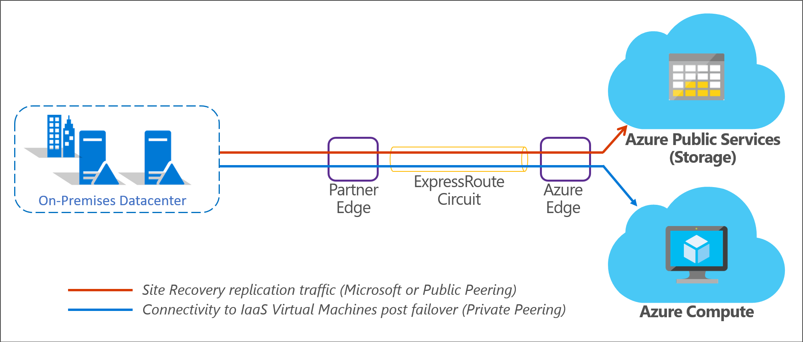

# Azure ExpressRoute with Azure Site Recovery

Microsoft Azure ExpressRoute lets you extend your on-premises networks into the Microsoft cloud over a private connection facilitated by a connectivity provider. With ExpressRoute, you can establish connections to Microsoft cloud services, such as Microsoft Azure, Office 365, and Dynamics 365.

This article describes how you can use Azure ExpressRoute with Azure Site Recovery for disaster recovery and migration.

## ExpressRoute circuits

An ExpressRoute circuit represents a logical connection between your on-premises infrastructure and Microsoft cloud services through a connectivity provider. You can order multiple ExpressRoute circuits. Each circuit can be in the same or different regions, and can be connected to your premises through different connectivity providers. Learn more about ExpressRoute circuits [here](../expressroute/expressroute-circuit-peerings.md).

## ExpressRoute routing domains

An ExpressRoute circuit has multiple routing domains associated with it:
-	[Azure Private peering](../expressroute/expressroute-circuit-peerings.md#azure-private-peering) - Azure compute services, namely virtual machines (IaaS), and cloud services (PaaS) that are deployed within a virtual network can be connected through the private peering domain. The private peering domain is considered a trusted extension of your core network into Microsoft Azure.
-	[Azure Public peering](../expressroute/expressroute-circuit-peerings.md#azure-public-peering) - Services such as Azure Storage, SQL databases, and Websites are offered on public IP addresses. You can privately connect to services hosted on public IP addresses, including VIPs of your cloud services, through the public peering routing domain. Public peering has been deprecated for new creations and Microsoft Peering should be used instead for Azure PaaS services.
-	[Microsoft peering](../expressroute/expressroute-circuit-peerings.md#microsoft-peering) - Connectivity to Microsoft online services (Office 365, Dynamics 365, and Azure PaaS services) is through the Microsoft peering. Microsoft peering is the recommended routing domain to connect to Azure PaaS services.

Learn more about and compare ExpressRoute routing domains [here](../expressroute/expressroute-circuit-peerings.md#routing-domain-comparison).

## On-premises to Azure replication with ExpressRoute

Azure Site Recovery enables disaster recovery and migration to Azure for on-premises [Hyper-V virtual machines](hyper-v-azure-architecture.md), [VMware virtual machines](vmware-azure-architecture.md), and [physical servers](physical-azure-architecture.md). For all on-premises to Azure scenarios, replication data is sent to and stored in an Azure Storage account. During replication, you don't pay any virtual machine charges. When you run a failover to Azure, Site Recovery automatically creates Azure IaaS virtual machines.

Site Recovery replicates data to an Azure Storage account over a public endpoint. To use ExpressRoute for Site Recovery replication, you can utilize [public peering](../expressroute/expressroute-circuit-peerings.md#azure-public-peering) or [Microsoft peering](../expressroute/expressroute-circuit-peerings.md#microsoft-peering). Microsoft peering is the recommended routing domain for replication. After virtual machines or servers fail over to an Azure virtual network, you can access them using [private peering](../expressroute/expressroute-circuit-peerings.md#azure-private-peering). Replication is not supported over private peering.

The combined scenario is represented in the following diagram:

## Azure to Azure replication with ExpressRoute

Azure Site Recovery enables disaster recovery of [Azure virtual machines](azure-to-azure-architecture.md). Depending on whether your Azure virtual machines use [Azure Managed Disks](../virtual-machines/windows/managed-disks-overview.md), replication data is sent to an Azure Storage account or replica Managed Disk on the target Azure region. Although the replication endpoints are public, replication traffic for Azure VM replication, by default, does not traverse the Internet, regardless of which Azure region the source virtual network exists in. You can override Azure's default system route for the 0.0.0.0/0 address prefix with a [custom route](../virtual-network/virtual-networks-udr-overview.md#custom-routes) and divert VM traffic to an on-premises network virtual appliance (NVA), but this configuration is not recommended for Site Recovery replication. If you're using custom routes, you should [create a virtual network service endpoint](azure-to-azure-about-networking.md#create-network-service-endpoint-for-storage) in your virtual network for "Storage" so that the replication traffic does not leave the Azure boundary.

For Azure VM disaster recovery, by default, ExpressRoute is not required for replication. After virtual machines fail over to the target Azure region, you can access them using [private peering](../expressroute/expressroute-circuit-peerings.md#azure-private-peering).

If you are already using ExpressRoute to connect from your on-premises datacenter to the Azure VMs on the source region, you can plan for re-establishing ExpressRoute connectivity at the failover target region. You can use the same ExpressRoute circuit to connect to the target region through a new virtual network connection or utilize a separate ExpressRoute circuit and connection for disaster recovery. The different possible scenarios are described [here](azure-vm-disaster-recovery-with-expressroute.md#fail-over-azure-vms-when-using-expressroute).

You can replicate Azure virtual machines to any Azure region within the same geographic cluster as detailed [here](../site-recovery/azure-to-azure-support-matrix.md#region-support). If the chosen target Azure region is not within the same geopolitical region as the source, you might need to enable ExpressRoute Premium. For more details, check [ExpressRoute locations](../expressroute/expressroute-locations.md#azure-regions-to-expressroute-locations-within-a-geopolitical-region) and [ExpressRoute pricing](https://azure.microsoft.com/pricing/details/expressroute/).

## Next steps
- Learn more about [ExpressRoute circuits](../expressroute/expressroute-circuit-peerings.md).
- Learn more about [ExpressRoute routing domains](../expressroute/expressroute-circuit-peerings.md#expressroute-routing-domains).
- Learn more about [ExpressRoute locations](../expressroute/expressroute-locations.md).
- Learn more about disaster recovery of [Azure virtual machines with ExpressRoute ](azure-vm-disaster-recovery-with-expressroute.md).
