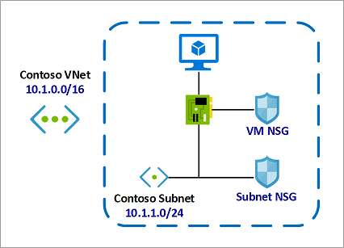

# Network Security Groups with Azure Site Recovery

Network Security Groups are used to limit network traffic to resources in a virtual network. A [Network Security Group (NSG)](../virtual-network/security-overview.md#network-security-groups) contains a list of security rules that allow or deny inbound or outbound network traffic based on source or destination IP address, port, and protocol.

Under the Resource Manager deployment model, NSGs can be associated to subnets or individual network interfaces. When an NSG is associated to a subnet, the rules apply to all resources connected to the subnet. Traffic can further be restricted by also associating an NSG to individual network interfaces within a subnet that already has an associated NSG.

This article describes how you can use Network Security Groups with Azure Site Recovery.

## Using Network Security Groups

An individual subnet can have zero, or one, associated NSG. An individual network interface can also have zero, or one, associated NSG. So, you can effectively have dual traffic restriction for a virtual machine by associating an NSG first to a subnet, and then another NSG to the VM's network interface. The application of NSG rules in this case depends on the direction of traffic and priority of applied security rules.

Consider a simple example with one virtual machine as follows:
-    The virtual machine is placed inside the **Contoso Subnet**.
-    **Contoso Subnet** is associated with **Subnet NSG**.
-    The VM network interface is additionally associated with **VM NSG**.

In this example, for inbound traffic, the Subnet NSG is evaluated first. Any traffic allowed through Subnet NSG is then evaluated by VM NSG. The reverse is applicable for outbound traffic, with VM NSG being evaluated first. Any traffic allowed through VM NSG is then evaluated by Subnet NSG.

This allows for granular security rule application. For example, you might want to allow inbound internet access to a few application VMs (such as frontend VMs) under a subnet but restrict inbound internet access to other VMs (such as database and other backend VMs). In this case you can have a more lenient rule on the Subnet NSG, allowing internet traffic, and restrict access to specific VMs by denying access on VM NSG. The same can be applied for outbound traffic.

When setting up such NSG configurations, ensure that the correct priorities are applied to the [security rules](../virtual-network/security-overview.md#security-rules). Rules are processed in priority order, with lower numbers processed before higher numbers, because lower numbers have higher priority. Once traffic matches a rule, processing stops. As a result, any rules that exist with lower priorities (higher numbers) that have the same attributes as rules with higher priorities are not processed.

You may not always be aware when network security groups are applied to both a network interface and a subnet. You can verify the aggregate rules applied to a network interface by viewing the [effective security rules](../virtual-network/virtual-network-network-interface.md#view-effective-security-rules) for a network interface. You can also use the [IP flow verify](../network-watcher/diagnose-vm-network-traffic-filtering-problem.md) capability in [Azure Network Watcher](../network-watcher/network-watcher-monitoring-overview.md) to determine whether communication is allowed to or from a network interface. The tool tells you whether communication is allowed, and which network security rule allows or denies traffic.

## On-premises to Azure replication with NSG

Azure Site Recovery enables disaster recovery and migration to Azure for on-premises [Hyper-V virtual machines](hyper-v-azure-architecture.md), [VMware virtual machines](vmware-azure-architecture.md), and [physical servers](physical-azure-architecture.md). For all on-premises to Azure scenarios, replication data is sent to and stored in an Azure Storage account. During replication, you don't pay any virtual machine charges. When you run a failover to Azure, Site Recovery automatically creates Azure IaaS virtual machines.

Once VMs have been created after failover to Azure, NSGs can be used to limit network traffic to the virtual network and VMs. Site Recovery does not create NSGs as part of the failover operation. We recommend creating the required Azure NSGs before initiating failover. You can then associate NSGs to failed over VMs automatically during failover, using automation scripts with Site Recovery's powerful [recovery plans](site-recovery-create-recovery-plans.md).

For example, if the post-failover VM configuration is similar to the [example scenario](concepts-network-security-group-with-site-recovery.md#using-network-security-groups) detailed above:
-    You can create **Contoso VNet** and **Contoso Subnet** as part of DR planning on the target Azure region.
-    You can also create and configure both **Subnet NSG** as well as **VM NSG** as part the same DR planning.
-    **Subnet NSG** can then be immediately associated with **Contoso Subnet**, as both the NSG and the subnet are already available.
-    **VM NSG** can be associated with VMs during failover using recovery plans.

Once the NSGs are created and configured, we recommend running a [test failover](site-recovery-test-failover-to-azure.md) to verify scripted NSG associations and post-failover VM connectivity.

## Azure to Azure replication with NSG

Azure Site Recovery enables disaster recovery of [Azure virtual machines](azure-to-azure-architecture.md). When enabling replication for Azure VMs, Site Recovery can create the replica virtual networks (including subnets and gateway subnets) on the target region and create the required mappings between the source and target virtual networks. You can also pre-create the target side networks and subnets, and use the same while enabling replication. Site Recovery does not create any VMs on the target Azure region prior to [failover](azure-to-azure-tutorial-failover-failback.md).

For Azure VM replication, ensure that the NSG rules on the source Azure region allow [outbound connectivity](azure-to-azure-about-networking.md#outbound-connectivity-using-service-tags) for replication traffic. You can also test and verify these required rules through this [example NSG configuration](azure-to-azure-about-networking.md#example-nsg-configuration).

Site Recovery does not create or replicate NSGs as part of the failover operation. We recommend creating the required NSGs on the target Azure region before initiating failover. You can then associate NSGs to failed over VMs automatically during failover, using automation scripts with Site Recovery's powerful [recovery plans](site-recovery-create-recovery-plans.md).

Considering the [example scenario](concepts-network-security-group-with-site-recovery.md#using-network-security-groups) described earlier:
-    Site Recovery can create replicas of **Contoso VNet** and **Contoso Subnet** on the target Azure region when replication is enabled for the VM.
-    You can create the desired replicas of **Subnet NSG** and **VM NSG** (named, for example, **Target Subnet NSG** and **Target VM NSG**, respectively) on the target Azure region, allowing for any additional rules required on the target region.
-    **Target Subnet NSG** can then be immediately associated with the target region subnet, as both the NSG and the subnet are already available.
-    **Target VM NSG** can be associated with VMs during failover using recovery plans.

Once the NSGs are created and configured, we recommend running a [test failover](azure-to-azure-tutorial-dr-drill.md) to verify scripted NSG associations and post-failover VM connectivity.

## Next steps
-    Learn more about [Network Security Groups](../virtual-network/security-overview.md#network-security-groups).
-    Learn more about NSG [security rules](../virtual-network/security-overview.md#security-rules).
-    Learn more about [effective security rules](../virtual-network/diagnose-network-traffic-filter-problem.md) for an NSG.
-    Learn more about [recovery plans](site-recovery-create-recovery-plans.md) to automate application failover.
