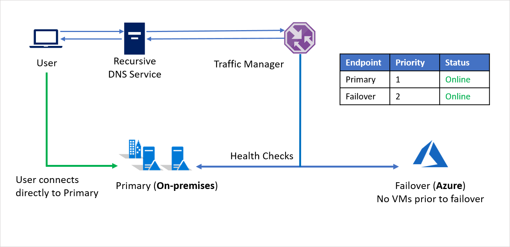
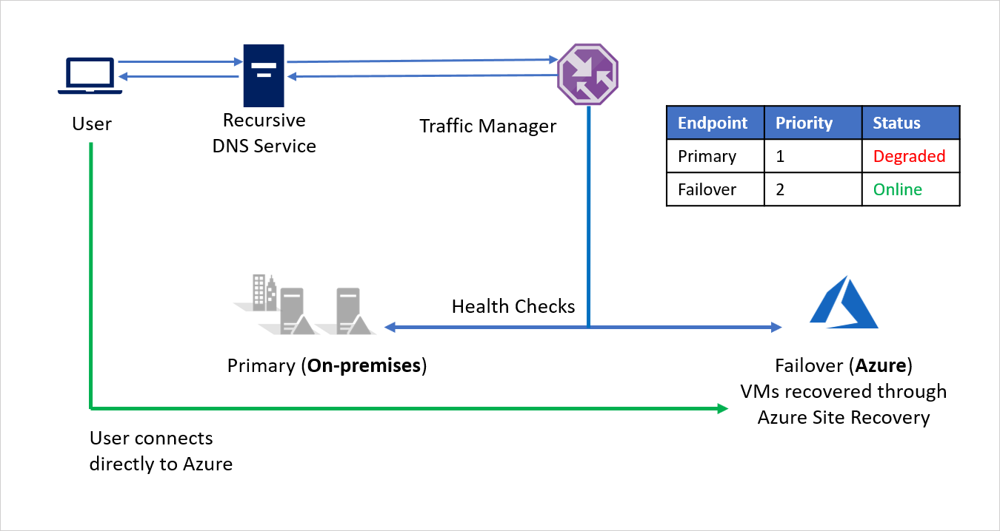
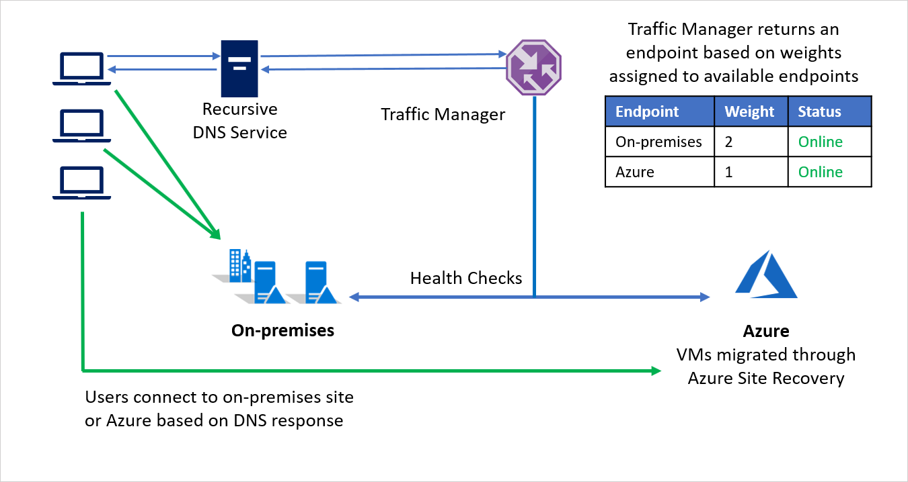
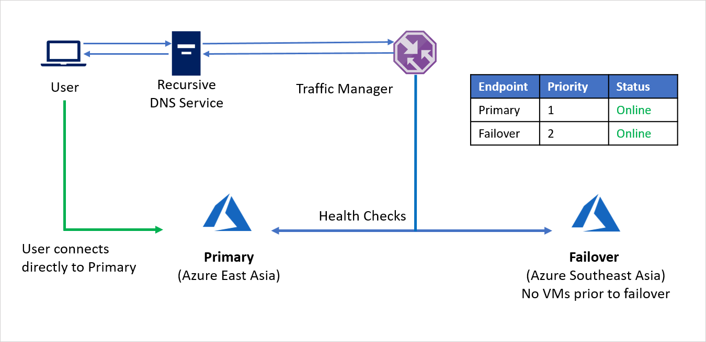
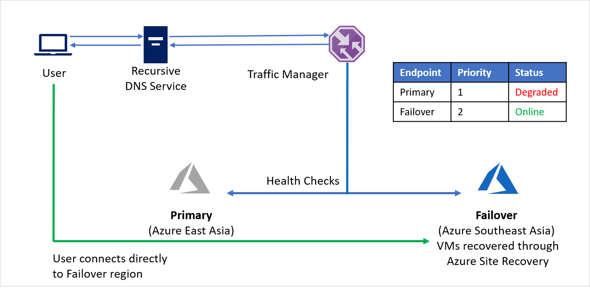
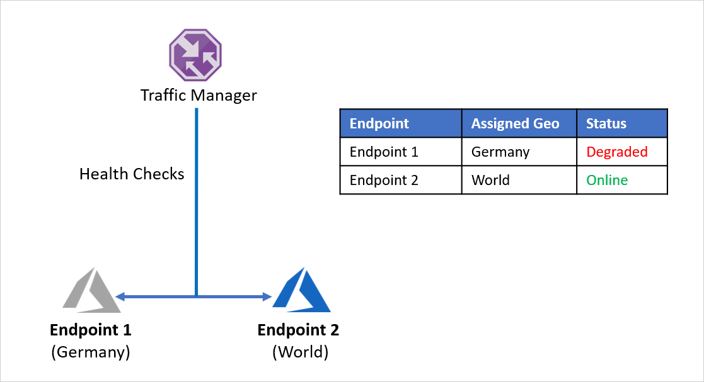
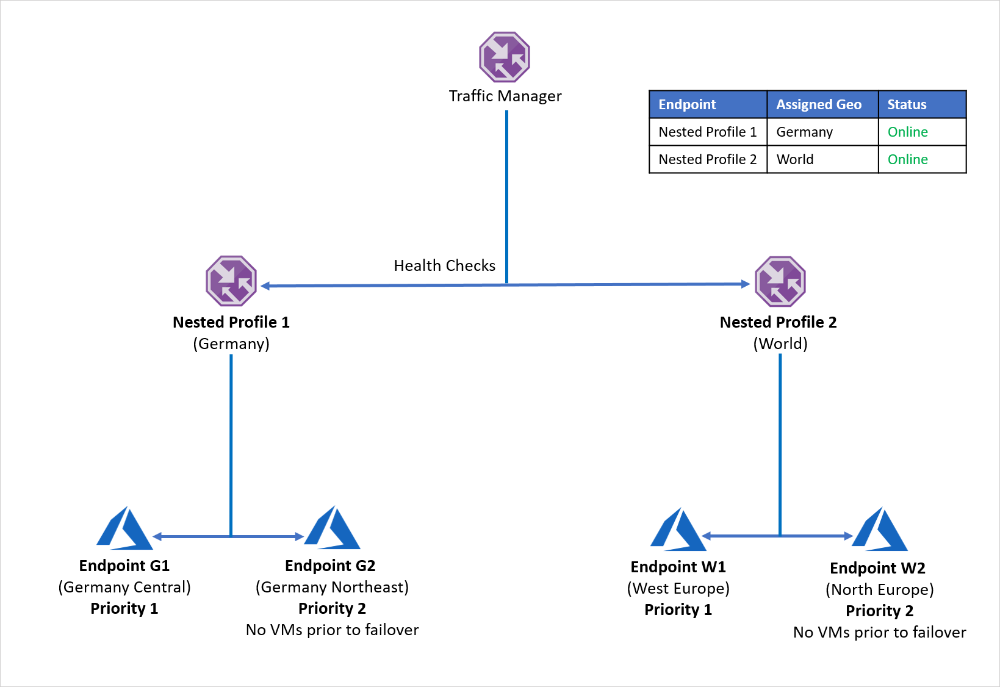

# Azure Traffic Manager with Azure Site Recovery

Azure Traffic Manager enables you to control the distribution of traffic across your application endpoints. An endpoint is any Internet-facing service hosted inside or outside of Azure.

Traffic Manager uses the Domain Name System (DNS) to direct client requests to the most appropriate endpoint, based on a traffic-routing method and the health of the endpoints. Traffic Manager provides a range of [traffic-routing methods](../traffic-manager/traffic-manager-routing-methods.md) and [endpoint monitoring options](../traffic-manager/traffic-manager-monitoring.md) to suit different application needs and automatic failover models. Clients connect to the selected endpoint directly. Traffic Manager is not a proxy or a gateway, and it does not see the traffic passing between the client and the service.

This article describes how you can combine Azure Traffic Monitor’s intelligent routing with Azure Site Recovery’s powerful disaster recovery and migration capabilities.

## On-premises to Azure failover

For the first scenario, consider **Company A** that has all its application infrastructure running in its on-premises environment. For business continuity and compliance reasons, **Company A** decides to use Azure Site Recovery to protect its applications.

**Company A** is running applications with public endpoints and wants the ability to seamlessly redirect traffic to Azure in a disaster event. The [Priority](../traffic-manager/traffic-manager-configure-priority-routing-method.md) traffic-routing method in Azure Traffic Manager allows Company A to easily implement this failover pattern.

The setup is as follows:
- **Company A** creates a [Traffic Manager profile](../traffic-manager/quickstart-create-traffic-manager-profile.md).
- Utilizing the **Priority** routing method, **Company A** creates two endpoints – **Primary** for on-premises and **Failover** for Azure. **Primary** is assigned Priority 1 and **Failover** is assigned Priority 2.
- Since the **Primary** endpoint is hosted outside Azure, the endpoint is created as an [External](../traffic-manager/traffic-manager-endpoint-types.md#external-endpoints) endpoint.
- With Azure Site Recovery, the Azure site does not have any virtual machines or applications running prior to failover. So, the **Failover** endpoint is also created as an **External** endpoint.
- By default, user traffic is directed to the on-premises application because that endpoint has the highest priority associated with it. No traffic is directed to Azure if the **Primary** endpoint is healthy.

In a disaster event, Company A can trigger a [failover](site-recovery-failover.md) to Azure and recover its applications on Azure. When Azure Traffic Manager detects that the **Primary** endpoint is no longer healthy, it automatically uses the **Failover** endpoint in the DNS response and users connect to the application recovered on Azure.

Depending on business requirements, **Company A** can choose a higher or lower [probing frequency](../traffic-manager/traffic-manager-monitoring.md) to switch between on-premises to Azure in a disaster event, and ensure minimal downtime for users.

When the disaster is contained, **Company A** can failback from Azure to its on-premises environment ([VMware](vmware-azure-failback.md) or [Hyper-V](hyper-v-azure-failback.md)) using Azure Site Recovery. Now, when Traffic Manager detects that the **Primary** endpoint is healthy again, it automatically utilizes the **Primary** endpoint in its DNS responses.

## On-premises to Azure migration

In addition to disaster recovery, Azure Site Recovery also enables [migrations to Azure](migrate-overview.md). Using Azure Site Recovery’s powerful test failover capabilities, customers can assess application performance on Azure without affecting their on-premises environment. And when customers are ready to migrate, they can choose to migrate entire workloads together or choose to migrate and scale gradually.

Azure Traffic Manager’s [Weighted](../traffic-manager/traffic-manager-configure-weighted-routing-method.md) routing method can be used to direct some part of incoming traffic to Azure while directing the majority to the on-premises environment. This approach can help assess scale performance as you can continue increasing the weight assigned to Azure as you migrate more and more of your workloads to Azure.

For example, **Company B** chooses to migrate in phases, moving some of its application environment while retaining the rest on-premises. During the initial stages when most of the environment is on-premises, a larger weight is assigned to the on-premises environment. Traffic manager returns an endpoint based on weights assigned to available endpoints.

During migration, both endpoints are active and most of the traffic is directed to the on-premises environment. As the migration proceeds, a larger weight can be assigned to the endpoint on Azure and finally the on-premises endpoint can be deactivated post migration.

## Azure to Azure failover

For this example, consider **Company C** that has all its application infrastructure running Azure. For business continuity and compliance reasons, **Company C** decides to use Azure Site Recovery to protect its applications.

**Company C** is running applications with public endpoints and wants the ability to seamlessly redirect traffic to a different Azure region in a disaster event. The [Priority](../traffic-manager/traffic-manager-configure-priority-routing-method.md) traffic-routing method allows **Company C** to easily implement this failover pattern.

The setup is as follows:
- **Company C** creates a [Traffic Manager profile](../traffic-manager/quickstart-create-traffic-manager-profile.md).
- Utilizing the **Priority** routing method, **Company C** creates two endpoints – **Primary** for the source region (Azure East Asia) and **Failover** for the recovery region (Azure Southeast Asia). **Primary** is assigned Priority 1 and **Failover** is assigned Priority 2.
- Since the **Primary** endpoint is hosted in Azure, the endpoint can be as an [Azure](../traffic-manager/traffic-manager-endpoint-types.md#azure-endpoints) endpoint.
- With Azure Site Recovery, the recovery Azure site does not have any virtual machines or applications running prior to failover. So, the **Failover** endpoint can be created as an [External](../traffic-manager/traffic-manager-endpoint-types.md#external-endpoints) endpoint.
- By default, user traffic is directed to the source region (East Asia) application as that endpoint has the highest priority associated with it. No traffic is directed to the recovery region if the **Primary** endpoint is healthy.

In a disaster event, **Company C** can trigger a [failover](azure-to-azure-tutorial-failover-failback.md) and recover its applications on the recovery Azure region. When Azure Traffic Manager detects that the Primary endpoint is no longer healthy, it automatically uses the **Failover** endpoint in the DNS response and users connect to the application recovered on the recovery Azure region (Southeast Asia).

Depending on business requirements, **Company C** can choose a higher or lower [probing frequency](../traffic-manager/traffic-manager-monitoring.md) to switch between source and recovery regions, and ensure minimal downtime for users.

When the disaster is contained, **Company C** can failback from the recovery Azure region to the source Azure region using Azure Site Recovery. Now, when Traffic Manager detects that the **Primary** endpoint is healthy again, it automatically utilizes the **Primary** endpoint in its DNS responses.

## Protecting multi-region enterprise applications

Global enterprises often improve customer experience by tailoring their applications to serve regional needs. Localization and latency reduction can lead to application infrastructure split across regions. Enterprises are also bound by regional data laws in certain areas and choose to isolate a part their application infrastructure within regional boundaries.  

Let’s consider an example where **Company D** has split its application endpoints to separately serve Germany and the rest of the world. **Company D** utilizes Azure Traffic Manager’s [Geographic](../traffic-manager/traffic-manager-configure-geographic-routing-method.md) routing method to set this up. Any traffic originating from Germany is directed to **Endpoint 1** and any traffic originating outside Germany is directed to **Endpoint 2**.

The problem with this setup is that if **Endpoint 1** stops working for any reason, there is no redirection of traffic to **Endpoint 2**. Traffic originating from Germany continues to be directed to **Endpoint 1** regardless of the health of the endpoint, leaving German users without access to **Company D**’s application. Similarly, if **Endpoint 2** goes offline, there is no redirection of traffic to **Endpoint 1**.

To avoid running into this problem and ensure application resiliency, **Company D** uses [nested Traffic Manager profiles](../traffic-manager/traffic-manager-nested-profiles.md) with Azure Site Recovery. In a nested profile setup, traffic is not directed to individual endpoints, but instead to other Traffic Manager profiles. Here’s how this setup works:
- Instead of utilizing Geographic routing with individual endpoints, **Company D** uses Geographic routing with Traffic Manager profiles.
- Each child Traffic Manager profile utilizes **Priority** routing with a primary and a recovery endpoint, hence nesting **Priority** routing within **Geographic** routing.
- To enable application resiliency, each workload distribution utilizes Azure Site Recovery to failover to a recovery region based in case of a disaster event.
- When the parent Traffic Manager receives a DNS query, it is directed to the relevant child Traffic Manager that responds to the query with an available endpoint.

For example, if the endpoint in Germany Central fails, the application can quickly be recovered to Germany Northeast. The new endpoint handles traffic originating from Germany with minimal downtime for users. Similarly an endpoint outage in West Europe can be handled by recovering the application workload to North Europe, with Azure Traffic Manager handling DNS redirects to the available endpoint.

The above setup can be expanded to include as many region and endpoint combinations required. Traffic Manager allows up to 10 levels of nested profiles and does not permit loops within the nested configuration.

## Recovery Time Objective (RTO) considerations

In most organizations, adding or modifying DNS records is handled either by a separate team or by someone outside the organization. This makes the task of altering DNS records very challenging. The time taken to update DNS records by other teams or organizations managing DNS infrastructure varies from organization to organization, and impacts the RTO of the application.

By utilizing Traffic Manager, you can frontload the work required for DNS updates. No manual or scripted action is required at the time of actual failover. This approach helps in quick switching (and hence lowering RTO) as well as avoiding costly time-consuming DNS change errors in a disaster event. With Traffic Manager, even the failback step is automated, which would otherwise have to be managed separately.

Setting the correct [probing interval](../traffic-manager/traffic-manager-monitoring.md) through basic or fast interval health checks can considerably bring down the RTO during failover and reduce downtime for users.

You can additionally optimize the DNS Time to Live (TTL) value for the Traffic Manager profile. TTL is the value for which a DNS entry would be cached by a client. For a record, DNS would not be queried twice within the span of TTL. Each DNS record has a TTL associated with it. Reducing this value results in more DNS queries to Traffic Manager but can reduce RTO by discovering outages faster.

The TTL experienced by the client also does not increase if the number of DNS resolvers between the client and the authoritative DNS server increases. DNS resolvers ‘count down’ the TTL and only pass on a TTL value that reflects the elapsed time since the record was cached. This ensures that the DNS record gets refreshed at the client after the TTL, irrespective of the number of DNS Resolvers in the chain.

## Next steps
- Learn more about Traffic Manager [routing methods](../traffic-manager/traffic-manager-routing-methods.md).
- Learn more about [nested Traffic Manager profiles](../traffic-manager/traffic-manager-nested-profiles.md).
- Learn more about [endpoint monitoring](../traffic-manager/traffic-manager-monitoring.md).
- Learn more about [recovery plans](site-recovery-create-recovery-plans.md) to automate application failover.
