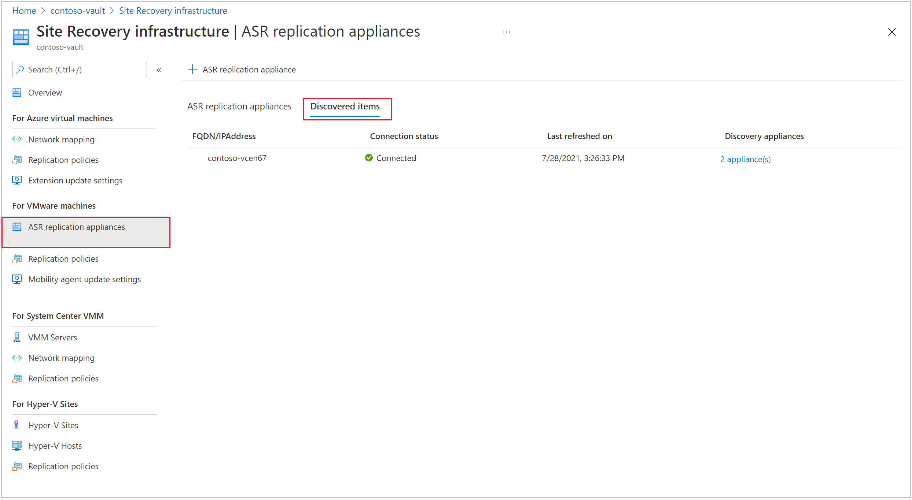

# Deploy Azure Site Recovery replication appliance - Modernized

>[!NOTE]
> The information in this article applies to Azure Site Recovery - Modernized. For information about configuration server requirements in Classic releases, [see this article](vmware-azure-configuration-server-requirements.md).

>[!NOTE]
> Ensure you create a new and exclusive Recovery Services vault for setting up the ASR replication appliance. Don't use an existing vault.

You deploy an on-premises replication appliance when you use [Azure Site Recovery](site-recovery-overview.md) for disaster recovery of VMware VMs or physical servers to Azure.

- The replication appliance coordinates communications between on-premises VMware and Azure. It also manages data replication.
- [Learn more](vmware-azure-architecture-modernized.md) about the Azure Site Recovery replication appliance components and processes.

## Pre-requisites

### Hardware requirements

**Component** | **Requirement**
--- | ---
CPU cores | 8
RAM | 32 GB
Number of disks | 2, including the OS disk - 80 GB and a data disk - 620 GB

### Software requirements

**Component** | **Requirement**
--- | ---
Operating system | Windows Server 2019
Operating system locale | English (en-*)
Windows Server roles | Don't enable these roles:   - Active Directory Domain Services  - Internet Information Services   - Hyper-V
Group policies | Don't enable these group policies:   - Prevent access to the command prompt.   - Prevent access to registry editing tools.   - Trust logic for file attachments.   - Turn on Script Execution.   [Learn more](/previous-versions/windows/it-pro/windows-7/gg176671(v=ws.10))
IIS | - No pre-existing default website   - No pre-existing website/application listening on port 443  - Enable  [anonymous authentication](/previous-versions/windows/it-pro/windows-server-2008-R2-and-2008/cc731244(v=ws.10))   - Enable [FastCGI](/previous-versions/windows/it-pro/windows-server-2008-R2-and-2008/cc753077(v=ws.10)) setting
FIPS (Federal Information Processing Standards) | Don't enable FIPS mode|

### Network requirements

|**Component** | **Requirement**|
|--- | ---|
|Fully qualified domain name (FQDN) | Static|
|Ports | 443 (Control channel orchestration) 9443 (Data transport)|
|NIC type | VMXNET3 (if the appliance is a VMware VM)|
|NAT | Supported |

#### Allow URLs

Ensure the following URLs are allowed and reachable from the Azure Site Recovery replication appliance for continuous connectivity:

  | **URL**                  | **Details**                             |
  | ------------------------- | -------------------------------------------|
  | portal.azure.com          | Navigate to the Azure portal.              |
  | `login.windows.net ` `graph.windows.net ` `*.msftauth.net` `*.msauth.net` `*.microsoft.com` `*.live.com ` `*.office.com ` | To sign-in to your Azure subscription.  |
  |`*.microsoftonline.com `|Create Azure Active  Directory (AD) apps for the appliance to communicate with Azure Site Recovery. |
  |management.azure.com |Create Azure AD apps for the appliance to communicate with the Azure Site Recovery service. |
  |`*.services.visualstudio.com `|Upload app logs used for internal monitoring. |
  |`*.vault.azure.net `|Manage secrets in the Azure Key Vault. Note: Ensure that the machines that need to be replicated have access to this URL. |
  |aka.ms |Allow access to "also known as" links. Used for Azure Site Recovery appliance updates. |
  |download.microsoft.com/download |Allow downloads from Microsoft download. |
  |`*.servicebus.windows.net `|Communication between the appliance and the Azure Site Recovery service. |
  |`*.discoverysrv.windowsazure.com `  `*.hypervrecoverymanager.windowsazure.com `   `*.backup.windowsazure.com ` |Connect to Azure Site Recovery micro-service URLs.
  |`*.blob.core.windows.net `|Upload data to Azure storage, which is used to create target disks. |
  | `*.prod.migration.windowsazure.com `| To discover your on-premises estate.  

#### Allow URLs for government clouds

Ensure the following URLs are allowed and reachable from the Azure Site Recovery replication appliance for continuous connectivity, when enabling replication to a government cloud:

  | **URL for Fairfax**                  | **URL for Mooncake**                             | **Details**                             |
  | ------------------------- | -------------------------------------------| -------------------------------------------|
  | `login.microsoftonline.us/*`   `graph.microsoftazure.us` | `login.chinacloudapi.cn/*`   `graph.chinacloudapi.cn` | To sign-in to your Azure subscription.  |
  | `portal.azure.us`          |    `portal.azure.cn`           |Navigate to the Azure portal. | 
  | `*.microsoftonline.us/*`   `management.usgovcloudapi.net` | `*.microsoftonline.cn/*`   `management.chinacloudapi.cn/*` | Create Azure AD apps for the appliance to communicate with the Azure Site Recovery service. |
  | `*.hypervrecoverymanager.windowsazure.us`   `*.migration.windowsazure.us`   `*.backup.windowsazure.us` | `*.hypervrecoverymanager.windowsazure.cn`   `*.migration.windowsazure.cn`   `*.backup.windowsazure.cn` | Connect to Azure Site Recovery micro-service URLs. |
  |`*.vault.usgovcloudapi.net`| `*.vault.azure.cn` |Manage secrets in the Azure Key Vault. Note: Ensure that the machines, which need to be replicated have access to this URL. |

### Folder exclusions from Antivirus program

#### If Antivirus Software is active on appliance

Exclude following folders from Antivirus software for smooth replication and to avoid connectivity issues.

C:\ProgramData\Microsoft Azure  
C:\ProgramData\ASRLogs  
C:\Windows\Temp\MicrosoftAzure
C:\Program Files\Microsoft Azure Appliance Auto Update  
C:\Program Files\Microsoft Azure Appliance Configuration Manager  
C:\Program Files\Microsoft Azure Push Install Agent  
C:\Program Files\Microsoft Azure RCM Proxy Agent  
C:\Program Files\Microsoft Azure Recovery Services Agent  
C:\Program Files\Microsoft Azure Server Discovery Service  
C:\Program Files\Microsoft Azure Site Recovery Process Server  
C:\Program Files\Microsoft Azure Site Recovery Provider  
C:\Program Files\Microsoft Azure to On-Premises Reprotect agent  
C:\Program Files\Microsoft Azure VMware Discovery Service  
C:\Program Files\Microsoft On-Premise to Azure Replication agent  
E:\  

#### If Antivirus software is active on source machine

If source machine has an Antivirus software active, installation folder should be excluded. So, exclude folder C:\ProgramData\ASR\agent for smooth replication.

## Sizing and capacity
An appliance that uses an in-built process server to protect the workload can handle up to 200 virtual machines, based on the following configurations:

  |CPU |    Memory |    Cache disk size |    Data change rate |    Protected machines |
  |---|-------|--------|------|-------|
  |16 vCPUs (2 sockets * 8 cores @ 2.5 GHz)    | 32 GB |    1 TB |    >1 TB to 2 TB    | Use to replicate 151 to 200 machines.|

- You can perform discovery of all the machines in a vCenter server, using any of the replication appliances in the vault.

- You can [switch a protected machine](switch-replication-appliance-modernized.md), between different appliances in the same vault, given the selected appliance is healthy.

For detailed information about how to use multiple appliances and failover a replication appliance, see [this article](switch-replication-appliance-modernized.md)

## Prepare Azure account

To create and register the Azure Site Recovery replication appliance, you need an Azure account with:

- Contributor or Owner permissions on the Azure subscription.
- Permissions to register Azure Active Directory apps.
- Owner or Contributor plus User Access Administrator permissions on the Azure subscription to create a Key Vault, used during registration of the Azure Site Recovery replication appliance with Azure.

If you just created a free Azure account, you're the owner of your subscription. If you're not the subscription owner, work with the owner for the required permissions.

## Required permissions

**Here are the required key vault permissions**:

- Microsoft.OffAzure/*
- Microsoft.KeyVault/register/action
- Microsoft.KeyVault/vaults/read
- Microsoft.KeyVault/vaults/keys/read
- Microsoft.KeyVault/vaults/secrets/read
- Microsoft.Recoveryservices/*

**Follow these  steps to assign the required permissions**:

1. In the Azure portal, search for **Subscriptions**, and under **Services**, select **Subscriptions** search box to search for the Azure subscription.

2. In the **Subscriptions** page, select the subscription in which you created the Recovery Services vault.

3. In the selected subscription, select **Access control** (IAM) > **Check access**. In **Check access**, search for the relevant user account.

4. In **Add a role assignment**, select **Add,** select the Contributor or Owner role, and select the account. Then Select **Save**.

  To register the appliance, your Azure account needs permissions to register Azure Active Directory apps.

  **Follow these steps to assign required permissions**:

  - In Azure portal, navigate to **Azure Active Directory** > **Users** > **User Settings**. In **User settings**, verify that Azure AD users can register applications (set to *Yes* by default).

  - In case the **App registrations** settings is set to *No*, request the tenant/global admin to assign the required permission. Alternately, the tenant/global admin can assign the Application Developer role to an account to allow the registration of Azure Active Directory App.

## Prepare infrastructure

You need to set up an Azure Site Recovery replication appliance in the on-premises environment to enable recovery on your on-premises machine. For detailed information on the operations performed by the appliance, [see this section](vmware-azure-architecture-modernized.md)

Go to **Recovery Services Vault** > **Getting Started**. In VMware machines to Azure, select
**Prepare Infrastructure** and proceed with the sections detailed below:

:::image type="Recovery Services Vault Modernized" source="./media/deploy-vmware-azure-replication-appliance-modernized/prepare-infra.png" alt-text="Screenshot showing recovery services vault modernized.":::

To set up a new appliance, you can use an OVF template (recommended) or PowerShell. Ensure you meet all the [hardware ](#hardware-requirements) and [software requirements](#software-requirements), and any other prerequisites.

## Create Azure Site Recovery replication appliance

You can create the Site Recovery replication appliance by using the OVF template or through PowerShell.

>[!NOTE]
> The appliance setup needs to be performed in a sequential manner. Parallel registration of multiple appliances cannot be executed.

### Create replication appliance through OVF template

We recommend this approach as Azure Site Recovery ensures all prerequisite configurations are handled by the template.
The OVF template spins up a machine with the required specifications.

:::image type="Prepare infrastructure for appliance creation" source="./media/deploy-vmware-azure-replication-appliance-modernized/prepare-infra.png" alt-text="Screenshot showing infrastructure for appliance creation.":::

**Follow these steps:**

1. Download the OVF template to set up an appliance on your on-premises environment.
2. After the deployment is complete, power on the appliance VM to accept Microsoft Evaluation license.
3. In the next screen, provide password for the administrator user.
4. Select **Finalize,** the system reboots and you can log in with the administrator user account.

### Set up the appliance through PowerShell

If there is any organizational restrictions, you can manually set up the Site Recovery replication appliance through PowerShell. Follow these steps:

1. Download the installers from [here](https://aka.ms/V2ARcmApplianceCreationPowershellZip) and place this folder on the Azure Site Recovery replication appliance.
2. After successfully copying the zip folder, unzip and extract the components of the folder.
3. Go to the path in which the folder is extracted to and execute the following PowerShell script as an administrator:

    **DRInstaller.ps1**

## Register appliance
  Once you create the appliance, Microsoft Azure appliance configuration manager is launched automatically. Prerequisites such as internet connectivity, Time sync, system configurations and group policies (listed below) are validated.

  - CheckRegistryAccessPolicy - Prevents access to registry editing tools.
      - Key: HKLM\SOFTWARE\Microsoft\Windows\CurrentVersion\Policies\System
      - DisableRegistryTools value shouldn't be equal 0.

  - CheckCommandPromptPolicy - Prevents access to the command prompt.

      - Key: HKLM\SOFTWARE\Policies\Microsoft\Windows\System
      - DisableCMD value shouldn't be equal 0.

  - CheckTrustLogicAttachmentsPolicy - Trust logic for file attachments.

      - Key: HKLM\SOFTWARE\Microsoft\Windows\CurrentVersion\Policies\Attachments
      - UseTrustedHandlers value shouldn't be equal 3.

  - CheckPowershellExecutionPolicy - Turn on Script Execution.

      - PowerShell execution policy shouldn't be AllSigned or Restricted
      - Ensure the group policy 'Turn on Script Execution Attachment Manager' isn't set to Disabled or 'Allow only signed scripts'

  **Use the following steps to register the appliance**:

1. If the appliance uses a proxy for internet access, configure the proxy settings by toggling on the **use proxy to connect to internet** option.

    All Azure Site Recovery services will use these settings to connect to the internet. Only HTTP proxy is supported.

2. Ensure the [required URLs](#allow-urls) are allowed and are reachable from the Azure Site Recovery replication appliance for continuous connectivity.

3. Once the prerequisites have been checked, in the next step information about all the appliance components will be fetched. Review the status of all components and then select **Continue**. After saving the details, proceed to choose the appliance connectivity.

4. After saving connectivity details, Select **Continue** to proceed to registration with Microsoft Azure.

5. Ensure the [prerequisites](#pre-requisites) are met, proceed with registration.

    :::image type="Register appliance" source="./media/deploy-vmware-azure-replication-appliance-modernized/app-setup-register.png" alt-text="Screenshot showing register appliance.":::

  - **Friendly name of appliance**: Provide a friendly name with which you want to track this appliance in the Azure portal under recovery services vault infrastructure.

  - **Azure Site Recovery replication appliance key**: Copy the key from the portal by navigating to **Recovery Services vault** > **Getting started** > **Site Recovery** > **VMware to Azure: Prepare Infrastructure**.

  - After pasting the key, select **Login.** You'll be redirected to a new authentication tab.

      By default, an authentication code will be generated as highlighted below, in the **Appliance configuration manager** page. Use this code in the authentication tab.

  - Enter your Microsoft Azure credentials to complete registration.

      After successful registration, you can close the tab and move to appliance configuration manager to continue the setup.

      :::image type="authentication code" source="./media/deploy-vmware-azure-replication-appliance-modernized/enter-code.png" alt-text="Screenshot showing authentication code.":::

      > [!NOTE]
      > An authentication code expires within 5 minutes of generation. In case of inactivity for more than this duration, you will be prompted to login again to Azure.

6. After successful sign in, Subscription, Resource Group and Recovery Services vault details are displayed. You can sign out in case you want to change the vault. Else, select **Continue** to proceed.

    :::image type="Appliance registered" source="./media/deploy-vmware-azure-replication-appliance-modernized/app-setup.png" alt-text="Screenshot showing appliance registered.":::

    After successful registration, proceed to configure vCenter details.

    :::image type="Configuration of vCenter" source="./media/deploy-vmware-azure-replication-appliance-modernized/vcenter-information.png" alt-text="Screenshot showing configuration of vCenter.":::

7. Select **Add vCenter Server** to add vCenter information. Enter the server name or IP address of the vCenter and port information. Post that, provide username, password, and friendly name. This is used to fetch details of [virtual machine managed through the vCenter](vmware-azure-tutorial-prepare-on-premises.md#prepare-an-account-for-automatic-discovery). The user account details will be encrypted and stored locally in the machine.

    >[!NOTE]
    >If  you're trying to add the same vCenter Server to multiple appliances, then ensure that the same friendly name is used in all the appliances.

8. After successfully saving the vCenter information, select **Add virtual machine credentials** to provide user details of the VMs discovered through the vCenter.

   >[!NOTE]
   > - For Linux OS, ensure to provide root credentials and for Windows OS, a user account with admin privileges should be added, these credentials will be used to push install mobility agent on to the source VM during enable replication operation. The credentials can be chosen per VM in the Azure portal during enable replication workflow.
   > - Visit the appliance configurator to edit or add credentials to access your machines.

9.	After you add the vCenter details, expand **Provide Physical server details** to add the details of any physical servers you plan to protect.

    :::image type="Physical server credentials." source="./media/deploy-vmware-azure-replication-appliance-modernized/physical-server-credentials.png" alt-text="Screenshot of Physical server credentials.":::

10. Select **Add credentials** to add the credentials of the machine(s) you plan to protect. Add all the details such as the **Operating system**, **Provide a friendly name for the credential**, **Username**, and **Password**. The user account details will be encrypted and stored locally in the machine. Select **Add**. 

    :::image type="Add Physical server credentials." source="./media/deploy-vmware-azure-replication-appliance-modernized/add-physical-server-credentials.png" alt-text="Screenshot of Add Physical server credentials.":::

11. Select **Add server** to add physical server details. Provide the machine’s **IP address/FQDN of  physical server**, **Select credential account** and select **Add**.

    :::image type="Add Physical server details." source="./media/deploy-vmware-azure-replication-appliance-modernized/add-physical-server-details.png" alt-text="Screenshot of Add Physical server details.":::    

12. After successfully adding the details, select **Continue** to install all Azure Site Recovery replication appliance components and register with Azure services. This activity can take up to 30 minutes.

    Ensure you don't close the browser while configuration is in progress.

    >[!NOTE]
    > Appliance cloning is not supported with the modernized architecture. If you attempt to clone, it might disrupt the recovery flow.

## View Azure Site Recovery replication appliance in Azure portal

After successful configuration of Azure Site Recovery replication appliance, navigate to Azure portal, **Recovery Services Vault**.

Select **Prepare infrastructure (Modernized)** under **Getting started**, you can see that an Azure Site Recovery replication appliance is already registered with this vault. Now you're all set! Start protecting your source machines through this replication appliance.

When you select  *Select 1 appliance(s)*, you'll be redirected to Azure Site Recovery replication appliance view, where the list of appliances registered to this vault is displayed.

You'll also be able to see a tab for **Discovered items** that lists all of the discovered vCenter Servers/vSphere hosts."

## Next steps
Set up disaster recovery of [VMware VMs](vmware-azure-set-up-replication-tutorial-modernized.md) to Azure.
