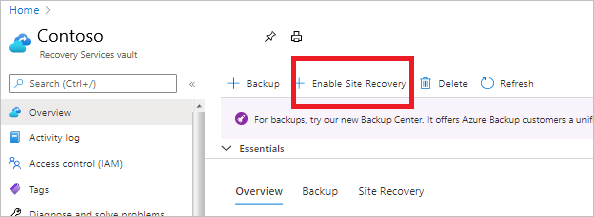

# Tutorial: Set up disaster recovery for VMs on Azure Public MEC using Vault flow

> [!IMPORTANT]
> The Azure Site Recovery (ASR) functionality for Public MEC is in preview state.

This tutorial shows you how to set up disaster recovery for VMs using Azure Site Recovery on Azure Public MEC. You will do this using the Azure Site Recovery portal.

In this article, you learn how to:

> [!div class="checklist"]
> * Enable VM replication

When you enable replication for a VM to set up disaster recovery, the Site Recovery Mobility service extension installs on the VM and registers it with Azure Site Recovery (ASR as a service for MEC is in preview). During replication, VM disk writes are sent to a cache storage account. Data is sent from there to the target region, and recovery points are generated from the data. When you fail over a VM during disaster recovery, a recovery point is used to restore the VM in the target region. [Learn more](azure-to-azure-architecture.md) about the architecture.

If you don’t have an Azure subscription, create a [free account](https://azure.microsoft.com/free/?WT.mc_id=A261C142F) before you begin.

## Prerequisites

- Ensure to create a Recovery Services vault in the parent region to which the Azure Public MEC is connected. For more information, see [Tutorial to set up Azure VM disaster recovery with Azure Site Recovery](azure-to-azure-tutorial-enable-replication.md#create-a-recovery-services-vault).
- Enable Site Recovery
    In the vault settings, select **Enable Site Recovery**.

    

## Enable replication

Select the source settings and enable VM replication.

### Select source settings
 
1. In the vault > **Site Recovery** page, under **Azure virtual machines**, select **Enable replication**. 
    
    :::image type="content" source="./media/disaster-recovery-for-edge-zone-vm-tutorial/enable-replication.png" alt-text="Screenshot of Enable replication tab.":::

    
1. In the **Enable replication** page, under **Source** tab, do the following: 
    
    - **Region** : Select the source (Azure Public MEC) in which VMs are currently running. 
    - **Subscription**: Select the subscription in which VMs are running.
    - **Resource group**: Select the desired resource group from the drop-down. 
    - **Virtual machine deployment model**: Retain the default **Resource Manager** setting. 
    - **Disaster recovery between availability zones**: Retain the default **No** setting. 
    
    :::image type="content" source="./media/disaster-recovery-for-edge-zone-vm-tutorial/enable-replication-add-zone.png" alt-text="Screenshot of Enable replication adding region tab.":::
    
    > [!NOTE]
    > As there are no availability zones for Azure Public MEC, it is disabled. 
    
1. Select **Next**.
     
### Select the VMs

Site Recovery retrieves the VMs associated with the selected subscription/resource group. 
    
1. In **Virtual machines**, select the VMs you want to enable for disaster recovery. You can select up to 10 VMs. 
    
    :::image type="content" source="./media/disaster-recovery-for-edge-zone-vm-tutorial/virtual-machines.png" alt-text="Screenshot of Enable replication form VM tab.":::

1. Select **Next**. 
    
    
### Review replication settings

1. In **Replication settings**, review the settings. Site Recovery creates default settings/policy for the target region. For the purposes of this tutorial, we use the default settings. 
 
    :::image type="content" source="./media/disaster-recovery-for-edge-zone-vm-tutorial/replication-settings.png" alt-text=" Screenshot of Replication settings tab.":::

    > [!NOTE]
    >- In the above box, you can select target to be parent region (i.e., connected to the Azure Public MEC) or in certain cases, another of your Azure Public MEC connected to the same region. 
    >- Capacity reservation has been disabled and hence hidden.  

1. In **Customize storage option**, you can select an existing storage that was created either on Azure Public MEC or region.

    :::image type="content" source="./media/disaster-recovery-for-edge-zone-vm-tutorial/customize-target.png" alt-text=" Screenshot of Customizing the target settings tab.":::
    
    >[!NOTE]
    >- For *Azure Public MEC* replication flow, an existing storage account associated with the recovery vault will be preselected. If a storage account doesn't exist with the recovery vault, a new one will be created in the region.
    >- For *Public MEC to Public MEC* replication flow, you must select an existing storage account in the drop down for **cache storage**.

### Manage
    
1. In **Manage**, do the following: 
    1. Under **Replication** policy, 

        - **Replication policy**: Select the replication policy. Defines the settings for recovery point retention history and app-consistent snapshot frequency. By default, Site Recovery creates a new replication policy with default settings of 24 hours for recovery point retention. 
            
        - **Replication group**: Create replication group to replicate VMs together to generate Multi-VM consistent recovery points. Note that enabling multi-VM consistency can impact workload performance and should only be used if machines are running the same workload and you need consistency across multiple machines. 

    1. Under **Extension settings**, 
        - Select **Update settings** and **Automation account**. 
            
            :::image type="content" source="./media/disaster-recovery-for-edge-zone-vm-tutorial/manage.png" alt-text="Screenshot of Manage replication tab.":::

    > [!NOTE]
    > There are no changes to select replication policy for Azure Public MEC. 

### Review
            
In **Review**, review the VM settings and select **Enable replication**.  
The **VM setting** now includes target region information and a **Summary** section includes the Azure Public MEC information. 
            
:::image type="content" source="./media/disaster-recovery-for-edge-zone-vm-tutorial/review.png" alt-text="Screenshot of Review replication tab."::: 
            
The VMs you enable appear on the vault > **Replicated items** page. 

## Next steps

See [Set up disaster recovery when creating a VM](disaster-recovery-for-edge-zone-via-vm-flow-tutorial.md).