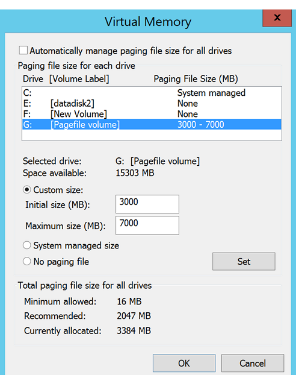

# Exclude disks from disaster recovery

This article describes how to exclude disks from replication during disaster recovery from on-premises to Azure with [Azure Site Recovery](site-recovery-overview.md). You might exclude disks from replication for a number of reasons:

- So that unimportant data churned on the excluded disk isn't replicated.
- To optimize consumed replication bandwidth, or target-side resources.
- To save storage and network resources by not replicating data that you don't need.
- Azure VMs have reached Site Recovery replication limits.


## Supported scenarios

You can exclude disks from replication as summarized in the table.

**Azure to Azure** | **VMware to Azure** | **Hyper-V to Azure** | **Physical Server to Azure**
--- | --- | --- | ---
Yes | Yes | Yes | Yes (only in classic architecture)

## Exclude limitations

**Limitation** | **Azure VMs** | **VMware VMs** | **Hyper-V VMs**
--- | --- | ---
**Disk types** | You can exclude basic disks from replication.<br/><br/> You can't exclude operating system disks or dynamic disks. Temp disks are excluded by default. | You can exclude basic disks from replication.<br/><br/> You can't exclude operating system disks or dynamic disks. | You can exclude basic disks from replication.<br/><br/> You can't exclude operating system disks. We recommend that you don't exclude dynamic disks. Site Recovery can't identify which VHS is basic or dynamic in the guest VM. If all dependent dynamic volume disks aren't excluded, the protected dynamic disk becomes a failed disk on a failover VM, and the data on that disk isn't accessible.
**Replicating disk** | You can't exclude a disk that's replicating.<br/><br/> Disable and reenable replication for the VM. |  You can't exclude a disk that's replicating. |  You can't exclude a disk that's replicating.
**Mobility service (VMware)** | Not relevant | You can exclude disks only on VMs that have the Mobility service installed.<br/><br/> This means that you have to manually install the Mobility service on the VMs for which you want to exclude disks.You can't use the push installation mechanism because it installs the Mobility service only after replication is enabled. | Not relevant.
**Add/Remove** | You can add managed disks on replication-enabled Azure VMs with managed disks. You cannot remove disks on replication-enabled Azure VMs. | You can't add or remove disks after replication is enabled. Disable and then reenable replication to add a disk. | You can't add or remove disks after replication is enabled. Disable and then reenable replication.
**Failover** | If an app needs a disk that you excluded, after failover you need to create the disk manually so that the replicated app can run.<br/><br/> Alternatively, you can create the disk during VM failover, by integrating Azure automation into a recovery plan. | If you exclude a disk that an app needs, create it manually in Azure after failover. | If you exclude a disk that an app needs, create it manually in Azure after failover.
**On-premises failback-disks created manually** | Not relevant | **Windows VMs**: Disks created manually in Azure aren't failed back. For example, if you fail over three disks and create two disks directly on an Azure VM, only the three disks that were failed over are then failed back.<br/><br/> **Linux VMs**: Disks created manually in Azure are failed back. For example, if you fail over three disks and create two disks on an Azure VM, all five will be failed back. You can't exclude disks that were created manually from failback. | Disks created manually in Azure aren't failed back. For example, if you fail over three disks and create two disks directly on an Azure VM, only three disks that were failed over will be failed back.
**On-premises failback-Excluded disks** | Not relevant | If you fail back to the original machine, the failback VM disk configuration doesn't include the excluded disks. Disks that were excluded from VMware to Azure replication aren't available on the failback VM. | When failback is to the original Hyper-V location, the failback VM disk configuration remains the same as that of original source VM disk. Disks that were excluded from Hyper-V site to Azure replication are available on the failback VM.


## Typical scenarios

Examples of data churn that are great candidates for exclusion include writes to a paging file (pagefile.sys), and writes to the tempdb file of Microsoft SQL Server. Depending on the workload and the storage subsystem, the paging and tempdb files can register a significant amount of churn. Replicating this type of data to Azure is resource-intensive.

- To optimize replication for a VM with a single virtual disk that includes both the operating system and the paging file, you could:
    1. Split the single virtual disk into two virtual disks. One virtual disk has the operating system, and the other has the paging file.
	2. Exclude the paging file disk from replication.

- To optimize replication for a disk that includes both the Microsoft SQL Server tempdb file and the system database file, you could:
    1. Keep the system database and tempdb on two different disks.
	2. Exclude the tempdb disk from replication.

## Example 1: Exclude the SQL Server tempdb disk

Let's look at how to handle disk exclusion, failover, and failover for a source SQL Server Windows VM - **SalesDB***, for which we want to exclude tempdb. 

### Exclude disks from replication

We have these disks on the source Windows VM SalesDB.

**Disk name** | **Guest OS disk** | **Drive letter** | **Disk data type**
--- | --- | --- | ---
DB-Disk0-OS | Disk0 | C:\ | Operating system disk.
DB-Disk1| Disk1 | D:\ | SQL system database and User Database1.
DB-Disk2 (Excluded the disk from protection) | Disk2 | E:\ | Temp files.
DB-Disk3 (Excluded the disk from protection) | Disk3 | F:\ | SQL tempdb database.<br/><br/> Folder path - F:\MSSQL\Data\. Make a note of the folder path before failover.
DB-Disk4 | Disk4 |G:\ | User Database2

1. We enable replication for the SalesDB VM.
2. We exclude Disk2 and Disk3 from replication because data churn on those disks is temporary. 


### Handle disks during failover

Since disks aren't replicated, when you fail over to Azure these disks aren't present on the Azure VM created after failover. The Azure VM has the disks summarized in this table.

**Guest OS disk** | **Drive letter** | **Disk data type**
--- | --- | ---
Disk0 |	C:\ | Operating system disk.
Disk1 |	E:\ | Temporary storage<br/><br/>Azure adds this disk. Because Disk2 and Disk3 were excluded from replication, E: is the first drive letter from the available list. Azure assigns E: to the temporary storage volume. Other drive letters for replicated disks remain the same.
Disk2 | D:\ | SQL system database and User Database1
Disk3 | G:\ | User Database2

In our example, since Disk3, the SQL tempdb disk, was excluded from replication and isn't available on the Azure VM, the SQL service is in a stopped state, and it needs the F:\MSSQL\Data path. You can create this path in a couple of ways: 

- Add a new disk after failover, and assign tempdb folder path.
- Use an existing temporary storage disk for the tempdb folder path.

#### Add a new disk after failover

1. Write down the paths of SQL tempdb.mdf and tempdb.ldf before failover.
2. From the Azure portal, add a new disk to the failover Azure VM. The disk should be the same size (or larger) as the source SQL tempdb disk (Disk3).
3. Sign in to the Azure VM.
4. From the disk management (diskmgmt.msc) console, initialize and format the newly added disk.
5. Assign the same drive letter that was used by the SQL tempdb disk (F:)
6. Create a tempdb folder on the F: volume (F:\MSSQL\Data).
7. Start the SQL service from the service console.

#### Use an existing temporary storage disk 

1. Open a command prompt.
2. Run SQL Server in recovery mode from the command prompt.

    ```console
    Net start MSSQLSERVER /f / T3608
    ```

3. Run the following sqlcmd to change the tempdb path to the new path.

    ```sql
    sqlcmd -A -S SalesDB		**Use your SQL DBname**
    USE master;		
    GO		
    ALTER DATABASE tempdb		
    MODIFY FILE (NAME = tempdev, FILENAME = 'E:\MSSQL\tempdata\tempdb.mdf');
    GO		
    ALTER DATABASE tempdb		
    MODIFY FILE (NAME = templog, FILENAME = 'E:\MSSQL\tempdata\templog.ldf');		
    GO
    ```

4. Stop the Microsoft SQL Server service.

    ```console
    Net stop MSSQLSERVER
    ```

5. Start the Microsoft SQL Server service.

    ```console
    Net start MSSQLSERVER
    ```

### VMware VMs: Disks during failback to original location

Now let's see how to handle disks on VMware VMs when you fail back to your original on-premises location.

- **Disks created in Azure**: Since our example uses a Windows VM, disks that you create manually in Azure aren't replicated back to your site when you fail back or reprotect a VM.
- **Temporary storage disk in Azure**: The temporary storage disk isn't replicated back to on-premises hosts.
- **Excluded disks**: Disks that were excluded from VMware to Azure replication aren't available on the on-premises VM after failback.

Before you fail back the VMware VMs to the original location, the Azure VM disk settings are as follows.

**Guest OS disk** | **Drive letter** | **Disk data type**
--- | --- | ---
Disk0 |	C:\ | Operating system disk.
Disk1 |	E:\ | Temporary storage.
Disk2 | D:\ | SQL system database and User Database1.
Disk3 | G:\ | User Database2.

After failback, the VMware VM in the original location has the disks summarized in the table.

**Guest OS disk** | **Drive letter** | **Disk data type**
--- | --- | ---
Disk0 |	C:\ | Operating system disk.
Disk1 | D:\ | SQL system database and User Database1.
Disk2 | G:\ | User Database2.


### Hyper-V VMs: Disks during failback to original location

Now let's see how to handle disks on Hyper-V VMs when you fail back to your original on-premises location.

- **Disks created in Azure**: Disks that you create manually in Azure aren't replicated back to your site when you fail back or reprotect a VM.
- **Temporary storage disk in Azure**: The temporary storage disk isn't replicated back to on-premises hosts.
- **Excluded disks**: After failback the VM disk configuration is the same as the original VM disk configuration. Disks that were excluded from replication from Hyper-V to Azure are available on the failback VM.

Before you fail back the Hyper-V VMs to the original location, the Azure VM disk settings are as follows.

**Guest OS disk** | **Drive letter** | **Disk data type**
--- | --- | ---
Disk0 |	C:\ | Operating system disk.
Disk1 |	E:\ | Temporary storage.
Disk2 | D:\ | SQL system database and User Database1.
Disk3 | G:\ | User Database2.

After planned failover (failback) from Azure to on-premises Hyper-V, the Hyper-V VM in the original location has the disks summarized in the table.

**Disk Name** | **Guest OS disk#** | **Drive letter** | **Disk data type**
 --- | --- | --- | ---
DB-Disk0-OS | Disk0 |	C:\ | Operating system disk.
DB-Disk1 | Disk1 | D:\ | SQL system database and User Database1.
DB-Disk2 (Excluded disk) | Disk2 | E:\ | Temp files.
DB-Disk3 (Excluded disk) | Disk3 | F:\ | SQL tempdb database<br/><br/> Folder path (F:\MSSQL\Data\).
DB-Disk4 | Disk4 | G:\ | User Database2


## Example 2: Exclude the paging file disk

Let's look at how to handle disk exclusion, failover, and failover for a source Windows VM, for which we want to exclude the pagefile.sys file disk on both the D drive, and an alternate drive.


### Paging file on the D drive

We have these disks on the source VM.

**Disk name** | **Guest OS disk** | **Drive letter** | **Disk data type**
--- | --- | --- | ---
DB-Disk0-OS | Disk0 | C:\ | Operating system disk
DB-Disk1 (Exclude from replication) | Disk1 | D:\ | pagefile.sys
DB-Disk2 | Disk2 | E:\ | User data 1
DB-Disk3 | Disk3 | F:\ | User data 2

Our paging file settings on the source VM are as follows:

![Screenshot of the Virtual Memory dialog with the D: Drive [Pagefile volume] line highlighted showing a Paging File Size (MB) of 3000-7000.](./media/exclude-disks-replication/pagefile-d-drive-source-vm.png)

1. We enable replication for the VM.
2. We exclude DB-Disk1 from replication.

#### Disks after failover

After failover the Azure VM has the disks summarized in the table.

**Disk name** | **Guest operating system disk#** | **Drive letter** | **Data type on the disk**
--- | --- | --- | ---
DB-Disk0-OS | Disk0 | C:\ | Operating system disk
DB-Disk1 | Disk1 | D:\ | Temporary storage/pagefile.sys <br/><br/> Because DB-Disk1 (D:) was excluded, D: is the first drive letter from the available list.<br/><br/> Azure assigns D: to the temporary storage volume.<br/><br/> Because D: is available, the VM paging file setting remains the same).
DB-Disk2 | Disk2 | E:\ | User data 1
DB-Disk3 | Disk3 | F:\ | User data 2

Our paging file settings on the Azure VM are as follows:


### Paging file on another drive (not D:)

Let's look at example in which the paging file isn't on the D drive.  

We have these disks on the source VM.

**Disk name** | **Guest OS disk** | **Drive letter** | **Disk data type**
--- | --- | --- | ---
DB-Disk0-OS | Disk0 | C:\ | Operating system disk
DB-Disk1 (Exclude from replication) | Disk1 | G:\ | pagefile.sys
DB-Disk2 | Disk2 | E:\ | User data 1
DB-Disk3 | Disk3 | F:\ | User data 2

Our paging file settings on the on-premises VM are as follows:



1. We enable replication for the VM.
2. We exclude DB-Disk1 from replication.

#### Disks after failover

After failover the Azure VM has the disks summarized in the table.

**Disk name** | **Guest OS disk#** | **Drive letter** | **Disk data type**
--- | --- | --- | ---
DB-Disk0-OS | Disk0  |C:\ | Operating system disk
DB-Disk1 | Disk1 | D:\ | Temporary storage<br/><br/> Because D: is the first drive letter from available the list, Azure assigns D: to the temporary storage volume.<br/><br/> For all the replicated disks, the drive letter remains the same.<br/><br/> Because the G: disk isn't available, the system will use the C: drive for the paging file.
DB-Disk2 | Disk2 | E:\ | User data 1
DB-Disk3 | Disk3 | F:\ | User data 2

Our paging file settings on the Azure VM are as follows:


## Next steps

- Learn more about guidelines for the temporary storage disk:
    - [Learn about](https://cloudblogs.microsoft.com/sqlserver/2014/09/25/using-ssds-in-azure-vms-to-store-sql-server-tempdb-and-buffer-pool-extensions/) using SSDs in Azure VMs to store SQL Server TempDB and Buffer Pool Extensions
    - [Review ](/azure/azure-sql/virtual-machines/windows/performance-guidelines-best-practices-checklist) performance best practices for SQL Server in Azure VMs.
- After your deployment is set up and running, [learn more](failover-failback-overview.md) about different types of failover.